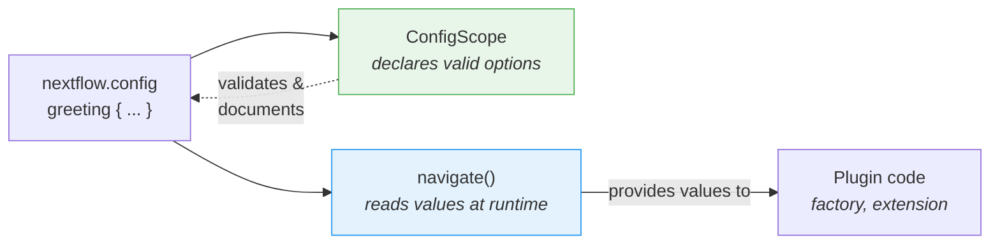

# भाग 6: कॉन्फ़िगरेशन

<span class="ai-translation-notice">:material-information-outline:{ .ai-translation-notice-icon } AI-सहायता प्राप्त अनुवाद - [अधिक जानें और सुधार सुझाएं](https://github.com/nextflow-io/training/blob/master/TRANSLATING.md)</span>

तुम्हारे plugin में custom functions और एक observer है, लेकिन सब कुछ hardcoded है।
Users task counter को बंद नहीं कर सकते, या decorator को बदल नहीं सकते, बिना source code edit किए और rebuild किए।

भाग 1 में, तुमने `nextflow.config` में `#!groovy validation {}` और `#!groovy co2footprint {}` blocks का उपयोग किया था यह नियंत्रित करने के लिए कि nf-schema और nf-co2footprint कैसे काम करते हैं।
वे config blocks इसलिए मौजूद हैं क्योंकि plugin authors ने वह क्षमता बनाई थी।
इस section में, तुम अपने plugin के लिए भी यही करोगे।

**उद्देश्य:**

1. Users को greeting decorator का prefix और suffix customize करने दो
2. Users को `nextflow.config` के ज़रिए plugin को enable या disable करने दो
3. एक formal config scope register करो ताकि Nextflow `#!groovy greeting {}` block को पहचाने

**तुम क्या बदलोगे:**

| फ़ाइल                        | बदलाव                                                    |
| ---------------------------- | -------------------------------------------------------- |
| `GreetingExtension.groovy`   | `init()` में prefix/suffix config पढ़ना                  |
| `GreetingFactory.groovy`     | observer creation को नियंत्रित करने के लिए config values पढ़ना |
| `GreetingConfig.groovy`      | नई फ़ाइल: formal `@ConfigScope` class                    |
| `build.gradle`               | config class को extension point के रूप में register करना |
| `nextflow.config`            | इसे test करने के लिए `#!groovy greeting {}` block जोड़ना  |

!!! tip "यहाँ से शुरू कर रहे हो?"

    अगर तुम इस भाग से जुड़ रहे हो, तो अपने starting point के रूप में उपयोग करने के लिए भाग 5 का समाधान copy करो:

    ```bash
    cp -r solutions/5-observers/* .
    ```

!!! info "आधिकारिक दस्तावेज़ीकरण"

    विस्तृत कॉन्फ़िगरेशन जानकारी के लिए, [Nextflow config scopes documentation](https://nextflow.io/docs/latest/developer/config-scopes.html) देखो।

---

## 1. Decorator को configurable बनाओ

`decorateGreeting` function हर greeting को `*** ... ***` में wrap करता है।
Users अलग markers चाहते हो सकते हैं, लेकिन अभी उन्हें बदलने का एकमात्र तरीका source code edit करना और rebuild करना है।

Nextflow session एक method प्रदान करता है जिसे `session.config.navigate()` कहते हैं जो `nextflow.config` से nested values पढ़ता है:

```groovy
// nextflow.config से 'greeting.prefix' पढ़ो, default '***' के साथ
final prefix = session.config.navigate('greeting.prefix', '***') as String
```

यह user के `nextflow.config` में एक config block से मेल खाता है:

```groovy title="nextflow.config"
greeting {
    prefix = '>>>'
}
```

### 1.1. कॉन्फ़िगरेशन reading जोड़ो (यह fail होगा!)

`GreetingExtension.groovy` को edit करो ताकि `init()` में configuration पढ़ी जाए और `decorateGreeting()` में उपयोग की जाए:

```groovy title="GreetingExtension.groovy" linenums="35" hl_lines="7-8 18"
@CompileStatic
class GreetingExtension extends PluginExtensionPoint {

    @Override
    protected void init(Session session) {
        // defaults के साथ configuration पढ़ो
        prefix = session.config.navigate('greeting.prefix', '***') as String
        suffix = session.config.navigate('greeting.suffix', '***') as String
    }

    // ... अन्य methods अपरिवर्तित ...

    /**
    * एक greeting को celebratory markers के साथ decorate करो
    */
    @Function
    String decorateGreeting(String greeting) {
        return "${prefix} ${greeting} ${suffix}"
    }
```

Build करने की कोशिश करो:

```bash
cd nf-greeting && make assemble
```

### 1.2. Error देखो

Build fail होती है:

```console
> Task :compileGroovy FAILED
GreetingExtension.groovy: 30: [Static type checking] - The variable [prefix] is undeclared.
 @ line 30, column 9.
           prefix = session.config.navigate('greeting.prefix', '***') as String
           ^

GreetingExtension.groovy: 31: [Static type checking] - The variable [suffix] is undeclared.
```

Groovy (और Java) में, variable को उपयोग करने से पहले _declare_ करना ज़रूरी है।
Code `prefix` और `suffix` को values assign करने की कोशिश करता है, लेकिन class में उन नामों के कोई fields नहीं हैं।

### 1.3. Instance variables declare करके ठीक करो

Class के शुरुआत में, opening brace के ठीक बाद, variable declarations जोड़ो:

```groovy title="GreetingExtension.groovy" linenums="35" hl_lines="4-5"
@CompileStatic
class GreetingExtension extends PluginExtensionPoint {

    private String prefix = '***'
    private String suffix = '***'

    @Override
    protected void init(Session session) {
        // defaults के साथ configuration पढ़ो
        prefix = session.config.navigate('greeting.prefix', '***') as String
        suffix = session.config.navigate('greeting.suffix', '***') as String
    }

    // ... class का बाकी हिस्सा अपरिवर्तित ...
```

ये दो lines **instance variables** (जिन्हें fields भी कहते हैं) declare करती हैं जो प्रत्येक `GreetingExtension` object से संबंधित हैं।
`private` keyword का मतलब है कि केवल इस class के अंदर का code इन्हें access कर सकता है।
प्रत्येक variable को `'***'` के default value के साथ initialize किया गया है।

जब plugin load होता है, Nextflow `init()` method को call करता है, जो इन defaults को user द्वारा `nextflow.config` में set की गई values से overwrite करता है।
अगर user ने कुछ set नहीं किया है, तो `navigate()` वही default return करता है, इसलिए behavior अपरिवर्तित रहता है।
`decorateGreeting()` method फिर हर बार चलने पर इन fields को पढ़ता है।

!!! tip "Errors से सीखना"

    यह "declare before use" pattern Java/Groovy के लिए fundamental है लेकिन अपरिचित है अगर तुम Python या R से आए हो जहाँ variables पहली बार assign करने पर अस्तित्व में आ जाते हैं।
    इस error को एक बार अनुभव करने से तुम इसे भविष्य में जल्दी पहचान और ठीक कर सकते हो।

### 1.4. Build और test करो

Build और install करो:

```bash
make install && cd ..
```

Decoration customize करने के लिए `nextflow.config` update करो:

=== "बाद में"

    ```groovy title="nextflow.config" hl_lines="7-10"
    // Plugin development exercises के लिए कॉन्फ़िगरेशन
    plugins {
        id 'nf-schema@2.6.1'
        id 'nf-greeting@0.1.0'
    }

    greeting {
        prefix = '>>>'
        suffix = '<<<'
    }
    ```

=== "पहले"

    ```groovy title="nextflow.config"
    // Plugin development exercises के लिए कॉन्फ़िगरेशन
    plugins {
        id 'nf-schema@2.6.1'
        id 'nf-greeting@0.1.0'
    }
    ```

Pipeline चलाओ:

```bash
nextflow run greet.nf -ansi-log false
```

```console title="Output (partial)"
Decorated: >>> Hello <<<
Decorated: >>> Bonjour <<<
...
```

Decorator अब config फ़ाइल से custom prefix और suffix उपयोग करता है।

ध्यान दो कि Nextflow एक "Unrecognized config option" warning print करता है क्योंकि किसी ने `greeting` को valid scope के रूप में declare नहीं किया है।
Value अभी भी `navigate()` के ज़रिए सही तरीके से पढ़ी जाती है, लेकिन Nextflow इसे unrecognized के रूप में flag करता है।
तुम इसे Section 3 में ठीक करोगे।

---

## 2. Task counter को configurable बनाओ

Observer factory अभी बिना शर्त के observers बनाती है।
Users को configuration के ज़रिए plugin को पूरी तरह disable करने में सक्षम होना चाहिए।

Factory के पास Nextflow session और उसकी configuration तक access है, इसलिए यह `enabled` setting पढ़ने और observers बनाने का निर्णय लेने के लिए सही जगह है।

=== "बाद में"

    ```groovy title="GreetingFactory.groovy" linenums="31" hl_lines="3-4"
    @Override
    Collection<TraceObserver> create(Session session) {
        final enabled = session.config.navigate('greeting.enabled', true)
        if (!enabled) return []

        return [
            new GreetingObserver(),
            new TaskCounterObserver()
        ]
    }
    ```

=== "पहले"

    ```groovy title="GreetingFactory.groovy" linenums="31"
    @Override
    Collection<TraceObserver> create(Session session) {
        return [
            new GreetingObserver(),
            new TaskCounterObserver()
        ]
    }
    ```

Factory अब config से `greeting.enabled` पढ़ती है और अगर user ने इसे `false` set किया है तो empty list return करती है।
जब list empty होती है, कोई observers नहीं बनते, इसलिए plugin के lifecycle hooks चुपचाप skip हो जाते हैं।

### 2.1. Build और test करो

Plugin को rebuild और install करो:

```bash
cd nf-greeting && make install && cd ..
```

यह confirm करने के लिए pipeline चलाओ कि सब कुछ अभी भी काम करता है:

```bash
nextflow run greet.nf -ansi-log false
```

??? exercise "Plugin को पूरी तरह disable करो"

    `nextflow.config` में `greeting.enabled = false` set करने की कोशिश करो और pipeline फिर से चलाओ।
    आउटपुट में क्या बदलता है?

    ??? solution "समाधान"

        ```groovy title="nextflow.config" hl_lines="8"
        // Plugin development exercises के लिए कॉन्फ़िगरेशन
        plugins {
            id 'nf-schema@2.6.1'
            id 'nf-greeting@0.1.0'
        }

        greeting {
            enabled = false
        }
        ```

        "Pipeline is starting!", "Pipeline complete!", और task count messages सभी गायब हो जाते हैं क्योंकि factory empty list return करती है जब `enabled` false होता है।
        Pipeline खुद अभी भी चलती है, लेकिन कोई observers active नहीं हैं।

        जारी रखने से पहले `enabled` को `true` पर वापस set करना याद रखो (या line हटा दो)।

---

## 3. ConfigScope के साथ Formal कॉन्फ़िगरेशन

तुम्हारा plugin configuration काम करता है, लेकिन Nextflow अभी भी "Unrecognized config option" warnings print करता है।
ऐसा इसलिए है क्योंकि `session.config.navigate()` केवल values पढ़ता है; किसी ने Nextflow को नहीं बताया कि `greeting` एक valid config scope है।

एक `ConfigScope` class उस gap को भरती है।
यह declare करती है कि तुम्हारा plugin कौन से options accept करता है, उनके types, और उनके defaults।
यह तुम्हारे `navigate()` calls को **replace नहीं** करती। बल्कि, यह उनके साथ काम करती है:



`ConfigScope` class के बिना, `navigate()` अभी भी काम करता है, लेकिन:

- Nextflow unrecognized options के बारे में warn करता है (जैसा तुमने देखा)
- `nextflow.config` लिखने वाले users के लिए कोई IDE autocompletion नहीं
- Configuration options self-documenting नहीं हैं
- Type conversion manual है (`as String`, `as boolean`)

एक formal config scope class register करने से warning ठीक होती है और तीनों समस्याएं हल होती हैं।
यह वही mechanism है जो `#!groovy validation {}` और `#!groovy co2footprint {}` blocks के पीछे है जो तुमने भाग 1 में उपयोग किए थे।

### 3.1. Config class बनाओ

एक नई फ़ाइल बनाओ:

```bash
touch nf-greeting/src/main/groovy/training/plugin/GreetingConfig.groovy
```

तीनों options के साथ config class जोड़ो:

```groovy title="GreetingConfig.groovy" linenums="1"
package training.plugin

import nextflow.config.spec.ConfigOption
import nextflow.config.spec.ConfigScope
import nextflow.config.spec.ScopeName
import nextflow.script.dsl.Description

/**
 * nf-greeting plugin के लिए कॉन्फ़िगरेशन options।
 *
 * Users इन्हें nextflow.config में configure करते हैं:
 *
 *     greeting {
 *         enabled = true
 *         prefix = '>>>'
 *         suffix = '<<<'
 *     }
 */
@ScopeName('greeting')                       // (1)!
class GreetingConfig implements ConfigScope { // (2)!

    GreetingConfig() {}

    GreetingConfig(Map opts) {               // (3)!
        this.enabled = opts.enabled as Boolean ?: true
        this.prefix = opts.prefix as String ?: '***'
        this.suffix = opts.suffix as String ?: '***'
    }

    @ConfigOption                            // (4)!
    @Description('Enable or disable the plugin entirely')
    boolean enabled = true

    @ConfigOption
    @Description('Prefix for decorated greetings')
    String prefix = '***'

    @ConfigOption
    @Description('Suffix for decorated greetings')
    String suffix = '***'
}
```

1. `nextflow.config` में `#!groovy greeting { }` block से map करता है
2. Config classes के लिए required interface
3. Nextflow को config instantiate करने के लिए no-arg और Map दोनों constructors चाहिए
4. `@ConfigOption` एक field को configuration option के रूप में mark करता है; `@Description` इसे tooling के लिए document करता है

मुख्य बातें:

- **`@ScopeName('greeting')`**: Config में `greeting { }` block से map करता है
- **`implements ConfigScope`**: Config classes के लिए required interface
- **`@ConfigOption`**: प्रत्येक field एक configuration option बन जाता है
- **`@Description`**: Language server support के लिए प्रत्येक option को document करता है (`nextflow.script.dsl` से import)
- **Constructors**: No-arg और Map दोनों constructors ज़रूरी हैं

### 3.2. Config class register करो

Class बनाना अकेले काफी नहीं है।
Nextflow को यह जानना ज़रूरी है कि यह exist करती है, इसलिए तुम इसे `build.gradle` में अन्य extension points के साथ register करते हो।

=== "बाद में"

    ```groovy title="build.gradle" hl_lines="4"
    extensionPoints = [
        'training.plugin.GreetingExtension',
        'training.plugin.GreetingFactory',
        'training.plugin.GreetingConfig'
    ]
    ```

=== "पहले"

    ```groovy title="build.gradle"
    extensionPoints = [
        'training.plugin.GreetingExtension',
        'training.plugin.GreetingFactory'
    ]
    ```

Factory और extension points registration के बीच अंतर नोट करो:

- **`build.gradle` में `extensionPoints`**: Compile-time registration। Nextflow plugin system को बताता है कि कौन सी classes extension points implement करती हैं।
- **Factory `create()` method**: Runtime registration। Factory observer instances बनाती है जब workflow actually शुरू होता है।

### 3.3. Build और test करो

```bash
cd nf-greeting && make install && cd ..
nextflow run greet.nf -ansi-log false
```

Pipeline का behavior identical है, लेकिन "Unrecognized config option" warning चली गई है।

!!! note "क्या बदला और क्या नहीं"

    तुम्हारे `GreetingFactory` और `GreetingExtension` अभी भी runtime पर values पढ़ने के लिए `session.config.navigate()` उपयोग करते हैं।
    वह code नहीं बदला।
    `ConfigScope` class एक parallel declaration है जो Nextflow को बताती है कि कौन से options exist करते हैं।
    दोनों pieces ज़रूरी हैं: `ConfigScope` declare करती है, `navigate()` पढ़ता है।

तुम्हारे plugin में अब वही structure है जो भाग 1 में तुमने उपयोग किए plugins में था।
जब nf-schema एक `#!groovy validation {}` block expose करता है या nf-co2footprint एक `#!groovy co2footprint {}` block expose करता है, वे exactly इसी pattern का उपयोग करते हैं: annotated fields के साथ एक `ConfigScope` class, extension point के रूप में registered।
तुम्हारा `#!groovy greeting {}` block उसी तरह काम करता है।

---

## सारांश

तुमने सीखा कि:

- `session.config.navigate()` runtime पर config values **पढ़ता** है
- `@ConfigScope` classes **declare** करती हैं कि कौन से config options exist करते हैं; वे `navigate()` के साथ काम करती हैं, उसकी जगह नहीं
- Configuration को observers और extension functions दोनों पर apply किया जा सकता है
- Groovy/Java में instance variables को उपयोग से पहले declare करना ज़रूरी है; `init()` plugin load होने पर उन्हें config से populate करता है

| Use case                                | Recommended approach                                              |
| --------------------------------------- | ----------------------------------------------------------------- |
| Quick prototype या simple plugin        | केवल `session.config.navigate()`                                  |
| कई options वाला production plugin       | अपने `navigate()` calls के साथ एक `ConfigScope` class जोड़ो      |
| Plugin जिसे तुम publicly share करोगे   | अपने `navigate()` calls के साथ एक `ConfigScope` class जोड़ो      |

---

## आगे क्या है?

तुम्हारे plugin में अब एक production plugin के सभी pieces हैं: custom functions, trace observers, और user-facing configuration।
अंतिम कदम इसे distribution के लिए package करना है।

[Summary पर जारी रखो :material-arrow-right:](summary.md){ .md-button .md-button--primary }
