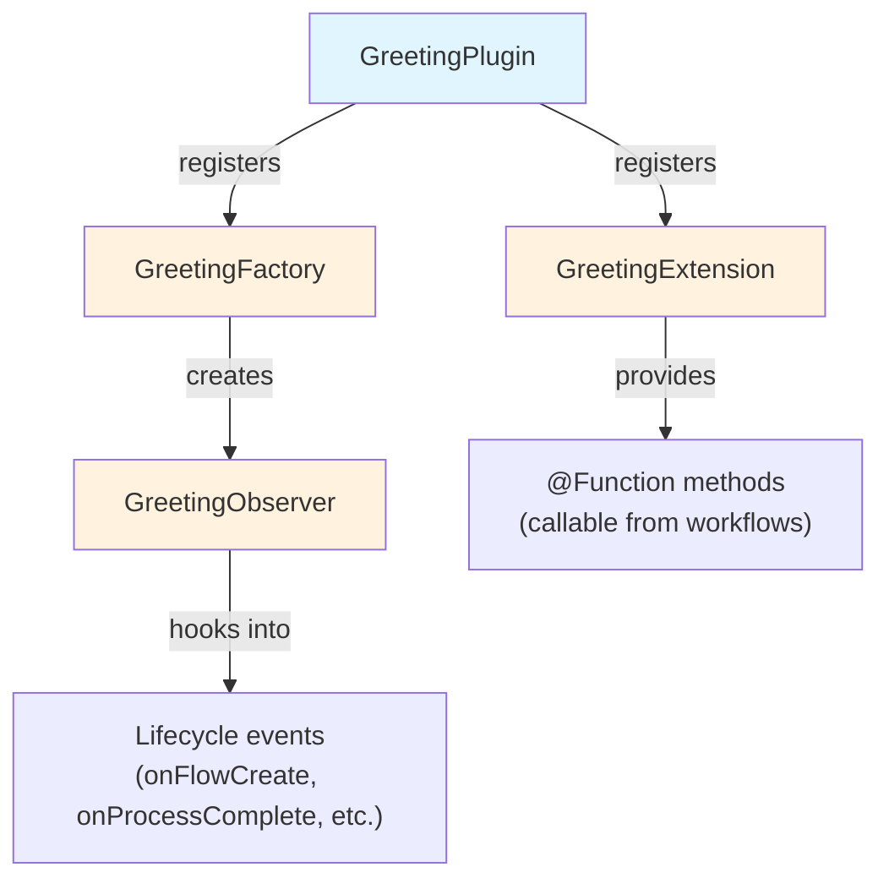

# Parte 2: Creare un Progetto Plugin

<span class="ai-translation-notice">:material-information-outline:{ .ai-translation-notice-icon } Traduzione assistita da IA - [scopri di più e suggerisci miglioramenti](https://github.com/nextflow-io/training/blob/master/TRANSLATING.md)</span>

Hai visto come i plugin estendono Nextflow con funzionalità riutilizzabili.
Ora ne creerai uno tuo, partendo da un template di progetto che gestisce la configurazione del build al posto tuo.

!!! tip "Stai iniziando da qui?"

    Se ti unisci a questa parte, copia la soluzione dalla Parte 1 per usarla come punto di partenza:

    ```bash
    cp -r solutions/1-plugin-basics/* .
    ```

!!! info "Documentazione ufficiale"

    Questa sezione e quelle che seguono coprono gli elementi essenziali dello sviluppo di plugin.
    Per dettagli completi, consulta la [documentazione ufficiale per lo sviluppo di plugin Nextflow](https://www.nextflow.io/docs/latest/plugins/developing-plugins.html).

---

## 1. Creare il progetto plugin

Il comando integrato `nextflow plugin create` genera un progetto plugin completo:

```bash
nextflow plugin create nf-greeting training
```

```console title="Output"
Plugin created successfully at path: /workspaces/training/side-quests/plugin_development/nf-greeting
```

Il primo argomento è il nome del plugin, il secondo è il nome della tua organizzazione (usato per organizzare il codice generato in cartelle).

!!! tip "Creazione manuale"

    Puoi anche creare progetti plugin manualmente oppure usare il [template nf-hello](https://github.com/nextflow-io/nf-hello) su GitHub come punto di partenza.

---

## 2. Esaminare la struttura del progetto

Un plugin Nextflow è un componente software Groovy che viene eseguito all'interno di Nextflow.
Estende le capacità di Nextflow usando punti di integrazione ben definiti, il che significa che può interagire con le funzionalità di Nextflow come canali, processi e configurazione.

Prima di scrivere qualsiasi codice, osserva cosa ha generato il template così saprai dove si trovano le varie parti.

Spostati nella directory del plugin:

```bash
cd nf-greeting
```

Elenca il contenuto:

```bash
tree
```

Dovresti vedere:

```console
.
├── build.gradle
├── COPYING
├── gradle
│   └── wrapper
│       ├── gradle-wrapper.jar
│       └── gradle-wrapper.properties
├── gradlew
├── Makefile
├── README.md
├── settings.gradle
└── src
    ├── main
    │   └── groovy
    │       └── training
    │           └── plugin
    │               ├── GreetingExtension.groovy
    │               ├── GreetingFactory.groovy
    │               ├── GreetingObserver.groovy
    │               └── GreetingPlugin.groovy
    └── test
        └── groovy
            └── training
                └── plugin
                    └── GreetingObserverTest.groovy

11 directories, 13 files
```

---

## 3. Esplorare la configurazione del build

Un plugin Nextflow è un software basato su Java che deve essere compilato e pacchettizzato prima che Nextflow possa utilizzarlo.
Questo richiede uno strumento di build.

Gradle è uno strumento di build che compila il codice, esegue i test e pacchettizza il software.
Il template del plugin include un wrapper Gradle (`./gradlew`) così non è necessario installare Gradle separatamente.

La configurazione del build indica a Gradle come compilare il plugin e indica a Nextflow come caricarlo.
Due file sono i più importanti.

### 3.1. settings.gradle

Questo file identifica il progetto:

```bash
cat settings.gradle
```

```groovy title="settings.gradle"
rootProject.name = 'nf-greeting'
```

Il nome qui deve corrispondere a quello che inserirai in `nextflow.config` quando utilizzerai il plugin.

### 3.2. build.gradle

Il file di build è dove avviene la maggior parte della configurazione:

```bash
cat build.gradle
```

Il file contiene diverse sezioni.
La più importante è il blocco `nextflowPlugin`:

```groovy title="build.gradle"
plugins {
    id 'io.nextflow.nextflow-plugin' version '1.0.0-beta.10'
}

version = '0.1.0'

nextflowPlugin {
    nextflowVersion = '24.10.0'       // (1)!

    provider = 'training'             // (2)!
    className = 'training.plugin.GreetingPlugin'  // (3)!
    extensionPoints = [               // (4)!
        'training.plugin.GreetingExtension',
        'training.plugin.GreetingFactory'
    ]

}
```

1. **`nextflowVersion`**: Versione minima di Nextflow richiesta
2. **`provider`**: Il tuo nome o quello della tua organizzazione
3. **`className`**: La classe principale del plugin, il punto di ingresso che Nextflow carica per primo
4. **`extensionPoints`**: Classi che aggiungono funzionalità a Nextflow (le tue funzioni, il monitoraggio, ecc.)

Il blocco `nextflowPlugin` configura:

- `nextflowVersion`: Versione minima di Nextflow richiesta
- `provider`: Il tuo nome o quello della tua organizzazione
- `className`: La classe principale del plugin (il punto di ingresso che Nextflow carica per primo, specificato in `build.gradle`)
- `extensionPoints`: Classi che aggiungono funzionalità a Nextflow (le tue funzioni, il monitoraggio, ecc.)

### 3.3. Aggiornare nextflowVersion

Il template genera un valore `nextflowVersion` che potrebbe essere obsoleto.
Aggiornalo per corrispondere alla versione di Nextflow installata, per garantire la piena compatibilità:

=== "Dopo"

    ```groovy title="build.gradle" hl_lines="2"
    nextflowPlugin {
        nextflowVersion = '25.10.0'

        provider = 'training'
    ```

=== "Prima"

    ```groovy title="build.gradle" hl_lines="2"
    nextflowPlugin {
        nextflowVersion = '24.10.0'

        provider = 'training'
    ```

---

## 4. Conoscere i file sorgente

Il codice sorgente del plugin si trova in `src/main/groovy/training/plugin/`.
Ci sono quattro file sorgente, ognuno con un ruolo distinto:

| File                       | Ruolo                                                          | Modificato in     |
| -------------------------- | -------------------------------------------------------------- | ----------------- |
| `GreetingPlugin.groovy`    | Punto di ingresso che Nextflow carica per primo                | Mai (generato)    |
| `GreetingExtension.groovy` | Definisce le funzioni richiamabili dai flussi di lavoro        | Parte 3           |
| `GreetingFactory.groovy`   | Crea istanze dell'observer quando un flusso di lavoro si avvia | Parte 5           |
| `GreetingObserver.groovy`  | Esegue codice in risposta agli eventi del ciclo di vita del flusso di lavoro | Parte 5 |

Ogni file viene introdotto in dettaglio nella parte indicata sopra, quando lo modificherai per la prima volta.
I principali da tenere a mente:

- `GreetingPlugin` è il punto di ingresso che Nextflow carica
- `GreetingExtension` fornisce le funzioni che questo plugin mette a disposizione dei flussi di lavoro
- `GreetingObserver` viene eseguito insieme alla pipeline e risponde agli eventi senza richiedere modifiche al codice della pipeline



---

## 5. Build, installazione ed esecuzione

Il template include codice funzionante già pronto all'uso, quindi puoi compilarlo ed eseguirlo subito per verificare che il progetto sia configurato correttamente.

Compila il plugin e installalo localmente:

```bash
make install
```

`make install` compila il codice del plugin e lo copia nella directory locale dei plugin di Nextflow (`$NXF_HOME/plugins/`), rendendolo disponibile all'uso.

??? example "Output del build"

    La prima volta che esegui questo comando, Gradle scaricherà se stesso (potrebbe richiedere un minuto):

    ```console
    Downloading https://services.gradle.org/distributions/gradle-8.14-bin.zip
    ...10%...20%...30%...40%...50%...60%...70%...80%...90%...100%

    Welcome to Gradle 8.14!
    ...

    Deprecated Gradle features were used in this build...

    BUILD SUCCESSFUL in 23s
    5 actionable tasks: 5 executed
    ```

    **Gli avvisi sono previsti.**

    - **"Downloading gradle..."**: Questo accade solo la prima volta. I build successivi sono molto più veloci.
    - **"Deprecated Gradle features..."**: Questo avviso proviene dal template del plugin, non dal tuo codice. Può essere ignorato tranquillamente.
    - **"BUILD SUCCESSFUL"**: Questo è ciò che conta. Il tuo plugin è stato compilato senza errori.

Torna alla directory della pipeline:

```bash
cd ..
```

Aggiungi il plugin nf-greeting a `nextflow.config`:

=== "Dopo"

    ```groovy title="nextflow.config" hl_lines="4"
    // Configurazione per gli esercizi di sviluppo plugin
    plugins {
        id 'nf-schema@2.6.1'
        id 'nf-greeting@0.1.0'
    }
    ```

=== "Prima"

    ```groovy title="nextflow.config"
    // Configurazione per gli esercizi di sviluppo plugin
    plugins {
        id 'nf-schema@2.6.1'
    }
    ```

!!! note "Versione richiesta per i plugin locali"

    Quando si utilizzano plugin installati localmente, è necessario specificare la versione (ad es., `nf-greeting@0.1.0`).
    I plugin pubblicati nel registro possono usare solo il nome.

Esegui la pipeline:

```bash
nextflow run greet.nf -ansi-log false
```

Il flag `-ansi-log false` disabilita la visualizzazione animata dell'avanzamento in modo che tutto l'output, inclusi i messaggi dell'observer, venga stampato in ordine.

```console title="Output"
Pipeline is starting! 🚀
[bc/f10449] Submitted process > SAY_HELLO (1)
[9a/f7bcb2] Submitted process > SAY_HELLO (2)
[6c/aff748] Submitted process > SAY_HELLO (3)
[de/8937ef] Submitted process > SAY_HELLO (4)
[98/c9a7d6] Submitted process > SAY_HELLO (5)
Output: Bonjour
Output: Hello
Output: Holà
Output: Ciao
Output: Hallo
Pipeline complete! 👋
```

(L'ordine dell'output e gli hash della directory di lavoro saranno diversi.)

I messaggi "Pipeline is starting!" e "Pipeline complete!" ricordano quelli del plugin nf-hello nella Parte 1, ma questa volta provengono dal `GreetingObserver` nel tuo plugin.
La pipeline stessa è invariata; l'observer viene eseguito automaticamente perché è registrato nella factory.

---

## Takeaway

Hai imparato che:

- Il comando `nextflow plugin create` genera un progetto iniziale completo
- `build.gradle` configura i metadati del plugin, le dipendenze e quali classi forniscono le funzionalità
- Il plugin ha quattro componenti principali: Plugin (punto di ingresso), Extension (funzioni), Factory (crea i monitor) e Observer (risponde agli eventi del flusso di lavoro)
- Il ciclo di sviluppo è: modifica il codice, `make install`, esegui la pipeline

---

## Cosa c'è dopo?

Ora implementerai funzioni personalizzate nella classe Extension e le utilizzerai nel flusso di lavoro.

[Continua alla Parte 3 :material-arrow-right:](03_custom_functions.md){ .md-button .md-button--primary }
