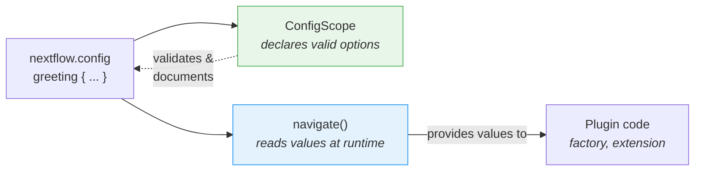

# Parte 6: Configurazione

<span class="ai-translation-notice">:material-information-outline:{ .ai-translation-notice-icon } Traduzione assistita da IA - [scopri di più e suggerisci miglioramenti](https://github.com/nextflow-io/training/blob/master/TRANSLATING.md)</span>

Il tuo plugin ha funzioni personalizzate e un observer, ma tutto è hardcoded.
Gli utenti non possono disattivare il contatore delle attività, né cambiare il decoratore, senza modificare il codice sorgente e ricompilare.

Nella Parte 1, hai usato i blocchi `#!groovy validation {}` e `#!groovy co2footprint {}` in `nextflow.config` per controllare il comportamento di nf-schema e nf-co2footprint.
Quei blocchi di configurazione esistono perché gli autori del plugin hanno implementato quella funzionalità.
In questa sezione, farai lo stesso per il tuo plugin.

**Obiettivi:**

1. Permettere agli utenti di personalizzare il prefisso e il suffisso del decoratore di saluti
2. Permettere agli utenti di abilitare o disabilitare il plugin tramite `nextflow.config`
3. Registrare un config scope formale affinché Nextflow riconosca il blocco `#!groovy greeting {}`

**Cosa cambierai:**

| File                       | Modifica                                                        |
| -------------------------- | --------------------------------------------------------------- |
| `GreetingExtension.groovy` | Leggere la configurazione di prefisso/suffisso in `init()`      |
| `GreetingFactory.groovy`   | Leggere i valori di configurazione per controllare la creazione dell'observer |
| `GreetingConfig.groovy`    | Nuovo file: classe formale `@ConfigScope`                       |
| `build.gradle`             | Registrare la classe di configurazione come extension point     |
| `nextflow.config`          | Aggiungere un blocco `#!groovy greeting {}` per testarlo        |

!!! tip "Stai iniziando da qui?"

    Se ti unisci a questa parte, copia la soluzione dalla Parte 5 da usare come punto di partenza:

    ```bash
    cp -r solutions/5-observers/* .
    ```

!!! info "Documentazione ufficiale"

    Per dettagli completi sulla configurazione, consulta la [documentazione sui config scope di Nextflow](https://nextflow.io/docs/latest/developer/config-scopes.html).

---

## 1. Rendere il decoratore configurabile

La funzione `decorateGreeting` avvolge ogni saluto in `*** ... ***`.
Gli utenti potrebbero volere marcatori diversi, ma al momento l'unico modo per cambiarli è modificare il codice sorgente e ricompilare.

La sessione Nextflow fornisce un metodo chiamato `session.config.navigate()` che legge valori annidati da `nextflow.config`:

```groovy
// Legge 'greeting.prefix' da nextflow.config, con valore predefinito '***'
final prefix = session.config.navigate('greeting.prefix', '***') as String
```

Questo corrisponde a un blocco di configurazione nel `nextflow.config` dell'utente:

```groovy title="nextflow.config"
greeting {
    prefix = '>>>'
}
```

### 1.1. Aggiungere la lettura della configurazione (questo fallirà!)

Modifica `GreetingExtension.groovy` per leggere la configurazione in `init()` e usarla in `decorateGreeting()`:

```groovy title="GreetingExtension.groovy" linenums="35" hl_lines="7-8 18"
@CompileStatic
class GreetingExtension extends PluginExtensionPoint {

    @Override
    protected void init(Session session) {
        // Legge la configurazione con i valori predefiniti
        prefix = session.config.navigate('greeting.prefix', '***') as String
        suffix = session.config.navigate('greeting.suffix', '***') as String
    }

    // ... altri metodi invariati ...

    /**
    * Decora un saluto con marcatori celebrativi
    */
    @Function
    String decorateGreeting(String greeting) {
        return "${prefix} ${greeting} ${suffix}"
    }
```

Prova a compilare:

```bash
cd nf-greeting && make assemble
```

### 1.2. Osservare l'errore

La compilazione fallisce:

```console
> Task :compileGroovy FAILED
GreetingExtension.groovy: 30: [Static type checking] - The variable [prefix] is undeclared.
 @ line 30, column 9.
           prefix = session.config.navigate('greeting.prefix', '***') as String
           ^

GreetingExtension.groovy: 31: [Static type checking] - The variable [suffix] is undeclared.
```

In Groovy (e Java), è necessario _dichiarare_ una variabile prima di usarla.
Il codice tenta di assegnare valori a `prefix` e `suffix`, ma la classe non ha campi con quei nomi.

### 1.3. Correggere dichiarando le variabili di istanza

Aggiungi le dichiarazioni delle variabili all'inizio della classe, subito dopo la parentesi graffa di apertura:

```groovy title="GreetingExtension.groovy" linenums="35" hl_lines="4-5"
@CompileStatic
class GreetingExtension extends PluginExtensionPoint {

    private String prefix = '***'
    private String suffix = '***'

    @Override
    protected void init(Session session) {
        // Legge la configurazione con i valori predefiniti
        prefix = session.config.navigate('greeting.prefix', '***') as String
        suffix = session.config.navigate('greeting.suffix', '***') as String
    }

    // ... resto della classe invariato ...
```

Queste due righe dichiarano **variabili di istanza** (chiamate anche campi) che appartengono a ogni oggetto `GreetingExtension`.
La parola chiave `private` significa che solo il codice all'interno di questa classe può accedervi.
Ogni variabile viene inizializzata con un valore predefinito di `'***'`.

Quando il plugin viene caricato, Nextflow chiama il metodo `init()`, che sovrascrive questi valori predefiniti con quelli impostati dall'utente in `nextflow.config`.
Se l'utente non ha impostato nulla, `navigate()` restituisce lo stesso valore predefinito, quindi il comportamento rimane invariato.
Il metodo `decorateGreeting()` legge poi questi campi ogni volta che viene eseguito.

!!! tip "Imparare dagli errori"

    Questo schema "dichiarare prima di usare" è fondamentale in Java/Groovy, ma può risultare insolito se si proviene da Python o R, dove le variabili prendono vita nel momento in cui vengono assegnate per la prima volta.
    Incontrare questo errore una volta aiuta a riconoscerlo e correggerlo rapidamente in futuro.

### 1.4. Compilare e testare

Compila e installa:

```bash
make install && cd ..
```

Aggiorna `nextflow.config` per personalizzare la decorazione:

=== "Dopo"

    ```groovy title="nextflow.config" hl_lines="7-10"
    // Configurazione per gli esercizi di sviluppo del plugin
    plugins {
        id 'nf-schema@2.6.1'
        id 'nf-greeting@0.1.0'
    }

    greeting {
        prefix = '>>>'
        suffix = '<<<'
    }
    ```

=== "Prima"

    ```groovy title="nextflow.config"
    // Configurazione per gli esercizi di sviluppo del plugin
    plugins {
        id 'nf-schema@2.6.1'
        id 'nf-greeting@0.1.0'
    }
    ```

Esegui la pipeline:

```bash
nextflow run greet.nf -ansi-log false
```

```console title="Output (partial)"
Decorated: >>> Hello <<<
Decorated: >>> Bonjour <<<
...
```

Il decoratore ora usa il prefisso e il suffisso personalizzati dal file di configurazione.

Nota che Nextflow stampa un avviso "Unrecognized config option" perché nulla ha ancora dichiarato `greeting` come config scope valido.
Il valore viene comunque letto correttamente tramite `navigate()`, ma Nextflow lo segnala come non riconosciuto.
Risolverai questo problema nella Sezione 3.

---

## 2. Rendere il contatore delle attività configurabile

La factory dell'observer attualmente crea gli observer in modo incondizionato.
Gli utenti dovrebbero poter disabilitare completamente il plugin tramite la configurazione.

La factory ha accesso alla sessione Nextflow e alla sua configurazione, quindi è il posto giusto per leggere l'impostazione `enabled` e decidere se creare gli observer.

=== "Dopo"

    ```groovy title="GreetingFactory.groovy" linenums="31" hl_lines="3-4"
    @Override
    Collection<TraceObserver> create(Session session) {
        final enabled = session.config.navigate('greeting.enabled', true)
        if (!enabled) return []

        return [
            new GreetingObserver(),
            new TaskCounterObserver()
        ]
    }
    ```

=== "Prima"

    ```groovy title="GreetingFactory.groovy" linenums="31"
    @Override
    Collection<TraceObserver> create(Session session) {
        return [
            new GreetingObserver(),
            new TaskCounterObserver()
        ]
    }
    ```

La factory ora legge `greeting.enabled` dalla configurazione e restituisce una lista vuota se l'utente l'ha impostato a `false`.
Quando la lista è vuota, non vengono creati observer, quindi gli hook del ciclo di vita del plugin vengono silenziosamente ignorati.

### 2.1. Compilare e testare

Ricompila e installa il plugin:

```bash
cd nf-greeting && make install && cd ..
```

Esegui la pipeline per confermare che tutto funzioni ancora:

```bash
nextflow run greet.nf -ansi-log false
```

??? exercise "Disabilitare completamente il plugin"

    Prova a impostare `greeting.enabled = false` in `nextflow.config` ed esegui di nuovo la pipeline.
    Cosa cambia nell'output?

    ??? solution "Soluzione"

        ```groovy title="nextflow.config" hl_lines="8"
        // Configurazione per gli esercizi di sviluppo del plugin
        plugins {
            id 'nf-schema@2.6.1'
            id 'nf-greeting@0.1.0'
        }

        greeting {
            enabled = false
        }
        ```

        I messaggi "Pipeline is starting!", "Pipeline complete!" e il conteggio delle attività scompaiono tutti, perché la factory restituisce una lista vuota quando `enabled` è false.
        La pipeline stessa continua a essere eseguita, ma nessun observer è attivo.

        Ricordati di reimpostare `enabled` a `true` (o di rimuovere la riga) prima di continuare.

---

## 3. Configurazione formale con ConfigScope

La configurazione del tuo plugin funziona, ma Nextflow stampa ancora avvisi "Unrecognized config option".
Questo accade perché `session.config.navigate()` si limita a leggere i valori; nulla ha comunicato a Nextflow che `greeting` è un config scope valido.

Una classe `ConfigScope` colma questa lacuna.
Dichiara quali opzioni accetta il tuo plugin, i loro tipi e i loro valori predefiniti.
**Non** sostituisce le chiamate a `navigate()`. Lavora invece insieme a esse:



Senza una classe `ConfigScope`, `navigate()` funziona comunque, ma:

- Nextflow avvisa sulle opzioni non riconosciute (come hai già visto)
- Nessun autocompletamento IDE per gli utenti che scrivono `nextflow.config`
- Le opzioni di configurazione non si autodocumentano
- La conversione dei tipi è manuale (`as String`, `as boolean`)

Registrare una classe formale di config scope risolve l'avviso e affronta tutti e tre i problemi.
Questo è lo stesso meccanismo alla base dei blocchi `#!groovy validation {}` e `#!groovy co2footprint {}` che hai usato nella Parte 1.

### 3.1. Creare la classe di configurazione

Crea un nuovo file:

```bash
touch nf-greeting/src/main/groovy/training/plugin/GreetingConfig.groovy
```

Aggiungi la classe di configurazione con tutte e tre le opzioni:

```groovy title="GreetingConfig.groovy" linenums="1"
package training.plugin

import nextflow.config.spec.ConfigOption
import nextflow.config.spec.ConfigScope
import nextflow.config.spec.ScopeName
import nextflow.script.dsl.Description

/**
 * Opzioni di configurazione per il plugin nf-greeting.
 *
 * Gli utenti le configurano in nextflow.config:
 *
 *     greeting {
 *         enabled = true
 *         prefix = '>>>'
 *         suffix = '<<<'
 *     }
 */
@ScopeName('greeting')                       // (1)!
class GreetingConfig implements ConfigScope { // (2)!

    GreetingConfig() {}

    GreetingConfig(Map opts) {               // (3)!
        this.enabled = opts.enabled as Boolean ?: true
        this.prefix = opts.prefix as String ?: '***'
        this.suffix = opts.suffix as String ?: '***'
    }

    @ConfigOption                            // (4)!
    @Description('Enable or disable the plugin entirely')
    boolean enabled = true

    @ConfigOption
    @Description('Prefix for decorated greetings')
    String prefix = '***'

    @ConfigOption
    @Description('Suffix for decorated greetings')
    String suffix = '***'
}
```

1. Corrisponde al blocco `#!groovy greeting { }` in `nextflow.config`
2. Interfaccia obbligatoria per le classi di configurazione
3. Sia il costruttore senza argomenti che quello con Map sono necessari affinché Nextflow possa istanziare la configurazione
4. `@ConfigOption` contrassegna un campo come opzione di configurazione; `@Description` lo documenta per gli strumenti di sviluppo

Punti chiave:

- **`@ScopeName('greeting')`**: Corrisponde al blocco `greeting { }` nella configurazione
- **`implements ConfigScope`**: Interfaccia obbligatoria per le classi di configurazione
- **`@ConfigOption`**: Ogni campo diventa un'opzione di configurazione
- **`@Description`**: Documenta ogni opzione per il supporto del language server (importato da `nextflow.script.dsl`)
- **Costruttori**: Sono necessari sia il costruttore senza argomenti che quello con Map

### 3.2. Registrare la classe di configurazione

Creare la classe non è sufficiente da sola.
Nextflow deve sapere che esiste, quindi la registri in `build.gradle` insieme agli altri extension point.

=== "Dopo"

    ```groovy title="build.gradle" hl_lines="4"
    extensionPoints = [
        'training.plugin.GreetingExtension',
        'training.plugin.GreetingFactory',
        'training.plugin.GreetingConfig'
    ]
    ```

=== "Prima"

    ```groovy title="build.gradle"
    extensionPoints = [
        'training.plugin.GreetingExtension',
        'training.plugin.GreetingFactory'
    ]
    ```

Nota la differenza tra la registrazione della factory e degli extension point:

- **`extensionPoints` in `build.gradle`**: Registrazione a tempo di compilazione. Indica al sistema di plugin di Nextflow quali classi implementano gli extension point.
- **Metodo `create()` della factory**: Registrazione a runtime. La factory crea le istanze degli observer quando un flusso di lavoro viene effettivamente avviato.

### 3.3. Compilare e testare

```bash
cd nf-greeting && make install && cd ..
nextflow run greet.nf -ansi-log false
```

Il comportamento della pipeline è identico, ma l'avviso "Unrecognized config option" è scomparso.

!!! note "Cosa è cambiato e cosa no"

    `GreetingFactory` e `GreetingExtension` usano ancora `session.config.navigate()` per leggere i valori a runtime.
    Nessuno di quel codice è cambiato.
    La classe `ConfigScope` è una dichiarazione parallela che comunica a Nextflow quali opzioni esistono.
    Entrambi gli elementi sono necessari: `ConfigScope` dichiara, `navigate()` legge.

Il tuo plugin ha ora la stessa struttura dei plugin che hai usato nella Parte 1.
Quando nf-schema espone un blocco `#!groovy validation {}` o nf-co2footprint espone un blocco `#!groovy co2footprint {}`, usano esattamente questo schema: una classe `ConfigScope` con campi annotati, registrata come extension point.
Il tuo blocco `#!groovy greeting {}` funziona allo stesso modo.

---

## Takeaway

Hai imparato che:

- `session.config.navigate()` **legge** i valori di configurazione a runtime
- Le classi `@ConfigScope` **dichiarano** quali opzioni di configurazione esistono; lavorano insieme a `navigate()`, non al suo posto
- La configurazione può essere applicata sia agli observer che alle funzioni di extension
- Le variabili di istanza devono essere dichiarate prima dell'uso in Groovy/Java; `init()` le popola dalla configurazione quando il plugin viene caricato

| Caso d'uso                                    | Approccio consigliato                                                    |
| --------------------------------------------- | ------------------------------------------------------------------------ |
| Prototipo rapido o plugin semplice            | Solo `session.config.navigate()`                                         |
| Plugin di produzione con molte opzioni        | Aggiungere una classe `ConfigScope` insieme alle chiamate `navigate()`   |
| Plugin che condividerai pubblicamente         | Aggiungere una classe `ConfigScope` insieme alle chiamate `navigate()`   |

---

## Cosa c'è dopo?

Il tuo plugin ha ora tutti gli elementi di un plugin di produzione: funzioni personalizzate, trace observer e configurazione accessibile agli utenti.
Il passo finale è prepararlo per la distribuzione.

[Continua al Sommario :material-arrow-right:](summary.md){ .md-button .md-button--primary }
