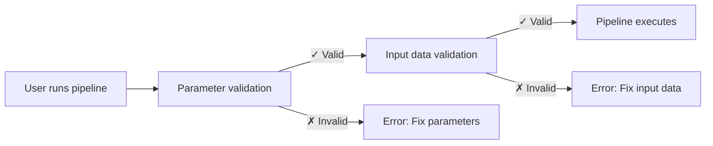

# 파트 5: 입력 검증

Hello nf-core 교육 과정의 다섯 번째 파트에서는 nf-schema 플러그인을 사용하여 파이프라인 입력과 매개변수를 검증하는 방법을 학습합니다.

??? info "이 섹션을 시작하는 방법"

    이 섹션은 [파트 4: nf-core 모듈 만들기](./04_make_module.md)를 완료하고 파이프라인의 `COWPY` 프로세스 모듈을 nf-core 표준으로 업데이트했다고 가정합니다.

    파트 4를 완료하지 않았거나 이 파트를 새로 시작하고 싶다면, `core-hello-part4` 해결책을 시작점으로 사용할 수 있습니다.
    `hello-nf-core/` 디렉토리 내에서 다음 명령을 실행하세요:

    ```bash
    cp -r solutions/core-hello-part4 core-hello
    cd core-hello
    ```

    이렇게 하면 `COWPY` 모듈이 이미 nf-core 표준을 따르도록 업그레이드된 파이프라인을 얻을 수 있습니다.
    다음 명령을 실행하여 성공적으로 실행되는지 테스트할 수 있습니다:

    ```bash
    nextflow run . --outdir core-hello-results -profile test,docker --validate_params false
    ```

---

## 0. 준비 운동: 배경 지식

### 0.1. 검증이 중요한 이유

파이프라인을 두 시간 동안 실행했는데, 사용자가 잘못된 확장자를 가진 파일을 제공해서 중단되는 상황을 상상해 보세요. 또는 수 시간 동안 알 수 없는 오류를 디버깅했는데, 매개변수의 철자가 잘못되었다는 것을 발견하는 경우를 생각해 보세요. 입력 검증이 없으면 이러한 시나리오가 흔하게 발생합니다.

다음 예제를 살펴보세요:

```console title="Without validation"
$ nextflow run my-pipeline --input data.txt --output results

...2 hours later...

ERROR ~ No such file: 'data.fq.gz'
  Expected FASTQ format but received TXT
```

파이프라인이 잘못된 입력을 받아들이고 몇 시간 동안 실행된 후 실패했습니다. 적절한 검증이 있다면:

```console title="With validation"
$ nextflow run my-pipeline --input data.txt --output results

ERROR ~ Validation of pipeline parameters failed!

 * --input (data.txt): File extension '.txt' does not match required pattern '.fq.gz' or '.fastq.gz'
 * --output: required parameter is missing (expected: --outdir)

Pipeline failed before execution - please fix the errors above
```

파이프라인이 명확하고 실행 가능한 오류 메시지와 함께 즉시 실패합니다. 이는 시간, 컴퓨팅 리소스, 그리고 불편함을 절약해 줍니다.

### 0.2. nf-schema 플러그인

[nf-schema 플러그인](https://nextflow-io.github.io/nf-schema/latest/)은 Nextflow 파이프라인을 위한 포괄적인 검증 기능을 제공하는 Nextflow 플러그인입니다.
nf-schema는 모든 Nextflow 워크플로우와 함께 작동하지만, 모든 nf-core 파이프라인의 표준 검증 솔루션입니다.

nf-schema는 여러 주요 기능을 제공합니다:

- **매개변수 검증**: `nextflow_schema.json`에 대해 파이프라인 매개변수를 검증합니다
- **샘플 시트 검증**: `assets/schema_input.json`에 대해 입력 파일을 검증합니다
- **채널 변환**: 검증된 샘플 시트를 Nextflow 채널로 변환합니다
- **도움말 텍스트 생성**: 스키마 정의에서 `--help` 출력을 자동으로 생성합니다
- **매개변수 요약**: 기본값과 다른 매개변수를 표시합니다

nf-schema는 더 이상 사용되지 않는 nf-validation 플러그인의 후속 버전이며, 검증을 위해 표준 [JSON Schema Draft 2020-12](https://json-schema.org/)를 사용합니다.

??? info "Nextflow 플러그인이란 무엇인가요?"

    플러그인은 Nextflow 언어 자체에 새로운 기능을 추가하는 확장입니다. `nextflow.config`의 `plugins{}` 블록을 통해 설치되며 다음을 제공할 수 있습니다:

    - 가져올 수 있는 새로운 함수와 클래스 (`samplesheetToList`와 같은)
    - 새로운 DSL 기능과 연산자
    - 외부 서비스와의 통합

    nf-schema 플러그인은 `nextflow.config`에 지정됩니다:

    ```groovy
    plugins {
        id 'nf-schema@2.1.1'
    }
    ```

    설치되면, `include { functionName } from 'plugin/plugin-name'` 구문을 사용하여 플러그인에서 함수를 가져올 수 있습니다.

### 0.3. 두 가지 검증 유형을 위한 두 개의 스키마 파일

nf-core 파이프라인은 두 가지 검증 유형에 해당하는 두 개의 별도 스키마 파일을 사용합니다:

| 스키마 파일                | 목적           | 검증 대상                                        |
| -------------------------- | -------------- | ------------------------------------------------ |
| `nextflow_schema.json`     | 매개변수 검증  | 명령줄 플래그: `--input`, `--outdir`, `--batch`  |
| `assets/schema_input.json` | 입력 데이터 검증 | 샘플 시트와 입력 파일의 내용                     |

두 스키마 모두 데이터 구조를 설명하고 검증하기 위해 널리 채택된 표준인 JSON Schema 형식을 사용합니다.

**매개변수 검증**은 명령줄 매개변수(`--outdir`, `--batch`, `--input`과 같은 플래그)를 검증합니다:

- 매개변수 타입, 범위, 형식을 확인합니다
- 필수 매개변수가 제공되었는지 확인합니다
- 파일 경로가 존재하는지 검증합니다
- `nextflow_schema.json`에 정의됩니다

**입력 데이터 검증**은 샘플 시트와 매니페스트 파일(데이터를 설명하는 CSV/TSV 파일)의 구조를 검증합니다:

- 열 구조와 데이터 타입을 확인합니다
- 샘플 시트에서 참조된 파일 경로가 존재하는지 검증합니다
- 필수 필드가 있는지 확인합니다
- `assets/schema_input.json`에 정의됩니다

!!! warning "입력 데이터 검증이 하지 않는 것"

    입력 데이터 검증은 *매니페스트 파일*(샘플 시트, CSV 파일)의 구조를 확인하지, 실제 데이터 파일(FASTQ, BAM, VCF 등)의 내용을 확인하지 않습니다.

    대규모 데이터의 경우, 파일 내용 검증(예: BAM 무결성 확인)은 오케스트레이션 머신의 검증 단계가 아니라 워커 노드에서 실행되는 파이프라인 프로세스에서 수행되어야 합니다.

### 0.4. 검증은 언제 수행되어야 하나요?



검증은 파이프라인 프로세스가 실행되기 **전에** 수행되어야 빠른 피드백을 제공하고 컴퓨팅 시간 낭비를 방지할 수 있습니다.

이제 매개변수 검증부터 시작하여 이러한 원칙을 실제로 적용해 보겠습니다.

---

## 1. 매개변수 검증 (nextflow_schema.json)

파이프라인에 매개변수 검증을 추가하는 것부터 시작하겠습니다. 이는 `--input`, `--outdir`, `--batch`와 같은 명령줄 플래그를 검증합니다.

### 1.1. 입력 파일 검증을 건너뛰도록 검증 구성

nf-core 파이프라인 템플릿은 nf-schema가 이미 설치되고 구성되어 있습니다:

- nf-schema 플러그인은 `nextflow.config`의 `plugins{}` 블록을 통해 설치됩니다
- 매개변수 검증은 `params.validate_params = true`를 통해 기본적으로 활성화됩니다
- 검증은 파이프라인 초기화 중에 `UTILS_NFSCHEMA_PLUGIN` 서브워크플로우에 의해 수행됩니다

검증 동작은 `nextflow.config`의 `validation{}` 범위를 통해 제어됩니다.

매개변수 검증(이 섹션)을 먼저 작업하고 섹션 2까지 입력 데이터 스키마를 구성하지 않을 것이므로, nf-schema가 `input` 매개변수의 파일 내용 검증을 건너뛰도록 임시로 설정해야 합니다.

`nextflow.config`를 열고 `validation` 블록(약 246번째 줄)을 찾으세요. 입력 파일 검증을 건너뛰기 위해 `ignoreParams`를 추가하세요:

=== "후"

    ```groovy title="nextflow.config" hl_lines="3" linenums="246"
    validation {
        defaultIgnoreParams = ["genomes"]
        ignoreParams = ['input']
        monochromeLogs = params.monochrome_logs
    }
    ```

=== "전"

    ```groovy title="nextflow.config" linenums="246"
    validation {
        defaultIgnoreParams = ["genomes"]
        monochromeLogs = params.monochrome_logs
    }
    ```

이 구성은 nf-schema에게 다음을 지시합니다:

- **`defaultIgnoreParams`**: `genomes`와 같은 복잡한 매개변수의 검증을 건너뜁니다 (템플릿 개발자가 설정)
- **`ignoreParams`**: `input` 매개변수의 파일 내용 검증을 건너뜁니다 (임시; 섹션 2에서 다시 활성화할 것입니다)
- **`monochromeLogs`**: `true`로 설정되면 검증 메시지에서 색상 출력을 비활성화합니다 (`params.monochrome_logs`로 제어됨)

!!! note "input 매개변수를 무시하는 이유는?"

    `nextflow_schema.json`의 `input` 매개변수는 `"schema": "assets/schema_input.json"`을 가지고 있어 nf-schema가 해당 스키마에 대해 입력 CSV 파일의 *내용*을 검증하도록 지시합니다.
    아직 해당 스키마를 구성하지 않았으므로, 이 검증을 임시로 무시합니다.
    섹션 2에서 입력 데이터 스키마를 구성한 후 이 설정을 제거할 것입니다.

### 1.2. 매개변수 스키마 살펴보기

파이프라인 템플릿과 함께 제공된 `nextflow_schema.json` 파일의 일부를 살펴보겠습니다:

```bash
grep -A 25 '"input_output_options"' nextflow_schema.json
```

매개변수 스키마는 그룹으로 구성됩니다. 다음은 `input_output_options` 그룹입니다:

```json title="core-hello/nextflow_schema.json (excerpt)" linenums="8"
        "input_output_options": {
            "title": "Input/output options",
            "type": "object",
            "fa_icon": "fas fa-terminal",
            "description": "Define where the pipeline should find input data and save output data.",
            "required": ["input", "outdir"],
            "properties": {
                "input": {
                    "type": "string",
                    "format": "file-path",
                    "exists": true,
                    "schema": "assets/schema_input.json",
                    "mimetype": "text/csv",
                    "pattern": "^\\S+\\.csv$",
                    "description": "Path to comma-separated file containing information about the samples in the experiment.",
                    "help_text": "You will need to create a design file with information about the samples in your experiment before running the pipeline. Use this parameter to specify its location. It has to be a comma-separated file with 3 columns, and a header row.",
                    "fa_icon": "fas fa-file-csv"
                },
                "outdir": {
                    "type": "string",
                    "format": "directory-path",
                    "description": "The output directory where the results will be saved. You have to use absolute paths to storage on Cloud infrastructure.",
                    "fa_icon": "fas fa-folder-open"
                }
            }
        },
```

여기에 설명된 각 입력은 검증할 수 있는 다음과 같은 주요 속성을 가지고 있습니다:

- **`type`**: 데이터 타입 (string, integer, boolean, number)
- **`format`**: `file-path` 또는 `directory-path`와 같은 특수 형식
- **`exists`**: 파일 경로의 경우, 파일이 존재하는지 확인
- **`pattern`**: 값이 일치해야 하는 정규 표현식
- **`required`**: 제공되어야 하는 매개변수 이름의 배열
- **`mimetype`**: 검증을 위한 예상 파일 mimetype

예리한 눈을 가지고 있다면, 우리가 사용해 온 `batch` 입력 매개변수가 아직 스키마에 정의되지 않았다는 것을 알아차릴 수 있습니다.
다음 섹션에서 추가할 것입니다.

??? info "스키마 매개변수는 어디에서 오나요?"

    스키마 검증은 `nextflow.config`를 매개변수 정의의 기반으로 사용합니다.
    워크플로우 스크립트의 다른 곳(`main.nf` 또는 모듈 파일과 같은)에서 선언된 매개변수는 스키마 검증기에 의해 **자동으로** 인식되지 않습니다.

    이는 파이프라인 매개변수를 항상 `nextflow.config`에 선언하고, 그런 다음 `nextflow_schema.json`에서 검증 규칙을 정의해야 함을 의미합니다.

### 1.3. batch 매개변수 추가

스키마는 수동으로 편집할 수 있는 JSON 파일이지만, **수동 편집은 오류가 발생하기 쉬우므로 권장되지 않습니다**.
대신, nf-core는 JSON Schema 구문을 처리하고 변경 사항을 검증하는 대화형 GUI 도구를 제공합니다:

```bash
nf-core pipelines schema build
```

다음과 같은 내용이 표시됩니다:

```console
                                      ,--./,-.
      ___     __   __   __   ___     /,-._.--\
|\ | |__  __ /  ` /  \ |__) |__         }  {
| \| |       \__, \__/ |  \ |___     \`-._,-`-,
                                      `._,._,'

nf-core/tools version 3.4.1 - https://nf-co.re

INFO     [✓] Default parameters match schema validation
INFO     [✓] Pipeline schema looks valid (found 17 params)
INFO     Writing schema with 17 params: 'nextflow_schema.json'
🚀  Launch web builder for customisation and editing? [y/n]:
```

`y`를 입력하고 Enter를 눌러 대화형 웹 인터페이스를 실행하세요.

브라우저가 열리면서 Parameter schema builder가 표시됩니다:


`batch` 매개변수를 추가하려면:

1. 상단의 **"Add parameter"** 버튼을 클릭하세요
2. 드래그 핸들(⋮⋮)을 사용하여 새 매개변수를 "Input/output options" 그룹으로 이동하고, `input` 매개변수 아래에 배치하세요
3. 매개변수 세부 정보를 입력하세요:
   - **ID**: `batch`
   - **Description**: `Name for this batch of greetings`
   - **Type**: `string`
   - **Required**: 체크박스를 선택하세요
   - 선택적으로, 아이콘 선택기에서 아이콘을 선택하세요 (예: `fas fa-layer-group`)


완료되면, 오른쪽 상단의 **"Finished"** 버튼을 클릭하세요.

터미널로 돌아가면 다음이 표시됩니다:

```console
INFO     Writing schema with 18 params: 'nextflow_schema.json'
⣾ Use ctrl+c to stop waiting and force exit.
```

`Ctrl+C`를 눌러 schema builder를 종료하세요.

이제 도구가 새로운 `batch` 매개변수로 `nextflow_schema.json` 파일을 업데이트했으며, 모든 JSON Schema 구문을 올바르게 처리했습니다.

### 1.4. 변경 사항 확인

```bash
grep -A 25 '"input_output_options"' nextflow_schema.json
```

```json title="core-hello/nextflow_schema.json (excerpt)" linenums="8" hl_lines="19-23"
    "input_output_options": {
      "title": "Input/output options",
      "type": "object",
      "fa_icon": "fas fa-terminal",
      "description": "Define where the pipeline should find input data and save output data.",
      "required": ["input", "outdir", "batch"],
      "properties": {
        "input": {
          "type": "string",
          "format": "file-path",
          "exists": true,
          "schema": "assets/schema_input.json",
          "mimetype": "text/csv",
          "pattern": "^\\S+\\.csv$",
          "description": "Path to comma-separated file containing information about the samples in the experiment.",
          "help_text": "You will need to create a design file with information about the samples in your experiment before running the pipeline. Use this parameter to specify its location. It has to be a comma-separated file with 3 columns, and a header row.",
          "fa_icon": "fas fa-file-csv"
        },
        "batch": {
          "type": "string",
          "description": "Name for this batch of greetings",
          "fa_icon": "fas fa-layer-group"
        },
```

`batch` 매개변수가 스키마에 추가되었고 "required" 필드가 이제 `["input", "outdir", "batch"]`를 표시하는 것을 확인할 수 있습니다.

### 1.5. 매개변수 검증 테스트

이제 매개변수 검증이 올바르게 작동하는지 테스트해 보겠습니다.

먼저, 필수 `input` 매개변수 없이 실행해 보세요:

```bash
nextflow run . --outdir test-results -profile docker
```

??? warning "명령 출력"

    ```console
    ERROR ~ Validation of pipeline parameters failed!

    -- Check '.nextflow.log' file for details
    The following invalid input values have been detected:

    * Missing required parameter(s): input, batch
    ```

완벽합니다! 검증이 파이프라인이 실행되기 전에 누락된 필수 매개변수를 포착합니다.

이제 유효한 매개변수 세트로 시도해 보세요:

```bash
nextflow run . --input assets/greetings.csv --outdir results --batch my-batch -profile test,docker
```

??? success "명령 출력"

    ```console
     N E X T F L O W   ~  version 25.04.3

    Launching `./main.nf` [peaceful_wozniak] DSL2 - revision: b9e9b3b8de

    executor >  local (8)
    [de/a1b2c3] CORE_HELLO:HELLO:sayHello (3)       | 3 of 3 ✔
    [4f/d5e6f7] CORE_HELLO:HELLO:convertToUpper (3) | 3 of 3 ✔
    [8a/b9c0d1] CORE_HELLO:HELLO:CAT_CAT (test)     | 1 of 1 ✔
    [e2/f3a4b5] CORE_HELLO:HELLO:COWPY (test)       | 1 of 1 ✔
    -[core/hello] Pipeline completed successfully-
    ```

파이프라인이 성공적으로 실행되어야 하며, `batch` 매개변수가 이제 검증됩니다.

### 핵심 정리

대화형 `nf-core pipelines schema build` 도구를 사용하여 `nextflow_schema.json`에 매개변수를 추가하는 방법을 학습했고, 매개변수 검증이 실제로 작동하는 것을 확인했습니다.
웹 인터페이스가 모든 JSON Schema 구문을 처리해 주므로, 오류가 발생하기 쉬운 수동 JSON 편집 없이 복잡한 매개변수 스키마를 쉽게 관리할 수 있습니다.

### 다음 단계

이제 매개변수 검증이 작동하므로, 입력 데이터 파일 내용에 대한 검증을 추가해 보겠습니다.

---

## 2. 입력 데이터 검증 (schema_input.json)

입력 CSV 파일의 내용에 대한 검증을 추가할 것입니다.
매개변수 검증이 명령줄 플래그를 확인하는 반면, 입력 데이터 검증은 CSV 파일 내부의 데이터가 올바르게 구조화되어 있는지 확인합니다.

### 2.1. greetings.csv 형식 이해하기

입력이 어떻게 생겼는지 다시 확인해 보겠습니다:

```bash
cat assets/greetings.csv
```

```csv title="assets/greetings.csv"
Hello,en,87
Bonjour,fr,96
Holà,es,98
```

이것은 다음과 같은 간단한 CSV입니다:

- 세 개의 열 (헤더 없음)
- 각 줄에: 인사말, 언어, 점수
- 처음 두 열은 특별한 형식 요구 사항이 없는 텍스트 문자열입니다
- 세 번째 열은 정수입니다

우리 파이프라인의 경우, 첫 번째 열만 필수입니다.

### 2.2. 스키마 구조 설계

우리의 사용 사례에서는 다음을 원합니다:

1. 최소 하나의 열이 있는 CSV 입력을 받아들입니다
2. 각 행의 첫 번째 요소를 인사말 문자열로 처리합니다
3. 인사말이 비어 있지 않고 공백으로 시작하지 않도록 합니다
4. 언어 필드가 지원되는 언어 코드(en, fr, es, it, de) 중 하나와 일치하는지 확인합니다
5. 점수 필드가 0에서 100 사이의 값을 가진 정수인지 확인합니다

이를 객체의 배열로 구조화할 것이며, 각 객체는 최소한 `greeting` 필드를 가집니다.

### 2.3. 스키마 파일 업데이트

nf-core 파이프라인 템플릿에는 paired-end 시퀀싱 데이터를 위해 설계된 기본 `assets/schema_input.json`이 포함되어 있습니다.
우리의 인사말 사용 사례를 위해 더 간단한 스키마로 교체해야 합니다.

`assets/schema_input.json`을 열고 `properties`와 `required` 섹션을 교체하세요:

=== "후"

    ```json title="assets/schema_input.json" linenums="1" hl_lines="10-25 27"
    {
        "$schema": "https://json-schema.org/draft/2020-12/schema",
        "$id": "https://raw.githubusercontent.com/core/hello/main/assets/schema_input.json",
        "title": "core/hello pipeline - params.input schema",
        "description": "Schema for the greetings file provided with params.input",
        "type": "array",
        "items": {
            "type": "object",
            "properties": {
                "greeting": {
                    "type": "string",
                    "pattern": "^\\S.*$",
                    "errorMessage": "Greeting must be provided and cannot be empty or start with whitespace"
                },
                "language": {
                    "type": "string",
                    "enum": ["en", "fr", "es", "it", "de"],
                    "errorMessage": "Language must be one of: en, fr, es, it, de"
                },
                "score": {
                    "type": "integer",
                    "minimum": 0,
                    "maximum": 100,
                    "errorMessage": "Score must be an integer with a value between 0 and 100"
                }
            },
            "required": ["greeting"]
        }
    }
    ```

=== "전"

    ```json title="assets/schema_input.json" linenums="1" hl_lines="10-29 31"
    {
        "$schema": "https://json-schema.org/draft/2020-12/schema",
        "$id": "https://raw.githubusercontent.com/core/hello/main/assets/schema_input.json",
        "title": "core/hello pipeline - params.input schema",
        "description": "Schema for the file provided with params.input",
        "type": "array",
        "items": {
            "type": "object",
            "properties": {
                "sample": {
                    "type": "string",
                    "pattern": "^\\S+$",
                    "errorMessage": "Sample name must be provided and cannot contain spaces",
                    "meta": ["id"]
                },
                "fastq_1": {
                    "type": "string",
                    "format": "file-path",
                    "exists": true,
                    "pattern": "^([\\S\\s]*\\/)?[^\\s\\/]+\\.f(ast)?q\\.gz$",
                    "errorMessage": "FastQ file for reads 1 must be provided, cannot contain spaces and must have extension '.fq.gz' or '.fastq.gz'"
                },
                "fastq_2": {
                    "type": "string",
                    "format": "file-path",
                    "exists": true,
                    "pattern": "^([\\S\\s]*\\/)?[^\\s\\/]+\\.f(ast)?q\\.gz$",
                    "errorMessage": "FastQ file for reads 2 cannot contain spaces and must have extension '.fq.gz' or '.fastq.gz'"
                }
            },
            "required": ["sample", "fastq_1"]
        }
    }
    ```

주요 변경 사항:

- **`description`**: "greetings file"을 언급하도록 업데이트되었습니다
- **`properties`**: `sample`, `fastq_1`, `fastq_2`를 `greeting`, `language`, `score`로 교체했습니다
  - **`type:`** string (`greeting`, `language`) 또는 integer (`score`)를 강제합니다
  - **`pattern: "^\\S.*$"`**: 인사말은 공백이 아닌 문자로 시작해야 합니다 (하지만 그 이후에는 공백을 포함할 수 있습니다)
  - **`"enum": ["en", "fr", "es", "it", "de"]`**: 언어 코드는 지원되는 세트에 있어야 합니다
  - **`"minimum": 0` 및 `"maximum": 100`**: 점수 값은 0에서 100 사이여야 합니다
  - **`errorMessage`**: 검증이 실패하면 표시되는 사용자 정의 오류 메시지
- **`required`**: `["sample", "fastq_1"]`에서 `["greeting"]`으로 변경되었습니다

### 2.4. greetings.csv 파일에 헤더 추가

nf-schema가 CSV 파일을 읽을 때, 첫 번째 행에 스키마의 필드 이름과 일치하는 열 헤더가 있을 것으로 예상합니다.

우리의 간단한 경우, 인사말 파일에 헤더 줄을 추가해야 합니다:

=== "후"

    ```csv title="assets/greetings.csv" linenums="1" hl_lines="1"
    greeting,language,score
    Hello,en,87
    Bonjour,fr,96
    Holà,es,98
    ```

=== "전"

    ```csv title="assets/greetings.csv" linenums="1"
    Hello,en,87
    Bonjour,fr,96
    Holà,es,98
    ```

이제 CSV 파일에 스키마의 필드 이름과 일치하는 헤더 줄이 있습니다.

마지막 단계는 `samplesheetToList`를 사용하여 파이프라인 코드에서 검증을 구현하는 것입니다.

### 2.5. 파이프라인에서 검증 구현

이제 간단한 CSV 파싱을 nf-schema의 `samplesheetToList` 함수로 교체해야 합니다. 이 함수는 샘플시트를 검증하고 파싱합니다.

`samplesheetToList` 함수는:

1. 입력 샘플 시트를 읽습니다 (CSV, TSV, JSON 또는 YAML)
2. 제공된 JSON 스키마에 대해 검증합니다
3. 각 항목이 행에 해당하는 Groovy 리스트를 반환합니다
4. 검증이 실패하면 유용한 오류 메시지를 발생시킵니다

입력 처리 코드를 업데이트해 보겠습니다:

`subworkflows/local/utils_nfcore_hello_pipeline/main.nf`를 열고 입력 채널을 생성하는 섹션을 찾으세요 (약 80번째 줄).

다음을 수행해야 합니다:

1. `samplesheetToList` 함수를 사용합니다 (템플릿에 이미 가져와져 있습니다)
2. 입력을 검증하고 파싱합니다
3. 워크플로우를 위해 인사말 문자열만 추출합니다

먼저, `samplesheetToList` 함수가 파일 상단에 이미 가져와져 있는지 확인하세요 (nf-core 템플릿은 기본적으로 이를 포함합니다):

```groovy title="core-hello/subworkflows/local/utils_nfcore_hello_pipeline/main.nf" linenums="1" hl_lines="13"
//
// Subworkflow with functionality specific to the core/hello pipeline
//

/*
~~~~~~~~~~~~~~~~~~~~~~~~~~~~~~~~~~~~~~~~~~~~~~~~~~~~~~~~~~~~~~~~~~~~~~~~~~~~~~~~~~~~~~~~
    IMPORT FUNCTIONS / MODULES / SUBWORKFLOWS
~~~~~~~~~~~~~~~~~~~~~~~~~~~~~~~~~~~~~~~~~~~~~~~~~~~~~~~~~~~~~~~~~~~~~~~~~~~~~~~~~~~~~~~~
*/

include { UTILS_NFSCHEMA_PLUGIN     } from '../../nf-core/utils_nfschema_plugin'
include { paramsSummaryMap          } from 'plugin/nf-schema'
include { samplesheetToList         } from 'plugin/nf-schema'
include { paramsHelp                } from 'plugin/nf-schema'
include { completionSummary         } from '../../nf-core/utils_nfcore_pipeline'
include { UTILS_NFCORE_PIPELINE     } from '../../nf-core/utils_nfcore_pipeline'
include { UTILS_NEXTFLOW_PIPELINE   } from '../../nf-core/utils_nextflow_pipeline'
```

이제 채널 생성 코드를 업데이트하세요:

=== "후"

    ```groovy title="core-hello/subworkflows/local/utils_nfcore_hello_pipeline/main.nf" linenums="80" hl_lines="4"
        //
        // Create channel from input file provided through params.input
        //
        ch_samplesheet = channel.fromList(samplesheetToList(params.input, "${projectDir}/assets/schema_input.json"))
            .map { line -> line[0] }

        emit:
        samplesheet = ch_samplesheet
        versions    = ch_versions
    ```

=== "전"

    ```groovy title="core-hello/subworkflows/local/utils_nfcore_hello_pipeline/main.nf" linenums="80" hl_lines="4 5"
        //
        // Create channel from input file provided through params.input
        //
        ch_samplesheet = channel.fromPath(params.input)
            .splitCsv()
            .map { line -> line[0] }

        emit:
        samplesheet = ch_samplesheet
        versions    = ch_versions
    ```

변경된 내용을 분석해 보겠습니다:

1. **`samplesheetToList(params.input, "${projectDir}/assets/schema_input.json")`**: 스키마에 대해 입력 파일을 검증하고 리스트를 반환합니다
2. **`Channel.fromList(...)`**: 리스트를 Nextflow 채널로 변환합니다

이것으로 `samplesheetToList`와 JSON 스키마를 사용한 입력 데이터 검증 구현이 완료되었습니다.

이제 입력 데이터 스키마를 구성했으므로, 이전에 추가한 임시 무시 설정을 제거할 수 있습니다.

### 2.6. 입력 검증 다시 활성화

`nextflow.config`를 열고 `validation` 블록에서 `ignoreParams` 줄을 제거하세요:

=== "후"

    ```groovy title="nextflow.config" linenums="246"
    validation {
        defaultIgnoreParams = ["genomes"]
        monochromeLogs = params.monochrome_logs
    }
    ```

=== "전"

    ```groovy title="nextflow.config" hl_lines="3" linenums="246"
    validation {
        defaultIgnoreParams = ["genomes"]
        ignoreParams = ['input']
        monochromeLogs = params.monochrome_logs
    }
    ```

이제 nf-schema는 매개변수 타입과 입력 파일 내용을 모두 검증합니다.

### 2.7. 입력 검증 테스트

유효한 입력과 유효하지 않은 입력을 모두 테스트하여 검증이 작동하는지 확인해 보겠습니다.

#### 2.7.1. 유효한 입력으로 테스트

먼저, 유효한 입력으로 파이프라인이 성공적으로 실행되는지 확인하세요.
검증이 작동하므로 더 이상 `--validate_params false`가 필요하지 않습니다!

```bash
nextflow run . --outdir core-hello-results -profile test,docker
```

??? success "명령 출력"

    ```console
    ------------------------------------------------------
    WARN: The following invalid input values have been detected:

    * --character: tux


    executor >  local (8)
    [c1/39f64a] CORE_HELLO:HELLO:sayHello (1)       | 3 of 3 ✔
    [44/c3fb82] CORE_HELLO:HELLO:convertToUpper (3) | 3 of 3 ✔
    [62/80fab2] CORE_HELLO:HELLO:CAT_CAT (test)     | 1 of 1 ✔
    [e1/4db4fd] CORE_HELLO:HELLO:COWPY (test)       | 1 of 1 ✔
    -[core/hello] Pipeline completed successfully-
    ```

훌륭합니다! 파이프라인이 성공적으로 실행되고 검증이 조용히 통과합니다.
`--character`에 대한 경고는 스키마에 정의되지 않았기 때문에 정보 제공용일 뿐입니다.
원한다면, 학습한 내용을 사용하여 해당 매개변수에 대한 검증도 추가할 수 있습니다!

#### 2.7.2. 유효하지 않은 입력으로 테스트

검증을 통과하는 것은 항상 좋은 느낌이지만, 검증이 실제로 오류를 포착하는지 확인해 보겠습니다.

유효하지 않은 열 이름을 가진 테스트 파일을 만들려면, 먼저 `greetings.csv` 파일의 복사본을 만드세요:

```bash
cp assets/greetings.csv assets/invalid_greetings.csv
```

이제 파일을 열고 헤더 줄에서 첫 번째 열의 이름을 `greeting`에서 `message`로 변경하세요:

=== "후"

    ```csv title="tmp_invalid_greetings.csv" hl_lines="1" linenums="1"
    message,language,score
    Hello,en,87
    Bonjour,fr,96
    Holà,es,98
    ```

=== "전"

    ```csv title="tmp_invalid_greetings.csv" hl_lines="1" linenums="1"
    greeting,language,score
    Hello,en,87
    Bonjour,fr,96
    Holà,es,98
    ```

이것은 스키마와 일치하지 않으므로, 검증이 오류를 발생시켜야 합니다.

이 유효하지 않은 입력으로 파이프라인을 실행해 보세요:

```bash
nextflow run . --input assets/invalid_greetings.csv --outdir test-results -profile docker
```

??? failure "명령 출력"

    ```console
    N E X T F L O W   ~  version 24.10.4

    Launching `./main.nf` [trusting_ochoa] DSL2 - revision: b9e9b3b8de

    Input/output options
      input              : assets/invalid_greetings.csv
      outdir             : test-results

    Generic options
      trace_report_suffix: 2025-01-27_03-16-04

    Core Nextflow options
      runName            : trusting_ochoa
      containerEngine    : docker
      launchDir          : /workspace/hello-nf-core
      workDir            : /workspace/hello-nf-core/work
      projectDir         : /workspace/hello-nf-core
      userName           : user
      profile            : docker
      configFiles        : /workspace/hello-nf-core/nextflow.config

    !! Only displaying parameters that differ from the pipeline defaults !!
    ------------------------------------------------------
    ERROR ~ Validation of pipeline parameters failed!

     -- Check '.nextflow.log' file for details
    The following invalid input values have been detected:

    * Missing required parameter(s): batch
    * --input (assets/invalid_greetings.csv): Validation of file failed:
        -> Entry 1: Missing required field(s): greeting
        -> Entry 2: Missing required field(s): greeting
        -> Entry 3: Missing required field(s): greeting

     -- Check script 'subworkflows/nf-core/utils_nfschema_plugin/main.nf' at line: 68 or see '.nextflow.log' file for more details
    ```

완벽합니다! 검증이 오류를 포착하고 다음을 가리키는 명확하고 유용한 오류 메시지를 제공했습니다:

- 어떤 파일이 검증에 실패했는지
- 어떤 항목(행 1, 첫 번째 데이터 행)에 문제가 있는지
- 구체적인 문제가 무엇인지 (필수 필드 `greeting` 누락)

스키마 검증은 파이프라인이 실행되기 전에 입력 파일이 올바른 구조를 가지고 있는지 확인하여, 시간을 절약하고 나중에 실행 중에 발생할 수 있는 혼란스러운 오류를 방지합니다.

연습하고 싶다면, 다른 재미있는 방식으로 스키마를 위반하는 다른 인사말 입력 파일을 자유롭게 만들어 보세요.

### 핵심 정리

매개변수 검증과 입력 데이터 검증을 모두 구현하고 테스트했습니다. 이제 파이프라인은 실행 전에 입력을 검증하여, 빠른 피드백과 명확한 오류 메시지를 제공합니다.

!!! tip "추가 자료"

    고급 검증 기능과 패턴에 대해 더 알아보려면, [nf-schema 문서](https://nextflow-io.github.io/nf-schema/latest/)를 확인하세요. `nf-core pipelines schema build` 명령은 복잡한 스키마를 관리하기 위한 대화형 GUI를 제공합니다.

### 다음 단계

Hello nf-core 교육 과정의 다섯 파트를 모두 완료했습니다!

[요약](summary.md)으로 계속 진행하여 구축하고 학습한 내용을 되돌아보세요.
