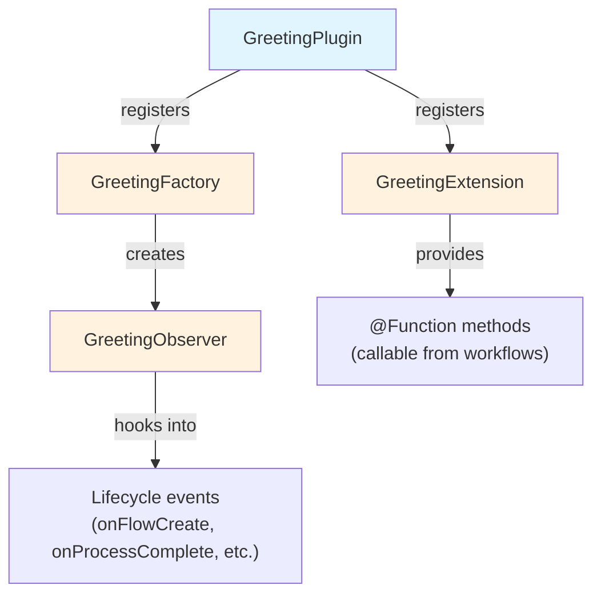

# 파트 2: 플러그인 프로젝트 생성

<span class="ai-translation-notice">:material-information-outline:{ .ai-translation-notice-icon } AI 지원 번역 - [자세히 알아보기 및 개선 제안](https://github.com/nextflow-io/training/blob/master/TRANSLATING.md)</span>

플러그인이 재사용 가능한 기능으로 Nextflow를 확장하는 방법을 살펴보았습니다.
이제 빌드 설정을 자동으로 처리해 주는 프로젝트 템플릿을 시작으로 직접 플러그인을 만들어 보겠습니다.

!!! tip "이 파트부터 시작하시나요?"

    이 파트부터 참여하시는 경우, 파트 1의 해결책을 시작점으로 복사하세요:

    ```bash
    cp -r solutions/1-plugin-basics/* .
    ```

!!! info "공식 문서"

    이 섹션과 이후 섹션에서는 플러그인 개발의 핵심 내용을 다룹니다.
    자세한 내용은 [공식 Nextflow 플러그인 개발 문서](https://www.nextflow.io/docs/latest/plugins/developing-plugins.html)를 참조하세요.

---

## 1. 플러그인 프로젝트 생성

내장 명령어 `nextflow plugin create`를 사용하면 완전한 플러그인 프로젝트를 생성할 수 있습니다:

```bash
nextflow plugin create nf-greeting training
```

```console title="Output"
Plugin created successfully at path: /workspaces/training/side-quests/plugin_development/nf-greeting
```

첫 번째 인자는 플러그인 이름이고, 두 번째 인자는 조직 이름입니다(생성된 코드를 폴더로 구성하는 데 사용됩니다).

!!! tip "수동 생성"

    플러그인 프로젝트를 직접 수동으로 생성하거나, GitHub의 [nf-hello 템플릿](https://github.com/nextflow-io/nf-hello)을 시작점으로 활용할 수도 있습니다.

---

## 2. 프로젝트 구조 살펴보기

Nextflow 플러그인은 Nextflow 내부에서 실행되는 Groovy 소프트웨어입니다.
채널, 프로세스, 설정과 같은 Nextflow 기능과 연동할 수 있도록 잘 정의된 통합 지점을 통해 Nextflow의 기능을 확장합니다.

코드를 작성하기 전에, 템플릿이 생성한 내용을 살펴보고 각 파일이 어디에 위치하는지 파악합니다.

플러그인 디렉토리로 이동합니다:

```bash
cd nf-greeting
```

내용을 확인합니다:

```bash
tree
```

다음과 같은 구조가 표시됩니다:

```console
.
├── build.gradle
├── COPYING
├── gradle
│   └── wrapper
│       ├── gradle-wrapper.jar
│       └── gradle-wrapper.properties
├── gradlew
├── Makefile
├── README.md
├── settings.gradle
└── src
    ├── main
    │   └── groovy
    │       └── training
    │           └── plugin
    │               ├── GreetingExtension.groovy
    │               ├── GreetingFactory.groovy
    │               ├── GreetingObserver.groovy
    │               └── GreetingPlugin.groovy
    └── test
        └── groovy
            └── training
                └── plugin
                    └── GreetingObserverTest.groovy

11 directories, 13 files
```

---

## 3. 빌드 설정 살펴보기

Nextflow 플러그인은 Java 기반 소프트웨어로, Nextflow에서 사용하기 전에 컴파일 및 패키징이 필요합니다.
이를 위해 빌드 도구가 필요합니다.

Gradle은 코드를 컴파일하고, 테스트를 실행하며, 소프트웨어를 패키징하는 빌드 도구입니다.
플러그인 템플릿에는 Gradle 래퍼(`./gradlew`)가 포함되어 있어 Gradle을 별도로 설치할 필요가 없습니다.

빌드 설정은 Gradle에게 플러그인을 컴파일하는 방법을 알려주고, Nextflow에게 플러그인을 로드하는 방법을 알려줍니다.
두 개의 파일이 가장 중요합니다.

### 3.1. settings.gradle

이 파일은 프로젝트를 식별합니다:

```bash
cat settings.gradle
```

```groovy title="settings.gradle"
rootProject.name = 'nf-greeting'
```

여기에 지정된 이름은 플러그인을 사용할 때 `nextflow.config`에 입력하는 이름과 일치해야 합니다.

### 3.2. build.gradle

빌드 파일에서 대부분의 설정이 이루어집니다:

```bash
cat build.gradle
```

파일에는 여러 섹션이 포함되어 있습니다.
가장 중요한 것은 `nextflowPlugin` 블록입니다:

```groovy title="build.gradle"
plugins {
    id 'io.nextflow.nextflow-plugin' version '1.0.0-beta.10'
}

version = '0.1.0'

nextflowPlugin {
    nextflowVersion = '24.10.0'       // (1)!

    provider = 'training'             // (2)!
    className = 'training.plugin.GreetingPlugin'  // (3)!
    extensionPoints = [               // (4)!
        'training.plugin.GreetingExtension',
        'training.plugin.GreetingFactory'
    ]

}
```

1. **`nextflowVersion`**: 필요한 최소 Nextflow 버전
2. **`provider`**: 이름 또는 조직명
3. **`className`**: 메인 플러그인 클래스로, Nextflow가 가장 먼저 로드하는 진입점
4. **`extensionPoints`**: Nextflow에 기능을 추가하는 클래스(함수, 모니터링 등)

`nextflowPlugin` 블록은 다음을 설정합니다:

- `nextflowVersion`: 필요한 최소 Nextflow 버전
- `provider`: 이름 또는 조직명
- `className`: 메인 플러그인 클래스(`build.gradle`에 지정되며, Nextflow가 가장 먼저 로드하는 진입점)
- `extensionPoints`: Nextflow에 기능을 추가하는 클래스(함수, 모니터링 등)

### 3.3. nextflowVersion 업데이트

템플릿이 생성하는 `nextflowVersion` 값이 오래되었을 수 있습니다.
완전한 호환성을 위해 설치된 Nextflow 버전에 맞게 업데이트합니다:

=== "후"

    ```groovy title="build.gradle" hl_lines="2"
    nextflowPlugin {
        nextflowVersion = '25.10.0'

        provider = 'training'
    ```

=== "전"

    ```groovy title="build.gradle" hl_lines="2"
    nextflowPlugin {
        nextflowVersion = '24.10.0'

        provider = 'training'
    ```

---

## 4. 소스 파일 파악하기

플러그인 소스 코드는 `src/main/groovy/training/plugin/`에 위치합니다.
각각 고유한 역할을 가진 네 개의 소스 파일이 있습니다:

| 파일                       | 역할                                            | 수정 파트        |
| -------------------------- | ----------------------------------------------- | ---------------- |
| `GreetingPlugin.groovy`    | Nextflow가 가장 먼저 로드하는 진입점            | 없음 (자동 생성) |
| `GreetingExtension.groovy` | 워크플로우에서 호출 가능한 함수 정의            | 파트 3           |
| `GreetingFactory.groovy`   | 워크플로우 시작 시 observer 인스턴스 생성       | 파트 5           |
| `GreetingObserver.groovy`  | 워크플로우 생명주기 이벤트에 응답하여 코드 실행 | 파트 5           |

각 파일은 처음 수정하는 파트에서 자세히 소개됩니다.
주요 파일은 다음과 같습니다:

- `GreetingPlugin`은 Nextflow가 로드하는 진입점입니다
- `GreetingExtension`은 이 플러그인이 워크플로우에 제공하는 함수를 정의합니다
- `GreetingObserver`는 파이프라인 코드를 변경하지 않고도 파이프라인과 함께 실행되며 이벤트에 응답합니다



---

## 5. 빌드, 설치 및 실행

템플릿에는 즉시 사용 가능한 동작하는 코드가 포함되어 있으므로, 프로젝트가 올바르게 설정되었는지 바로 빌드하고 실행하여 확인할 수 있습니다.

플러그인을 컴파일하고 로컬에 설치합니다:

```bash
make install
```

`make install`은 플러그인 코드를 컴파일하고 로컬 Nextflow 플러그인 디렉토리(`$NXF_HOME/plugins/`)에 복사하여 사용 가능하게 만듭니다.

??? example "빌드 출력"

    처음 실행하면 Gradle이 자동으로 다운로드됩니다(잠시 시간이 걸릴 수 있습니다):

    ```console
    Downloading https://services.gradle.org/distributions/gradle-8.14-bin.zip
    ...10%...20%...30%...40%...50%...60%...70%...80%...90%...100%

    Welcome to Gradle 8.14!
    ...

    Deprecated Gradle features were used in this build...

    BUILD SUCCESSFUL in 23s
    5 actionable tasks: 5 executed
    ```

    **경고 메시지는 정상입니다.**

    - **"Downloading gradle..."**: 처음 실행할 때만 발생합니다. 이후 빌드는 훨씬 빠릅니다.
    - **"Deprecated Gradle features..."**: 이 경고는 작성한 코드가 아닌 플러그인 템플릿에서 발생합니다. 무시해도 됩니다.
    - **"BUILD SUCCESSFUL"**: 이것이 중요합니다. 플러그인이 오류 없이 컴파일되었습니다.

파이프라인 디렉토리로 돌아갑니다:

```bash
cd ..
```

`nextflow.config`에 nf-greeting 플러그인을 추가합니다:

=== "후"

    ```groovy title="nextflow.config" hl_lines="4"
    // 플러그인 개발 실습을 위한 설정
    plugins {
        id 'nf-schema@2.6.1'
        id 'nf-greeting@0.1.0'
    }
    ```

=== "전"

    ```groovy title="nextflow.config"
    // 플러그인 개발 실습을 위한 설정
    plugins {
        id 'nf-schema@2.6.1'
    }
    ```

!!! note "로컬 플러그인에는 버전 지정 필요"

    로컬에 설치된 플러그인을 사용할 때는 버전을 반드시 지정해야 합니다(예: `nf-greeting@0.1.0`).
    레지스트리에 게시된 플러그인은 이름만으로도 사용할 수 있습니다.

파이프라인을 실행합니다:

```bash
nextflow run greet.nf -ansi-log false
```

`-ansi-log false` 플래그는 애니메이션 진행 표시를 비활성화하여 observer 메시지를 포함한 모든 출력이 순서대로 표시되도록 합니다.

```console title="Output"
Pipeline is starting! 🚀
[bc/f10449] Submitted process > SAY_HELLO (1)
[9a/f7bcb2] Submitted process > SAY_HELLO (2)
[6c/aff748] Submitted process > SAY_HELLO (3)
[de/8937ef] Submitted process > SAY_HELLO (4)
[98/c9a7d6] Submitted process > SAY_HELLO (5)
Output: Bonjour
Output: Hello
Output: Holà
Output: Ciao
Output: Hallo
Pipeline complete! 👋
```

(출력 순서와 work directory 해시는 다를 수 있습니다.)

"Pipeline is starting!"과 "Pipeline complete!" 메시지는 파트 1의 nf-hello 플러그인에서 본 것과 유사하지만, 이번에는 직접 만든 플러그인의 `GreetingObserver`에서 출력됩니다.
파이프라인 자체는 변경되지 않았으며, observer는 factory에 등록되어 있기 때문에 자동으로 실행됩니다.

---

## 핵심 정리

이 파트에서 학습한 내용:

- `nextflow plugin create` 명령어로 완전한 스타터 프로젝트를 생성할 수 있습니다
- `build.gradle`은 플러그인 메타데이터, 의존성, 기능을 제공하는 클래스를 설정합니다
- 플러그인은 네 가지 주요 구성 요소로 이루어집니다: Plugin(진입점), Extension(함수), Factory(모니터 생성), Observer(워크플로우 이벤트 응답)
- 개발 사이클은 코드 편집 → `make install` → 파이프라인 실행 순서로 진행됩니다

---

## 다음 단계

이제 Extension 클래스에 사용자 정의 함수를 구현하고 워크플로우에서 활용합니다.

[파트 3으로 계속 :material-arrow-right:](03_custom_functions.md){ .md-button .md-button--primary }
