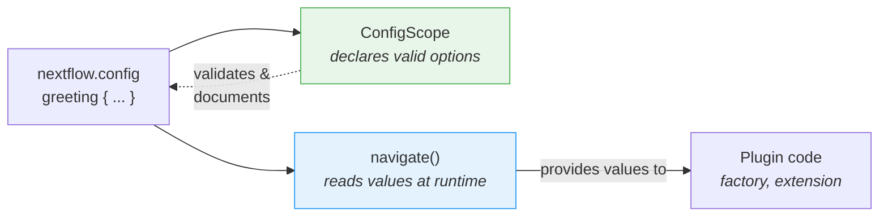

# 파트 6: 설정

<span class="ai-translation-notice">:material-information-outline:{ .ai-translation-notice-icon } AI 지원 번역 - [자세히 알아보기 및 개선 제안](https://github.com/nextflow-io/training/blob/master/TRANSLATING.md)</span>

플러그인에 사용자 정의 함수와 옵저버가 있지만, 모든 것이 하드코딩되어 있습니다.
사용자는 소스 코드를 편집하고 다시 빌드하지 않고는 작업 카운터를 끄거나 데코레이터를 변경할 수 없습니다.

파트 1에서는 `nextflow.config`의 `#!groovy validation {}` 및 `#!groovy co2footprint {}` 블록을 사용하여 nf-schema와 nf-co2footprint의 동작을 제어했습니다.
이러한 설정 블록은 플러그인 개발자가 해당 기능을 구현했기 때문에 존재합니다.
이 섹션에서는 여러분의 플러그인에도 동일한 기능을 구현합니다.

**목표:**

1. 사용자가 인사말 데코레이터의 접두사와 접미사를 맞춤화할 수 있도록 합니다
2. 사용자가 `nextflow.config`를 통해 플러그인을 활성화하거나 비활성화할 수 있도록 합니다
3. Nextflow가 `#!groovy greeting {}` 블록을 인식할 수 있도록 공식 설정 스코프를 등록합니다

**변경할 파일:**

| 파일                       | 변경 내용                                      |
| -------------------------- | ---------------------------------------------- |
| `GreetingExtension.groovy` | `init()`에서 접두사/접미사 설정 읽기           |
| `GreetingFactory.groovy`   | 설정 값을 읽어 옵저버 생성 여부 제어           |
| `GreetingConfig.groovy`    | 새 파일: 공식 `@ConfigScope` 클래스            |
| `build.gradle`             | 설정 클래스를 확장 포인트로 등록               |
| `nextflow.config`          | 테스트를 위한 `#!groovy greeting {}` 블록 추가 |

!!! tip "여기서부터 시작하시나요?"

    이 파트부터 참여하신다면, 파트 5의 해결책을 시작점으로 복사하세요:

    ```bash
    cp -r solutions/5-observers/* .
    ```

!!! info "공식 문서"

    포괄적인 설정 세부 정보는 [Nextflow 설정 스코프 문서](https://nextflow.io/docs/latest/developer/config-scopes.html)를 참조하세요.

---

## 1. 데코레이터를 설정 가능하게 만들기

`decorateGreeting` 함수는 모든 인사말을 `*** ... ***`으로 감쌉니다.
사용자는 다른 마커를 원할 수 있지만, 현재로서는 소스 코드를 편집하고 다시 빌드하는 것이 유일한 변경 방법입니다.

Nextflow 세션은 `session.config.navigate()`라는 메서드를 제공하며, 이를 통해 `nextflow.config`에서 내포된 값을 읽을 수 있습니다:

```groovy
// nextflow.config에서 'greeting.prefix'를 읽고, 기본값은 '***'
final prefix = session.config.navigate('greeting.prefix', '***') as String
```

이는 사용자의 `nextflow.config`에 있는 다음 설정 블록에 해당합니다:

```groovy title="nextflow.config"
greeting {
    prefix = '>>>'
}
```

### 1.1. 설정 읽기 추가 (빌드 실패 예정!)

`GreetingExtension.groovy`를 편집하여 `init()`에서 설정을 읽고 `decorateGreeting()`에서 사용하도록 합니다:

```groovy title="GreetingExtension.groovy" linenums="35" hl_lines="7-8 18"
@CompileStatic
class GreetingExtension extends PluginExtensionPoint {

    @Override
    protected void init(Session session) {
        // 기본값과 함께 설정 읽기
        prefix = session.config.navigate('greeting.prefix', '***') as String
        suffix = session.config.navigate('greeting.suffix', '***') as String
    }

    // ... 다른 메서드는 변경 없음 ...

    /**
    * 인사말을 축하 마커로 꾸밉니다
    */
    @Function
    String decorateGreeting(String greeting) {
        return "${prefix} ${greeting} ${suffix}"
    }
```

빌드를 시도합니다:

```bash
cd nf-greeting && make assemble
```

### 1.2. 오류 확인

빌드가 실패합니다:

```console
> Task :compileGroovy FAILED
GreetingExtension.groovy: 30: [Static type checking] - The variable [prefix] is undeclared.
 @ line 30, column 9.
           prefix = session.config.navigate('greeting.prefix', '***') as String
           ^

GreetingExtension.groovy: 31: [Static type checking] - The variable [suffix] is undeclared.
```

Groovy(및 Java)에서는 변수를 사용하기 전에 _선언_ 해야 합니다.
코드는 `prefix`와 `suffix`에 값을 할당하려 하지만, 클래스에 해당 이름의 필드가 없습니다.

### 1.3. 인스턴스 변수 선언으로 수정

클래스 시작 부분, 여는 중괄호 바로 뒤에 변수 선언을 추가합니다:

```groovy title="GreetingExtension.groovy" linenums="35" hl_lines="4-5"
@CompileStatic
class GreetingExtension extends PluginExtensionPoint {

    private String prefix = '***'
    private String suffix = '***'

    @Override
    protected void init(Session session) {
        // 기본값과 함께 설정 읽기
        prefix = session.config.navigate('greeting.prefix', '***') as String
        suffix = session.config.navigate('greeting.suffix', '***') as String
    }

    // ... 나머지 클래스는 변경 없음 ...
```

이 두 줄은 각 `GreetingExtension` 객체에 속하는 **인스턴스 변수**(필드라고도 함)를 선언합니다.
`private` 키워드는 이 클래스 내부의 코드만 접근할 수 있음을 의미합니다.
각 변수는 기본값 `'***'`으로 초기화됩니다.

플러그인이 로드되면 Nextflow는 `init()` 메서드를 호출하고, 이 메서드는 사용자가 `nextflow.config`에 설정한 값으로 기본값을 덮어씁니다.
사용자가 아무것도 설정하지 않은 경우, `navigate()`는 동일한 기본값을 반환하므로 동작은 변경되지 않습니다.
`decorateGreeting()` 메서드는 실행될 때마다 이 필드를 읽습니다.

!!! tip "오류에서 배우기"

    이 "사용 전 선언" 패턴은 Java/Groovy의 기본 원칙이지만, 변수가 처음 할당될 때 자동으로 생성되는 Python이나 R에서 오신 분들에게는 낯설 수 있습니다.
    이 오류를 한 번 경험하면 앞으로 빠르게 인식하고 수정할 수 있습니다.

### 1.4. 빌드 및 테스트

빌드하고 설치합니다:

```bash
make install && cd ..
```

`nextflow.config`를 업데이트하여 데코레이션을 맞춤화합니다:

=== "후"

    ```groovy title="nextflow.config" hl_lines="7-10"
    // 플러그인 개발 실습을 위한 설정
    plugins {
        id 'nf-schema@2.6.1'
        id 'nf-greeting@0.1.0'
    }

    greeting {
        prefix = '>>>'
        suffix = '<<<'
    }
    ```

=== "전"

    ```groovy title="nextflow.config"
    // 플러그인 개발 실습을 위한 설정
    plugins {
        id 'nf-schema@2.6.1'
        id 'nf-greeting@0.1.0'
    }
    ```

파이프라인을 실행합니다:

```bash
nextflow run greet.nf -ansi-log false
```

```console title="Output (partial)"
Decorated: >>> Hello <<<
Decorated: >>> Bonjour <<<
...
```

데코레이터가 이제 설정 파일의 사용자 정의 접두사와 접미사를 사용합니다.

Nextflow가 `greeting`을 유효한 스코프로 선언한 것이 없기 때문에 "Unrecognized config option" 경고를 출력한다는 점에 유의하세요.
값은 `navigate()`를 통해 올바르게 읽히지만, Nextflow는 이를 인식되지 않은 것으로 표시합니다.
섹션 3에서 이 문제를 해결합니다.

---

## 2. 작업 카운터를 설정 가능하게 만들기

현재 옵저버 팩토리는 조건 없이 옵저버를 생성합니다.
사용자는 설정을 통해 플러그인 전체를 비활성화할 수 있어야 합니다.

팩토리는 Nextflow 세션과 그 설정에 접근할 수 있으므로, `enabled` 설정을 읽고 옵저버 생성 여부를 결정하기에 적합한 위치입니다.

=== "후"

    ```groovy title="GreetingFactory.groovy" linenums="31" hl_lines="3-4"
    @Override
    Collection<TraceObserver> create(Session session) {
        final enabled = session.config.navigate('greeting.enabled', true)
        if (!enabled) return []

        return [
            new GreetingObserver(),
            new TaskCounterObserver()
        ]
    }
    ```

=== "전"

    ```groovy title="GreetingFactory.groovy" linenums="31"
    @Override
    Collection<TraceObserver> create(Session session) {
        return [
            new GreetingObserver(),
            new TaskCounterObserver()
        ]
    }
    ```

팩토리는 이제 설정에서 `greeting.enabled`를 읽고, 사용자가 `false`로 설정한 경우 빈 목록을 반환합니다.
목록이 비어 있으면 옵저버가 생성되지 않으므로 플러그인의 라이프사이클 훅이 자동으로 건너뜁니다.

### 2.1. 빌드 및 테스트

플러그인을 다시 빌드하고 설치합니다:

```bash
cd nf-greeting && make install && cd ..
```

파이프라인을 실행하여 모든 것이 정상적으로 작동하는지 확인합니다:

```bash
nextflow run greet.nf -ansi-log false
```

??? exercise "플러그인 전체 비활성화"

    `nextflow.config`에서 `greeting.enabled = false`를 설정하고 파이프라인을 다시 실행해 보세요.
    출력에서 무엇이 달라지나요?

    ??? solution "해결책"

        ```groovy title="nextflow.config" hl_lines="8"
        // 플러그인 개발 실습을 위한 설정
        plugins {
            id 'nf-schema@2.6.1'
            id 'nf-greeting@0.1.0'
        }

        greeting {
            enabled = false
        }
        ```

        팩토리가 `enabled`가 false일 때 빈 목록을 반환하기 때문에 "Pipeline is starting!", "Pipeline complete!", 그리고 작업 수 메시지가 모두 사라집니다.
        파이프라인 자체는 계속 실행되지만, 활성화된 옵저버가 없습니다.

        계속하기 전에 `enabled`를 `true`로 다시 설정하거나 해당 줄을 제거하는 것을 잊지 마세요.

---

## 3. ConfigScope를 사용한 공식 설정

플러그인 설정은 작동하지만, Nextflow는 여전히 "Unrecognized config option" 경고를 출력합니다.
이는 `session.config.navigate()`가 값만 읽을 뿐, Nextflow에 `greeting`이 유효한 설정 스코프임을 알리지 않았기 때문입니다.

`ConfigScope` 클래스가 이 간극을 채웁니다.
플러그인이 허용하는 옵션, 해당 타입, 기본값을 선언합니다.
`navigate()` 호출을 **대체하지 않습니다**. 대신, 함께 작동합니다:



`ConfigScope` 클래스 없이도 `navigate()`는 작동하지만:

- Nextflow가 인식되지 않은 옵션에 대해 경고를 출력합니다 (이미 확인하셨듯이)
- `nextflow.config`를 작성하는 사용자를 위한 IDE 자동 완성이 없습니다
- 설정 옵션이 자체 문서화되지 않습니다
- 타입 변환이 수동으로 이루어집니다 (`as String`, `as boolean`)

공식 설정 스코프 클래스를 등록하면 경고가 해결되고 세 가지 문제가 모두 해결됩니다.
이것은 파트 1에서 사용한 `#!groovy validation {}` 및 `#!groovy co2footprint {}` 블록의 기반이 되는 동일한 메커니즘입니다.

### 3.1. 설정 클래스 생성

새 파일을 생성합니다:

```bash
touch nf-greeting/src/main/groovy/training/plugin/GreetingConfig.groovy
```

세 가지 옵션을 모두 포함하는 설정 클래스를 추가합니다:

```groovy title="GreetingConfig.groovy" linenums="1"
package training.plugin

import nextflow.config.spec.ConfigOption
import nextflow.config.spec.ConfigScope
import nextflow.config.spec.ScopeName
import nextflow.script.dsl.Description

/**
 * nf-greeting 플러그인의 설정 옵션.
 *
 * 사용자는 nextflow.config에서 다음과 같이 설정합니다:
 *
 *     greeting {
 *         enabled = true
 *         prefix = '>>>'
 *         suffix = '<<<'
 *     }
 */
@ScopeName('greeting')                       // (1)!
class GreetingConfig implements ConfigScope { // (2)!

    GreetingConfig() {}

    GreetingConfig(Map opts) {               // (3)!
        this.enabled = opts.enabled as Boolean ?: true
        this.prefix = opts.prefix as String ?: '***'
        this.suffix = opts.suffix as String ?: '***'
    }

    @ConfigOption                            // (4)!
    @Description('Enable or disable the plugin entirely')
    boolean enabled = true

    @ConfigOption
    @Description('Prefix for decorated greetings')
    String prefix = '***'

    @ConfigOption
    @Description('Suffix for decorated greetings')
    String suffix = '***'
}
```

1. `nextflow.config`의 `#!groovy greeting { }` 블록에 매핑됩니다
2. 설정 클래스에 필요한 인터페이스입니다
3. Nextflow가 설정을 인스턴스화하려면 인자 없는 생성자와 Map 생성자가 모두 필요합니다
4. `@ConfigOption`은 필드를 설정 옵션으로 표시하고, `@Description`은 툴링을 위해 문서화합니다

핵심 사항:

- **`@ScopeName('greeting')`**: 설정의 `greeting { }` 블록에 매핑됩니다
- **`implements ConfigScope`**: 설정 클래스에 필요한 인터페이스입니다
- **`@ConfigOption`**: 각 필드가 설정 옵션이 됩니다
- **`@Description`**: 언어 서버 지원을 위해 각 옵션을 문서화합니다 (`nextflow.script.dsl`에서 가져옴)
- **생성자**: 인자 없는 생성자와 Map 생성자가 모두 필요합니다

### 3.2. 설정 클래스 등록

클래스를 생성하는 것만으로는 충분하지 않습니다.
Nextflow가 클래스의 존재를 알 수 있도록 다른 확장 포인트와 함께 `build.gradle`에 등록해야 합니다.

=== "후"

    ```groovy title="build.gradle" hl_lines="4"
    extensionPoints = [
        'training.plugin.GreetingExtension',
        'training.plugin.GreetingFactory',
        'training.plugin.GreetingConfig'
    ]
    ```

=== "전"

    ```groovy title="build.gradle"
    extensionPoints = [
        'training.plugin.GreetingExtension',
        'training.plugin.GreetingFactory'
    ]
    ```

팩토리와 확장 포인트 등록의 차이점에 유의하세요:

- **`build.gradle`의 `extensionPoints`**: 컴파일 타임 등록. Nextflow 플러그인 시스템에 어떤 클래스가 확장 포인트를 구현하는지 알립니다.
- **팩토리의 `create()` 메서드**: 런타임 등록. 팩토리는 워크플로우가 실제로 시작될 때 옵저버 인스턴스를 생성합니다.

### 3.3. 빌드 및 테스트

```bash
cd nf-greeting && make install && cd ..
nextflow run greet.nf -ansi-log false
```

파이프라인 동작은 동일하지만, "Unrecognized config option" 경고가 사라집니다.

!!! note "변경된 것과 변경되지 않은 것"

    `GreetingFactory`와 `GreetingExtension`은 여전히 `session.config.navigate()`를 사용하여 런타임에 값을 읽습니다.
    해당 코드는 변경되지 않았습니다.
    `ConfigScope` 클래스는 Nextflow에 어떤 옵션이 존재하는지 알리는 병렬 선언입니다.
    두 가지 모두 필요합니다: `ConfigScope`는 선언하고, `navigate()`는 읽습니다.

이제 플러그인은 파트 1에서 사용한 플러그인과 동일한 구조를 갖습니다.
nf-schema가 `#!groovy validation {}` 블록을 노출하거나 nf-co2footprint가 `#!groovy co2footprint {}` 블록을 노출할 때, 정확히 이 패턴을 사용합니다: 어노테이션이 달린 필드를 가진 `ConfigScope` 클래스가 확장 포인트로 등록됩니다.
여러분의 `#!groovy greeting {}` 블록도 동일한 방식으로 작동합니다.

---

## 핵심 정리

다음 내용을 학습했습니다:

- `session.config.navigate()`는 런타임에 설정 값을 **읽습니다**
- `@ConfigScope` 클래스는 어떤 설정 옵션이 존재하는지 **선언합니다**; `navigate()` 대신이 아니라 함께 작동합니다
- 설정은 옵저버와 확장 함수 모두에 적용할 수 있습니다
- Groovy/Java에서 인스턴스 변수는 사용 전에 선언해야 하며, `init()`은 플러그인이 로드될 때 설정에서 값을 채웁니다

| 사용 사례                            | 권장 접근 방식                                     |
| ------------------------------------ | -------------------------------------------------- |
| 빠른 프로토타입 또는 간단한 플러그인 | `session.config.navigate()`만 사용                 |
| 많은 옵션이 있는 프로덕션 플러그인   | `navigate()` 호출과 함께 `ConfigScope` 클래스 추가 |
| 공개적으로 공유할 플러그인           | `navigate()` 호출과 함께 `ConfigScope` 클래스 추가 |

---

## 다음 단계

이제 플러그인에 프로덕션 플러그인의 모든 요소가 갖춰졌습니다: 사용자 정의 함수, 트레이스 옵저버, 그리고 사용자 대면 설정.
마지막 단계는 배포를 위한 패키징입니다.

[요약으로 계속 :material-arrow-right:](summary.md){ .md-button .md-button--primary }
