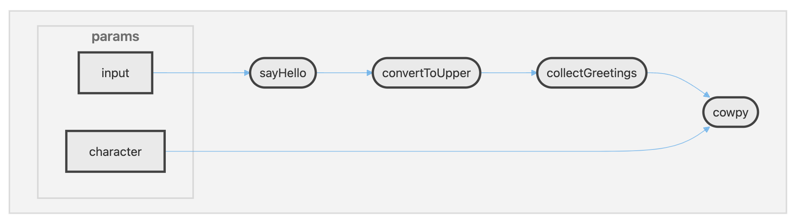

# Part 2: Run pipelines

In Part 1 of this course (Run Basic Operations), we started with an example workflow that had only minimal features in order to keep the code complexity low.
For example, `1-hello.nf` used a command-line parameter (`--greeting`) to provide a single value at a time.

However, most real-world pipelines use more sophisticated features in order to enable efficient processing of large amounts of data at scale, and apply multiple processing steps chained together by sometimes complex logic.

In this part of the training, we demonstrate key features of real-world pipelines by trying out expanded versions of the original Hello World pipeline.

## 1. Processing input data from a file

In a real-world pipeline, we typically want to process multiple data points (or data series) contained in one or more input files.
And wherever possible, we want to run the processing of independent data in parallel, to shorten the time spent waiting for analysis.

To enable this efficiently, Nextflow uses a system of queues called **channels**.

To demonstrate this, we've prepared a a CSV file called `greetings.csv` that contains several input greetings, mimicking the kind of columnar data you might want to process in a real data analysis.

<details>
  <summary>CSV file contents</summary>

```csv title="greetings.csv" linenums="1"
Hello,English,123
Bonjour,French,456
Holà,Spanish,789
```

Note that the numbers are not meaningful, they are just there for illustrative purposes.

</details>

And we've written an improved version of the original workflow, now called `2a-inputs.nf`, that will read in the CSV file, extract the greetings and write each of them to a separate file.

<figure class="excalidraw">
--8<-- "docs/nextflow_run/img/hello-pipeline-multi-inputs.svg"
</figure>

Let's run the workflow first, and we'll take a look at the relevant Nextflow code afterward.

### 1.1. Run the workflow

Run the following command in your terminal.

```bash
nextflow run 2a-inputs.nf --input greetings.csv
```

This should run without error.

<details>
  <summary>Command output</summary>

```console linenums="1"
 N E X T F L O W   ~  version 25.04.3

Launching `2a-inputs.nf` [mighty_sammet] DSL2 - revision: 29fb5352b3

executor >  local (3)
[8e/0eb066] sayHello (2) [100%] 3 of 3 ✔
```

</details>

Excitingly, this seems to indicate that '3 of 3' calls were made for the process, which is encouraging, since there were three rows of data in the CSV we provided as input.
This suggests the `sayHello()` process was called three times, once on each input row.

### 1.2. Find the outputs in the `results` directory

Let's look at the 'results' directory to see if our workflow is still writing a copy of our outputs there.

<details>
  <summary>Directory contents</summary>

```console title="results/" linenums="1"
results
├── Bonjour-output.txt
├── Hello-output.txt
└── Holà-output.txt
```

</details>

Yes! We see three output files with different names, conveniently enough.
(Spoiler: we changed the workflow to name the files differently.)

If you haven't deleted the `results` folder when running Part 1 of this training, you'll see the `output.txt` file in there too.

You can open each of them to satisfy yourself that they contain the appropriate greeting string.

<details>
  <summary>File contents</summary>

```console title="results/Hello-output.txt"
Hello
```

```console title="results/Bonjour-output.txt"
Bonjour
```

```console title="results/Holà-output.txt"
Holà
```

</details>

This confirms each greeting in the input file has been processed appropriately.

### 1.3. Find the original outputs and logs

You may have noticed that the console output above referred to only one task directory.
Does that mean all three calls to `sayHello()` were executed within that one task directory?

Let's have a look inside that `8e/0eb066` task directory:

<details>
  <summary>Directory contents</summary>
```console title="8e/0eb066"
work/8e/0eb066071cdb4123906b7b4ea8b047/
└── Bonjour-output.txt
```
</details>

No! We only find the output corresponding to one of the greetings (as well as the accessory files if we enable display of hidden files).

So what's going on here?

By default, the ANSI logging system writes the status information for all calls to the same process on the same line.
As a result, it only showed us one of the three task directory paths (`8e/0eb066`) in the console output.
There are two others that are not listed there.

We can modify the logging behavior to see the full list of process calls by adding the `-ansi-log false` to the command as follows:

```bash
nextflow run 2a-inputs.nf --input greetings.csv -ansi-log false
```

This time we see all three process runs and their associated work subdirectories listed in the output.

<details>
  <summary>Command output</summary>

```console linenums="1"
N E X T F L O W  ~  version 25.04.3
Launching `2a-inputs.nf` [pedantic_hamilton] DSL2 - revision: 6bbc42e49f
[ab/1a8ece] Submitted process > sayHello (1)
[0d/2cae24] Submitted process > sayHello (2)
[b5/0df1d6] Submitted process > sayHello (3)
```

Notice that the way the status is reported is a bit different between the two logging modes.
In the condensed mode, Nextflow reports whether calls were completed successfully or not.
In this expanded mode, it only reports that they were submitted.

</details>

This confirms that the `sayHello()` process gets called three times, and a separate task directory is created for each one.

If we look inside each of the task directories listed there, we can verify that each one corresponds to one of the greetings.

<details>
  <summary>Directory contents</summary>

```console title="ab/1a8ece"
work/ab/1a8ece307e53f03fce689dde904b64/
└── Hello-output.txt
```

```console title="0d/2cae24"
work/0d/2cae2481a53593bc607077c80c9466/
└── Bonjour-output.txt
```

```console title="b5/0df1d6"
work/b5/0df1d642353269909c2ce23fc2a8fa/
└── Holà-output.txt
```

</details>

This confirms that each process call is executed in isolation from all the others.
That has many advantages, including avoiding collisions if the process produces any intermediate files with non-unique names.

!!! Tip

    For a complex workflow, or a large number of inputs, having the full list output to the terminal might get a bit overwhelming, so you might prefer not to use `-ansi-log false` in those cases.

### 1.4. Examine the code

So this version of the workflow is capable of reading in a CSV file of inputs, processing the inputs separately, and naming the outputs uniquely.

Let's take a look at what makes that possible in the workflow code.
Once again, we're not aiming to memorize code syntax, but to identify signature components of the workflow that provide important functionality.

<details>
  <summary>Code</summary>

```groovy title="2a-inputs.nf" linenums="1"
#!/usr/bin/env nextflow

/*
 * Use echo to print 'Hello World!' to a file
 */
process sayHello {

    publishDir 'results', mode: 'copy'

    input:
        val greeting

    output:
        path "${greeting}-output.txt"

    script:
    """
    echo '$greeting' > '$greeting-output.txt'
    """
}

workflow {

    // create a channel for inputs from a CSV file
    greeting_ch = channel.fromPath(params.input)
                        .splitCsv()
                        .map { line -> line[0] }

    // emit a greeting
    sayHello(greeting_ch)
}
```

</details>

#### 1.4.1. Loading the input data from the CSV

This is the most interesting part: how did we switch from taking a single value from the command-line, to taking a CSV file, parsing it and processing the individual greetings it contains?

In Nextflow, we do that with a **channel**: a construct designed to handle inputs efficiently and shuttle them from one step to another in multi-step workflows, while providing built-in parallelism and many additional benefits.

Let's break it down.

```groovy title="2a-inputs.nf" linenums="22"
workflow {

    // create a channel for inputs from a CSV file
    greeting_ch = channel.fromPath(params.input)
                        .splitCsv()
                        .map { line -> line[0] }
```

This is where the magic happens, starting at line 25.
Here's what that line means in plain English:

- `Channel` creates a **channel**, i.e. a queue that will hold the data
- `.fromPath` specifies the data source is a filepath
- `(params.input)` specifies the filepath is provided by `--input` on the command line

In other words, that line tells Nextflow: take the filepath given with `--input` and get ready to treat its contents as input data.

Then the next two lines apply **operators** that do the actual parsing of the file and loading of the data into the appropriate data structure:

- `.splitCsv()` tells Nextflow to parse the CSV file into an array representing rows and columns
- `.map { line -> line[0] }` tells Nextflow to take only the element in the first column from each row

So in practice, starting from the following CSV file:

```csv title="greetings.csv" linenums="1"
Hello,English,123
Bonjour,French,456
Holà,Spanish,789
```

We have transformed that into an array that looks like this:

```txt title="Array contents"
[[Hello,English,123],[Bonjour,French,456],[Holà,Spanish,789]]
```

And then we've taken the first element from each of the three rows and loaded them into a Nextflow channel that now contains: `Hello`, `Bonjour`, and `Holà`.

The result of this very short snippet of code is a channel called `greeting_ch` loaded with the three individual greetings from the CSV file, ready for processing.

#### 1.4.2. Call the process on each greeting

Next, in the last line of the workflow block, we provide the loaded `greeting_ch` channel as input to the `sayHello()` process.

```groovy title="2a-inputs.nf" linenums="28"
    sayHello(greeting_ch)
}
```

This tells Nextflow to run the process _individually_ on each element in the channel, i.e. on each greeting.

And because Nextflow is smart like that, it will run these process calls in parallel if possible, depending on the available computing infrastructure.

That is how you can achieve efficient and scalable processing of a lot of data (many samples, or data points, whatever is your unit of research) with comparatively very little code.

#### 1.4.3. Ensure the outputs are uniquely named

Finally, it's worth taking a quick look at how we get the output files to be named uniquely.

```groovy title="2a-inputs.nf" linenums="13"
    output:
        path "${greeting}-output.txt"

    script:
    """
    echo '$greeting' > '$greeting-output.txt'
    """
```

You see that, compared to the version of this process in `1-hello.nf`, the output declaration and the relevant bit of the command have changed to include the greeting value in the output file name.

This is one way to ensure that the output file names won't collide when they get published to the common `results` directory.

And that's the only change we've had to make inside the process declaration.

### Takeaway

You understand at a basic level how channels and operators enable us to process multiple inputs efficiently.

### What's next?

Discover how multi-step workflows are constructed and how they operate.

---

## 2. Running multi-step workflows

Most real-world workflows involve more than one step.
Let's build on what we just learned about channels, and look at how Nextflow uses channels and operators to connect processes together in a multi-step workflow.

To that end, we provide you with an example workflow that chains together three separate steps and demonstrates the following:

1. Making data flow from one process to the next
2. Collecting outputs from multiple process calls into a single process call

Specifically, we made an expanded version of the workflow called `2b-multistep.nf` that takes each input greeting, converts it to uppercase, then collects all the uppercased greetings into a single output file.

<figure class="excalidraw">
--8<-- "docs/nextflow_run/img/hello-pipeline-multi-steps.svg"
</figure>

As previously, we'll run the workflow first then look at the code to see what's changed.

### 2.1. Run the workflow

Run the following command in your terminal:

```bash
nextflow run 2b-multistep.nf --input greetings.csv
```

Once again this should run successfully.

<details>
  <summary>Command output</summary>

```console linenums="1"
 N E X T F L O W   ~  version 25.04.3

Launching `2b-multistep.nf` [soggy_franklin] DSL2 - revision: bc8e1b2726

[d6/cdf466] sayHello (1)       | 3 of 3 ✔
[99/79394f] convertToUpper (2) | 3 of 3 ✔
[1e/83586c] collectGreetings   | 1 of 1 ✔
```

</details>

You see that as promised, multiple steps were run as part of the workflow; the first two (`sayHello` and `convertToUpper`) were presumably run on each individual greeting, and the third (`collectGreetings`) will have been run only once, on the outputs of all three of the `convertToUpper` calls.

### 2.2. Find the outputs

Let's verify that that is in fact what happened by taking a look in the `results` directory.

<details>
  <summary>Directory contents</summary>

```console title="Directory contents"
results
├── Bonjour-output.txt
├── COLLECTED-output.txt
├── Hello-output.txt
├── Holà-output.txt
├── UPPER-Bonjour-output.txt
├── UPPER-Hello-output.txt
└── UPPER-Holà-output.txt
```

</details>

Look at the file names and check their contents to confirm that they are what you expect; for example:

```console title="bash"
cat results/COLLECTED-output.txt
```

<details>
  <summary>Command output</summary>

```console
HELLO
BONJOUR
HOLà
```

</details>

That is the expected final result of our multi-step pipeline.

### 2.3. Examine the code

Let's look at the code and see what we can tie back to what we just observed.

<details>
  <summary>Code</summary>

```groovy title="2a-inputs.nf" linenums="1"
#!/usr/bin/env nextflow

/*
 * Use echo to print 'Hello World!' to a file
 */
process sayHello {

    publishDir 'results', mode: 'copy'

    input:
        val greeting

    output:
        path "${greeting}-output.txt"

    script:
    """
    echo '$greeting' > '$greeting-output.txt'
    """
}

/*
 * Use a text replacement tool to convert the greeting to uppercase
 */
process convertToUpper {

    publishDir 'results', mode: 'copy'

    input:
        path input_file

    output:
        path "UPPER-${input_file}"

    script:
    """
    cat '$input_file' | tr '[a-z]' '[A-Z]' > 'UPPER-${input_file}'
    """
}

/*
 * Collect uppercase greetings into a single output file
 */
process collectGreetings {

    publishDir 'results', mode: 'copy'

    input:
        path input_files

    output:
        path "COLLECTED-output.txt"

    script:
    """
    cat ${input_files} > 'COLLECTED-output.txt'
    """
}

workflow {

    // create a channel for inputs from a CSV file
    greeting_ch = channel.fromPath(params.input)
                        .splitCsv()
                        .map { line -> line[0] }

    // emit a greeting
    sayHello(greeting_ch)

    // convert the greeting to uppercase
    convertToUpper(sayHello.out)

    // collect all the greetings into one file
    collectGreetings(convertToUpper.out.collect())
}

```

</details>

The most obvious difference compared to the previous version of the workflow is that now there are multiple process definitions, and correspondingly, several process calls in the workflow block.

#### 2.3.1. Multiple process definitions

In addition to the original `sayHello` process, we now also have `convertToUpper` and `collectGreetings`, which match the names of the processes we saw in the console output.

All three are structured in the same way and follow roughly the same logic.
We won't go into that in detail, but it shows how a process can be given additional parameters and emit multiple outputs.

#### 2.3.2. Processes are connected via channels

The really interesting thing to look at here is how the process calls are chained together in the workflow block.

<details>
  <summary>Code</summary>

```groovy title="2a-inputs.nf" linenums="69"
workflow {

    // create a channel for inputs from a CSV file
    greeting_ch = channel.fromPath(params.input)
                        .splitCsv()
                        .map { line -> line[0] }

    // emit a greeting
    sayHello(greeting_ch)

    // convert the greeting to uppercase
    convertToUpper(sayHello.out)

    // collect all the greetings into one file
    collectGreetings(convertToUpper.out.collect())
}
```

</details>

You can see that the first process call, `sayHello(greeting_ch)`, is unchanged.

Then the next process call, to `convertToUpper`, _refers_ to the output of `sayHello` as `sayHello.out`.

```groovy title="2a-inputs.nf" linenums="79"
    // convert the greeting to uppercase
    convertToUpper(sayHello.out)
```

This tells Nextflow to provide `sayHello.out`, which represents the channel output by `sayHello()`, as an input to `convertToUpper`.

That is, at its simplest, how we shuttle data from one step to the next in Nextflow.

Finally, the third call, `collectGreetings`, is doing the same thing, with a twist:

```groovy title="2a-inputs.nf" linenums="82"
    // collect all the greetings into one file
    collectGreetings(convertToUpper.out.collect())
```

This one is a bit more complicated and deserves its own discussion.

#### 2.3.3. Operators provide additional wiring options

What we're seeing in `convertToUpper.out.collect()` is the use of another operator (like `splitCsv` and `map` in the previous section), called `collect`.

This operator is used to collect the outputs from multiple calls to the same process (as when we run `sayHello` on multiple greetings independently) and package them into a single channel element.

This allows us to take all the separate uppercased greetings produced by the second step of the workflow and feed them all together to a single call in the third step of the pipeline.

<figure class="excalidraw">
--8<-- "docs/nextflow_run/img/with-collect-operator.svg"
</figure>

If we didn't apply `collect()` to the output of `convertToUpper()` before feeding it to `collectGreetings()`, Nextflow would simply run `collectGreetings()` independently on each greeting, which would not achieve our goal.

<figure class="excalidraw">
--8<-- "docs/nextflow_run/img/without-collect-operator.svg"
</figure>

There are many other [operators](https://www.nextflow.io/docs/latest/reference/operator.html#operator-page) available to apply transformations to the contents of channels between process calls.

This gives pipeline developers a lot of flexibility for customizing the flow logic of their pipeline.
The downside is that it can sometimes make it harder to decipher what the pipeline is doing.

### 2.4. Use the graph preview

One very helpful tool for understanding what a pipeline does, if it's not adequately documented, is the graph preview functionality available in VSCode thanks to the Nextflow extension. You can see this in the training environment by clicking on the small `DAG preview` link displayed just above the workflow block in any Nextflow script.



This does not show operators, but it does give a useful representation of how process calls are connected and what are their inputs.

### Takeaway

You understand at a basic level how multi-step workflows are constructed using channels and operators and how they operate.

### What's next?

Learn how Nextflow pipelines can be modularized to promote code reuse and maintainability.

---

## 3. Running modularized pipelines

So far, all the workflows we've looked at have consisted of one single workflow file containing all the relevant code.

However, real-world pipelines typically benefit from being _modularized_, meaning that the code is split into different files.
This can make their development and maintenance more efficient and sustainable.

<figure class="excalidraw">
    --8<-- "docs/side_quests/img/nf-core/nested.excalidraw.svg"
</figure>

Here we are going to demonstrate the most common form of code modularity in Nextflow, which is the use of **modules**.

In Nextflow, a **module** is a single process definition that is encapsulated by itself in a standalone code file.
To use a module in a workflow, you just add a single-line import statement to your workflow code file; then you can integrate the process into the workflow the same way you normally would.

Putting processes into individual modules makes it possible to reuse process definitions in multiple workflows without producing multiple copies of the code.
This makes the code more shareable, flexible and maintainable.

We have of course once again prepared a suitable workflow for demonstration purposes, called `2c-modules.nf`, along with a set of modules located in the `modules/` directory.

<details>
  <summary>Directory contents</summary>

```console title="modules/"
modules/
├── collectGreetings.nf
├── convertToUpper.nf
├── cowpy.nf
└── sayHello.nf
```

</details>

You see there are four Nextflow files, each named after one of the processes.
You can ignore the `cowpy.nf` file for now; we'll get to that one later.

### 3.1. Examine the code

This time we're going to look at the code first, so let's open each of the files listed above (not shown here).

We see that the code for the processes and workflow logic are exactly the same as in the previous version of the workflow.
However, the process code is now located in the modules instead of being in the main workflow file, and there are now import statements in the workflow file telling Nextflow to pull them in at runtime.

```groovy title="hello-modules.nf" linenums="9" hl_lines="4"
// Include modules
include { sayHello } from './modules/sayHello.nf'
include { convertToUpper } from './modules/convertToUpper.nf'
include { collectGreetings } from './modules/collectGreetings.nf'

workflow {
```

You can look inside one of the modules to satisfy yourself that the process definition is unchanged; it's literally just been copy-pasted into a standalone file.

<details>
  <summary>Example: sayHello process module</summary>

```groovy title="modules/sayHello.nf" linenums="1"
#!/usr/bin/env nextflow

/*
 * Use echo to print 'Hello World!' to a file
 */
process sayHello {

    publishDir 'results', mode: 'copy'

    input:
        val greeting

    output:
        path "${greeting}-output.txt"

    script:
    """
    echo '$greeting' > '$greeting-output.txt'
    """
}
```

</details>

So let's see what it looks like to run this new version.

### 3.2. Run the workflow

Run this command in your terminal, with the `-resume` flag:

```bash
nextflow run 2c-modules.nf --input greetings.csv -resume
```

Once again this should run successfully.

<details>
  <summary>Command output</summary>

```console linenums="1"
 N E X T F L O W   ~  version 25.04.3

Launching `2c-modules.nf` [soggy_franklin] DSL2 - revision: bc8e1b2726

[j6/cdfa66] sayHello (1)       | 3 of 3, cached: ✔
[95/79484f] convertToUpper (2) | 3 of 3, cached: ✔
[5e/4358gc] collectGreetings   | 1 of 1, cached: ✔
```

</details>

You'll notice that the process executions all cached successfully, meaning that Nextflow recognized that it has already done the requested work, even though the code has been split up and the main workflow file has been renamed.

None of that matters to Nextflow; what matters is the job script that is generated once all the code has been pulled together and evaluated.

!!! Tip

    It is also possible to encapsulate a section of a workflow as a 'subworkflow' that can be imported into a larger pipeline, but that is outside the scope of this course.

    You can learn more about developing composable workflows in the Side Quest on [Workflows of Workflows](https://training.nextflow.io/latest/side_quests/workflows_of_workflows/).

### Takeaway

You know how processes can be stored in standalone modules to promote code reuse and improve maintainability.

### What's next?

Learn to use containers for managing software dependencies.

---

## 4. Using containerized software

So far the workflows we've been using as examples just needed to run very basic text processing operations using UNIX tools available in our environment.

However, real-world pipelines typically require specialized tools and packages that are not included by default in most environments.
Usually, you'd need to install these tools, manage their dependencies, and resolve any conflicts.

That is all very tedious and annoying.
A much better way to address this problem is to use **containers**.

A **container** is a lightweight, standalone, executable unit of software created from a container **image** that includes everything needed to run an application including code, system libraries and settings.

!!! Tip

    We teach this using the technology [Docker](https://www.docker.com/get-started/), but Nextflow supports [several other container technologies](https://www.nextflow.io/docs/latest/container.html#) as well.

### 4.1. Use a container directly

First, let's try interacting with a container directly.
This will help solidify your understanding of what containers are before we start using them in Nextflow.

#### 4.1.1. Pull the container image

To use a container, you usually download or "pull" a container image from a container registry, and then run the container image to create a container instance.

The general syntax is as follows:

```bash title="Syntax"
docker pull '<container>'
```

- `docker pull` is the instruction to the container system to pull a container image from a repository.
- `'<container>'` is the URI address of the container image.

As an example, let's pull a container image that contains [cowpy](https://github.com/jeffbuttars/cowpy), a python implementation of a tool called `cowsay` that generates ASCII art to display arbitrary text inputs in a fun way.

There are various repositories where you can find published containers.
We used the [Seqera Containers](https://seqera.io/containers/) service to generate this Docker container image from the `cowpy` Conda package: `'community.wave.seqera.io/library/cowpy:1.1.5--3db457ae1977a273'`.

Run the complete pull command:

```bash
docker pull 'community.wave.seqera.io/library/cowpy:1.1.5--3db457ae1977a273'
```

This tells the system to download the image specified.

<details>
  <summary>Command output</summary>

```console linenums="1"
Unable to find image 'community.wave.seqera.io/library/cowpy:1.1.5--3db457ae1977a273' locally
131d6a1b707a8e65: Pulling from library/cowpy
dafa2b0c44d2: Pull complete
dec6b097362e: Pull complete
f88da01cff0b: Pull complete
4f4fb700ef54: Pull complete
92dc97a3ef36: Pull complete
403f74b0f85e: Pull complete
10b8c00c10a5: Pull complete
17dc7ea432cc: Pull complete
bb36d6c3110d: Pull complete
0ea1a16bbe82: Pull complete
030a47592a0a: Pull complete
622dd7f15040: Pull complete
895fb5d0f4df: Pull complete
Digest: sha256:fa50498b32534d83e0a89bb21fec0c47cc03933ac95c6b6587df82aaa9d68db3
Status: Downloaded newer image for community.wave.seqera.io/library/cowpy:1.1.5--3db457ae1977a273
community.wave.seqera.io/library/cowpy:1.1.5--3db457ae1977a273
```

</details>

Once the download is complete, you have a local copy of the container image.

#### 4.1.2. Spin up the container

Containers can be run as a one-off command, but you can also use them interactively, which gives you a shell prompt inside the container and allows you to play with the command.

The general syntax is as follows:

```bash title="Syntax"
docker run --rm '<container>' [tool command]
```

- `docker run --rm '<container>'` is the instruction to the container system to spin up a container instance from a container image and execute a command in it.
- `--rm` tells the system to shut down the container instance after the command has completed.

</details>

Fully assembled, the container execution command looks like this:

```bash
docker run --rm -it 'community.wave.seqera.io/library/cowpy:1.1.5--3db457ae1977a273'
```

Run that command, and you should see your prompt change to something like `(base) root@b645838b3314:/tmp#`, which indicates that you are now inside the container.

You can verify this by running `ls` to list directory contents:

```bash
ls /
```

<details>
  <summary>Command output</summary>

```console
bin  boot  dev  etc  home  lib  lib64  media  mnt  opt  proc  root  run  sbin  srv  sys  tmp  usr  var
```

</details>

You observe see that the filesystem inside the container is different from the filesystem on your host system.

!!! Tip

    When you run a container, it is isolated from the host system by default.
    This means that the container can't access any files on the host system unless you explicitly allow it to do so by specifying that you want to mount a volume as part of the `docker run` command using the following syntax:

    ```bash title="Syntax"
    -v <outside_path>:<inside_path>
    ```

    This effectively establishes a tunnel through the container wall that you can use to access that part of your filesystem.

#### 4.1.3. Run the `cowpy` tool

From inside the container, you can run the `cowpy` command directly.

```bash
cowpy "Hello Containers"
```

This produces ASCII art of the default cow character (or 'cowacter') with a speech bubble containing the text we specified.

<details>
  <summary>Command output</summary>

```console
 ______________________________________________________
< Hello Containers >
 ------------------------------------------------------
     \   ^__^
      \  (oo)\_______
         (__)\       )\/\
           ||----w |
           ||     ||
```

</details>

Now that you have tested the basic usage, you can try giving it some parameters.
For example, the tool documentation says we can set the character with `-c`.

```bash
cowpy "Hello Containers" -c tux
```

This time the ASCII art output shows the Linux penguin, Tux, because we specified the `-c tux` parameter.

<details>
  <summary>Command output</summary>

```console
 __________________
< Hello Containers >
 ------------------
   \
    \
        .--.
       |o_o |
       |:_/ |
      //   \ \
     (|     | )
    /'\_   _/`\
    \___)=(___/
```

</details>

Since you're inside the container, you can run the cowpy command as many times as you like, varying the input parameters, without having to worry about install any libraries on your system itself.

!!! Tip

    Use the '-c' flag to pick a different character, including:
    `beavis`, `cheese`, `daemon`, `dragonandcow`, `ghostbusters`, `kitty`, `moose`, `milk`, `stegosaurus`, `turkey`, `turtle`, `tux`

Feel free to play around with this.
When you're done, exit the container using the `exit` command:

```bash
exit
```

You will find yourself back in your normal shell.

### 4.2. Use a container in a workflow

When we run a pipeline, we want to be able to tell Nextflow what container to use at each step, and importantly, we want it to handle all that work we just did: pull the container, spin it up, run the command and tear the container down when it's done.

Good news: that's exactly what Nextflow is going to do for us.
We just need to specify a container for each process.

To demonstrate how this work, we made another version of our workflow that runs `cowpy` on the file of collected greetings produced in the third step.

<figure class="excalidraw">
--8<-- "docs/nextflow_run/img/hello-pipeline-cowpy.svg"
</figure>

This should output a file containing the ASCII art with the three greetings in the speech bubble.

#### 4.2.1. Examine the code

The workflow is very similar to the previous one, plus the extra step to run `cowpy.
The differences are highlighted in the code snippet below.

<details>
  <summary>Code</summary>

```groovy title="2d-container.nf" linenums="1" hl_lines="7 25 26"
#!/usr/bin/env nextflow

// Include modules
include { sayHello } from './modules/sayHello.nf'
include { convertToUpper } from './modules/convertToUpper.nf'
include { collectGreetings } from './modules/collectGreetings.nf'
include { cowpy } from './modules/cowpy.nf'

workflow {

    // create a channel for inputs from a CSV file
    greeting_ch = channel.fromPath(params.input)
                        .splitCsv()
                        .map { line -> line[0] }

    // emit a greeting
    sayHello(greeting_ch)

    // convert the greeting to uppercase
    convertToUpper(sayHello.out)

    // collect all the greetings into one file
    collectGreetings(convertToUpper.out.collect())

    // generate ASCII art with cowpy
    cowpy(collectGreetings.out, params.character)
}
```

</details>

You see that this workflow imports a `cowpy` process from a module file, and calls it on the output of the `collectGreetings()` call.

```groovy title="modules/cowpy.nf" linenums="26"
cowpy(collectGreetings.out, params.character)
```

The `cowpy` process, which wraps the cowpy command to generate ASCII art, is defined in the `cowpy.nf` module.

<details>
  <summary>Code</summary>

```groovy title="modules/cowpy.nf" linenums="1"
#!/usr/bin/env nextflow

// Generate ASCII art with cowpy
process cowpy {

    container 'community.wave.seqera.io/library/cowpy:1.1.5--3db457ae1977a273'

    publishDir 'results', mode: 'copy'

    input:
        path input_file
        val character

    output:
        path "cowpy-${input_file}"

    script:
    """
    cat $input_file | cowpy -c "$character" > cowpy-${input_file}
    """

}
```

</details>

The `cowpy` process requires two inputs: the path to an input file containing the text to put in the speech bubble (`input_file`), and a value for the character variable.

Importantly, it also includes the line `container 'community.wave.seqera.io/library/cowpy:1.1.5--3db457ae1977a273'`, which points to the container URI we used earlier.

#### 4.2.2. Check that Docker is enabled in the configuration

We're going to slightly anticipate Part 3 of this training course by introducing the topic of configuration.

One of the main ways Nextflow offers for configuring workflow execution is to use a `nextflow.config` file.
When such a file is present in the current directory, Nextflow will automatically load it in and apply any configuration it contains.

To that end, we include a `nextflow.config` file with a single line of code that enables Docker.

```groovy title="nextflow.config" linenums="1"
docker.enabled = true
```

You can check that this is indeed set correctly either by opening the file, or by running the `nextflow config` command in the terminal.

```bash
nextflow config
```

<details>
  <summary>Command output</summary>

```json title="nextflow.config" linenums="1"
docker {
   enabled = true
}
```

</details>

That tells Nextflow to use Docker for any process that specifies a compatible container.

!!! Tip

    It is possible to enable Docker execution from the command-line, on a per-run basis, using the `-with-docker <container>` parameter.
    However, that only allows us to specify one container for the entire workflow, whereas the approach we just showed you allows us to specify a different container per process.
    This is better for modularity, code maintenance and reproducibility.

#### 4.2.3. Run the workflow

Let's run the workflow with the `-resume` flag, and specify that we want the character to be the turkey.

```bash
nextflow run 2d-container.nf --input greetings.csv --character turkey -resume
```

This should work without error.

<details>
  <summary>Command output</summary>

```console linenums="1"
 N E X T F L O W   ~  version 25.04.3

Launching `2d-container.nf` [elegant_brattain] DSL2 - revision: 028a841db1

executor >  local (1)
[95/fa0bac] sayHello (3)       | 3 of 3, cached: 3 ✔
[92/32533f] convertToUpper (3) | 3 of 3, cached: 3 ✔
[aa/e697a2] collectGreetings   | 1 of 1, cached: 1 ✔
[7f/caf718] cowpy              | 1 of 1 ✔
```

</details>

The first three steps cached since we've already run them before, but the `cowpy` process is new so that actually gets run.

You can find the output of the `cowpy` step in the `results` directory.

<details>
  <summary>Output file contents</summary>

```console title="results/cowpy-COLLECTED-output.txt"
 _________
/ HOLà    \
| HELLO   |
\ BONJOUR /
 ---------
  \                                  ,+*^^*+___+++_
   \                           ,*^^^^              )
    \                       _+*                     ^**+_
     \                    +^       _ _++*+_+++_,         )
              _+^^*+_    (     ,+*^ ^          \+_        )
             {       )  (    ,(    ,_+--+--,      ^)      ^\
            { (\@)    } f   ,(  ,+-^ __*_*_  ^^\_   ^\       )
           {:;-/    (_+*-+^^^^^+*+*<_ _++_)_    )    )      /
          ( /  (    (        ,___    ^*+_+* )   <    <      \
           U _/     )    *--<  ) ^\-----++__)   )    )       )
            (      )  _(^)^^))  )  )\^^^^^))^*+/    /       /
          (      /  (_))_^)) )  )  ))^^^^^))^^^)__/     +^^
         (     ,/    (^))^))  )  ) ))^^^^^^^))^^)       _)
          *+__+*       (_))^)  ) ) ))^^^^^^))^^^^^)____*^
          \             \_)^)_)) ))^^^^^^^^^^))^^^^)
           (_             ^\__^^^^^^^^^^^^))^^^^^^^)
             ^\___            ^\__^^^^^^))^^^^^^^^)\\
                  ^^^^^\uuu/^^\uuu/^^^^\^\^\^\^\^\^\^\
                     ___) >____) >___   ^\_\_\_\_\_\_\)
                    ^^^//\\_^^//\\_^       ^(\_\_\_\)
                      ^^^ ^^ ^^^ ^
```

What a beautiful turkey!

</details>

You see that the character is saying all the greetings, since it ran on the file of collected uppercased greetings.

More to the point, we were able to run this as part of our pipeline without having to do a proper installation of cowpy and all its dependencies.
And we can now share the pipeline with collaborators and have them run it on their infrastructure without them needing to install anything either, aside from Docker or one of its alternatives (such as Singularity/Apptainer) as mentioned above.

#### 4.2.4. Inspect how Nextflow launched the containerized task

Let's take a look at the `.command.run` file inside the task directory where the `cowpy` call was executed.
This file contains all the commands Nextflow ran on your behalf in the course of executing the pipeline.

Open the `.command.run` file and search for `nxf_launch` to find the launch command Nextflow used.

<details>
  <summary>Partial file contents</summary>

```bash title="work/7f/caf7189fca6c56ba627b75749edcb3/.command.run"
nxf_launch() {
    docker run -i --cpu-shares 1024 -e "NXF_TASK_WORKDIR" -v /workspaces/training/hello-nextflow/work:/workspaces/training/hello-nextflow/work -w "$NXF_TASK_WORKDIR" --name $NXF_BOXID community.wave.seqera.io/library/pip_cowpy:131d6a1b707a8e65 /bin/bash -ue /workspaces/training/nextflow-run/work/7f/caf7189fca6c56ba627b75749edcb3/.command.sh
}
```

</details>

This launch command shows that Nextflow is using a very similar `docker run` command to launch the process call as we did when we ran it manually.
It also mounts the corresponding work subdirectory into the container, sets the working directory inside the container accordingly, and runs our templated bash script in the `.command.sh` file.

This confirms that all the hard work we had to do manually in the previous section is now done for us by Nextflow!

### Takeaway

You understand what role containers play in managing software tool versions and ensuring reproducibility.

More generally, you have a basic understanding of what are the core components of real-world Nextflow pipelines and how they are organized.
You know the fundamentals of how Nextflow can process multiple inputs efficiently, run workflows composed of multiple steps connected together, leverage modular code components, and utilize containers for greater reproducibility and portability.

### What's next?

Take another break! That was a big pile of information about how Nextflow pipelines work.
In the next section of this training, we're going to delve deeper into the topic of configuration.
You will learn how to configure the execution of your pipeline to fit your infrastructure as well as manage configuration of inputs and parameters.
