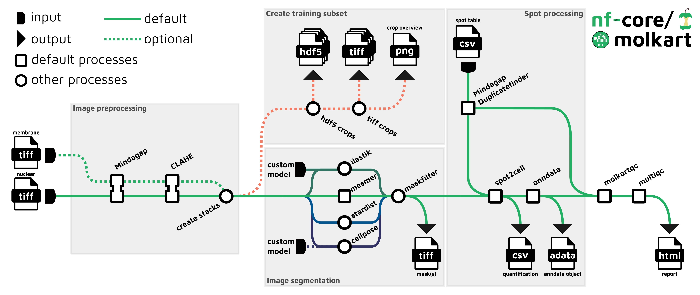

# Part 2: Run nf-core/molkart

In Part 1, we ran a simple Hello World workflow to understand the basics of Nextflow execution.
Now we're going to run a real-world bioimaging pipeline: **nf-core/molkart**.

This pipeline processes Molecular Cartography spatial transcriptomics data from Resolve Bioscience.
However, the Nextflow patterns you'll learn here apply to any nf-core pipeline or production workflow.

## 1. Understanding nf-core pipelines

Before we run the pipeline, let's understand what nf-core is and why it matters for running workflows.

### 1.1. What is nf-core?

[nf-core](https://nf-co.re/) is a community-driven collection of high-quality Nextflow pipelines.
All nf-core pipelines follow the same structure and conventions, which means once you learn to run one, you can run any of them.

Key features of nf-core pipelines:

- **Standardized structure**: All pipelines have consistent parameter names and usage patterns
- **Built-in test data**: Every pipeline includes test profiles for quick validation
- **Comprehensive documentation**: Detailed usage instructions and parameter descriptions
- **Quality control**: Automated QC reports using MultiQC
- **Container support**: Pre-built containers for reproducibility

!!! tip "Want to learn more about nf-core?"

    For an in-depth introduction to nf-core pipeline development, check out the [Hello nf-core](../../hello_nf-core/index.md) training course.
    It covers how to create and customize nf-core pipelines from scratch.

### 1.2. The molkart pipeline



The [nf-core/molkart](https://nf-co.re/molkart) pipeline processes spatial transcriptomics imaging data through several stages:

1. **Image preprocessing**: Grid pattern filling and optional contrast enhancement
2. **Cell segmentation**: Multiple algorithm options (Cellpose, Mesmer, ilastik, Stardist)
3. **Spot assignment**: Assign transcript spots to segmented cells
4. **Quality control**: Generate comprehensive QC reports

The key outputs are:

- Cell-by-transcript count tables
- Segmentation masks
- MultiQC quality control report

---

## 2. Run molkart with test data

Before we begin, let's clone the molkart repository locally so we can inspect its code:

```bash
cd /workspaces/training/nf4-science/imaging
git clone --branch 1.2.0 --depth 1 https://github.com/nf-core/molkart
```

This creates a `molkart/` directory containing the complete pipeline source code.

!!! note "Why are we cloning locally?"

    Typically, you would run nf-core pipelines directly from GitHub using `nextflow run nf-core/molkart -r 1.2.0`.
    Nextflow automatically downloads the requested pipeline version for you to `$HOME/.nextflow/assets/nf-core/molkart` and runs it from there.
    However, for this training, we're cloning the pipeline to a different local directory so we can more easily inspect the code.

### 2.1. Understanding container requirements

Before running the full pipeline, let's learn why containers are essential for nf-core pipelines.

Let's try running the pipeline using the test dataset and parameters from the molkart test configuration:

```bash
nextflow run ./molkart \
  --input 'data/samplesheet.csv' \
  --mindagap_tilesize 90 \
  --mindagap_boxsize 7 \
  --mindagap_loopnum 100 \
  --clahe_pyramid_tile 368 \
  --segmentation_method "mesmer,cellpose,stardist" \
  --outdir results
```

Let's break down these parameters:

- `--input`: Path to the samplesheet containing sample metadata
- `--mindagap_tilesize`, `--mindagap_boxsize`, `--mindagap_loopnum`: Parameters for grid pattern filling
- `--clahe_pyramid_tile`: Kernel size for contrast enhancement
- `--segmentation_method`: Which algorithm(s) to use for cell segmentation
- `--outdir`: Where to save the results

!!! Warning "This command will fail - that's intentional!"

    We're deliberately running this without containers to demonstrate why they're needed.

After a few moments, you'll see an error like this:

```console title="Error output"
ERROR ~ Error executing process > 'NFCORE_MOLKART:MOLKART:MINDAGAP_DUPLICATEFINDER (mem_only)'

Caused by:
  Process `NFCORE_MOLKART:MOLKART:MINDAGAP_DUPLICATEFINDER (mem_only)` terminated with an error exit status (127)

Command executed:

  duplicate_finder.py \
      spots.txt \
      90

Command exit status:
  127

Command error:
  .command.sh: line 3: duplicate_finder.py: command not found
```

**What's happening here?**

The error `command not found` (exit status 127) means Nextflow tried to run `duplicate_finder.py` but couldn't find it on your system.
This is because:

1. The pipeline expects specialized bioinformatics software to be installed
2. These tools (like `duplicate_finder.py`, `apply_clahe.dask.py`, etc.) are not part of standard Linux distributions
3. Without containers, Nextflow tries to run commands directly on your local machine

**Where are these tools supposed to come from?**

Let's inspect one of the process modules to see how it declares its software requirements.

Open the CLAHE preprocessing module:

```bash
code molkart/modules/local/clahe/main.nf
```

Look at line 5 - you'll see:

```groovy
container 'ghcr.io/schapirolabor/molkart-local:v0.0.4'
```

This line tells Nextflow: "To run this process, use the Docker image `ghcr.io/schapirolabor/molkart-local:v0.0.4`, which contains all the required software."

Each process declares which container image provides its required tools.
However, Nextflow only uses these containers if you tell it to!

**The solution: Enable Docker in the configuration**

### 2.2. Configure Docker and launch the pipeline

To enable Docker, we need to change `docker.enabled` from `false` to `true` in the `nextflow.config` file.

Open the config file:

```bash
code nextflow.config
```

Change `docker.enabled = false` to `docker.enabled = true`:

```groovy
docker.enabled = true
process {
    resourceLimits = [
        cpus: 2,
        memory: '7.GB',
    ]
}
```

Now run the pipeline again with the same command:

```bash
nextflow run ./molkart \
  --input 'data/samplesheet.csv' \
  --mindagap_tilesize 90 \
  --mindagap_boxsize 7 \
  --mindagap_loopnum 100 \
  --clahe_pyramid_tile 368 \
  --segmentation_method "cellpose,mesmer,stardist" \
  --outdir results
```

This time, Nextflow will:

1. Read the `docker.enabled = true` setting from the config
2. Pull the required Docker images (first time only)
3. Run each process inside its specified container
4. Execute successfully because all tools are available inside the containers

!!! Tip "Why containers matter"

    Most nf-core pipelines **require** containerization (Docker, Singularity, Podman, etc.) because:

    - They use specialized bioinformatics software not available in standard environments
    - Containers ensure reproducibility - the exact same software versions run everywhere
    - You don't need to manually install dozens of tools and their dependencies

    For more details about containers in Nextflow, see [Hello Containers](../../hello_nextflow/05_hello_containers.md) from the Hello Nextflow training.

### 2.3. Monitor execution

As the pipeline runs, you'll see output similar to this:

```console title="Output"
Nextflow 25.04.8 is available - Please consider updating your version to it

 N E X T F L O W   ~  version 25.04.3

Launching `https://github.com/nf-core/molkart` [soggy_kalam] DSL2 - revision: 5e54b29cb3 [dev]


------------------------------------------------------
                                        ,--./,-.
        ___     __   __   __   ___     /,-._.--~'
  |\ | |__  __ /  ` /  \ |__) |__         }  {
  | \| |       \__, \__/ |  \ |___     \`-._,-`-,
                                        `._,._,'
  nf-core/molkart 1.2.0dev
------------------------------------------------------
Segmentation methods and options
  segmentation_method       : mesmer,cellpose,stardist

Image preprocessing
  mindagap_boxsize          : 7
  mindagap_loopnum          : 100
  clahe_kernel              : 25
  mindagap_tilesize         : 90
  clahe_pyramid_tile        : 368

Input/output options
  input                     : https://raw.githubusercontent.com/nf-core/test-datasets/molkart/test_data/samplesheets/samplesheet_membrane.csv
  outdir                    : results

Institutional config options
  config_profile_name       : Test profile
  config_profile_description: Minimal test dataset to check pipeline function

Generic options
  trace_report_suffix       : 2025-10-18_22-22-21

Core Nextflow options
  revision                  : dev
  runName                   : soggy_kalam
  containerEngine           : docker
  launchDir                 : /workspaces/training/nf4-science/imaging
  workDir                   : /workspaces/training/nf4-science/imaging/work
  projectDir                : /workspaces/.nextflow/assets/nf-core/molkart
  userName                  : root
  profile                   : docker,test
  configFiles               :

!! Only displaying parameters that differ from the pipeline defaults !!
------------------------------------------------------
* The pipeline
    https://doi.org/10.5281/zenodo.10650748

* The nf-core framework
    https://doi.org/10.1038/s41587-020-0439-x

* Software dependencies
    https://github.com/nf-core/molkart/blob/master/CITATIONS.md

executor >  local (22)
[c1/da5009] NFCORE_MOLKART:MOLKART:MINDAGAP_MINDAGAP (mem_only)        [100%] 2 of 2 ✔
[73/8f5e8a] NFCORE_MOLKART:MOLKART:CLAHE (mem_only)                    [100%] 2 of 2 ✔
[ec/8f84d5] NFCORE_MOLKART:MOLKART:CREATE_STACK (mem_only)             [100%] 1 of 1 ✔
[a2/99349b] NFCORE_MOLKART:MOLKART:MINDAGAP_DUPLICATEFINDER (mem_only) [100%] 1 of 1 ✔
[95/c9b4b1] NFCORE_MOLKART:MOLKART:DEEPCELL_MESMER (mem_only)          [100%] 1 of 1 ✔
[d4/1ebd1e] NFCORE_MOLKART:MOLKART:STARDIST (mem_only)                 [100%] 1 of 1 ✔
[3e/3c0736] NFCORE_MOLKART:MOLKART:CELLPOSE (mem_only)                 [100%] 1 of 1 ✔
[a0/415c6a] NFCORE_MOLKART:MOLKART:MASKFILTER (mem_only)               [100%] 3 of 3 ✔
[14/a830c9] NFCORE_MOLKART:MOLKART:SPOT2CELL (mem_only)                [100%] 3 of 3 ✔
[b5/391836] NFCORE_MOLKART:MOLKART:CREATE_ANNDATA (mem_only)           [100%] 3 of 3 ✔
[77/aed558] NFCORE_MOLKART:MOLKART:MOLKARTQC (mem_only)                [100%] 3 of 3 ✔
[e6/b81475] NFCORE_MOLKART:MOLKART:MULTIQC                             [100%] 1 of 1 ✔
-[nf-core/molkart] Pipeline completed successfully-
Completed at: 19-Oct-2025 22:23:01
Duration    : 2m 52s
CPU hours   : 0.1
Succeeded   : 22
```

Notice how this output is more detailed than our Hello World example because of the nf-core conventions the pipeline follows:

- Pipeline shows its version and logo
- Configuration parameters are displayed
- Multiple processes run in parallel (indicated by multiple process lines)
- Process names include the full module path (e.g., `NFCORE_MOLKART:MOLKART:MINDAGAP_MINDAGAP`)

### 2.4. Understanding process execution

The executor line `executor > local (22)` tells you:

- **executor**: Which compute environment is being used (`local` = your machine)
- **(22)**: Total number of tasks launched

Each process line shows:

- **Hash** (`[1a/2b3c4d]`): Work directory identifier (like before)
- **Process name**: Full module path and process name
- **Input identifier**: Sample name in parentheses
- **Progress**: Percentage complete and count (e.g., `1 of 1 ✔`)

### Takeaway

You know how to launch an nf-core pipeline with test data and interpret its execution output.

### What's next?

Learn where to find the results and how to interpret them.

---

## 3. Find and examine the outputs

When the pipeline completes successfully, you'll see a completion message and execution summary.

### 3.1. Locate the results directory

By default, nf-core pipelines write outputs to a directory specified by the `outdir` parameter, which we set to `results/`.

List the contents:

```bash
tree results/
```

You should see several subdirectories:

```console title="results/"
results/
├── anndata/
├── clahe/
├── mindagap/
├── molkartqc/
├── multiqc/
├── pipeline_info/
├── segmentation/
├── spot2cell/
└── stack/
```

Each subdirectory contains outputs from a specific stage of the pipeline:

- **mindagap/**: Grid-filled images from the MindaGap preprocessing step
- **clahe/**: Contrast-enhanced images from CLAHE preprocessing
- **stack/**: Multi-channel image stacks created for segmentation
- **segmentation/**: Segmentation results from different algorithms (cellpose/, mesmer/, stardist/, filtered_masks/)
- **spot2cell/**: Cell-by-transcript count tables
- **anndata/**: AnnData objects containing cell-by-transcript matrices and spatial coordinates
- **molkartqc/**: Quality control metrics for spot assignment
- **multiqc/**: Comprehensive quality control report
- **pipeline_info/**: Execution reports and logs

### 3.2. Examine the MultiQC report

The MultiQC report is a comprehensive HTML file that aggregates quality metrics from all pipeline steps.

Open the report in the file browser and then click the "Show Preview" button to see it rendered directly in VS Code.

The report includes:

- General statistics for all samples
- Preprocessing metrics
- Segmentation quality metrics
- Number of cells and spots detected

!!! Tip

    MultiQC reports are typically included in all nf-core pipelines.
    They always provide a high-level overview of pipeline execution and data quality.

### 3.3. Examine the cell-by-transcript tables

The most important scientific output is the cell-by-transcript count table.
This tells you how many of each transcript was detected in each cell.

Navigate to the spot2cell directory:

```bash
ls results/spot2cell/
```

You'll find files like:

- `cellxgene_mem_only_cellpose.csv`: Cell-by-transcript table using Cellpose segmentation
- `cellxgene_mem_only_mesmer.csv`: Cell-by-transcript table using Mesmer segmentation
- `cellxgene_mem_only_stardist.csv`: Cell-by-transcript table using Stardist segmentation

We only ran 1 sample in this test dataset, but in a real experiment we would have these tables for each sample.
Notice how Nextflow is able to process multiple segmentation methods in parallel, making it easy to compare results.

### 3.4. View execution reports

Nextflow generates several execution reports automatically.

Check the pipeline_info directory:

```bash
ls results/pipeline_info/
```

Key files:

- **execution_report.html**: Timeline and resource usage visualization
- **execution_timeline.html**: Gantt chart of process execution
- **execution_trace.txt**: Detailed task execution metrics
- **pipeline_dag.html**: Directed acyclic graph showing workflow structure

Open the execution report to see resource usage:

```bash
code results/pipeline_info/execution_report.html
```

This shows:

- How long each process took
- CPU and memory usage
- Which tasks were cached vs. executed

!!! Tip

    These reports are incredibly useful for optimizing resource allocation and troubleshooting performance issues.

### Takeaway

You know how to locate pipeline outputs, examine quality control reports, and access execution metrics.

### What's next?

Learn about the work directory and how Nextflow manages intermediate files.

---

## 4. Explore the work directory

Just like with our Hello World example, all the actual work happens in the `work/` directory.

### 4.1. Understanding work directory structure

The work directory contains a subdirectory for each task that was executed.
For this pipeline with 12 tasks, there will be 12 work subdirectories.

List the work directory:

```bash
ls -d work/*/*/ | head -5
```

This shows the first 5 task directories.

### 4.2. Inspect a task directory

Pick one of the segmentation process hashes from the console output (e.g., `[3m/4n5o6p]`) and look inside:

```bash
ls -la work/3m/4n5o6p*/
```

You'll see:

- **.command.\*** files\*\*: Nextflow execution scripts and logs (like before)
- **Staged input files**: Symlinks to the actual input files
- **Output files**: Segmentation masks, intermediate results, etc.

The key difference from Hello World:

- Real pipelines stage large input files (images, reference data)
- Output files can be quite large (segmentation masks, processed images)
- Multiple input and output files per task

!!! Tip

    If a process fails, you can navigate to its work directory, examine `.command.err` for error messages, and even re-run `.command.sh` manually to debug the issue.

### 4.3. Work directory cleanup

The work directory can become quite large over multiple pipeline runs.
As we learned in Part 1, you can use `nextflow clean` to remove work directories from old runs.

However, for nf-core pipelines with large intermediate files, it's especially important to clean up regularly.

### Takeaway

You understand how nf-core pipelines organize their work directories and how to inspect individual tasks for debugging.

### What's next?

Learn about the Nextflow cache and how to resume failed pipeline runs.

---

## 5. Resume a pipeline run

One of Nextflow's most powerful features is the ability to resume a pipeline from the point of failure.

### 5.1. The cache mechanism

When you run a pipeline with `-resume`, Nextflow:

1. Checks the cache for each task
2. If inputs, code, and parameters are identical, reuses the cached result
3. Only re-runs tasks that changed or failed

This is essential for long-running pipelines where failures might occur late in execution.

### 5.2. Try resume with molkart

Run the same command again, but add `-resume`:

```bash
nextflow run ./molkart \
  --input 'data/samplesheet.csv' \
  --mindagap_tilesize 90 \
  --mindagap_boxsize 7 \
  --mindagap_loopnum 100 \
  --clahe_pyramid_tile 368 \
  --segmentation_method "cellpose" \
  --outdir results \
  -resume
```

You should see output like:

```console
executor >  local (0)
[1a/2b3c4d] NFCORE_MOLKART:MOLKART:MINDAGAP_MINDAGAP (mem_only)        [100%] 2 of 2, cached: 2 ✔
[5e/6f7g8h] NFCORE_MOLKART:MOLKART:CLAHE (mem_only)                    [100%] 2 of 2, cached: 2 ✔
[7f/8g9h0i] NFCORE_MOLKART:MOLKART:CREATE_STACK (mem_only)             [100%] 1 of 1, cached: 1 ✔
[9h/0i1j2k] NFCORE_MOLKART:MOLKART:MINDAGAP_DUPLICATEFINDER (mem_only) [100%] 1 of 1, cached: 1 ✔
[2k/3l4m5n] NFCORE_MOLKART:MOLKART:CELLPOSE (mem_only)                 [100%] 1 of 1, cached: 1 ✔
...
```

Notice `cached: 2` or `cached: 1` for each process - nothing was re-executed!

### 5.3. When resume is useful

Resume is particularly valuable when:

- A pipeline fails due to resource limits (out of memory, time limit exceeded)
- You need to modify downstream processes without re-running upstream steps
- Your network connection drops during data download
- You want to add additional outputs without redoing computation

!!! Warning

    Resume only works if you haven't changed the input data, pipeline code, or parameters.
    If you change any of these, Nextflow will correctly re-run affected tasks.

### Takeaway

You know how to use `-resume` to efficiently re-run pipelines without repeating successful tasks.

### What's next?

Now that you can run nf-core/molkart with test data, you're ready to learn how to configure it for your own datasets.
