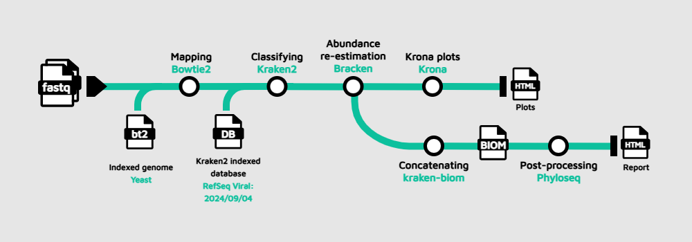

# Part 1: Pipeline development and single-sample execution

In the field of metagenomics data analysis, there is an endless universe of pipelines or methodologies you can follow to explore and characterize your samples. 
For this course, we propose to wrap with Nextflow the protocol published by [Jennifer Lu et al. (2022)](https://www.nature.com/articles/s41596-022-00738-y). 

---

## 1. Workflow

The workflow is designed as follows:

<div markdown class="metagenomics">



</div>


As you can see from the picture, the pipeline will undergo as follows:

1. The input is **FASTQ** files from one or multiple samples. For this course, we will be using only paired-end reads recovered from an oligotrophic, phosphorus-deficient pond in Cuatro Ciénegas, Mexico ([Okie et al.,2020](https://elifesciences.org/articles/49816)); the BioProject accesion number is [PRJEB22811](https://www.ncbi.nlm.nih.gov/bioproject/PRJEB22811).
2. **Host removal** with [**Bowtie2**](https://bowtie-bio.sourceforge.net/bowtie2/manual.shtml) by aligning the reads against an indexed reference genome. In this case, we are using the indexed genome of yeast given the storage limitations we have in this codespace, although you can use any organism of your interest by building [your own index](https://www.metagenomics.wiki/tools/bowtie2/index) or downloading a [precomputed](https://benlangmead.github.io/aws-indexes/bowtie) one.
3. **Taxonomic classification** with [**Kraken2**](https://ccb.jhu.edu/software/kraken2/). This tools relies on a indexed database that can be [downloaded](https://benlangmead.github.io/aws-indexes/k2) or you can build your customized version following specific [instructions](https://avilpage.com/2024/07/mastering-kraken2-build-custom-db.html). We will be using the Viral database given the storage limitations (I know, it's a bit annoying), therefore this methodology is pointing at "viral metagenomics"; however, by just switching to any other database you can analyze your samples to annotate bacteria, archaea and more.
4. **Bayesian species abundance re-estimation** with [**Bracken**](https://ccb.jhu.edu/software/bracken/index.shtml?t=manual). This software is designed to compute species abundance using Kraken classification results as stated in the reference paper, and it also uses some files contained in the dabatase folders such as the kmer distribution files (don't worry about this now, you can learn about how the method works afterwards).
5. [**Krona**](https://bmcbioinformatics.biomedcentral.com/articles/10.1186/1471-2105-12-385) plots are generated using the Bracken output to visualize interactively the relative abundance of each annotated species.
6. If multiple samples are used as input to the pipeline, the bracken reports will be concatenated and converted into a Biological Observation Matrix ([**BIOM**](https://biom-format.org/)) file.
7. Finally, the BIOM file will be first converted in a [**Phyloseq**](https://joey711.github.io/phyloseq/index.html) object, and this object will be further processed to generate absolute plots, estimate both α and β-diversity and perform a network analysis; this information will be presented in a final `report.html`. If you can to follow the code to generate the plots and metrics, you can check this Phyloseq [tutorial](https://vaulot.github.io/tutorials/Phyloseq_tutorial.html). 

!!!tip

    If you feel a bit overwhelmed by the theoretical background of the methodology, we strongly encourage you to check this [Carpentries](https://carpentries-lab.github.io/metagenomics-analysis/) lesson first, where the concepts are explained step by step using interesting examples.

---

## 2. Modules

Once we have a clear overview of what we want to achieve, we can start developing the modules that are going to perform each task; you can think of them as building blocks that we can stack up to construct a big tower (this is valid for this pipeline as it is linear).

### 2.1 Bowtie2

As previously mentioned, the objective with this module is to clean the reads by aligning them against a reference genome to remove the ones that map with it. Let's create then the `bowtie2.nf` file inside the **modules** folder to write the following code:

```groovy title="modules/bowtie2.nf" linenums="1"
process BOWTIE2 {
    tag "${sample_id}"
    publishDir "$params.outdir/${sample_id}", pattern: "*.sam", mode:'copy'
    container "community.wave.seqera.io/library/bowtie2:2.5.4--d51920539234bea7"

    input:
    tuple val(sample_id), path(reads)
    path bowtie2_index

    output:
    tuple val("${sample_id}"), path("${sample_id}.1"), path("${sample_id}.2"), path("${sample_id}.sam")

    script:
    """
    export BOWTIE2_INDEXES=/workspaces/training/nf4-science/metagenomics/data/yeast
    bowtie2 -x $bowtie2_index -1 ${reads[0]} -2 ${reads[1]} -p 2 -S ${sample_id}.sam --un-conc-gz ${sample_id}
    """
}
```

Let's take a moment to break down what we are seeing here:

- The process name is `BOWTIE2`, this is important when creating the workflow file.
- The `tag` directive is used to indicate which sample is being processed at a determined moment. This will be useful when running the pipeline.
- `publishDir` points out to the directory where the ouput is stored. In this case we are taking the path from the parameters, and within it subfolders with the sample namse will be created to store each `.sam` file, creating a copy of such files.
- `container` indicates the docker container on which the process will be run. We have retrieved all the containers from [Seqera Containers](https://seqera.io/containers/). More information about how containers work can be found in the part 1 of the [RNASeq course](../rnaseq).
- The `input` for this process will be the `sample id`, the paired-end `reads`, as well as the path to the `bowtie index`. More about this when creating the `main.nf` file.
- This process will produce a tuple containing the `sample id`, the path to the cleaned `reads` and the path to the `*.sam` file. This former file contains basically the overall information about the alignment of the sequences against the reference indexed genome; to learn more about this format, please check this [material](https://samtools.github.io/hts-specs/SAMv1.pdf).
- Finally, the `script` statement contains two commands: _i)_ an environment variable is exported pointing to the directory where the indexed genome is stored (this is required by Bowtie2 for some reason, don't worry about it, just keep in mind if you plan to use another reference genome though); and _ii)_ the Bowtie2 command that includes again the path to the indexed genome, `-1` and `-2` capture the path to forward and reverse reads, respectively, `-S` provides the information about the desired format output, and `--un-conc-gz` is used to write the paired-end that fail to align concordantly to the reference genome (if this former parameter does not make sense to you, don't worry it took me a week to understand what it means, just check the [Bowtie2](https://bowtie-bio.sourceforge.net/bowtie2/manual.shtml) manual 😉).

### 2.2 Kraken2

Now, let's create the module for our taxonomic classifier. Following the Bowtie2 process, we are going to create `kraken2.nf` file inside the **modules** folder to write this code:

```groovy title="modules/kraken2.nf" linenums="1"
process KRAKEN2 {
	tag "${sample_id}"
	publishDir "$params.outdir/${sample_id}", mode:'copy'
	container "community.wave.seqera.io/library/kraken2:2.14--83aa57048e304f01"

	input:
	tuple val(sample_id), path(reads_1), path(reads_2), path(sam)
	path kraken2_db

	output:
	tuple val("${sample_id}"), path("${sample_id}.k2report"), path("${sample_id}.kraken2")

	script:
	"""
	kraken2 --db $kraken2_db --threads 2 \
	--report ${sample_id}.k2report \
	--report-minimizer-data \
	--minimum-hit-groups 2 \
	--gzip-compressed \
	--paired \
	${reads_1} ${reads_2} > ${sample_id}.kraken2
	"""
}
```

At a first glimpse, you can see that it follows the same structure as the previous process. The directives `tag`, `publishDir` and `container` play the same role as in Bowtie2, the `input` in this case is a tuple containing the `sample id`, the cleaned reads and the `*.sam` file (this one is declared just to maintain the correspondence between the output from Bowtie2 and the Kraken2 input). Also, the path to the kraken database is declared; more about this when writing the `main.nf` file. The output from this process will be a tuple containing the `sample id`, the path to the `.k2report` file, as well as the path to the `.kraken2` file. 

The `script` statement will run the Kraken2 command along with a series of flags that include the path to the database, the number of threads to use, the path to the reports Kraken2 generates, the minimum number of 'hit groups' needed to make a classification call, the flag to report the minimizers and distinct minimizer count, the parameters that indicate that the received reads are paired-end and compressed in a _.gz_ format. You are strongly encouraged to check both the [protocol](https://www.nature.com/articles/s41596-022-00738-y) that documents this methodology, as well as the [source publication](https://genomebiology.biomedcentral.com/articles/10.1186/s13059-019-1891-0) to understand how Kraken2 works and the type of files it generates; this [article](https://homolog.us/blogs/bioinfo/2017/10/25/intro-minimizer/) about minimimzers is also useful.

### 2.3 Bracken

Following the same procedure as with the two previous processes, let's create the file `bracken.nf` inside **modules**:

```groovy title="modules/bracken.nf" linenums="1"
process BRACKEN {
	tag "${sample_id}"
	publishDir "$params.outdir/${sample_id}", mode:'copy'
	container "community.wave.seqera.io/library/bracken:3.1--22a4e66ce04c5e01"

	input:
	tuple val(sample_id), path(k2report), path(kraken2)
	path kraken2_db

	output:
	tuple val("${sample_id}"), path("${sample_id}.breport"), path("${sample_id}.bracken")

	script:
	"""
	bracken -d $kraken2_db \
	-i ${k2report} -r 250 -l S -t 10 \
	-o ${sample_id}.bracken \
	-w ${sample_id}.breport
	"""
}
```

For this and the following process, we will focused only on the features that differ from the Bowtie2 and Kraken2 explanations. As expected, the declared `input` for this Bracken process matches the output generated by Kraken2, receiving a tuple containing the `sample id` and the paths to `.k2report` and `kraken2` reports. 

Similarly, the `output` establishes that this process will generate a tuple with the `sample id` and the two types of `reports` Bracken produces; more information about these reports can be found at the GitHub [repository](https://github.com/jenniferlu717/Bracken). 

The `script` statement runs Bracken specifying the path to the database, the input represented by the Kraken2 report, the length of the reads, the taxonomic level at which we want to re-estimate the abundance (species in this case), the required number of reads before abundance estimation to perform re-estimation, and the format for the reports afore-mentioned.

### 2.4 Krona

To generate the Krona plots (this interactive pie charts especially common in the metagenomics field), we will need 2 processes. The first one is going to execute the script `kreport2krona.py`, provided as part of [KrakenTools](https://github.com/jenniferlu717/KrakenTools), using the Bracken report as input to produce a plain text file that contains the species abundance information. Let's create the file `kReport2Krona.nf` inside **modules**, and introduce the following code:

```groovy title="modules/kReport2Krona.nf" linenums="1"
process K_REPORT_TO_KRONA {
	tag "${sample_id}"
	publishDir "$params.outdir/${sample_id}", mode:'copy'
	container "community.wave.seqera.io/library/krakentools:1.2--db94e0b19cfa397b"

	input:
	tuple val(sample_id), path(b_report), path(bracken)

	output:
	tuple val("${sample_id}"), path("${sample_id}.b.krona.txt")

	script:
	"""
	kreport2krona.py -r ${b_report} \
	-o ${sample_id}.b.krona.txt \
	--no-intermediate-ranks
	"""
}
```

As seen before, this process is taking as input the exact output from Bracken in a tuple form, and it is going to generate another tuple containing `sample id` and the `*.txt` file with the abundance numbers. Within the `script` execution an additional flag that indicates leaving out non-traditional ranks.

Now, the following process will use the plain `*.txt` to render the Krona plot in a self-contained `*.html` file. I guess that by this point you already what is coming: let's create the file `ktImportText.nf` inside **modules**, and write the code:

```groovy title="modules/ktImportText.nf" linenums="1"
process KT_IMPORT_TEXT {
	tag "${sample_id}"
	publishDir "$params.outdir/${sample_id}", mode:'copy'
	container "community.wave.seqera.io/library/krona:2.8.1--2f750080982f027e"

	input:
	tuple val(sample_id), path(krona_txt)

	output:
	path "${sample_id}.krona.html"

	script:
	"""
	ktImportText ${krona_txt} \
	-o ${sample_id}.krona.html
	"""
}
```

The only output from this process will be the Krona plot that can be directly opened using a regular modern browser, just like the one you are using to follow this tutorial. With this process, the execution of the pipeline for a single sample is finished, we can proceed then to create the files that control the execution of the pipeline.

---

## 3. `workflow.nf`

We are going to leverage the [`Workflows of Workflows`](../../side_quests/workflows_of_workflows.md) Side Quest to create the file `workflow.nf`, and we are going to use the `take/main` syntax. Here, inputs are declared using the keyword `take`, and workflow content is placed inside `main`. Now it is time to explicitly write where the processes files can be found, as well as the order of execution of the processes. In the file `workflow.nf` (no, this time it does not go inside the **modules** directory), we include the following:

```groovy title="workflow.nf" linenums="1"
/*
 * required tasks
 */
include { BOWTIE2 		        } 	from './modules/bowtie2.nf'
include { KRAKEN2 		        }	from './modules/kraken2.nf'
include { BRACKEN 		        } 	from './modules/bracken.nf'
include { K_REPORT_TO_KRONA 	        } 	from './modules/kReport2Krona.nf'
include { KT_IMPORT_TEXT 	        } 	from './modules/ktImportText.nf'
```

This way of importing process is composed by two parts, the first one invokes the name of the process inside the curly brackets (please not that they should match exactly with given names in the corresponding files), and the second one points out to the relative path where the files are located. Now, let's write what are the primary input for the workflow and the order of execution of the processes:

```groovy title="workflow.nf" linenums="10"
/*
 * workflow
 */

workflow kraken2Flow {
	// required inputs
	take:
		bowtie2_index
		kraken2_db
		reads_ch
	// workflow implementation
	main:
		BOWTIE2(reads_ch, bowtie2_index)
		KRAKEN2(BOWTIE2.out, kraken2_db)
		BRACKEN(KRAKEN2.out, kraken2_db)
		K_REPORT_TO_KRONA(BRACKEN.out)
		KT_IMPORT_TEXT(K_REPORT_TO_KRONA.out)
```

In this declaration you see that we need three primary inputs for the pipeline: the indexed reference genome for Bowtie2, the indexed database for Kraken2 and Bracken, and the paths to the reads; when creating the `nextflow.config`, you will see how to specify these paths. In the block `main`, you see the names of the processes with one or more parameters inside the parenthesis depicting the exact data flow:

1. `BOWTIE2(reads_ch, bowtie2_index)` will be the first executed process using the reads and the indexed genome; the other processes must wait until this one is finished.
2. Once `BOWTIE2` has completed the task, `KRAKEN2` will take the output, along with the database path to perform the specified task; the remaining process are on hold until Kraken2 is finished.
3. `BRACKEN`, in turn, will take `KRAKEN2` output to run the abundance re-estimation using the same database; `K_REPORT_TO_KRONA` and `KT_IMPORT_TEXT` can not be run until `BRACKEN` is finished with its task.
4. Finally, `K_REPORT_TO_KRONA`, and subsequently `KT_IMPORT_TEXT`, will be run to generate our final goal file which is the Krona plot.

---

## 4. `main.nf`

We are getting closer to run the pipeline, let's create the `main.nf` file. Within this file, we create banner with the pipeline name to be shown when the execution starts. `log.info` is method call on a logging object and it is used to write informational messages to the Nextflow log during a pipeline's execution. You can learn more about this [here](https://carpentries-incubator.github.io/workflows-nextflow/11-Simple_Rna-Seq_pipeline.html#define-the-pipeline-parameters). 

```groovy title="main.nf" linenums="1"
#!/usr/bin/env nextflow

log.info """\
	__________________________________________________________________________________________________________________________________________________
	__________________________________________________________________________________________________________________________________________________
	>=>   >=>                       >=>                                         >=> >=>>=>                                >=>
	>=>  >=>                        >=>                           >=>>=>       >=>  >>   >=>                              >=>
	>=> >=>     >> >==>    >=> >=>  >=>  >=>   >==>    >==>>==>  >>   >=>     >=>   >>    >=> >> >==>    >=> >=>     >==> >=>  >=>   >==>    >==>>==>
	>>=>>        >=>     >=>   >=>  >=> >=>  >>   >=>   >=>  >=>     >=>     >=>    >==>>=>    >=>     >=>   >=>   >=>    >=> >=>  >>   >=>   >=>  >=>
	>=>  >=>     >=>    >=>    >=>  >=>=>    >>===>>=>  >=>  >=>    >=>     >=>     >>    >=>  >=>    >=>    >=>  >=>     >=>=>    >>===>>=>  >=>  >=>
	>=>   >=>    >=>     >=>   >=>  >=> >=>  >>         >=>  >=>  >=>      >=>      >>     >>  >=>     >=>   >=>   >=>    >=> >=>  >>         >=>  >=>
	>=>     >=> >==>      >==>>>==> >=>  >=>  >====>   >==>  >=> >======> >=>       >===>>=>  >==>      >==>>>==>    >==> >=>  >=>  >====>   >==>  >=>
	__________________________________________________________________________________________________________________________________________________
	__________________________________________________________________________________________________________________________________________________
"""
.stripIndent()
```

The other part of this `main.nf` file is to invoke the workflow from the './workflow.nf' file, and then stating the order of the execution:

1. Creating a channel for the paired-end reads using the channel factory [`fromFilePairs`](https://nextflow.io/docs/latest/reference/channel.html#fromfilepairs).
2. Running the workflow using the reference indexed genome, the Kraken2 database and the channel created for the reads. 

```groovy title="main.nf" linenums="18"
include { kraken2Flow } from './workflow.nf'

workflow {

	reads_ch = Channel .fromFilePairs( params.reads, checkIfExists:true )
	kraken2Flow( params.bowtie2_index, params.kraken2_db, reads_ch )
}
```

---

## 5. `nextflow.config`

Finally, we create the file `nextflow.config` where we indicate the input parameters of the pipeline and enable its execution using docker to pull the containers required by each process:

```groovy title="nextflow.config" linenums="1"
/*
 * pipeline input parameters
 */

params {
    reads                                 = null
    outdir                                = "/workspaces/training/nf4-science/metagenomics/output"
    bowtie2_index                         = "/workspaces/training/nf4-science/metagenomics/data/yeast/yeast"
    kraken2_db                            = "/workspaces/training/nf4-science/metagenomics/data/viral_db"
}

// Enable using docker as the container engine to run the pipeline
docker.enabled = true
```

!!!tip

    Please note that we are using absolute paths for the parameters. Even though relative paths are preferred for system-independendance of the pipelines, often some tools or scripts will fail if parameters are not provided as absolute paths.

---

## 6. Execution

That's it, we are all set to run the pipeline, let's just use one of the samples provided, you can choose any of them and the run the following command:

```bash
nextflow run main.nf --reads 'data/samples/ERR2143758/ERR2143768_{1,2}.fastq'
```
On the output of the command line, you will see:

```console title="Output"
 N E X T F L O W   ~  version 24.10.4

Launching `main.nf` [determined_lorenz] DSL2 - revision: 8f65b983e6

        __________________________________________________________________________________________________________________________________________________
        __________________________________________________________________________________________________________________________________________________
        >=>   >=>                       >=>                                         >=> >=>>=>                                >=>
        >=>  >=>                        >=>                           >=>>=>       >=>  >>   >=>                              >=>
        >=> >=>     >> >==>    >=> >=>  >=>  >=>   >==>    >==>>==>  >>   >=>     >=>   >>    >=> >> >==>    >=> >=>     >==> >=>  >=>   >==>    >==>>==>
        >>=>>        >=>     >=>   >=>  >=> >=>  >>   >=>   >=>  >=>     >=>     >=>    >==>>=>    >=>     >=>   >=>   >=>    >=> >=>  >>   >=>   >=>  >=>
        >=>  >=>     >=>    >=>    >=>  >=>=>    >>===>>=>  >=>  >=>    >=>     >=>     >>    >=>  >=>    >=>    >=>  >=>     >=>=>    >>===>>=>  >=>  >=>
        >=>   >=>    >=>     >=>   >=>  >=> >=>  >>         >=>  >=>  >=>      >=>      >>     >>  >=>     >=>   >=>   >=>    >=> >=>  >>         >=>  >=>
        >=>     >=> >==>      >==>>>==> >=>  >=>  >====>   >==>  >=> >======> >=>       >===>>=>  >==>      >==>>>==>    >==> >=>  >=>  >====>   >==>  >=>
        __________________________________________________________________________________________________________________________________________________
        __________________________________________________________________________________________________________________________________________________

executor >  local (5)
[fe/4b8409] process > kraken2Flow:BOWTIE2 (ERR2143768)           [100%] 1 of 1 ✔
[14/c3d787] process > kraken2Flow:KRAKEN2 (ERR2143768)           [100%] 1 of 1 ✔
[4c/5d2db3] process > kraken2Flow:BRACKEN (ERR2143768)           [100%] 1 of 1 ✔
[e4/c305af] process > kraken2Flow:K_REPORT_TO_KRONA (ERR2143768) [100%] 1 of 1 ✔
[39/08b32c] process > kraken2Flow:KT_IMPORT_TEXT (ERR2143768)    [100%] 1 of 1 ✔
```

Now, it's your time to analyze the results, you can find all the ouput files in the **output** directory, run the `tree` command:

```bash
tree output
```
And you will see the following:

```console title="Output contents"
output/
└── ERR2143758
    ├── ERR2143768.b.krona.txt
    ├── ERR2143768.bracken
    ├── ERR2143768.breport
    ├── ERR2143768.k2report
    ├── ERR2143768.kraken2
    ├── ERR2143768.krona.html
    └── ERR2143768.sam
```

Feel free to explore each of the files to understand each process and how data were handled. The file in which we are more interested is the `*.html` since this is the Krona plot, and you can either download or install the [preview](https://marketplace.visualstudio.com/items?itemName=ms-vscode.live-server) extension for Visual Studio. Keep in mind that we used the viral database, therefore you will be seeing information only about the viruses contained in the samples, to perform the analysis with bacteria and beyond you have to download a different database or build your own.

---

### Takeaway

Congratulations! you just have performed a whole taxonomic annotation and abundance estimation of your metagenomics sample.

### What's next?

Learn how to modify the workflow to process multiple samples in parallel, create a report with different diversity measurements, execute customized scripts, and use Nextflow operators and conditionals to control the workflow.
