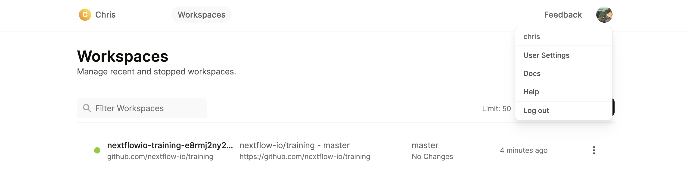
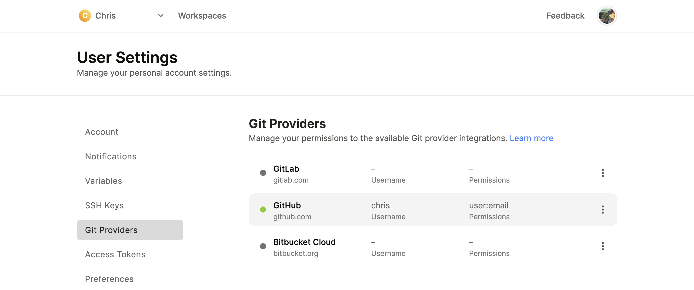

# Orientation

The Gitpod environment contains some test data that will be used in this workshop.

!!! note

    Follow [this link](../envsetup/00_introduction.md) if you have not yet setup your Gitpod environment.

## Getting started

You will complete this module in the `nf-develop` folder.

This is an empty directory where you will create an launch your pipeline.

!!! question "Exercise"

    Open the [Gitpod training environment](https://gitpod.io/#https://github.com/nextflow-io/training) and use the following command to switch to the empty `nf-develop` folder:

    ```bash
    cd /workspace/gitpod/nf-develop
    ```

## Configuring GitHub

As a part of this workshop you will push changes to your GitHub.

If this is the first time you have used Gitpod for development work you will need to edit your permissions to push changes.

To edit your Gitpod permissions, open your Gitpod dashboard by clicking on the three horizontal lines in the top left-hand corner of your browser window and select `Gitpod: Open Dashboard` from the dropdown menu.


In your dashboard, click on your avatar in the top right-hand corner of your window and select `User Settings` from the dropdown menu.



Click on `Git Providers` on the right hand menu.



Edit the permissions for your GitHub account by clicking on the three dots next to your GitHub account and give your Gitpod account permissions to access for GitHub repositories.


Once complete, click `Update permissions` and return reopen your Gitpod training environment.
