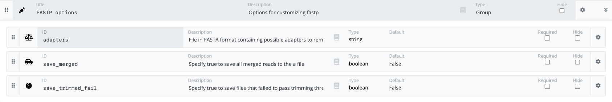

# Developing your pipeline

The nf-core pipeline template is a working pipeline and comes preconfigured with two modules:

-   [FastQC](https://www.bioinformatics.babraham.ac.uk/projects/fastqc/): A tool that performs quality control checks on raw sequence data coming from high throughput sequencing pipelines. It provides a modular set of analyses that can be used to give a quick impression of your data.
-   [MultiQC](https://multiqc.info/): A modular tool to aggregate results from bioinformatics analyses across many samples into a single report.

## Testing your pipeline

The `test` profile can be used to check if your pipeline is still working during your development cycle. It is also used as a part of GitHub Actions to test your pipeline during pull requests.

The default template `test` profile leverages small test files that are stored in the nf-core [test data GitHub repository](https://github.com/nf-core/test-datasets) as inputs for the pipeline.

Additionally, the template comes with profiles for the management of software dependencies (e.g., `docker`, `singularity`, and `conda`). For pipelines with processes are shipped with containers/images/recipes, these profiles can be used to change the way dependencies are handled when you execute your pipeline.

!!! warning

    If `-profile` for managing software dependencies is not specified, the pipeline will run locally and expect all software to be installed and available on the `PATH`. **This is not recommended.**

Additional test profiles can be created to test different parts of your pipeline and can also be added to GitHub actions.

!!! question "Exercise"

    Run your pipeline with the `test` and `docker` profile.

    ```bash
    cd /workspace/gitpod/nf-develop
    nextflow run nf-core-myfirstpipeline -profile test,docker --outdir results
    ```

## Adding a new tool to your pipeline

Here, as an example, let's say you need a process for `fastp`, a fastq data pre-processing tool that has functions for quality control, trimming of adapters, filtering by quality, and read pruning.

The `fastp` module will take fastq files from the sample sheet as inputs and will produce reports that you will add as inputs for the `MultiQC` process

<figure class="excalidraw">
--8<-- "docs/nf_template/img/pipeline.excalidraw.svg"
</figure>

While you could develop a module for this tool independently, you can save a lot of time and effort by leveraging nf-core modules and subworkflows.

nf-core modules and subworkflows are written and maintained by the nf-core community. They are designed to be flexible but may require additional configuration to suit different use cases. Currently, there are more than [1200 nf-core modules](https://nf-co.re/modules) and [60 nf-core subworkflows](https://nf-co.re/subworkflows) (April 2024) available.

Modules and subworkflows can be listed, installed, updated, removed, and patched using nf-core tooling.

### Working with branches

GitHub branches are used to isolate development work without affecting other branches in a repository. Each repository has one default branch, and can have multiple other branches.

You can merge updates from one branch into another branch using a pull request.

The `nf-core create` created three branches: `main`, `dev`, and `TEMPLATE`.

In nf-core, the `main` branch is for stable releases and the `dev` branch is for merging feature branches together. This enables the `main` branch to remain fully functional while new features are developed in feature branches, collected in the `dev` branch, and then merged into `main` once they are ready.

<figure class="excalidraw">
--8<-- "docs/nf_template/img/branches.excalidraw.svg"
</figure>

Feature branches should be checked out from the `dev` branch.

!!! question "Exercise"

    Checkout a new feature branch named `myFeature` from the dev branch

    ```
    git checkout -b myFeature dev
    ```

You can find out more about working collaboratively with branches on the [GitHub documentation](https://docs.github.com/en/pull-requests/collaborating-with-pull-requests/proposing-changes-to-your-work-with-pull-requests).

!!! note "Executing revisions"

    Remote GitHub branches can be executed with Nextflow using the revision flag (e.g., `-r dev`).

### The `TEMPLATE` branch

The `TEMPLATE` branch is used by the `nf-core sync` command to integrate template changes to your pipeline. You should **never** modify the `TEMPLATE` branch as any changes will likely disrupt the syncing functionality.

You will learn more about the `TEMPLATE` branch in later sections.

### Installing the `fastp` module

The `nf-core modules list` command can be used to list modules in your local pipeline or the nf-core remote repository.

```
nf-core modules list remote
```

The `nf-core modules install` command can be used to install the `fastp` module directly from the nf-core repository:

```
cd nf-core-myfirstpipeline
nf-core modules install
```

You can follow the prompts to find and install the module you are interested in:

```console
? Tool name: fastp
```

Once selected, the tooling will install the module in the `modules/nf-core/` folder and suggest code that you can add to your main workflow file (`workflows/mypipeline.nf`).

```console
INFO     Installing 'fastp'
INFO     Use the following statement to include this module:

include { FASTP } from '../modules/nf-core/fastp/main'
```

!!! question "Exercise"

    Run the `nf-core modules install` command to add the `fastp` module to your pipeline.

To enable reporting and reproducibility, modules and subworkflows from the nf-core repository are tracked using hashes in the `modules.json` file. When modules are installed or removed using the nf-core tooling the `modules.json` file will be automatically updated.

!!! question "Exercise"

    Open your `modules.json` file and see if the `fastp` module is being tracked.

### Adding a module to your pipeline

Although the module has been installed in your local pipeline repository, it is not yet added to your pipeline. The suggested `include` statement needs to be added to your `workflows/mypipeline.nf` file and the process call (with inputs) needs to be added to the workflow block.

```groovy title="workflows/mypipeline.nf" linenums="7"
include { FASTQC                 } from '../modules/nf-core/fastqc/main'
include { FASTP                  } from '../modules/nf-core/fastp/main'
include { MULTIQC                } from '../modules/nf-core/multiqc/main'
```

!!! question "Exercise"

    Add the suggested `include` statement to your `mypipeline.nf` file.

To add the fastp module to your workflow you will need to check what inputs are required.

You can view the input channels for the module by opening the `./modules/nf-core/fastp/main.nf` file.

```groovy title="/modules/nf-core/fastp/main.nf" linenums="10"
input:
tuple val(meta), path(reads)
path  adapter_fasta
val   save_trimmed_fail
val   save_merged
```

Each nf-core module also has a `meta.yml` file which describes the inputs and outputs. This meta file is rendered on the [nf-core website](https://nf-co.re/modules/fastp), or can be viewed using the `nf-core modules info` command.

!!! question "Exercise"

    Use the `nf-core modules info` command to view information for the `fastp` module

    ```
    nf-core modules info fastp
    ```

Using this module information you can work out what inputs are required and make decisions about how flexible you want your four inputs to be:

1.  `tuple val(meta), path(reads)`

    -   A tuple with a meta _map_ and a list of fastq _files_
    -   The channel `ch_samplesheet` used by the `FASTQC` process can be used as the reads input.

2.  `path  adapter_fasta`

    -   A fasta _file_ with possible adapters
    -   Should be a parameter as the the adapter file may change between runs

3.  `val   save_trimmed_fail`

    -   A _boolean_ to specify if files that failed to pass trimming should be saved
    -   Could be hard coded as true or false, or made into a parameter

4.  `val save_merged`

    -   A _boolean_ to specify if merged read files should be saved
    -   Could be hard coded as true or false, or made into a parameter

To maximize the flexibility of your pipeline the second, third, and fourth inputs can be set via pipeline parameters.

Parameter names should be unique and easily identifiable. Default values should be added to your `nextflow.config` file within the `params` scope.

!!! question "Exercise"

    Add new parameters with default values to your `nextflow.config` file.

    ```console title="nextflow.config" linenums="26"
    // FASTP options
    adapters                   = null
    save_trimmed_fail          = false
    save_merged                = false
    ```

While `save_trimmed_fail` and `save_merged` are boolean and can have a default value (in this case false), `adapters` is a file, and a default value of `null` will prevent the `FASTP` process from running. However, empty square brackets (`[]`) can be used as input to fill the channel without supplying a file.

A ternary expression (aka a conditional expression) can be used to create a channel that will be either the square brackets or a supplied fasta file.

!!! question "Exercise"

    Create a new channel (`ch_adapters`) using a ternary expression to use either a supplied fasta file or `[]`.

    ```groovy title="workflows/mypipeline.nf" linenums="40"
    ch_adapters = params.adapters ? params.adapters : []
    ```

Now you have all four input channels, you can add the `FASTP` process to your pipeline workflow block.

Make sure to comment your code so you can recognize the process.

!!! question "Exercise"

    ```groovy title="workflows/mypipeline.nf" linenums="40"
    //
    // MODULE: FASTP
    //
    ch_adapters = params.adapters ? params.adapters : []
    FASTP (
        ch_samplesheet,
        ch_adapters,
        params.save_trimmed_fail,
        params.save_merged
    )
    ```

Finally, to provide the `FASTP` outputs as inputs to your `MULTIQC` process, you can mix them into existing channels.

As with the inputs, you can view the outputs for the module by opening the `/modules/nf-core/fastp/main.nf` file and viewing the module metadata.

```groovy title="/modules/nf-core/fastp/main.nf" linenums="10"
output:
tuple val(meta), path('*.fastp.fastq.gz') , optional:true, emit: reads
tuple val(meta), path('*.json')           , emit: json
tuple val(meta), path('*.html')           , emit: html
tuple val(meta), path('*.log')            , emit: log
path "versions.yml"                       , emit: versions
tuple val(meta), path('*.fail.fastq.gz')  , optional:true, emit: reads_fail
tuple val(meta), path('*.merged.fastq.gz'), optional:true, emit: reads_merged
```

MultiQC will accept json files as well as collected software versions.

!!! question "Exercise"

    Use the `mix` channel operator to mix the `json` and `versions` channels with the `ch_multiqc_files` and `ch_versions` channels, respectively.

    ```groovy title="workflows/mypipeline.nf" linenums="50"
    ch_multiqc_files = ch_multiqc_files.mix(FASTP.out.json.collect{it[1]}.ifEmpty([]))
    ch_versions      = ch_versions.mix(FASTP.out.versions.first())
    ```

### Additional configuration options

To prevent changing the nf-core modules, additional configuration options can be applied to a module using scopes within configuration files.

The configuration of modules is commonly added to the `modules.conf` file in the `conf` folder. Process selectors (e.g., `withName`) are used to apply configuration to modules selectively. Process selectors must be used within the process scope.

Extra configuration may be applied as directives by using `args`. You can find many examples of how arguments are added to modules in nf-core pipelines, for example, the nf-core/rnaseq [modules.config](https://github.com/nf-core/rnaseq/blob/master/conf/modules.config) file.

!!! question "Exercise"

    Add this snippet to your `conf/modules.config` file to save fastp reports in folders named using `meta.id`.

    ```console title="conf/modules.config" linenums="25"
    withName: 'FASTP' {
        publishDir = [
            path: { "${params.outdir}/fastp/${meta.id}" },
            mode: params.publish_dir_mode,
            pattern: "*.{html,json,log}"
        ]
    }
    ```

!!! note "Closures"

    Closures can be used in configuration files to inject code evaluated at runtime.

### Linting your changes

Linting is a static analysis process that helps ensure code quality by automatically identifying syntax errors, potential bugs, and adherence to coding standards. By enforcing consistency and best practices, linting enhances code readability, reduces errors, and streamlines the development workflow.

As a part of nf-core tools, the `nf-core lint` command can be used to check for inconsistencies in your code, compare your code against source code, and compare your code against nf-core standards.

Executing the `nf-core lint` command from within your pipeline repository will print a list of ignored tests, warnings, failed tests, and a summary.

```console
╭───────────────────────╮
│ LINT RESULTS SUMMARY  │
├───────────────────────┤
│ [✔] 184 Tests Passed  │
│ [?]   0 Tests Ignored │
│ [!]  26 Test Warnings │
│ [✗]   3 Tests Failed  │
╰───────────────────────╯
```

### Updating `nextflow_schema.json`

If you have added parameters and they have not been documented in the `nextflow_schema.json` file then pipeline tests will fail during linting.

```
schema_params: Param adapters from nextflow config not found in nextflow_schema.json
schema_params: Param save_trimmed_fail from nextflow config not found in nextflow_schema.json
schema_params: Param save_merged from nextflow config not found in nextflow_schema.json
```

For these tests to pass the `nextflow_schema.json` file must be updated with the parameters that were added to your pipeline but have not been documented.

The `nextflow_schema.json` file can get very big and very complicated very quickly. The `nf-core schema build` command is designed to support developers write, check, validate, and propose additions to your `nextflow_schema.json` file. It will enable you to launch a web builder to edit this file in your web browser rather than trying to edit this file manually.

```console
INFO     [✓] Default parameters match schema validation
INFO     [✓] Pipeline schema looks valid (found 31 params)
✨ Found 'params.adapters' in the pipeline config, but not in the schema. Add to pipeline schema? [y/n]: y
✨ Found 'params.save_trimmed_fail' in the pipeline config, but not in the schema. Add to pipeline schema? [y/n]: y
✨ Found 'params.save_merged' in the pipeline config, but not in the schema. Add to pipeline schema? [y/n]: y
INFO     Writing schema with 34 params: 'nextflow_schema.json'

🚀  Launch web builder for customization and editing? [y/n]:
```

Using the web builder you can add add details about your new parameters.

The parameters that you have added to your pipeline will be added to the bottom of the `nf-core schema build` file. Some information about these parameters will be automatically filled based on the default value from your `nextflow.config`. You will be able to categorize your new parameters into a group, add icons, and add descriptions for each.



Once you have made your edits you can click `Finished` and all changes will be automatically added to your `nextflow_schema.json` file.

!!! question "Exercise"

    Use the `nf-core schema build` command to update your schema. Add any grouping and information you think is appropriate. Lint your pipeline again.

## Bump your pipeline version

Having a universal way of versioning the development projects is the best way to track what is going on with the software as new features are added. This problem can be solved by following semantic versioning rules: `[major].[minor].[patch]`

For example, starting with a release version `1.4.3`, bumping the version to:

-   `1.4.4` would be a patch release for minor things such as fixing bugs.
-   `1.5` would be a minor release, for example adding some new features.
-   `2.0` would correspond to the major release where results would no longer be backward compatible.

The pipeline version number is mentioned in a lot of different places in nf-core pipelines. The `nf-core bump-version` command updates the version for you automatically, so that you don't accidentally miss any. It can be used for each pipeline release, and again for the next development version after release.

```bash
nf-core bump-version 1.0
```

After you have updated the version of your pipeline, your changes can be pushed to GitHub.

!!! question "Exercise"

    Bump your pipeline version to `1.0` using the `nf-core bump-version` command.

### Push your changes to GitHub

When you are satisfied with your improvements you can `add`, `commit`, and `push` your changes to GitHub.

You can check which branch you are on using the `git branch` command.

As your current branch `myFeature` has no upstream branch you will need to set the remote as upstream the first time you push your changes.

!!! question "Exercise"

    Push your changes to your GitHub repository.

    ```bash
    git add .
    git commit -m "Added fastp to pipeline"
    git push --set-upstream origin myFeature
    ```

!!! note "Branch origin"

    To automatically add an origin for branches without a tracking upstream, see `push.autoSetupRemote` in `git help config`.
