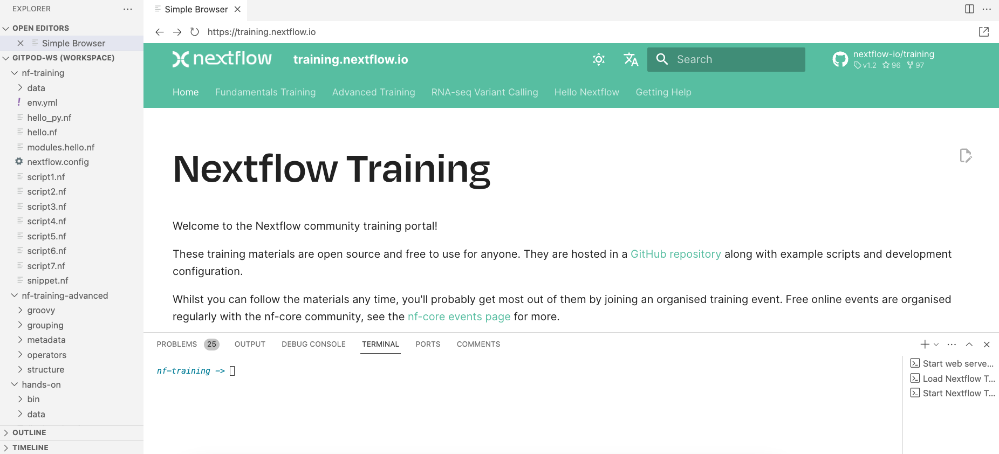

# Orientation

This workshop should be completed using the [Nextflow Training Gitpod Environment](https://gitpod.io/#https://github.com/nextflow-io/training).

Gitpod offers a virtual machine with everything already set up for you, accessible from your web browser or built into your code editor (e.g., VSCode).

To start, click on the button below.

[](https://gitpod.io/#https://github.com/nextflow-io/training)

## Running Gitpod

To run Gitpod:

-   Click the following URL: <https://gitpod.io/#https://github.com/nextflow-io/training>
    -   This is our GitHub repository URL, prefixed with `https://gitpod.io/#`
-   Log in with your GitHub account.

When you first sign up to Gitpod you may need to authenticate your account.

!!! question "Exercise"

    Open the [Gitpod training environment](https://gitpod.io/#https://github.com/nextflow-io/training) and use the following command to switch to the empty `nf-templates` folder:

    ```bash
    cd /workspace/gitpod/nf-template
    ```

### Explore your Gitpod IDE

You should now see something similar to the following:



-   **The sidebar** allows you to customize your Gitpod environment and perform basic tasks (copy, paste, open files, search, git, etc.). You can click the explorer button to see which files are in this repository.
-   **The terminal** allows you to run all the programs in the repository. For example, both `nextflow` and `docker` are installed and can be executed.
-   **The file explorer** allows you to view and edit files. Clicking on a file in the explorer will open it within the main window.
-   **The Simple Browser** lets you view the nf-training material browser (<https://training.nextflow.io/>). If you close it by accident, you can load the simple browser again by typing the following in the terminal: `gp preview https://training.nextflow.io`.

### Gitpod resources

-   Gitpod gives you 500 free credits per month, which is equivalent to 50 hours of free environment runtime using the standard workspace (up to 4 cores, 8 GB RAM, and 30 GB storage).
-   There is also a large workspace option that gives you up to 8 cores, 16GB RAM, and 50GB storage. However, the large workspace will use your free credits quicker and you will have fewer hours of access to this space.
-   Gitpod will time out after 30 minutes of inactivity and will save your changes for up to 2 weeks.

More information about Gitpod is available at [gitpod.io](https://www.gitpod.io).

### Reopening a Gitpod session

You can reopen an environment from <https://gitpod.io/workspaces>. Previous environments will be listed. You can select the ellipsis (three dots icon) and then select `Open` to reopen a previous environment.

If you have saved the URL for your previous Gitpod environment, you can simply open it in your browser.

Alternatively, you can open a new training workspace by following the Gitpod URL: <https://gitpod.io/#https://github.com/nextflow-io/training>

### Saving files from Gitpod to your local machine

To save any file from the explorer panel, right-click the file and select `Download`.
