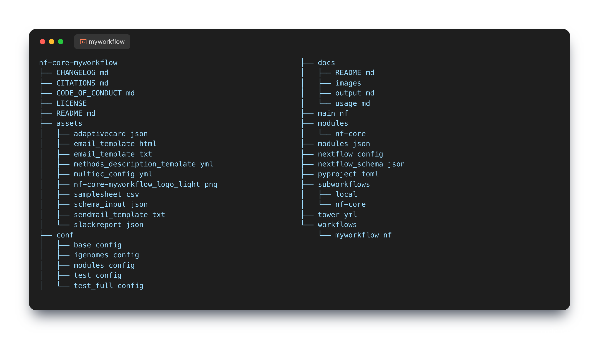

# Anatomy of the nf-core template

The nf-core pipeline template comes packed with a lot of files and folders which can be overwhelming.

Fortunately, a complete understanding isn't required to get started.

!!! note "Viewing files"

    Dot files are not shown using the `ls` command. You can use `ll` or `ls -la` to view all files. Alternatively, `tree -a` command can be used to show the branching structure of your repository.

For this workshop, the important parts of the template include:

1. The `.github/workflows` folder and files
2. The `conf/test.config` file
3. The `nf-core.yml` file
4.  2. The `workflow`, `subworkflow`, and `modules` folders and files
5. The `modules.json` file
6. The `nextflow.config` file
7. The `nextflow_schema.json` file

!!! question "Exercise"

    Find all of these files in the nf-core pipeline template you have just created.

## Pipeline consistency

Every nf-core pipeline is built using the same template and has been tested extensively. Using the template gives a sense of familiarity and plugs into the wider nf-core ecosystem, e.g., integration with `nf-core/modules` and the schema is rendered in Seqera platform.

You can explore any nf-core pipeline and expect to find the same files in the same place.

## New features as of nf-core/tools version 2.13

The groovy code that used to live in the `lib` folder has been moved to `subworkflows/`. Moving this code has made it easier to find, modify, and test. Importantly, it's modular and is paving the way for a more flexible template in the future.
