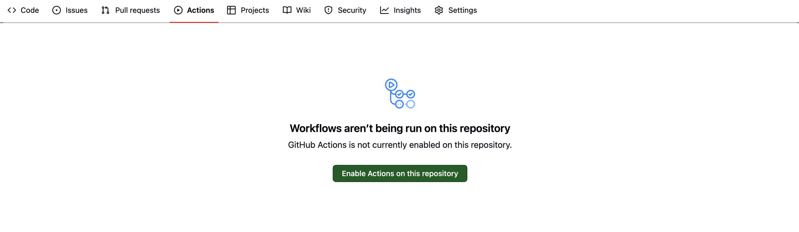

# Getting started

The nf-core pipeline template is a standardized framework designed to streamline the development of Nextflow-based bioinformatics pipelines.

Creating a pipeline using the nf-core template is greatly simplified by the nf-core tooling. It will help you create a pipeline using the set framework that can be modified to suit your own purposes.

Here, you will use the nf-core template to kickstart your pipeline development using the latest version of Nextflow and the nf-core tooling.

## Creating your pipeline

nf-core tooling has commands for pipeline users and developers.

View all of the tooling using the `nf-core --help` argument.

```bash
nf-core --help
```

Here we will focus on the tooling to assist pipeline developers, starting with the `nf-core pipelines create` command.

### `nf-core pipelines create`

The `nf-core pipelines create` command makes a new pipeline using the nf-core base template with a pipeline name, description, and author. It is the first and most important step for creating a pipeline that will integrate with the wider Nextflow ecosystem.

```bash
nf-core pipelines create
```

Running this command will open a Text User Interface (TUI) for pipeline creation.

<div style="text-align: center;">
    <iframe width="560" height="315" src="https://www.youtube.com/embed/VwjXNXONHlY?si=d0HkFSISnKn76TeI" title="YouTube video player" frameborder="0" allow="accelerometer; autoplay; clipboard-write; encrypted-media; gyroscope; picture-in-picture; web-share" allowfullscreen="" data-ruffle-polyfilled=""></iframe>
</div>

Template features can be flexibly included or excluded at the time of creation. You can still use the CLI by providing all values as parameters.

!!! question "Exercise"

    Follow these steps create your first pipeline using the `nf-core pipelines create` TUI:

    1. Run the `nf-core pipelines create` command
    2. Select **Let's go!** on the welcome screen
    3. Select **Custom** on the Choose pipeline type screen
    4. Enter your pipeline details, replacing < YOUR NAME > with your own name, then select **Next**
        - **GitHub organisation:** myorg
        - **Workflow name:** myfirstpipeline
        - **A short description of your pipeline:** My first pipeline
        - **Name of the main author / authors:** < YOUR NAME >
    5. Select **Continue** on the Template features screen
    6. Select **Finish** on the Final details screen
    7. Wait for the pipeline to be created, then select **Continue**
    8. Select **Finish without creating a repo** on the Create GitHub repository screen
    9. Select **Close** on the HowTo create a GitHub repository page

If run successfully, you will see a new folder in your current directory named `myorg-myfirstpipeline`.

<!---

### Customizing the template

The nf-core pipeline comes packed with features. However, you may not want to include all of these in your pipeline.

Instead of manually removing these features once the template has been created, you can customize certain areas of the template as it is being created.

The following template areas can be customized:

-   **GitHub hosting:** Files required for GitHub hosting of the pipeline, e.g., `.github/` and `.gitignore`.
-   **GitHub CI:** Files required for GitHub continuous integration tests, e.g., `.github/workflows/`.
-   **GitHub badges:** GitHub badges in the `README.md` file.
-   **iGenomes config:** Pipeline options related to iGenomes, e.g., `conf/igenomes.config`.
-   **nf-core/configs:** Repository options that integrate nf-core config profiles.

If you choose to customize the template, the nf-core tooling will provide a series of interactive prompts to help guide your choices.

```bash
? Workflow name <name>
? Description <description>
? Author <name>
? Do you want to customize which parts of the template are used? (y/N) <y>
? Pipeline prefix <organisation>
Skip template areas?
   ○ GitHub hosting
   ○ GitHub CI
   ● GitHub badges
   ○ iGenomes config
   ○ nf-core/configs
```

!!! note

    GitHub badges were skipped in the example above.

### Submit your code to GitHub

The `nf-core pipelines create` command suggests commands for submitting your pipeline to GitHub.

You will first need to create an empty repository on GitHub for your template to be pushed to.

When you are logged into GitHub, you can use the green `New` repository button in the top right hand corner of the webpage or navigate to [https://github.com/new](https://github.com/new) and follow the prompts to make a new repository.


Once you have created the repository you can use `git` to push your template to GitHub.

```bash
cd /workspaces/training/nf-develop/myorg-mypipeline
git remote add origin https://github.com/<USERNAME>/<REPO>.git
git push --all origin
```

!!! warning "https vs ssh"

    When using GitHub Codespaces you must use **https** not **ssh** when adding your remote:

    For example, you should use:

    ```
    git remote add origin https://github.com/<USERNAME>/<REPO>.git
    ```

    Not:

    ```
    git remote add origin git@github.com:<USERNAME>/<REPO>.git
    ```

By default, three branches will all be pushed to GitHub using the commands above.

```console
remote: Resolving deltas: 100% (10/10), done.
To https://github.com/<USERNAME>/myfirstpipeline.git
 * [new branch]      TEMPLATE -> TEMPLATE
 * [new branch]      dev -> dev
 * [new branch]      main -> main
```

The role each of these branches have in pipeline development will be explained in subsequent sections.

!!! question "Exercise"

    Create a new GitHub repository named `myfirstpipeline` and push your new pipeline using the commands above. You will need to replace `<USERNAME>` and `<REPO>` with your GitHub username and `myfirstpipeline`, respectively.

-->

## Template tour

The nf-core pipeline template comes packed with a lot of files and folders.

Here, almost everything was included in the template to create opportunities to explore these features.

While the template may feel overwhelming, a complete understanding isn't required to start developing your pipeline.

### Workflows, subworkflows, and modules

The nf-core pipeline template has a `main.nf` script that calls `myfirstpipeline.nf` from the `workflows` folder. The `myfirstpipeline.nf` file inside the workflows folder is the central pipeline file that is used to bring everything else together.

Instead of having one large monolithic pipeline script, it's broken up into smaller script components, namely, modules and subworkflows:

- **Modules:** Wrappers around a single process
- **Subworkflows:** Two or more modules that are packaged together as a mini workflow

<figure class="excalidraw">
--8<-- "docs/nf_develop/img/nested.excalidraw.svg"
</figure>

Within your pipeline repository, `modules` and `subworkflows` are stored within `local` and `nf-core` folders. The `nf-core` folder is for components that have come from the nf-core GitHub repository while the `local` folder is for components that have been developed independently:

```console
modules/
├── local
│   └── <toolname>
│   │   └── main.nf
│   .
│
└── nf-core
    ├── <tool name>
    │   ├── environment.yml
    │   ├── main.nf
    │   ├── meta.yml
    │   └── tests
    │       ├── main.nf.test
    │       ├── main.nf.test.snap
    │       └── tags.yml
    .
```

Modules from nf-core follow a similar same structure and contain a small number of additional files that are used for testing using [nf-test](https://www.nf-test.com/) and documentation about the module.

!!!note

    Some nf-core modules are also split into command specific directories:

    ```console
    │
    └── <tool name>
        └── <command>
            ├── environment.yml
            ├── main.nf
            ├── meta.yml
            └── tests
                ├── main.nf.test
                ├── main.nf.test.snap
                └── tags.yml
    ```

!!!note

    The nf-core template does not come with a local modules folder by default.

### Configuration files

The nf-core pipeline template utilizes Nextflows flexible customization options and has a series of configuration files throughout the template.

In the template, the `nextflow.config` file is a central configuration file and is used to set default values for parameters and other configuration options. The majority of these configuration options are applied by default while others (e.g., software dependency profiles) are included as optional profiles.

There are several configuration files that are stored in the `conf` folder and are added to the configuration by default or optionally as profiles:

- `base.config`: A 'blank slate' config file, appropriate for general use on most high performance compute environments.
- `igenomes.config`: Defines reference genomes using iGenome paths.
- `igenomes_ignored.config`: Empty genomes dictionary to use when igenomes is ignored
- `modules.config`: Additional module directives and arguments.
- `test.config`: A profile to run the pipeline with minimal test data.
- `test_full.config`: A profile to run the pipeline with a full-sized test dataset.

### `.nf-core.yml`

The `.nf-core.yml` file is used to specify the repository type and manage linting tests.

```yml title=".nf-core.yml" linenums="1"
bump_version: null
lint:
  files_exist:
    - CODE_OF_CONDUCT.md
    - assets/nf-core-myfirstpipeline_logo_light.png
    - docs/images/nf-core-myfirstpipeline_logo_light.png
    - docs/images/nf-core-myfirstpipeline_logo_dark.png
    - .github/ISSUE_TEMPLATE/config.yml
    - .github/workflows/awstest.yml
    - .github/workflows/awsfulltest.yml
  files_unchanged:
    - CODE_OF_CONDUCT.md
    - assets/nf-core-myfirstpipeline_logo_light.png
    - docs/images/nf-core-myfirstpipeline_logo_light.png
    - docs/images/nf-core-myfirstpipeline_logo_dark.png
    - .github/ISSUE_TEMPLATE/bug_report.yml
  multiqc_config:
    - report_comment
  nextflow_config:
    - manifest.name
    - manifest.homePage
    - validation.help.beforeText
    - validation.help.afterText
    - validation.summary.beforeText
    - validation.summary.afterText
nf_core_version: 3.0.1
org_path: null
repository_type: pipeline
template:
  author: Chris
  description: My first pipeline
  force: true
  is_nfcore: false
  name: myfirstpipeline
  org: myorg
  outdir: .
  skip_features: []
  version: 1.0.0dev
update: null
```

!!!note

    The `.nf-core.yml` file must match your template features for linting tests to pass.

### `nextflow_schema.json`

The `nextflow_schema.json` is a file used to store parameter related information including type, description and help text in a machine readable format. The schema is used for various purposes, including automated parameter validation, help text generation, and interactive parameter form rendering in UI interfaces.

### GitHub actions workflows

Automated workflows are an important part of the nf-core pipeline template.

By default, the template comes with several automated tests that utilize GitHub Actions, each of which are configured in the `.github/workflows` folder:

- `branch.yml`: Sets the branch protection for the nf-core repository
- `ci.yml`: Run small pipeline tests with the small test datasets
- `clean-up.yml`: Automated testing for stale and closed GitHub issues and PRs in the nf-core repo
- `download_pipeline.yml`: Test a pipeline download with `nf-core pipelines download`.
- `fix-linting.yml`: Fix linting by adding a comment to a PR
- `linting_comment.yml`: Triggered after the linting action and posts an automated comment to the PR, even if the PR is coming from a fork
- `linting.yml`: Triggered on pushes and PRs to the repository and runs `nf-core pipelines lint` and markdown lint tests to ensure that the code meets the nf-core guidelines
- `release-announcements.yml`: Automatic release toot and tweet announcements for nf-core pipeline releases

Many of these tests are only configured for the nf-core repo. However, they can be modified for your repository or ignored if they are superfluous to your requirements.

Read more about creating and modifying workflows on the [GitHub Actions documentation webpage](https://docs.github.com/en/actions).

<!---

!!! note

    To enable these workflows you need to click `Enable Actions on this Repository` under the `Actions` tab in your GitHub repository.

    

--->

---

Congratulations! You have now created a template pipeline, pushed it to GitHub and learned about important template files!
