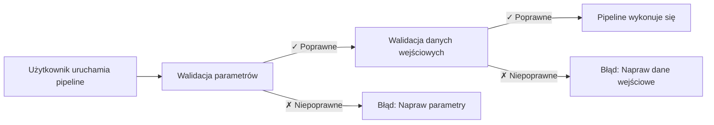

# Część 5: Walidacja danych wejściowych

<span class="ai-translation-notice">:material-information-outline:{ .ai-translation-notice-icon } Tłumaczenie wspomagane przez AI - [dowiedz się więcej i zasugeruj ulepszenia](https://github.com/nextflow-io/training/blob/master/TRANSLATING.md)</span>

W tej piątej części kursu szkoleniowego Hello nf-core pokażemy, jak używać wtyczki nf-schema do walidacji danych wejściowych i parametrów pipeline'u.

??? info "Jak rozpocząć od tej sekcji"

    Ta sekcja zakłada, że ukończyłeś [Część 4: Tworzenie modułu nf-core](./04_make_module.md) i zaktualizowałeś moduł procesu `COWPY` do standardów nf-core w Swoim pipeline'ie.

    Jeśli nie ukończyłeś Części 4 lub chcesz zacząć od nowa w tej części, możesz użyć rozwiązania `core-hello-part4` jako punktu wyjścia.
    Uruchom te polecenia z wnętrza katalogu `hello-nf-core/`:

    ```bash
    cp -r solutions/core-hello-part4 core-hello
    cd core-hello
    ```

    To da Ci pipeline z modułem `COWPY` już zaktualizowanym zgodnie ze standardami nf-core.
    Możesz przetestować, czy działa poprawnie, uruchamiając następujące polecenie:

    ```bash
    nextflow run . --outdir core-hello-results -profile test,docker --validate_params false
    ```

---

## 0. Rozgrzewka: Trochę kontekstu

### 0.1. Dlaczego walidacja ma znaczenie

Wyobraź sobie, że uruchamiasz Swój pipeline przez dwie godziny, tylko po to, by się zawiesił, ponieważ użytkownik podał plik z niewłaściwym rozszerzeniem. Lub spędzasz długie chwile na debugowaniu tajemniczych błędów, aby ostatecznie odkryć, że parametr był błędnie napisany. Bez walidacji danych wejściowych takie scenariusze są powszechne.

Rozważ ten przykład:

```console title="Bez walidacji"
$ nextflow run my-pipeline --input data.txt --output results

...2 godziny później...

ERROR ~ No such file: 'data.fq.gz'
  Expected FASTQ format but received TXT
```

Pipeline zaakceptował nieprawidłowe dane wejściowe i działał przez godziny przed awarią. Z odpowiednią walidacją:

```console title="Z walidacją"
$ nextflow run my-pipeline --input data.txt --output results

ERROR ~ Validation of pipeline parameters failed!

 * --input (data.txt): File extension '.txt' does not match required pattern '.fq.gz' or '.fastq.gz'
 * --output: required parameter is missing (expected: --outdir)

Pipeline failed before execution - please fix the errors above
```

Pipeline zawodzi natychmiast z jasnymi, działającymi komunikatami o błędach. To oszczędza czas, zasoby obliczeniowe i frustrację.

### 0.2. Wtyczka nf-schema

[Wtyczka nf-schema](https://nextflow-io.github.io/nf-schema/latest/) to wtyczka Nextflow, która zapewnia kompleksowe możliwości walidacji dla pipeline'ów Nextflow.
Chociaż nf-schema działa z dowolnym workflow'em Nextflow, jest to standardowe rozwiązanie walidacyjne dla wszystkich pipeline'ów nf-core.

nf-schema zapewnia kilka kluczowych funkcji:

- **Walidacja parametrów**: Waliduje parametry pipeline'u względem `nextflow_schema.json`
- **Walidacja arkuszy próbek**: Waliduje pliki wejściowe względem `assets/schema_input.json`
- **Konwersja kanałów**: Konwertuje zwalidowane arkusze próbek na kanały Nextflow
- **Generowanie tekstu pomocy**: Automatycznie generuje wyjście `--help` z definicji schematu
- **Podsumowanie parametrów**: Wyświetla, które parametry różnią się od wartości domyślnych

nf-schema jest następcą przestarzałej wtyczki nf-validation i używa standardu [JSON Schema Draft 2020-12](https://json-schema.org/) do walidacji.

??? info "Czym są wtyczki Nextflow?"

    Wtyczki to rozszerzenia, które dodają nowe funkcjonalności do samego języka Nextflow. Są instalowane przez blok `plugins{}` w `nextflow.config` i mogą zapewniać:

    - Nowe funkcje i klasy, które można zaimportować (jak `samplesheetToList`)
    - Nowe funkcje DSL i operatory
    - Integrację z zewnętrznymi usługami

    Wtyczka nf-schema jest określona w `nextflow.config`:

    ```groovy
    plugins {
        id 'nf-schema@2.1.1'
    }
    ```

    Po zainstalowaniu możesz importować funkcje z wtyczek używając składni `include { functionName } from 'plugin/plugin-name'`.

### 0.3. Dwa pliki schematu dla dwóch typów walidacji

Pipeline nf-core będzie wykorzystywał dwa oddzielne pliki schematu, które odpowiadają dwóm typom walidacji:

| Plik schematu              | Cel                          | Waliduje                                              |
| -------------------------- | ---------------------------- | ----------------------------------------------------- |
| `nextflow_schema.json`     | Walidacja parametrów         | Flagi linii poleceń: `--input`, `--outdir`, `--batch` |
| `assets/schema_input.json` | Walidacja danych wejściowych | Zawartość arkuszy próbek i plików wejściowych         |

Oba schematy używają formatu JSON Schema, szeroko przyjętego standardu do opisywania i walidacji struktur danych.

**Walidacja parametrów** sprawdza argumenty linii poleceń (flagi takie jak `--outdir`, `--batch`, `--input`):

- Kontroluje typy wartości, zakresy i formaty
- Zapewnia, że wymagane opcje są podane
- Weryfikuje, czy ścieżki plików istnieją
- Zdefiniowana w `nextflow_schema.json`

**Walidacja danych wejściowych** sprawdza strukturę arkuszy próbek i manifestów (pliki CSV/TSV opisujące Twoje dane):

- Kontroluje strukturę kolumn i typy danych
- Weryfikuje, czy ścieżki wymienione w arkuszu próbek istnieją
- Zapewnia obecność wymaganych pól
- Zdefiniowana w `assets/schema_input.json`

!!! warning "Czego walidacja danych wejściowych NIE robi"

    Walidacja danych wejściowych sprawdza strukturę *plików manifestu* (arkusze próbek, pliki CSV), NIE zawartość rzeczywistych plików danych (FASTQ, BAM, VCF, itp.).

    Dla danych na dużą skalę walidacja zawartości plików (jak sprawdzanie integralności BAM) powinna odbywać się w procesach pipeline'u działających na węzłach roboczych, a nie podczas etapu walidacji na maszynie orkiestrującej.

### 0.4. Kiedy powinna nastąpić walidacja?



Walidacja powinna nastąpić **przed** uruchomieniem jakichkolwiek procesów pipeline'u, aby zapewnić szybkie informacje zwrotne i zapobiec marnowaniu czasu obliczeniowego.

Teraz zastosujmy te zasady w praktyce, zaczynając od walidacji parametrów.

---

## 1. Walidacja parametrów (nextflow_schema.json)

Zacznijmy od dodania walidacji parametrów do naszego pipeline'u. To waliduje flagi linii poleceń, takie jak `--input`, `--outdir` i `--batch`.

### 1.1. Skonfiguruj walidację, aby pominąć walidację pliku wejściowego

Szablon pipeline'u nf-core jest dostarczany z już zainstalowanym i skonfigurowanym nf-schema:

- Wtyczka nf-schema jest instalowana przez blok `plugins{}` w `nextflow.config`
- Walidacja parametrów jest domyślnie włączona przez `params.validate_params = true`
- Walidacja jest wykonywana przez subworkflow `UTILS_NFSCHEMA_PLUGIN` podczas inicjalizacji pipeline'u

Zachowanie walidacji jest kontrolowane przez zakres `validation{}` w `nextflow.config`.

Ponieważ najpierw będziemy pracować nad walidacją parametrów (ta sekcja) i nie skonfigurujemy schematu danych wejściowych do sekcji 2, musimy tymczasowo powiedzieć nf-schema, aby pominął walidację zawartości pliku parametru `input`.

Otwórz `nextflow.config` i znajdź blok `validation` (około linii 246). Dodaj `ignoreParams`, aby pominąć walidację pliku wejściowego:

=== "Po"

    ```groovy title="nextflow.config" hl_lines="3" linenums="246"
    validation {
        defaultIgnoreParams = ["genomes"]
        ignoreParams = ['input']
        monochromeLogs = params.monochrome_logs
    }
    ```

=== "Przed"

    ```groovy title="nextflow.config" linenums="246"
    validation {
        defaultIgnoreParams = ["genomes"]
        monochromeLogs = params.monochrome_logs
    }
    ```

Ta konfiguracja mówi nf-schema, aby:

- **`defaultIgnoreParams`**: Pominął walidację złożonych parametrów, takich jak `genomes` (ustawione przez deweloperów szablonu)
- **`ignoreParams`**: Pominął walidację zawartości pliku parametru `input` (tymczasowo; ponownie włączymy to w sekcji 2)
- **`monochromeLogs`**: Wyłączył kolorowe wyjście w komunikatach walidacji, gdy ustawione na `true` (kontrolowane przez `params.monochrome_logs`)

!!! note "Dlaczego ignorować parametr input?"

    Parametr `input` w `nextflow_schema.json` ma `"schema": "assets/schema_input.json"`, co mówi nf-schema, aby zwalidował *zawartość* pliku CSV wejściowego względem tego schematu.
    Ponieważ jeszcze nie skonfigurowaliśmy tego schematu, tymczasowo ignorujemy tę walidację.
    Usuniemy to ustawienie w sekcji 2 po skonfigurowaniu schematu danych wejściowych.

### 1.2. Zbadaj schemat parametrów

Spójrzmy na sekcję pliku `nextflow_schema.json`, który był dołączony do naszego szablonu pipeline'u:

```bash
grep -A 25 '"input_output_options"' nextflow_schema.json
```

Schemat parametrów jest zorganizowany w grupy. Oto grupa `input_output_options`:

```json title="core-hello/nextflow_schema.json (fragment)" linenums="8"
        "input_output_options": {
            "title": "Input/output options",
            "type": "object",
            "fa_icon": "fas fa-terminal",
            "description": "Define where the pipeline should find input data and save output data.",
            "required": ["input", "outdir"],
            "properties": {
                "input": {
                    "type": "string",
                    "format": "file-path",
                    "exists": true,
                    "schema": "assets/schema_input.json",
                    "mimetype": "text/csv",
                    "pattern": "^\\S+\\.csv$",
                    "description": "Path to comma-separated file containing information about the samples in the experiment.",
                    "help_text": "You will need to create a design file with information about the samples in your experiment before running the pipeline. Use this parameter to specify its location. It has to be a comma-separated file with 3 columns, and a header row.",
                    "fa_icon": "fas fa-file-csv"
                },
                "outdir": {
                    "type": "string",
                    "format": "directory-path",
                    "description": "The output directory where the results will be saved. You have to use absolute paths to storage on Cloud infrastructure.",
                    "fa_icon": "fas fa-folder-open"
                }
            }
        },
```

Każde wejście opisane tutaj ma następujące kluczowe właściwości, które mogą być walidowane:

- **`type`**: Typ danych (string, integer, boolean, number)
- **`format`**: Specjalne formaty, takie jak `file-path` lub `directory-path`
- **`exists`**: Dla ścieżek plików, sprawdź, czy plik istnieje
- **`pattern`**: Wyrażenie regularne, któremu wartość musi odpowiadać
- **`required`**: Tablica nazw parametrów, które muszą być podane
- **`mimetype`**: Oczekiwany typ MIME pliku do walidacji

Jeśli masz bystre oko, możesz zauważyć, że parametr wejściowy `batch`, którego używaliśmy, nie jest jeszcze zdefiniowany w schemacie.
Dodamy go w następnej sekcji.

??? info "Skąd pochodzą parametry schematu?"

    Walidacja schematu używa `nextflow.config` jako bazy dla definicji opcji konfiguracyjnych.
    Wartości zadeklarowane gdzie indziej w skryptach workflow'u (jak w `main.nf` lub plikach modułów) **nie** są automatycznie przechwytywane przez walidator schematu.

    To oznacza, że zawsze powinieneś deklarować parametry pipeline'u w `nextflow.config`, a następnie definiować ich reguły walidacji w `nextflow_schema.json`.

### 1.3. Dodaj parametr batch

Chociaż schemat jest plikiem JSON, który można edytować ręcznie, **ręczna edycja jest podatna na błędy i nie jest zalecana**.
Zamiast tego nf-core zapewnia interaktywne narzędzie GUI, które obsługuje składnię JSON Schema za Ciebie i waliduje Twoje zmiany:

```bash
nf-core pipelines schema build
```

Powinieneś zobaczyć coś takiego:

```console
                                      ,--./,-.
      ___     __   __   __   ___     /,-._.--\
|\ | |__  __ /  ` /  \ |__) |__         }  {
| \| |       \__, \__/ |  \ |___     \`-._,-`-,
                                      `._,._,'

nf-core/tools version 3.4.1 - https://nf-co.re

INFO     [✓] Default parameters match schema validation
INFO     [✓] Pipeline schema looks valid (found 17 params)
INFO     Writing schema with 17 params: 'nextflow_schema.json'
🚀  Launch web builder for customisation and editing? [y/n]:
```

Wpisz `y` i naciśnij Enter, aby uruchomić interaktywny interfejs webowy.

Twoja przeglądarka otworzy się, pokazując konstruktor schematu parametrów:


Aby dodać parametr `batch`:

1. Kliknij przycisk **"Add parameter"** na górze
2. Użyj uchwytu przeciągania (⋮⋮), aby przenieść nowy parametr w górę do grupy "Input/output options", poniżej parametru `input`
3. Wypełnij szczegóły parametru:
   - **ID**: `batch`
   - **Description**: `Name for this batch of greetings`
   - **Type**: `string`
   - **Required**: zaznacz pole wyboru
   - Opcjonalnie wybierz ikonę z selektora ikon (np. `fas fa-layer-group`)


Gdy skończysz, kliknij przycisk **"Finished"** w prawym górnym rogu.

Z powrotem w terminalu zobaczysz:

```console
INFO     Writing schema with 18 params: 'nextflow_schema.json'
⣾ Use ctrl+c to stop waiting and force exit.
```

Naciśnij `Ctrl+C`, aby wyjść z konstruktora schematu.

Narzędzie zaktualizowało teraz Twój plik `nextflow_schema.json` nowym parametrem `batch`, obsługując całą składnię JSON Schema poprawnie.

### 1.4. Zweryfikuj zmiany

```bash
grep -A 25 '"input_output_options"' nextflow_schema.json
```

```json title="core-hello/nextflow_schema.json (fragment)" linenums="8" hl_lines="19-23"
    "input_output_options": {
      "title": "Input/output options",
      "type": "object",
      "fa_icon": "fas fa-terminal",
      "description": "Define where the pipeline should find input data and save output data.",
      "required": ["input", "outdir", "batch"],
      "properties": {
        "input": {
          "type": "string",
          "format": "file-path",
          "exists": true,
          "schema": "assets/schema_input.json",
          "mimetype": "text/csv",
          "pattern": "^\\S+\\.csv$",
          "description": "Path to comma-separated file containing information about the samples in the experiment.",
          "help_text": "You will need to create a design file with information about the samples in your experiment before running the pipeline. Use this parameter to specify its location. It has to be a comma-separated file with 3 columns, and a header row.",
          "fa_icon": "fas fa-file-csv"
        },
        "batch": {
          "type": "string",
          "description": "Name for this batch of greetings",
          "fa_icon": "fas fa-layer-group"
        },
```

Powinieneś zobaczyć, że parametr `batch` został dodany do schematu z polem "required" teraz pokazującym `["input", "outdir", "batch"]`.

### 1.5. Przetestuj walidację parametrów

Teraz przetestujmy, czy walidacja parametrów działa poprawnie.

Najpierw spróbuj uruchomić bez wymaganego parametru `input`:

```bash
nextflow run . --outdir test-results -profile docker
```

??? warning "Wyjście polecenia"

    ```console
    ERROR ~ Validation of pipeline parameters failed!

    -- Check '.nextflow.log' file for details
    The following invalid input values have been detected:

    * Missing required parameter(s): input, batch
    ```

Doskonale! Walidacja wychwytuje brakujący wymagany parametr, zanim pipeline się uruchomi.

Teraz spróbuj z poprawnym zestawem parametrów:

```bash
nextflow run . --input assets/greetings.csv --outdir results --batch my-batch -profile test,docker
```

??? success "Wyjście polecenia"

    ```console
     N E X T F L O W   ~  version 25.04.3

    Launching `./main.nf` [peaceful_wozniak] DSL2 - revision: b9e9b3b8de

    executor >  local (8)
    [de/a1b2c3] CORE_HELLO:HELLO:sayHello (3)       | 3 of 3 ✔
    [4f/d5e6f7] CORE_HELLO:HELLO:convertToUpper (3) | 3 of 3 ✔
    [8a/b9c0d1] CORE_HELLO:HELLO:CAT_CAT (test)     | 1 of 1 ✔
    [e2/f3a4b5] CORE_HELLO:HELLO:COWPY (test)       | 1 of 1 ✔
    -[core/hello] Pipeline completed successfully-
    ```

Pipeline powinien uruchomić się pomyślnie, a parametr `batch` jest teraz walidowany.

### Wnioski

Nauczyłeś się, jak używać interaktywnego narzędzia `nf-core pipelines schema build` do dodawania parametrów do `nextflow_schema.json` i widziałeś walidację parametrów w akcji.
Interfejs webowy obsługuje całą składnię JSON Schema za Ciebie, ułatwiając zarządzanie złożonymi schematami parametrów bez podatnej na błędy ręcznej edycji JSON.

### Co dalej?

Teraz, gdy walidacja parametrów działa, dodajmy walidację dla zawartości pliku danych wejściowych.

---

## 2. Walidacja danych wejściowych (schema_input.json)

Zamierzamy dodać walidację dla zawartości naszego pliku CSV wejściowego.
Podczas gdy walidacja parametrów sprawdza flagi linii poleceń, walidacja danych wejściowych zapewnia, że dane wewnątrz pliku CSV są poprawnie ustrukturyzowane.

### 2.1. Zrozum format greetings.csv

Przypomnijmy sobie, jak wygląda nasze wejście:

```bash
cat assets/greetings.csv
```

```csv title="assets/greetings.csv"
Hello,en,87
Bonjour,fr,96
Holà,es,98
```

To prosty CSV z:

- Trzema kolumnami (bez nagłówka)
- W każdej linii: powitanie, język i wynik
- Pierwsze dwie kolumny to ciągi tekstowe bez specjalnych wymagań formatowania
- Trzecia kolumna to liczba całkowita

Dla naszego pipeline'u wymagana jest tylko pierwsza kolumna.

### 2.2. Zaprojektuj strukturę schematu

W naszym przypadku użycia chcemy:

1. Zaakceptować wejście CSV z co najmniej jedną kolumną
2. Traktować pierwszy element każdego wiersza jako ciąg powitania
3. Zapewnić, że powitania nie są puste i nie zaczynają się od białych znaków
4. Zapewnić, że pole języka pasuje do jednego z obsługiwanych kodów języków (en, fr, es, it, de)
5. Zapewnić, że pole wyniku jest liczbą całkowitą o wartości między 0 a 100

Ustrukturyzujemy to jako tablicę obiektów, gdzie każdy obiekt ma co najmniej pole `greeting`.

### 2.3. Zaktualizuj plik schematu

Szablon pipeline'u nf-core zawiera domyślny `assets/schema_input.json` zaprojektowany dla danych sekwencjonowania parami końcowymi.
Musimy zastąpić go prostszym schematem dla naszego przypadku użycia powitań.

Otwórz `assets/schema_input.json` i zastąp sekcje `properties` i `required`:

=== "Po"

    ```json title="assets/schema_input.json" linenums="1" hl_lines="10-25 27"
    {
        "$schema": "https://json-schema.org/draft/2020-12/schema",
        "$id": "https://raw.githubusercontent.com/core/hello/main/assets/schema_input.json",
        "title": "core/hello pipeline - params.input schema",
        "description": "Schema for the greetings file provided with params.input",
        "type": "array",
        "items": {
            "type": "object",
            "properties": {
                "greeting": {
                    "type": "string",
                    "pattern": "^\\S.*$",
                    "errorMessage": "Greeting must be provided and cannot be empty or start with whitespace"
                },
                "language": {
                    "type": "string",
                    "enum": ["en", "fr", "es", "it", "de"],
                    "errorMessage": "Language must be one of: en, fr, es, it, de"
                },
                "score": {
                    "type": "integer",
                    "minimum": 0,
                    "maximum": 100,
                    "errorMessage": "Score must be an integer with a value between 0 and 100"
                }
            },
            "required": ["greeting"]
        }
    }
    ```

=== "Przed"

    ```json title="assets/schema_input.json" linenums="1" hl_lines="10-29 31"
    {
        "$schema": "https://json-schema.org/draft/2020-12/schema",
        "$id": "https://raw.githubusercontent.com/core/hello/main/assets/schema_input.json",
        "title": "core/hello pipeline - params.input schema",
        "description": "Schema for the file provided with params.input",
        "type": "array",
        "items": {
            "type": "object",
            "properties": {
                "sample": {
                    "type": "string",
                    "pattern": "^\\S+$",
                    "errorMessage": "Sample name must be provided and cannot contain spaces",
                    "meta": ["id"]
                },
                "fastq_1": {
                    "type": "string",
                    "format": "file-path",
                    "exists": true,
                    "pattern": "^([\\S\\s]*\\/)?[^\\s\\/]+\\.f(ast)?q\\.gz$",
                    "errorMessage": "FastQ file for reads 1 must be provided, cannot contain spaces and must have extension '.fq.gz' or '.fastq.gz'"
                },
                "fastq_2": {
                    "type": "string",
                    "format": "file-path",
                    "exists": true,
                    "pattern": "^([\\S\\s]*\\/)?[^\\s\\/]+\\.f(ast)?q\\.gz$",
                    "errorMessage": "FastQ file for reads 2 cannot contain spaces and must have extension '.fq.gz' or '.fastq.gz'"
                }
            },
            "required": ["sample", "fastq_1"]
        }
    }
    ```

Kluczowe zmiany:

- **`description`**: Zaktualizowana, aby wspomnieć o "pliku powitań"
- **`properties`**: Zastąpiono `sample`, `fastq_1` i `fastq_2` przez `greeting`, `language` i `score`
  - **`type:`** Wymusza albo string (`greeting`, `language`), albo integer (`score`)
  - **`pattern: "^\\S.*$"`**: Powitanie musi zaczynać się od znaku niebędącego białym znakiem (ale może zawierać spacje później)
  - **`"enum": ["en", "fr", "es", "it", "de"]`**: Kod języka musi być w obsługiwanym zestawie
  - **`"minimum": 0` i `"maximum": 100`**: Wartość wyniku musi być między 0 a 100
  - **`errorMessage`**: Niestandardowy komunikat o błędzie pokazywany, jeśli walidacja się nie powiedzie
- **`required`**: Zmieniono z `["sample", "fastq_1"]` na `["greeting"]`

### 2.4. Dodaj nagłówek do pliku greetings.csv

Gdy nf-schema odczytuje plik CSV, oczekuje, że pierwszy wiersz będzie zawierał nagłówki kolumn, które pasują do nazw pól w schemacie.

W naszym prostym przypadku musimy dodać linię nagłówka do naszego pliku powitań:

=== "Po"

    ```csv title="assets/greetings.csv" linenums="1" hl_lines="1"
    greeting,language,score
    Hello,en,87
    Bonjour,fr,96
    Holà,es,98
    ```

=== "Przed"

    ```csv title="assets/greetings.csv" linenums="1"
    Hello,en,87
    Bonjour,fr,96
    Holà,es,98
    ```

Teraz plik CSV ma linię nagłówka, która pasuje do nazw pól w naszym schemacie.

Ostatnim krokiem jest wdrożenie walidacji w kodzie pipeline'u używając `samplesheetToList`.

### 2.5. Wdróż walidację w pipeline'ie

Teraz musimy zastąpić nasze proste parsowanie CSV funkcją `samplesheetToList` z nf-schema, która zwaliduje i sparsuje arkusz próbek.

Funkcja `samplesheetToList`:

1. Odczytuje wejściowy arkusz próbek (CSV, TSV, JSON lub YAML)
2. Waliduje go względem dostarczonego schematu JSON
3. Zwraca listę Groovy, gdzie każdy wpis odpowiada wierszowi
4. Rzuca pomocne komunikaty o błędach, jeśli walidacja się nie powiedzie

Zaktualizujmy kod obsługi wejścia:

Otwórz `subworkflows/local/utils_nfcore_hello_pipeline/main.nf` i zlokalizuj sekcję, gdzie tworzymy kanał wejściowy (około linii 80).

Musimy:

1. Użyć funkcji `samplesheetToList` (już zaimportowana w szablonie)
2. Zwalidować i sparsować wejście
3. Wyodrębnić tylko ciągi powitań dla naszego workflow'u

Najpierw zauważ, że funkcja `samplesheetToList` jest już zaimportowana na górze pliku (szablon nf-core zawiera to domyślnie):

```groovy title="core-hello/subworkflows/local/utils_nfcore_hello_pipeline/main.nf" linenums="1" hl_lines="13"
//
// Subworkflow z funkcjonalnością specyficzną dla pipeline'u core/hello
//

/*
~~~~~~~~~~~~~~~~~~~~~~~~~~~~~~~~~~~~~~~~~~~~~~~~~~~~~~~~~~~~~~~~~~~~~~~~~~~~~~~~~~~~~~~~
    IMPORT FUNCTIONS / MODULES / SUBWORKFLOWS
~~~~~~~~~~~~~~~~~~~~~~~~~~~~~~~~~~~~~~~~~~~~~~~~~~~~~~~~~~~~~~~~~~~~~~~~~~~~~~~~~~~~~~~~
*/

include { UTILS_NFSCHEMA_PLUGIN     } from '../../nf-core/utils_nfschema_plugin'
include { paramsSummaryMap          } from 'plugin/nf-schema'
include { samplesheetToList         } from 'plugin/nf-schema'
include { paramsHelp                } from 'plugin/nf-schema'
include { completionSummary         } from '../../nf-core/utils_nfcore_pipeline'
include { UTILS_NFCORE_PIPELINE     } from '../../nf-core/utils_nfcore_pipeline'
include { UTILS_NEXTFLOW_PIPELINE   } from '../../nf-core/utils_nextflow_pipeline'
```

Teraz zaktualizuj kod tworzenia kanału:

=== "Po"

    ```groovy title="core-hello/subworkflows/local/utils_nfcore_hello_pipeline/main.nf" linenums="80" hl_lines="4"
        //
        // Utwórz kanał z pliku wejściowego podanego przez params.input
        //
        ch_samplesheet = channel.fromList(samplesheetToList(params.input, "${projectDir}/assets/schema_input.json"))
            .map { line -> line[0] }

        emit:
        samplesheet = ch_samplesheet
        versions    = ch_versions
    ```

=== "Przed"

    ```groovy title="core-hello/subworkflows/local/utils_nfcore_hello_pipeline/main.nf" linenums="80" hl_lines="4 5"
        //
        // Utwórz kanał z pliku wejściowego podanego przez params.input
        //
        ch_samplesheet = channel.fromPath(params.input)
            .splitCsv()
            .map { line -> line[0] }

        emit:
        samplesheet = ch_samplesheet
        versions    = ch_versions
    ```

Rozłóżmy, co się zmieniło:

1. **`samplesheetToList(params.input, "${projectDir}/assets/schema_input.json")`**: Waliduje plik wejściowy względem naszego schematu i zwraca listę
2. **`Channel.fromList(...)`**: Konwertuje listę na kanał Nextflow

To kończy implementację walidacji danych wejściowych używając `samplesheetToList` i schematów JSON.

Teraz, gdy skonfigurowaliśmy schemat danych wejściowych, możemy usunąć tymczasowe ustawienie ignorowania, które dodaliśmy wcześniej.

### 2.6. Ponownie włącz walidację wejścia

Otwórz `nextflow.config` i usuń linię `ignoreParams` z bloku `validation`:

=== "Po"

    ```groovy title="nextflow.config" linenums="246"
    validation {
        defaultIgnoreParams = ["genomes"]
        monochromeLogs = params.monochrome_logs
    }
    ```

=== "Przed"

    ```groovy title="nextflow.config" hl_lines="3" linenums="246"
    validation {
        defaultIgnoreParams = ["genomes"]
        ignoreParams = ['input']
        monochromeLogs = params.monochrome_logs
    }
    ```

Teraz nf-schema będzie walidował zarówno typy parametrów, JAK I zawartość pliku wejściowego.

### 2.7. Przetestuj walidację wejścia

Zweryfikujmy, że nasza walidacja działa, testując zarówno poprawne, jak i niepoprawne wejścia.

#### 2.7.1. Przetestuj z poprawnym wejściem

Najpierw potwierdź, że pipeline uruchamia się pomyślnie z poprawnym wejściem.
Zauważ, że nie potrzebujemy już `--validate_params false`, ponieważ walidacja działa!

```bash
nextflow run . --outdir core-hello-results -profile test,docker
```

??? success "Wyjście polecenia"

    ```console
    ------------------------------------------------------
    WARN: The following invalid input values have been detected:

    * --character: tux


    executor >  local (8)
    [c1/39f64a] CORE_HELLO:HELLO:sayHello (1)       | 3 of 3 ✔
    [44/c3fb82] CORE_HELLO:HELLO:convertToUpper (3) | 3 of 3 ✔
    [62/80fab2] CORE_HELLO:HELLO:CAT_CAT (test)     | 1 of 1 ✔
    [e1/4db4fd] CORE_HELLO:HELLO:COWPY (test)       | 1 of 1 ✔
    -[core/hello] Pipeline completed successfully-
    ```

Świetnie! Pipeline uruchamia się pomyślnie, a walidacja przechodzi po cichu.
Ostrzeżenie o `--character` jest tylko informacyjne, ponieważ nie jest zdefiniowane w schemacie.
Jeśli chcesz, użyj tego, czego się nauczyłeś, aby dodać walidację również dla tego parametru!

#### 2.7.2. Przetestuj z niepoprawnym wejściem

Przejście walidacji zawsze daje dobre uczucie, ale upewnijmy się, że walidacja rzeczywiście wychwytuje błędy.

Aby utworzyć plik testowy z niepoprawną nazwą kolumny, zacznij od skopiowania pliku `greetings.csv`:

```bash
cp assets/greetings.csv assets/invalid_greetings.csv
```

Teraz otwórz plik i zmień nazwę pierwszej kolumny, w linii nagłówka, z `greeting` na `message`:

=== "Po"

    ```csv title="tmp_invalid_greetings.csv" hl_lines="1" linenums="1"
    message,language,score
    Hello,en,87
    Bonjour,fr,96
    Holà,es,98
    ```

=== "Przed"

    ```csv title="tmp_invalid_greetings.csv" hl_lines="1" linenums="1"
    greeting,language,score
    Hello,en,87
    Bonjour,fr,96
    Holà,es,98
    ```

To nie pasuje do naszego schematu, więc walidacja powinna zgłosić błąd.

Spróbuj uruchomić pipeline z tym niepoprawnym wejściem:

```bash
nextflow run . --input assets/invalid_greetings.csv --outdir test-results -profile docker
```

??? failure "Wyjście polecenia"

    ```console
    N E X T F L O W   ~  version 24.10.4

    Launching `./main.nf` [trusting_ochoa] DSL2 - revision: b9e9b3b8de

    Input/output options
      input              : assets/invalid_greetings.csv
      outdir             : test-results

    Generic options
      trace_report_suffix: 2025-01-27_03-16-04

    Core Nextflow options
      runName            : trusting_ochoa
      containerEngine    : docker
      launchDir          : /workspace/hello-nf-core
      workDir            : /workspace/hello-nf-core/work
      projectDir         : /workspace/hello-nf-core
      userName           : user
      profile            : docker
      configFiles        : /workspace/hello-nf-core/nextflow.config

    !! Only displaying parameters that differ from the pipeline defaults !!
    ------------------------------------------------------
    ERROR ~ Validation of pipeline parameters failed!

     -- Check '.nextflow.log' file for details
    The following invalid input values have been detected:

    * Missing required parameter(s): batch
    * --input (assets/invalid_greetings.csv): Validation of file failed:
        -> Entry 1: Missing required field(s): greeting
        -> Entry 2: Missing required field(s): greeting
        -> Entry 3: Missing required field(s): greeting

     -- Check script 'subworkflows/nf-core/utils_nfschema_plugin/main.nf' at line: 68 or see '.nextflow.log' file for more details
    ```

Doskonale! Walidacja wykryła błąd i dostarczyła jasny, pomocny komunikat o błędzie wskazujący na:

- Który plik nie przeszedł walidacji
- Który wpis (wiersz 1, pierwszy wiersz danych) ma problem
- Jaki jest konkretny problem (brakujące wymagane pole `greeting`)

Walidacja schematu zapewnia, że pliki wejściowe mają poprawną strukturę, zanim pipeline się uruchomi, oszczędzając czas i zapobiegając mylącym błędom później podczas wykonywania.

Jeśli chcesz to przećwiczyć, śmiało twórz inne pliki wejściowe powitań, które naruszają schemat na inne zabawne sposoby.

### Wnioski

Zaimplementowałeś i przetestowałeś zarówno walidację parametrów, jak i walidację danych wejściowych. Twój pipeline waliduje teraz wejścia przed wykonaniem, zapewniając szybkie informacje zwrotne i jasne komunikaty o błędach.

!!! tip "Dalsze czytanie"

    Aby dowiedzieć się więcej o zaawansowanych funkcjach i wzorcach walidacji, sprawdź [dokumentację nf-schema](https://nextflow-io.github.io/nf-schema/latest/). Polecenie `nf-core pipelines schema build` zapewnia interaktywny GUI do zarządzania złożonymi schematami.

### Co dalej?

Ukończyłeś wszystkie pięć części kursu szkoleniowego Hello nf-core!

Przejdź do [Podsumowania](summary.md), aby zastanowić się nad tym, co zbudowałeś i czego się nauczyłeś.
