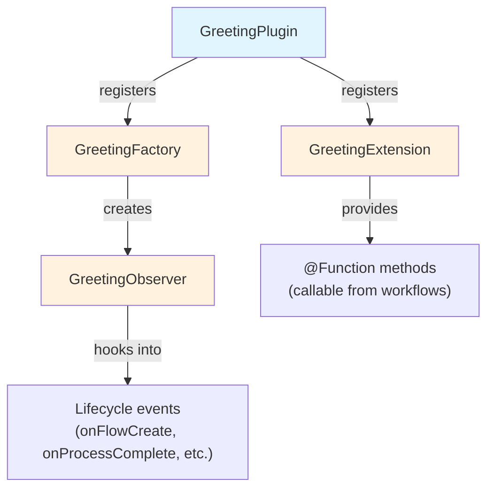

---

# Część 2: Tworzenie projektu wtyczki

<span class="ai-translation-notice">:material-information-outline:{ .ai-translation-notice-icon } Tłumaczenie wspomagane przez AI - [dowiedz się więcej i zasugeruj ulepszenia](https://github.com/nextflow-io/training/blob/master/TRANSLATING.md)</span>

Wiesz już, jak wtyczki rozszerzają Nextflow'a o funkcjonalności wielokrotnego użytku.
Teraz stworzysz własną, zaczynając od szablonu projektu, który zajmuje się konfiguracją budowania za Ciebie.

!!! tip "Zaczynasz od tej części?"

    Jeśli dołączasz w tym miejscu, skopiuj rozwiązanie z Części 1 jako punkt startowy:

    ```bash
    cp -r solutions/1-plugin-basics/* .
    ```

!!! info "Oficjalna dokumentacja"

    Ta sekcja i kolejne omawiają podstawy tworzenia wtyczek.
    Szczegółowe informacje znajdziesz w [oficjalnej dokumentacji tworzenia wtyczek Nextflow](https://www.nextflow.io/docs/latest/plugins/developing-plugins.html).

---

## 1. Tworzenie projektu wtyczki

Wbudowane polecenie `nextflow plugin create` generuje kompletny projekt wtyczki:

```bash
nextflow plugin create nf-greeting training
```

```console title="Output"
Plugin created successfully at path: /workspaces/training/side-quests/plugin_development/nf-greeting
```

Pierwszy argument to nazwa wtyczki, a drugi to nazwa Twojej organizacji (służy do organizowania wygenerowanego kodu w katalogi).

!!! tip "Tworzenie ręczne"

    Możesz też tworzyć projekty wtyczek ręcznie lub użyć [szablonu nf-hello](https://github.com/nextflow-io/nf-hello) na GitHub jako punktu startowego.

---

## 2. Analiza struktury projektu

Wtyczka Nextflow to fragment oprogramowania napisanego w Groovy, który działa wewnątrz Nextflow'a.
Rozszerza możliwości Nextflow'a za pomocą dobrze zdefiniowanych punktów integracji, co oznacza, że może współpracować z takimi funkcjonalnościami jak kanały, procesy i konfiguracja.

Zanim zaczniesz pisać kod, przyjrzyj się temu, co wygenerował szablon — dzięki temu będziesz wiedzieć, gdzie co się znajduje.

Przejdź do katalogu wtyczki:

```bash
cd nf-greeting
```

Wylistuj zawartość:

```bash
tree
```

Powinieneś zobaczyć:

```console
.
├── build.gradle
├── COPYING
├── gradle
│   └── wrapper
│       ├── gradle-wrapper.jar
│       └── gradle-wrapper.properties
├── gradlew
├── Makefile
├── README.md
├── settings.gradle
└── src
    ├── main
    │   └── groovy
    │       └── training
    │           └── plugin
    │               ├── GreetingExtension.groovy
    │               ├── GreetingFactory.groovy
    │               ├── GreetingObserver.groovy
    │               └── GreetingPlugin.groovy
    └── test
        └── groovy
            └── training
                └── plugin
                    └── GreetingObserverTest.groovy

11 directories, 13 files
```

---

## 3. Analiza konfiguracji budowania

Wtyczka Nextflow to oprogramowanie oparte na Javie, które musi zostać skompilowane i spakowane, zanim Nextflow będzie mógł z niego korzystać.
Wymaga to narzędzia do budowania.

Gradle to narzędzie, które kompiluje kod, uruchamia testy i pakuje oprogramowanie.
Szablon wtyczki zawiera wrapper Gradle (`./gradlew`), dzięki czemu nie musisz instalować Gradle osobno.

Konfiguracja budowania mówi Gradle, jak skompilować wtyczkę, a Nextflow'owi — jak ją załadować.
Najważniejsze są dwa pliki.

### 3.1. settings.gradle

Ten plik identyfikuje projekt:

```bash
cat settings.gradle
```

```groovy title="settings.gradle"
rootProject.name = 'nf-greeting'
```

Nazwa tutaj musi odpowiadać tej, którą wpiszesz w `nextflow.config` podczas korzystania z wtyczki.

### 3.2. build.gradle

Plik budowania zawiera większość konfiguracji:

```bash
cat build.gradle
```

Plik składa się z kilku sekcji.
Najważniejszy jest blok `nextflowPlugin`:

```groovy title="build.gradle"
plugins {
    id 'io.nextflow.nextflow-plugin' version '1.0.0-beta.10'
}

version = '0.1.0'

nextflowPlugin {
    nextflowVersion = '24.10.0'       // (1)!

    provider = 'training'             // (2)!
    className = 'training.plugin.GreetingPlugin'  // (3)!
    extensionPoints = [               // (4)!
        'training.plugin.GreetingExtension',
        'training.plugin.GreetingFactory'
    ]

}
```

1. **`nextflowVersion`**: Minimalna wymagana wersja Nextflow'a
2. **`provider`**: Twoje imię lub nazwa organizacji
3. **`className`**: Główna klasa wtyczki — punkt wejścia ładowany przez Nextflow'a jako pierwszy
4. **`extensionPoints`**: Klasy dodające funkcjonalności do Nextflow'a (Twoje funkcje, monitorowanie itp.)

Blok `nextflowPlugin` konfiguruje:

- `nextflowVersion`: Minimalna wymagana wersja Nextflow'a
- `provider`: Twoje imię lub nazwa organizacji
- `className`: Główna klasa wtyczki (punkt wejścia ładowany przez Nextflow'a jako pierwszy, określony w `build.gradle`)
- `extensionPoints`: Klasy dodające funkcjonalności do Nextflow'a (Twoje funkcje, monitorowanie itp.)

### 3.3. Aktualizacja nextflowVersion

Szablon generuje wartość `nextflowVersion`, która może być nieaktualna.
Zaktualizuj ją, aby odpowiadała zainstalowanej wersji Nextflow'a i zapewnić pełną kompatybilność:

=== "Po"

    ```groovy title="build.gradle" hl_lines="2"
    nextflowPlugin {
        nextflowVersion = '25.10.0'

        provider = 'training'
    ```

=== "Przed"

    ```groovy title="build.gradle" hl_lines="2"
    nextflowPlugin {
        nextflowVersion = '24.10.0'

        provider = 'training'
    ```

---

## 4. Pliki źródłowe

Kod źródłowy wtyczki znajduje się w `src/main/groovy/training/plugin/`.
Są tam cztery pliki źródłowe, każdy z odrębną rolą:

| Plik                       | Rola                                                           | Modyfikowany w     |
| -------------------------- | -------------------------------------------------------------- | ------------------ |
| `GreetingPlugin.groovy`    | Punkt wejścia ładowany przez Nextflow'a jako pierwszy          | Nigdy (generowany) |
| `GreetingExtension.groovy` | Definiuje funkcje wywoływalne z workflow'ów                    | Część 3            |
| `GreetingFactory.groovy`   | Tworzy instancje obserwatora przy uruchomieniu workflow'u      | Część 5            |
| `GreetingObserver.groovy`  | Uruchamia kod w odpowiedzi na zdarzenia cyklu życia workflow'u | Część 5            |

Każdy plik jest szczegółowo omówiony w odpowiedniej części, gdy po raz pierwszy go modyfikujesz.
Kluczowe pliki, o których warto wiedzieć:

- `GreetingPlugin` to punkt wejścia ładowany przez Nextflow'a
- `GreetingExtension` dostarcza funkcje udostępniane przez wtyczkę workflow'om
- `GreetingObserver` działa równolegle z pipeline'em i reaguje na zdarzenia bez konieczności modyfikowania kodu pipeline'u



---

## 5. Budowanie, instalacja i uruchomienie

Szablon zawiera działający kod od razu po wygenerowaniu, więc możesz go zbudować i uruchomić natychmiast, aby sprawdzić, czy projekt jest poprawnie skonfigurowany.

Skompiluj wtyczkę i zainstaluj ją lokalnie:

```bash
make install
```

`make install` kompiluje kod wtyczki i kopiuje go do lokalnego katalogu wtyczek Nextflow (`$NXF_HOME/plugins/`), udostępniając go do użycia.

??? example "Wynik budowania"

    Przy pierwszym uruchomieniu Gradle pobierze się samodzielnie (może to chwilę potrwać):

    ```console
    Downloading https://services.gradle.org/distributions/gradle-8.14-bin.zip
    ...10%...20%...30%...40%...50%...60%...70%...80%...90%...100%

    Welcome to Gradle 8.14!
    ...

    Deprecated Gradle features were used in this build...

    BUILD SUCCESSFUL in 23s
    5 actionable tasks: 5 executed
    ```

    **Ostrzeżenia są oczekiwane.**

    - **"Downloading gradle..."**: Dzieje się to tylko za pierwszym razem. Kolejne budowania są znacznie szybsze.
    - **"Deprecated Gradle features..."**: To ostrzeżenie pochodzi z szablonu wtyczki, nie z Twojego kodu. Można je bezpiecznie zignorować.
    - **"BUILD SUCCESSFUL"**: To jest najważniejsze. Wtyczka skompilowała się bez błędów.

Wróć do katalogu pipeline'u:

```bash
cd ..
```

Dodaj wtyczkę nf-greeting do `nextflow.config`:

=== "Po"

    ```groovy title="nextflow.config" hl_lines="4"
    // Konfiguracja dla ćwiczeń z tworzenia wtyczek
    plugins {
        id 'nf-schema@2.6.1'
        id 'nf-greeting@0.1.0'
    }
    ```

=== "Przed"

    ```groovy title="nextflow.config"
    // Konfiguracja dla ćwiczeń z tworzenia wtyczek
    plugins {
        id 'nf-schema@2.6.1'
    }
    ```

!!! note "Wersja wymagana dla lokalnych wtyczek"

    Korzystając z lokalnie zainstalowanych wtyczek, musisz podać wersję (np. `nf-greeting@0.1.0`).
    Wtyczki opublikowane w rejestrze mogą używać samej nazwy.

Uruchom pipeline:

```bash
nextflow run greet.nf -ansi-log false
```

Flaga `-ansi-log false` wyłącza animowany podgląd postępu, dzięki czemu wszystkie komunikaty — w tym wiadomości od obserwatora — są wypisywane w kolejności.

```console title="Output"
Pipeline is starting! 🚀
[bc/f10449] Submitted process > SAY_HELLO (1)
[9a/f7bcb2] Submitted process > SAY_HELLO (2)
[6c/aff748] Submitted process > SAY_HELLO (3)
[de/8937ef] Submitted process > SAY_HELLO (4)
[98/c9a7d6] Submitted process > SAY_HELLO (5)
Output: Bonjour
Output: Hello
Output: Holà
Output: Ciao
Output: Hallo
Pipeline complete! 👋
```

(Kolejność wyników i skróty katalogów roboczych mogą się różnić.)

Komunikaty „Pipeline is starting!" i „Pipeline complete!" wyglądają znajomo — widziałeś je już przy wtyczce nf-hello w Części 1, ale tym razem pochodzą z `GreetingObserver` w Twojej własnej wtyczce.
Sam pipeline pozostaje niezmieniony; obserwator uruchamia się automatycznie, ponieważ jest zarejestrowany w fabryce.

---

## Podsumowanie

Nauczyłeś się, że:

- Polecenie `nextflow plugin create` generuje kompletny projekt startowy
- `build.gradle` konfiguruje metadane wtyczki, zależności oraz klasy dostarczające funkcjonalności
- Wtyczka składa się z czterech głównych komponentów: Plugin (punkt wejścia), Extension (funkcje), Factory (tworzy monitory) i Observer (reaguje na zdarzenia workflow'u)
- Cykl tworzenia to: edytuj kod, `make install`, uruchom pipeline

---

## Co dalej?

Teraz zaimplementujesz własne funkcje w klasie Extension i użyjesz ich w workflow'ie.

[Przejdź do Części 3 :material-arrow-right:](03_custom_functions.md){ .md-button .md-button--primary }
