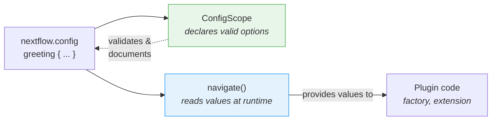

# Część 6: Konfiguracja

<span class="ai-translation-notice">:material-information-outline:{ .ai-translation-notice-icon } Tłumaczenie wspomagane przez AI - [dowiedz się więcej i zasugeruj ulepszenia](https://github.com/nextflow-io/training/blob/master/TRANSLATING.md)</span>

Twój plugin ma własne funkcje i obserwator, ale wszystko jest zakodowane na stałe.
Użytkownicy nie mogą wyłączyć licznika zadań ani zmienić dekoratora bez edytowania kodu źródłowego i ponownego budowania.

W Części 1 używałeś bloków `#!groovy validation {}` i `#!groovy co2footprint {}` w `nextflow.config`, aby kontrolować zachowanie nf-schema i nf-co2footprint.
Te bloki konfiguracyjne istnieją, ponieważ autorzy pluginów wbudowali tę możliwość.
W tej sekcji zrobisz to samo dla własnego pluginu.

**Cele:**

1. Pozwól użytkownikom dostosować prefiks i sufiks dekoratora powitania
2. Pozwól użytkownikom włączać i wyłączać plugin przez `nextflow.config`
3. Zarejestruj formalny zakres konfiguracji, aby Nextflow rozpoznawał blok `#!groovy greeting {}`

**Co zmienisz:**

| Plik                       | Zmiana                                                          |
| -------------------------- | --------------------------------------------------------------- |
| `GreetingExtension.groovy` | Odczyt konfiguracji prefiksu/sufiksu w `init()`                 |
| `GreetingFactory.groovy`   | Odczyt wartości konfiguracji do sterowania tworzeniem obserwatora |
| `GreetingConfig.groovy`    | Nowy plik: formalna klasa `@ConfigScope`                        |
| `build.gradle`             | Rejestracja klasy konfiguracji jako punktu rozszerzenia         |
| `nextflow.config`          | Dodanie bloku `#!groovy greeting {}` do testów                  |

!!! tip "Wskazówka"

    Jeśli zaczynasz od tej części, skopiuj rozwiązanie z Części 5 jako punkt startowy:

    ```bash
    cp -r solutions/5-observers/* .
    ```

!!! info "Oficjalna dokumentacja"

    Szczegółowe informacje o konfiguracji znajdziesz w [dokumentacji zakresów konfiguracji Nextflow](https://nextflow.io/docs/latest/developer/config-scopes.html).

---

## 1. Uczynienie dekoratora konfigurowalnym

Funkcja `decorateGreeting` opakowuje każde powitanie w `*** ... ***`.
Użytkownicy mogą chcieć innych znaczników, ale obecnie jedynym sposobem ich zmiany jest edycja kodu źródłowego i ponowne zbudowanie projektu.

Sesja Nextflow udostępnia metodę `session.config.navigate()`, która odczytuje zagnieżdżone wartości z `nextflow.config`:

```groovy
// Odczytaj 'greeting.prefix' z nextflow.config, domyślnie '***'
final prefix = session.config.navigate('greeting.prefix', '***') as String
```

Odpowiada to blokowi konfiguracyjnemu w `nextflow.config` użytkownika:

```groovy title="nextflow.config"
greeting {
    prefix = '>>>'
}
```

### 1.1. Dodanie odczytu konfiguracji (to się nie powiedzie!)

Edytuj `GreetingExtension.groovy`, aby odczytywać konfigurację w `init()` i używać jej w `decorateGreeting()`:

```groovy title="GreetingExtension.groovy" linenums="35" hl_lines="7-8 18"
@CompileStatic
class GreetingExtension extends PluginExtensionPoint {

    @Override
    protected void init(Session session) {
        // Odczytaj konfigurację z wartościami domyślnymi
        prefix = session.config.navigate('greeting.prefix', '***') as String
        suffix = session.config.navigate('greeting.suffix', '***') as String
    }

    // ... pozostałe metody bez zmian ...

    /**
    * Udekoruj powitanie świątecznymi znacznikami
    */
    @Function
    String decorateGreeting(String greeting) {
        return "${prefix} ${greeting} ${suffix}"
    }
```

Spróbuj zbudować:

```bash
cd nf-greeting && make assemble
```

### 1.2. Analiza błędu

Budowanie kończy się niepowodzeniem:

```console
> Task :compileGroovy FAILED
GreetingExtension.groovy: 30: [Static type checking] - The variable [prefix] is undeclared.
 @ line 30, column 9.
           prefix = session.config.navigate('greeting.prefix', '***') as String
           ^

GreetingExtension.groovy: 31: [Static type checking] - The variable [suffix] is undeclared.
```

W Groovy (i Javie) musisz _zadeklarować_ zmienną przed jej użyciem.
Kod próbuje przypisać wartości do `prefix` i `suffix`, ale klasa nie ma pól o tych nazwach.

### 1.3. Naprawa przez deklarację zmiennych instancji

Dodaj deklaracje zmiennych na początku klasy, zaraz po otwierającym nawiasie klamrowym:

```groovy title="GreetingExtension.groovy" linenums="35" hl_lines="4-5"
@CompileStatic
class GreetingExtension extends PluginExtensionPoint {

    private String prefix = '***'
    private String suffix = '***'

    @Override
    protected void init(Session session) {
        // Odczytaj konfigurację z wartościami domyślnymi
        prefix = session.config.navigate('greeting.prefix', '***') as String
        suffix = session.config.navigate('greeting.suffix', '***') as String
    }

    // ... reszta klasy bez zmian ...
```

Te dwie linie deklarują **zmienne instancji** (zwane też polami), które należą do każdego obiektu `GreetingExtension`.
Słowo kluczowe `private` oznacza, że tylko kod wewnątrz tej klasy może się do nich odwoływać.
Każda zmienna jest inicjalizowana domyślną wartością `'***'`.

Gdy plugin się ładuje, Nextflow wywołuje metodę `init()`, która nadpisuje te wartości domyślne tym, co użytkownik ustawił w `nextflow.config`.
Jeśli użytkownik nic nie ustawił, `navigate()` zwraca tę samą wartość domyślną, więc zachowanie pozostaje niezmienione.
Metoda `decorateGreeting()` odczytuje te pola przy każdym wywołaniu.

!!! tip "Wskazówka"

    Ten wzorzec „deklaruj przed użyciem" jest fundamentalny dla Javy i Groovy, ale może być nieznany, jeśli przychodzisz z Pythona lub R, gdzie zmienne pojawiają się w momencie pierwszego przypisania.
    Napotkanie tego błędu raz pomaga szybko go rozpoznawać i naprawiać w przyszłości.

### 1.4. Budowanie i testowanie

Zbuduj i zainstaluj:

```bash
make install && cd ..
```

Zaktualizuj `nextflow.config`, aby dostosować dekorację:

=== "Po"

    ```groovy title="nextflow.config" hl_lines="7-10"
    // Konfiguracja dla ćwiczeń z tworzenia pluginów
    plugins {
        id 'nf-schema@2.6.1'
        id 'nf-greeting@0.1.0'
    }

    greeting {
        prefix = '>>>'
        suffix = '<<<'
    }
    ```

=== "Przed"

    ```groovy title="nextflow.config"
    // Konfiguracja dla ćwiczeń z tworzenia pluginów
    plugins {
        id 'nf-schema@2.6.1'
        id 'nf-greeting@0.1.0'
    }
    ```

Uruchom pipeline:

```bash
nextflow run greet.nf -ansi-log false
```

```console title="Output (partial)"
Decorated: >>> Hello <<<
Decorated: >>> Bonjour <<<
...
```

Dekorator używa teraz niestandardowego prefiksu i sufiksu z pliku konfiguracyjnego.

Zwróć uwagę, że Nextflow wyświetla ostrzeżenie „Unrecognized config option", ponieważ nic nie zadeklarowało jeszcze `greeting` jako prawidłowego zakresu konfiguracji.
Wartość jest nadal poprawnie odczytywana przez `navigate()`, ale Nextflow oznacza ją jako nierozpoznaną.
Naprawisz to w Sekcji 3.

---

## 2. Uczynienie licznika zadań konfigurowalnym

Fabryka obserwatorów tworzy je obecnie bezwarunkowo.
Użytkownicy powinni mieć możliwość całkowitego wyłączenia pluginu przez konfigurację.

Fabryka ma dostęp do sesji Nextflow i jej konfiguracji, więc to właściwe miejsce do odczytu ustawienia `enabled` i decydowania, czy tworzyć obserwatory.

=== "Po"

    ```groovy title="GreetingFactory.groovy" linenums="31" hl_lines="3-4"
    @Override
    Collection<TraceObserver> create(Session session) {
        final enabled = session.config.navigate('greeting.enabled', true)
        if (!enabled) return []

        return [
            new GreetingObserver(),
            new TaskCounterObserver()
        ]
    }
    ```

=== "Przed"

    ```groovy title="GreetingFactory.groovy" linenums="31"
    @Override
    Collection<TraceObserver> create(Session session) {
        return [
            new GreetingObserver(),
            new TaskCounterObserver()
        ]
    }
    ```

Fabryka odczytuje teraz `greeting.enabled` z konfiguracji i zwraca pustą listę, jeśli użytkownik ustawił tę wartość na `false`.
Gdy lista jest pusta, żadne obserwatory nie są tworzone, a hooki cyklu życia pluginu są po cichu pomijane.

### 2.1. Budowanie i testowanie

Przebuduj i zainstaluj plugin:

```bash
cd nf-greeting && make install && cd ..
```

Uruchom pipeline, aby potwierdzić, że wszystko nadal działa:

```bash
nextflow run greet.nf -ansi-log false
```

??? exercise "Ćwiczenie"

    Spróbuj ustawić `greeting.enabled = false` w `nextflow.config` i uruchom pipeline ponownie.
    Co zmienia się w wyjściu?

    ??? solution "Rozwiązanie"

        ```groovy title="nextflow.config" hl_lines="8"
        // Konfiguracja dla ćwiczeń z tworzenia pluginów
        plugins {
            id 'nf-schema@2.6.1'
            id 'nf-greeting@0.1.0'
        }

        greeting {
            enabled = false
        }
        ```

        Komunikaty „Pipeline is starting!", „Pipeline complete!" oraz informacja o liczbie zadań znikają, ponieważ fabryka zwraca pustą listę, gdy `enabled` ma wartość false.
        Sam pipeline nadal działa, ale żadne obserwatory nie są aktywne.

        Pamiętaj, aby ustawić `enabled` z powrotem na `true` (lub usunąć tę linię) przed kontynuowaniem.

---

## 3. Formalna konfiguracja z ConfigScope

Konfiguracja Twojego pluginu działa, ale Nextflow nadal wyświetla ostrzeżenia „Unrecognized config option".
Dzieje się tak, ponieważ `session.config.navigate()` tylko odczytuje wartości — nic nie poinformowało Nextflow'a, że `greeting` jest prawidłowym zakresem konfiguracji.

Klasa `ConfigScope` wypełnia tę lukę.
Deklaruje, jakie opcje akceptuje Twój plugin, ich typy i wartości domyślne.
**Nie** zastępuje wywołań `navigate()`. Zamiast tego działa obok nich:



Bez klasy `ConfigScope` `navigate()` nadal działa, ale:

- Nextflow ostrzega o nierozpoznanych opcjach (jak już widziałeś)
- Brak autouzupełniania w IDE dla użytkowników piszących `nextflow.config`
- Opcje konfiguracji nie są samodokumentujące się
- Konwersja typów jest ręczna (`as String`, `as boolean`)

Zarejestrowanie formalnej klasy zakresu konfiguracji usuwa ostrzeżenie i rozwiązuje wszystkie trzy problemy.
To ten sam mechanizm, który stoi za blokami `#!groovy validation {}` i `#!groovy co2footprint {}` używanymi w Części 1.

### 3.1. Tworzenie klasy konfiguracji

Utwórz nowy plik:

```bash
touch nf-greeting/src/main/groovy/training/plugin/GreetingConfig.groovy
```

Dodaj klasę konfiguracji z wszystkimi trzema opcjami:

```groovy title="GreetingConfig.groovy" linenums="1"
package training.plugin

import nextflow.config.spec.ConfigOption
import nextflow.config.spec.ConfigScope
import nextflow.config.spec.ScopeName
import nextflow.script.dsl.Description

/**
 * Opcje konfiguracji dla pluginu nf-greeting.
 *
 * Użytkownicy konfigurują je w nextflow.config:
 *
 *     greeting {
 *         enabled = true
 *         prefix = '>>>'
 *         suffix = '<<<'
 *     }
 */
@ScopeName('greeting')                       // (1)!
class GreetingConfig implements ConfigScope { // (2)!

    GreetingConfig() {}

    GreetingConfig(Map opts) {               // (3)!
        this.enabled = opts.enabled as Boolean ?: true
        this.prefix = opts.prefix as String ?: '***'
        this.suffix = opts.suffix as String ?: '***'
    }

    @ConfigOption                            // (4)!
    @Description('Enable or disable the plugin entirely')
    boolean enabled = true

    @ConfigOption
    @Description('Prefix for decorated greetings')
    String prefix = '***'

    @ConfigOption
    @Description('Suffix for decorated greetings')
    String suffix = '***'
}
```

1. Mapuje na blok `#!groovy greeting { }` w `nextflow.config`
2. Wymagany interfejs dla klas konfiguracji
3. Zarówno konstruktor bezargumentowy, jak i konstruktor przyjmujący Map są potrzebne, aby Nextflow mógł tworzyć instancje konfiguracji
4. `@ConfigOption` oznacza pole jako opcję konfiguracji; `@Description` dokumentuje je dla narzędzi

Kluczowe punkty:

- **`@ScopeName('greeting')`**: Mapuje na blok `greeting { }` w konfiguracji
- **`implements ConfigScope`**: Wymagany interfejs dla klas konfiguracji
- **`@ConfigOption`**: Każde pole staje się opcją konfiguracji
- **`@Description`**: Dokumentuje każdą opcję dla wsparcia serwera językowego (importowane z `nextflow.script.dsl`)
- **Konstruktory**: Potrzebne są zarówno konstruktor bezargumentowy, jak i konstruktor przyjmujący Map

### 3.2. Rejestracja klasy konfiguracji

Samo utworzenie klasy nie wystarczy.
Nextflow musi wiedzieć o jej istnieniu, więc rejestrujesz ją w `build.gradle` obok pozostałych punktów rozszerzenia.

=== "Po"

    ```groovy title="build.gradle" hl_lines="4"
    extensionPoints = [
        'training.plugin.GreetingExtension',
        'training.plugin.GreetingFactory',
        'training.plugin.GreetingConfig'
    ]
    ```

=== "Przed"

    ```groovy title="build.gradle"
    extensionPoints = [
        'training.plugin.GreetingExtension',
        'training.plugin.GreetingFactory'
    ]
    ```

Zwróć uwagę na różnicę między rejestracją fabryki a punktów rozszerzenia:

- **`extensionPoints` w `build.gradle`**: Rejestracja w czasie kompilacji. Informuje system pluginów Nextflow'a, które klasy implementują punkty rozszerzenia.
- **Metoda `create()` fabryki**: Rejestracja w czasie wykonania. Fabryka tworzy instancje obserwatorów, gdy workflow faktycznie startuje.

### 3.3. Budowanie i testowanie

```bash
cd nf-greeting && make install && cd ..
nextflow run greet.nf -ansi-log false
```

Zachowanie pipeline'u jest identyczne, ale ostrzeżenie „Unrecognized config option" zniknęło.

!!! note "Uwaga"

    `GreetingFactory` i `GreetingExtension` nadal używają `session.config.navigate()` do odczytu wartości w czasie wykonania.
    Żaden z tych fragmentów kodu nie uległ zmianie.
    Klasa `ConfigScope` to równoległa deklaracja, która informuje Nextflow'a o dostępnych opcjach.
    Obie części są potrzebne: `ConfigScope` deklaruje, `navigate()` odczytuje.

Twój plugin ma teraz taką samą strukturę jak pluginy używane w Części 1.
Gdy nf-schema udostępnia blok `#!groovy validation {}`, a nf-co2footprint udostępnia blok `#!groovy co2footprint {}`, używają dokładnie tego wzorca: klasy `ConfigScope` z adnotowanymi polami, zarejestrowanej jako punkt rozszerzenia.
Twój blok `#!groovy greeting {}` działa w ten sam sposób.

---

## Podsumowanie

Nauczyłeś się, że:

- `session.config.navigate()` **odczytuje** wartości konfiguracji w czasie wykonania
- Klasy `@ConfigScope` **deklarują** dostępne opcje konfiguracji; działają obok `navigate()`, a nie zamiast niego
- Konfigurację można stosować zarówno do obserwatorów, jak i funkcji rozszerzenia
- Zmienne instancji muszą być zadeklarowane przed użyciem w Groovy/Javie; `init()` wypełnia je wartościami z konfiguracji podczas ładowania pluginu

| Przypadek użycia                              | Zalecane podejście                                                    |
| --------------------------------------------- | --------------------------------------------------------------------- |
| Szybki prototyp lub prosty plugin             | Tylko `session.config.navigate()`                                     |
| Plugin produkcyjny z wieloma opcjami          | Dodaj klasę `ConfigScope` obok wywołań `navigate()`                   |
| Plugin przeznaczony do publicznego udostępnienia | Dodaj klasę `ConfigScope` obok wywołań `navigate()`                |

---

## Co dalej?

Twój plugin ma teraz wszystkie elementy pluginu produkcyjnego: własne funkcje, obserwatory śladów i konfigurację dostępną dla użytkowników.
Ostatnim krokiem jest przygotowanie go do dystrybucji.

[Przejdź do Podsumowania :material-arrow-right:](summary.md){ .md-button .md-button--primary }
