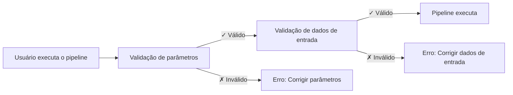

# Parte 5: Validação de entrada

<span class="ai-translation-notice">:material-information-outline:{ .ai-translation-notice-icon } Tradução assistida por IA - [saiba mais e sugira melhorias](https://github.com/nextflow-io/training/blob/master/TRANSLATING.md)</span>

Na quinta parte do curso de treinamento Hello nf-core, mostramos como usar o plugin nf-schema para validar entradas e parâmetros do pipeline.

??? info "Como começar a partir desta seção"

    Esta seção assume que você completou a [Parte 4: Criar um módulo nf-core](./04_make_module.md) e atualizou o módulo de processo `COWPY` para os padrões nf-core em seu pipeline.

    Se você não completou a Parte 4 ou quer começar do zero para esta parte, pode usar a solução `core-hello-part4` como ponto de partida.
    Execute estes comandos de dentro do diretório `hello-nf-core/`:

    ```bash
    cp -r solutions/core-hello-part4 core-hello
    cd core-hello
    ```

    Isso fornece um pipeline com o módulo `COWPY` já atualizado para seguir os padrões nf-core.
    Você pode testar se ele executa com sucesso executando o seguinte comando:

    ```bash
    nextflow run . --outdir core-hello-results -profile test,docker --validate_params false
    ```

---

## 0. Aquecimento: Um pouco de contexto

### 0.1. Por que a validação é importante

Imagine executar seu pipeline por duas horas, apenas para ele falhar porque um usuário forneceu um arquivo com a extensão errada. Ou passar horas depurando erros enigmáticos, apenas para descobrir que um parâmetro foi escrito incorretamente. Sem validação de entrada, esses cenários são comuns.

Considere este exemplo:

```console title="Sem validação"
$ nextflow run my-pipeline --input data.txt --output results

...2 horas depois...

ERROR ~ No such file: 'data.fq.gz'
  Expected FASTQ format but received TXT
```

O pipeline aceitou entradas inválidas e executou por horas antes de falhar. Com validação adequada:

```console title="Com validação"
$ nextflow run my-pipeline --input data.txt --output results

ERROR ~ Validation of pipeline parameters failed!

 * --input (data.txt): File extension '.txt' does not match required pattern '.fq.gz' or '.fastq.gz'
 * --output: required parameter is missing (expected: --outdir)

Pipeline failed before execution - please fix the errors above
```

O pipeline falha imediatamente com mensagens de erro claras e acionáveis. Isso economiza tempo, recursos computacionais e frustração.

### 0.2. O plugin nf-schema

O [plugin nf-schema](https://nextflow-io.github.io/nf-schema/latest/) é um plugin Nextflow que fornece capacidades abrangentes de validação para pipelines Nextflow.
Embora o nf-schema funcione com qualquer fluxo de trabalho Nextflow, é a solução de validação padrão para todos os pipelines nf-core.

O nf-schema fornece várias funções principais:

- **Validação de parâmetros**: Valida parâmetros do pipeline contra `nextflow_schema.json`
- **Validação de planilha de amostras**: Valida arquivos de entrada contra `assets/schema_input.json`
- **Conversão de canal**: Converte planilhas de amostras validadas em canais Nextflow
- **Geração de texto de ajuda**: Gera automaticamente saída `--help` a partir de definições de schema
- **Resumo de parâmetros**: Exibe quais parâmetros diferem dos padrões

O nf-schema é o sucessor do plugin nf-validation descontinuado e usa o padrão [JSON Schema Draft 2020-12](https://json-schema.org/) para validação.

??? info "O que são plugins Nextflow?"

    Plugins são extensões que adicionam novas funcionalidades à própria linguagem Nextflow. Eles são instalados via um bloco `plugins{}` em `nextflow.config` e podem fornecer:

    - Novas funções e classes que podem ser importadas (como `samplesheetToList`)
    - Novos recursos DSL e operadores
    - Integração com serviços externos

    O plugin nf-schema é especificado em `nextflow.config`:

    ```groovy
    plugins {
        id 'nf-schema@2.1.1'
    }
    ```

    Uma vez instalado, você pode importar funções de plugins usando a sintaxe `include { functionName } from 'plugin/plugin-name'`.

### 0.3. Dois arquivos de schema para dois tipos de validação

Um pipeline nf-core utilizará dois arquivos de schema separados, que correspondem a dois tipos de validação:

| Arquivo de Schema          | Propósito                     | Valida                                                      |
| -------------------------- | ----------------------------- | ----------------------------------------------------------- |
| `nextflow_schema.json`     | Validação de parâmetros       | Flags de linha de comando: `--input`, `--outdir`, `--batch` |
| `assets/schema_input.json` | Validação de dados de entrada | Conteúdo de planilhas de amostras e arquivos de entrada     |

Ambos os schemas usam o formato JSON Schema, um padrão amplamente adotado para descrever e validar estruturas de dados.

**Validação de parâmetros** valida parâmetros de linha de comando (flags como `--outdir`, `--batch`, `--input`):

- Verifica tipos, intervalos e formatos de parâmetros
- Garante que parâmetros obrigatórios sejam fornecidos
- Valida se os caminhos de arquivo existem
- Definida em `nextflow_schema.json`

**Validação de dados de entrada** valida a estrutura de planilhas de amostras e arquivos de manifesto (arquivos CSV/TSV que descrevem seus dados):

- Verifica estrutura de colunas e tipos de dados
- Valida se os caminhos de arquivo referenciados na planilha de amostras existem
- Garante que campos obrigatórios estejam presentes
- Definida em `assets/schema_input.json`

!!! warning "O que a validação de dados de entrada NÃO faz"

    A validação de dados de entrada verifica a estrutura de *arquivos de manifesto* (planilhas de amostras, arquivos CSV), NÃO o conteúdo dos seus arquivos de dados reais (FASTQ, BAM, VCF, etc.).

    Para dados em larga escala, validar o conteúdo dos arquivos (como verificar a integridade de BAM) deve acontecer em processos do pipeline executando em nós de trabalho, não durante a etapa de validação na máquina de orquestração.

### 0.4. Quando a validação deve ocorrer?



A validação deve acontecer **antes** de qualquer processo do pipeline executar, para fornecer feedback rápido e evitar tempo de computação desperdiçado.

Agora vamos aplicar esses princípios na prática, começando com a validação de parâmetros.

---

## 1. Validação de parâmetros (nextflow_schema.json)

Vamos começar adicionando validação de parâmetros ao nosso pipeline. Isso valida flags de linha de comando como `--input`, `--outdir` e `--batch`.

### 1.1. Configurar a validação para ignorar validação de arquivo de entrada

O template de pipeline nf-core vem com o nf-schema já instalado e configurado:

- O plugin nf-schema é instalado via o bloco `plugins{}` em `nextflow.config`
- A validação de parâmetros é habilitada por padrão via `params.validate_params = true`
- A validação é realizada pelo subworkflow `UTILS_NFSCHEMA_PLUGIN` durante a inicialização do pipeline

O comportamento de validação é controlado através do escopo `validation{}` em `nextflow.config`.

Como estaremos trabalhando na validação de parâmetros primeiro (esta seção) e não configuraremos o schema de dados de entrada até a seção 2, precisamos temporariamente dizer ao nf-schema para ignorar a validação do conteúdo do arquivo do parâmetro `input`.

Abra `nextflow.config` e encontre o bloco `validation` (por volta da linha 246). Adicione `ignoreParams` para ignorar a validação de arquivo de entrada:

=== "Depois"

    ```groovy title="nextflow.config" hl_lines="3" linenums="246"
    validation {
        defaultIgnoreParams = ["genomes"]
        ignoreParams = ['input']
        monochromeLogs = params.monochrome_logs
    }
    ```

=== "Antes"

    ```groovy title="nextflow.config" linenums="246"
    validation {
        defaultIgnoreParams = ["genomes"]
        monochromeLogs = params.monochrome_logs
    }
    ```

Esta configuração diz ao nf-schema para:

- **`defaultIgnoreParams`**: Ignorar validação de parâmetros complexos como `genomes` (definido pelos desenvolvedores do template)
- **`ignoreParams`**: Ignorar validação do conteúdo do arquivo do parâmetro `input` (temporário; vamos reabilitar isso na seção 2)
- **`monochromeLogs`**: Desabilitar saída colorida em mensagens de validação quando definido como `true` (controlado por `params.monochrome_logs`)

!!! note "Por que ignorar o parâmetro input?"

    O parâmetro `input` em `nextflow_schema.json` tem `"schema": "assets/schema_input.json"` que diz ao nf-schema para validar o *conteúdo* do arquivo CSV de entrada contra esse schema.
    Como ainda não configuramos esse schema, temporariamente ignoramos essa validação.
    Removeremos essa configuração na seção 2 após configurar o schema de dados de entrada.

### 1.2. Examinar o schema de parâmetros

Vamos olhar uma seção do arquivo `nextflow_schema.json` que veio com nosso template de pipeline:

```bash
grep -A 25 '"input_output_options"' nextflow_schema.json
```

O schema de parâmetros é organizado em grupos. Aqui está o grupo `input_output_options`:

```json title="core-hello/nextflow_schema.json (trecho)" linenums="8"
        "input_output_options": {
            "title": "Input/output options",
            "type": "object",
            "fa_icon": "fas fa-terminal",
            "description": "Define where the pipeline should find input data and save output data.",
            "required": ["input", "outdir"],
            "properties": {
                "input": {
                    "type": "string",
                    "format": "file-path",
                    "exists": true,
                    "schema": "assets/schema_input.json",
                    "mimetype": "text/csv",
                    "pattern": "^\\S+\\.csv$",
                    "description": "Path to comma-separated file containing information about the samples in the experiment.",
                    "help_text": "You will need to create a design file with information about the samples in your experiment before running the pipeline. Use this parameter to specify its location. It has to be a comma-separated file with 3 columns, and a header row.",
                    "fa_icon": "fas fa-file-csv"
                },
                "outdir": {
                    "type": "string",
                    "format": "directory-path",
                    "description": "The output directory where the results will be saved. You have to use absolute paths to storage on Cloud infrastructure.",
                    "fa_icon": "fas fa-folder-open"
                }
            }
        },
```

Cada entrada descrita aqui tem as seguintes propriedades principais que podem ser validadas:

- **`type`**: Tipo de dado (string, integer, boolean, number)
- **`format`**: Formatos especiais como `file-path` ou `directory-path`
- **`exists`**: Para caminhos de arquivo, verifica se o arquivo existe
- **`pattern`**: Expressão regular que o valor deve corresponder
- **`required`**: Array de nomes de parâmetros que devem ser fornecidos
- **`mimetype`**: Mimetype de arquivo esperado para validação

Se você tem olhar afiado, pode perceber que o parâmetro de entrada `batch` que temos usado ainda não está definido no schema.
Vamos adicioná-lo na próxima seção.

??? info "De onde vêm os parâmetros do schema?"

    A validação do schema usa `nextflow.config` como base para definições de parâmetros.
    Parâmetros declarados em outros lugares nos seus scripts de fluxo de trabalho (como em `main.nf` ou arquivos de módulo) **não** são automaticamente capturados pelo validador de schema.

    Isso significa que você deve sempre declarar seus parâmetros de pipeline em `nextflow.config`, e então definir suas regras de validação em `nextflow_schema.json`.

### 1.3. Adicionar o parâmetro batch

Embora o schema seja um arquivo JSON que possa ser editado manualmente, **a edição manual é propensa a erros e não é recomendada**.
Em vez disso, o nf-core fornece uma ferramenta GUI interativa que manipula a sintaxe JSON Schema para você e valida suas alterações:

```bash
nf-core pipelines schema build
```

Você deve ver algo assim:

```console
                                      ,--./,-.
      ___     __   __   __   ___     /,-._.--\
|\ | |__  __ /  ` /  \ |__) |__         }  {
| \| |       \__, \__/ |  \ |___     \`-._,-`-,
                                      `._,._,'

nf-core/tools version 3.4.1 - https://nf-co.re

INFO     [✓] Default parameters match schema validation
INFO     [✓] Pipeline schema looks valid (found 17 params)
INFO     Writing schema with 17 params: 'nextflow_schema.json'
🚀  Launch web builder for customisation and editing? [y/n]:
```

Digite `y` e pressione Enter para iniciar a interface web interativa.

Seu navegador abrirá mostrando o construtor de schema de parâmetros:


Para adicionar o parâmetro `batch`:

1. Clique no botão **"Add parameter"** no topo
2. Use a alça de arrastar (⋮⋮) para mover o novo parâmetro para cima no grupo "Input/output options", abaixo do parâmetro `input`
3. Preencha os detalhes do parâmetro:
   - **ID**: `batch`
   - **Description**: `Name for this batch of greetings`
   - **Type**: `string`
   - **Required**: marque a caixa de seleção
   - Opcionalmente, selecione um ícone do seletor de ícones (ex: `fas fa-layer-group`)


Quando terminar, clique no botão **"Finished"** no canto superior direito.

De volta ao seu terminal, você verá:

```console
INFO     Writing schema with 18 params: 'nextflow_schema.json'
⣾ Use ctrl+c to stop waiting and force exit.
```

Pressione `Ctrl+C` para sair do construtor de schema.

A ferramenta agora atualizou seu arquivo `nextflow_schema.json` com o novo parâmetro `batch`, manipulando toda a sintaxe JSON Schema corretamente.

### 1.4. Verificar as alterações

```bash
grep -A 25 '"input_output_options"' nextflow_schema.json
```

```json title="core-hello/nextflow_schema.json (trecho)" linenums="8" hl_lines="19-23"
    "input_output_options": {
      "title": "Input/output options",
      "type": "object",
      "fa_icon": "fas fa-terminal",
      "description": "Define where the pipeline should find input data and save output data.",
      "required": ["input", "outdir", "batch"],
      "properties": {
        "input": {
          "type": "string",
          "format": "file-path",
          "exists": true,
          "schema": "assets/schema_input.json",
          "mimetype": "text/csv",
          "pattern": "^\\S+\\.csv$",
          "description": "Path to comma-separated file containing information about the samples in the experiment.",
          "help_text": "You will need to create a design file with information about the samples in your experiment before running the pipeline. Use this parameter to specify its location. It has to be a comma-separated file with 3 columns, and a header row.",
          "fa_icon": "fas fa-file-csv"
        },
        "batch": {
          "type": "string",
          "description": "Name for this batch of greetings",
          "fa_icon": "fas fa-layer-group"
        },
```

Você deve ver que o parâmetro `batch` foi adicionado ao schema com o campo "required" agora mostrando `["input", "outdir", "batch"]`.

### 1.5. Testar a validação de parâmetros

Agora vamos testar que a validação de parâmetros funciona corretamente.

Primeiro, tente executar sem o parâmetro obrigatório `input`:

```bash
nextflow run . --outdir test-results -profile docker
```

??? warning "Saída do comando"

    ```console
    ERROR ~ Validation of pipeline parameters failed!

    -- Check '.nextflow.log' file for details
    The following invalid input values have been detected:

    * Missing required parameter(s): input, batch
    ```

Perfeito! A validação captura o parâmetro obrigatório faltante antes do pipeline executar.

Agora tente com um conjunto válido de parâmetros:

```bash
nextflow run . --input assets/greetings.csv --outdir results --batch my-batch -profile test,docker
```

??? success "Saída do comando"

    ```console
     N E X T F L O W   ~  version 25.04.3

    Launching `./main.nf` [peaceful_wozniak] DSL2 - revision: b9e9b3b8de

    executor >  local (8)
    [de/a1b2c3] CORE_HELLO:HELLO:sayHello (3)       | 3 of 3 ✔
    [4f/d5e6f7] CORE_HELLO:HELLO:convertToUpper (3) | 3 of 3 ✔
    [8a/b9c0d1] CORE_HELLO:HELLO:CAT_CAT (test)     | 1 of 1 ✔
    [e2/f3a4b5] CORE_HELLO:HELLO:COWPY (test)       | 1 of 1 ✔
    -[core/hello] Pipeline completed successfully-
    ```

O pipeline deve executar com sucesso, e o parâmetro `batch` agora está validado.

### Conclusão

Você aprendeu como usar a ferramenta interativa `nf-core pipelines schema build` para adicionar parâmetros ao `nextflow_schema.json` e viu a validação de parâmetros em ação.
A interface web manipula toda a sintaxe JSON Schema para você, facilitando o gerenciamento de schemas de parâmetros complexos sem edição JSON manual propensa a erros.

### Próximos passos

Agora que a validação de parâmetros está funcionando, vamos adicionar validação para o conteúdo do arquivo de dados de entrada.

---

## 2. Validação de dados de entrada (schema_input.json)

Vamos adicionar validação para o conteúdo do nosso arquivo CSV de entrada.
Enquanto a validação de parâmetros verifica flags de linha de comando, a validação de dados de entrada garante que os dados dentro do arquivo CSV estejam estruturados corretamente.

### 2.1. Entender o formato greetings.csv

Vamos relembrar como nossa entrada se parece:

```bash
cat assets/greetings.csv
```

```csv title="assets/greetings.csv"
Hello,en,87
Bonjour,fr,96
Holà,es,98
```

Este é um CSV simples com:

- Três colunas (sem cabeçalho)
- Em cada linha: uma saudação, um idioma e uma pontuação
- As duas primeiras colunas são strings de texto sem requisitos de formato especiais
- A terceira coluna é um inteiro

Para nosso pipeline, apenas a primeira coluna é obrigatória.

### 2.2. Projetar a estrutura do schema

Para nosso caso de uso, queremos:

1. Aceitar entrada CSV com pelo menos uma coluna
2. Tratar o primeiro elemento de cada linha como uma string de saudação
3. Garantir que as saudações não estejam vazias e não comecem com espaço em branco
4. Garantir que o campo de idioma corresponda a um dos códigos de idioma suportados (en, fr, es, it, de)
5. Garantir que o campo de pontuação seja um inteiro com valor entre 0 e 100

Vamos estruturar isso como um array de objetos, onde cada objeto tem pelo menos um campo `greeting`.

### 2.3. Atualizar o arquivo de schema

O template de pipeline nf-core inclui um `assets/schema_input.json` padrão projetado para dados de sequenciamento paired-end.
Precisamos substituí-lo por um schema mais simples para nosso caso de uso de saudações.

Abra `assets/schema_input.json` e substitua as seções `properties` e `required`:

=== "Depois"

    ```json title="assets/schema_input.json" linenums="1" hl_lines="10-25 27"
    {
        "$schema": "https://json-schema.org/draft/2020-12/schema",
        "$id": "https://raw.githubusercontent.com/core/hello/main/assets/schema_input.json",
        "title": "core/hello pipeline - params.input schema",
        "description": "Schema for the greetings file provided with params.input",
        "type": "array",
        "items": {
            "type": "object",
            "properties": {
                "greeting": {
                    "type": "string",
                    "pattern": "^\\S.*$",
                    "errorMessage": "Greeting must be provided and cannot be empty or start with whitespace"
                },
                "language": {
                    "type": "string",
                    "enum": ["en", "fr", "es", "it", "de"],
                    "errorMessage": "Language must be one of: en, fr, es, it, de"
                },
                "score": {
                    "type": "integer",
                    "minimum": 0,
                    "maximum": 100,
                    "errorMessage": "Score must be an integer with a value between 0 and 100"
                }
            },
            "required": ["greeting"]
        }
    }
    ```

=== "Antes"

    ```json title="assets/schema_input.json" linenums="1" hl_lines="10-29 31"
    {
        "$schema": "https://json-schema.org/draft/2020-12/schema",
        "$id": "https://raw.githubusercontent.com/core/hello/main/assets/schema_input.json",
        "title": "core/hello pipeline - params.input schema",
        "description": "Schema for the file provided with params.input",
        "type": "array",
        "items": {
            "type": "object",
            "properties": {
                "sample": {
                    "type": "string",
                    "pattern": "^\\S+$",
                    "errorMessage": "Sample name must be provided and cannot contain spaces",
                    "meta": ["id"]
                },
                "fastq_1": {
                    "type": "string",
                    "format": "file-path",
                    "exists": true,
                    "pattern": "^([\\S\\s]*\\/)?[^\\s\\/]+\\.f(ast)?q\\.gz$",
                    "errorMessage": "FastQ file for reads 1 must be provided, cannot contain spaces and must have extension '.fq.gz' or '.fastq.gz'"
                },
                "fastq_2": {
                    "type": "string",
                    "format": "file-path",
                    "exists": true,
                    "pattern": "^([\\S\\s]*\\/)?[^\\s\\/]+\\.f(ast)?q\\.gz$",
                    "errorMessage": "FastQ file for reads 2 cannot contain spaces and must have extension '.fq.gz' or '.fastq.gz'"
                }
            },
            "required": ["sample", "fastq_1"]
        }
    }
    ```

As principais mudanças:

- **`description`**: Atualizada para mencionar "greetings file"
- **`properties`**: Substituídas `sample`, `fastq_1` e `fastq_2` por `greeting`, `language` e `score`
  - **`type:`** Impõe string (`greeting`, `language`) ou integer (`score`)
  - **`pattern: "^\\S.*$"`**: A saudação deve começar com um caractere que não seja espaço em branco (mas pode conter espaços depois disso)
  - **`"enum": ["en", "fr", "es", "it", "de"]`**: O código de idioma deve estar no conjunto suportado
  - **`"minimum": 0` e `"maximum": 100`**: O valor da pontuação deve estar entre 0 e 100
  - **`errorMessage`**: Mensagem de erro personalizada mostrada se a validação falhar
- **`required`**: Alterado de `["sample", "fastq_1"]` para `["greeting"]`

### 2.4. Adicionar um cabeçalho ao arquivo greetings.csv

Quando o nf-schema lê um arquivo CSV, ele espera que a primeira linha contenha cabeçalhos de colunas que correspondam aos nomes de campos no schema.

Para nosso caso simples, precisamos adicionar uma linha de cabeçalho ao nosso arquivo de saudações:

=== "Depois"

    ```csv title="assets/greetings.csv" linenums="1" hl_lines="1"
    greeting,language,score
    Hello,en,87
    Bonjour,fr,96
    Holà,es,98
    ```

=== "Antes"

    ```csv title="assets/greetings.csv" linenums="1"
    Hello,en,87
    Bonjour,fr,96
    Holà,es,98
    ```

Agora o arquivo CSV tem uma linha de cabeçalho que corresponde aos nomes de campos em nosso schema.

O passo final é implementar a validação no código do pipeline usando `samplesheetToList`.

### 2.5. Implementar validação no pipeline

Agora precisamos substituir nossa análise CSV simples pela função `samplesheetToList` do nf-schema, que validará e analisará a planilha de amostras.

A função `samplesheetToList`:

1. Lê a planilha de amostras de entrada (CSV, TSV, JSON ou YAML)
2. Valida contra o schema JSON fornecido
3. Retorna uma lista Groovy onde cada entrada corresponde a uma linha
4. Lança mensagens de erro úteis se a validação falhar

Vamos atualizar o código de manipulação de entrada:

Abra `subworkflows/local/utils_nfcore_hello_pipeline/main.nf` e localize a seção onde criamos o canal de entrada (por volta da linha 80).

Precisamos:

1. Usar a função `samplesheetToList` (já importada no template)
2. Validar e analisar a entrada
3. Extrair apenas as strings de saudação para nosso fluxo de trabalho

Primeiro, note que a função `samplesheetToList` já está importada no topo do arquivo (o template nf-core inclui isso por padrão):

```groovy title="core-hello/subworkflows/local/utils_nfcore_hello_pipeline/main.nf" linenums="1" hl_lines="13"
//
// Subfluxo de trabalho com funcionalidade específica para o pipeline core/hello
//

/*
~~~~~~~~~~~~~~~~~~~~~~~~~~~~~~~~~~~~~~~~~~~~~~~~~~~~~~~~~~~~~~~~~~~~~~~~~~~~~~~~~~~~~~~~
    IMPORT FUNCTIONS / MODULES / SUBWORKFLOWS
~~~~~~~~~~~~~~~~~~~~~~~~~~~~~~~~~~~~~~~~~~~~~~~~~~~~~~~~~~~~~~~~~~~~~~~~~~~~~~~~~~~~~~~~
*/

include { UTILS_NFSCHEMA_PLUGIN     } from '../../nf-core/utils_nfschema_plugin'
include { paramsSummaryMap          } from 'plugin/nf-schema'
include { samplesheetToList         } from 'plugin/nf-schema'
include { paramsHelp                } from 'plugin/nf-schema'
include { completionSummary         } from '../../nf-core/utils_nfcore_pipeline'
include { UTILS_NFCORE_PIPELINE     } from '../../nf-core/utils_nfcore_pipeline'
include { UTILS_NEXTFLOW_PIPELINE   } from '../../nf-core/utils_nextflow_pipeline'
```

Agora atualize o código de criação do canal:

=== "Depois"

    ```groovy title="core-hello/subworkflows/local/utils_nfcore_hello_pipeline/main.nf" linenums="80" hl_lines="4"
        //
        // Cria canal a partir do arquivo de entrada fornecido através de params.input
        //
        ch_samplesheet = channel.fromList(samplesheetToList(params.input, "${projectDir}/assets/schema_input.json"))
            .map { line -> line[0] }

        emit:
        samplesheet = ch_samplesheet
        versions    = ch_versions
    ```

=== "Antes"

    ```groovy title="core-hello/subworkflows/local/utils_nfcore_hello_pipeline/main.nf" linenums="80" hl_lines="4 5"
        //
        // Cria canal a partir do arquivo de entrada fornecido através de params.input
        //
        ch_samplesheet = channel.fromPath(params.input)
            .splitCsv()
            .map { line -> line[0] }

        emit:
        samplesheet = ch_samplesheet
        versions    = ch_versions
    ```

Vamos detalhar o que mudou:

1. **`samplesheetToList(params.input, "${projectDir}/assets/schema_input.json")`**: Valida o arquivo de entrada contra nosso schema e retorna uma lista
2. **`Channel.fromList(...)`**: Converte a lista em um canal Nextflow

Isso completa a implementação da validação de dados de entrada usando `samplesheetToList` e schemas JSON.

Agora que configuramos o schema de dados de entrada, podemos remover a configuração de ignorar temporária que adicionamos anteriormente.

### 2.6. Reabilitar validação de entrada

Abra `nextflow.config` e remova a linha `ignoreParams` do bloco `validation`:

=== "Depois"

    ```groovy title="nextflow.config" linenums="246"
    validation {
        defaultIgnoreParams = ["genomes"]
        monochromeLogs = params.monochrome_logs
    }
    ```

=== "Antes"

    ```groovy title="nextflow.config" hl_lines="3" linenums="246"
    validation {
        defaultIgnoreParams = ["genomes"]
        ignoreParams = ['input']
        monochromeLogs = params.monochrome_logs
    }
    ```

Agora o nf-schema validará tanto os tipos de parâmetros QUANTO o conteúdo do arquivo de entrada.

### 2.7. Testar validação de entrada

Vamos verificar que nossa validação funciona testando entradas válidas e inválidas.

#### 2.7.1. Testar com entrada válida

Primeiro, confirme que o pipeline executa com sucesso com entrada válida.
Note que não precisamos mais de `--validate_params false` já que a validação está funcionando!

```bash
nextflow run . --outdir core-hello-results -profile test,docker
```

??? success "Saída do comando"

    ```console
    ------------------------------------------------------
    WARN: The following invalid input values have been detected:

    * --character: tux


    executor >  local (8)
    [c1/39f64a] CORE_HELLO:HELLO:sayHello (1)       | 3 of 3 ✔
    [44/c3fb82] CORE_HELLO:HELLO:convertToUpper (3) | 3 of 3 ✔
    [62/80fab2] CORE_HELLO:HELLO:CAT_CAT (test)     | 1 of 1 ✔
    [e1/4db4fd] CORE_HELLO:HELLO:COWPY (test)       | 1 of 1 ✔
    -[core/hello] Pipeline completed successfully-
    ```

Ótimo! O pipeline executa com sucesso e a validação passa silenciosamente.
O aviso sobre `--character` é apenas informativo já que não está definido no schema.
Se quiser, use o que aprendeu para adicionar validação para esse parâmetro também!

#### 2.7.2. Testar com entrada inválida

Passar na validação é sempre uma boa sensação, mas vamos garantir que a validação realmente capturará erros.

Para criar um arquivo de teste com um nome de coluna inválido, comece fazendo uma cópia do arquivo `greetings.csv`:

```bash
cp assets/greetings.csv assets/invalid_greetings.csv
```

Agora abra o arquivo e mude o nome da primeira coluna, na linha de cabeçalho, de `greeting` para `message`:

=== "Depois"

    ```csv title="tmp_invalid_greetings.csv" hl_lines="1" linenums="1"
    message,language,score
    Hello,en,87
    Bonjour,fr,96
    Holà,es,98
    ```

=== "Antes"

    ```csv title="tmp_invalid_greetings.csv" hl_lines="1" linenums="1"
    greeting,language,score
    Hello,en,87
    Bonjour,fr,96
    Holà,es,98
    ```

Isso não corresponde ao nosso schema, então a validação deve lançar um erro.

Tente executar o pipeline com esta entrada inválida:

```bash
nextflow run . --input assets/invalid_greetings.csv --outdir test-results -profile docker
```

??? failure "Saída do comando"

    ```console
    N E X T F L O W   ~  version 24.10.4

    Launching `./main.nf` [trusting_ochoa] DSL2 - revision: b9e9b3b8de

    Input/output options
      input              : assets/invalid_greetings.csv
      outdir             : test-results

    Generic options
      trace_report_suffix: 2025-01-27_03-16-04

    Core Nextflow options
      runName            : trusting_ochoa
      containerEngine    : docker
      launchDir          : /workspace/hello-nf-core
      workDir            : /workspace/hello-nf-core/work
      projectDir         : /workspace/hello-nf-core
      userName           : user
      profile            : docker
      configFiles        : /workspace/hello-nf-core/nextflow.config

    !! Only displaying parameters that differ from the pipeline defaults !!
    ------------------------------------------------------
    ERROR ~ Validation of pipeline parameters failed!

     -- Check '.nextflow.log' file for details
    The following invalid input values have been detected:

    * Missing required parameter(s): batch
    * --input (assets/invalid_greetings.csv): Validation of file failed:
        -> Entry 1: Missing required field(s): greeting
        -> Entry 2: Missing required field(s): greeting
        -> Entry 3: Missing required field(s): greeting

     -- Check script 'subworkflows/nf-core/utils_nfschema_plugin/main.nf' at line: 68 or see '.nextflow.log' file for more details
    ```

Perfeito! A validação capturou o erro e forneceu uma mensagem de erro clara e útil apontando para:

- Qual arquivo falhou na validação
- Qual entrada (linha 1, a primeira linha de dados) tem o problema
- Qual é o problema específico (campo obrigatório `greeting` ausente)

A validação do schema garante que os arquivos de entrada tenham a estrutura correta antes do pipeline executar, economizando tempo e prevenindo erros confusos mais tarde na execução.

Se quiser praticar isso, sinta-se livre para criar outros arquivos de entrada de saudações que violem o schema de outras maneiras divertidas.

### Conclusão

Você implementou e testou tanto a validação de parâmetros quanto a validação de dados de entrada. Seu pipeline agora valida entradas antes da execução, fornecendo feedback rápido e mensagens de erro claras.

!!! tip "Leitura adicional"

    Para aprender mais sobre recursos e padrões avançados de validação, consulte a [documentação do nf-schema](https://nextflow-io.github.io/nf-schema/latest/). O comando `nf-core pipelines schema build` fornece uma GUI interativa para gerenciar schemas complexos.

### Próximos passos

Você completou todas as cinco partes do curso de treinamento Hello nf-core!

Continue para o [Resumo](summary.md) para refletir sobre o que você construiu e aprendeu.
