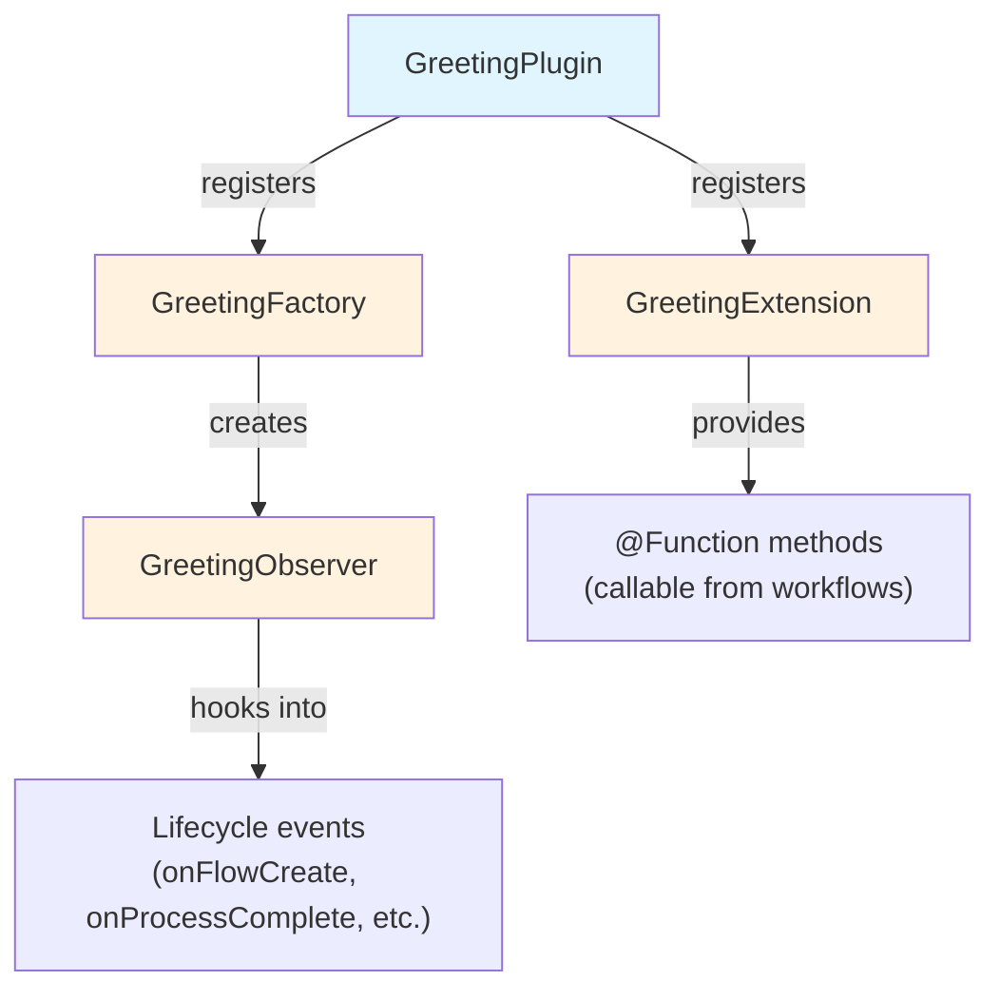

# Parte 2: Criar um Projeto de Plugin

<span class="ai-translation-notice">:material-information-outline:{ .ai-translation-notice-icon } Tradução assistida por IA - [saiba mais e sugira melhorias](https://github.com/nextflow-io/training/blob/master/TRANSLATING.md)</span>

Você viu como os plugins estendem o Nextflow com funcionalidades reutilizáveis.
Agora você vai criar o seu próprio, começando com um template de projeto que cuida da configuração de build para você.

!!! tip "Começando por aqui?"

    Se você está entrando nesta parte, copie a solução da Parte 1 para usar como ponto de partida:

    ```bash
    cp -r solutions/1-plugin-basics/* .
    ```

!!! info "Documentação oficial"

    Esta seção e as que se seguem cobrem os fundamentos do desenvolvimento de plugins.
    Para detalhes completos, consulte a [documentação oficial de desenvolvimento de plugins do Nextflow](https://www.nextflow.io/docs/latest/plugins/developing-plugins.html).

---

## 1. Criar o projeto do plugin

O comando embutido `nextflow plugin create` gera um projeto de plugin completo:

```bash
nextflow plugin create nf-greeting training
```

```console title="Output"
Plugin created successfully at path: /workspaces/training/side-quests/plugin_development/nf-greeting
```

O primeiro argumento é o nome do plugin e o segundo é o nome da sua organização (usado para organizar o código gerado em pastas).

!!! tip "Criação manual"

    Você também pode criar projetos de plugin manualmente ou usar o [template nf-hello](https://github.com/nextflow-io/nf-hello) no GitHub como ponto de partida.

---

## 2. Examinar a estrutura do projeto

Um plugin Nextflow é um software Groovy que roda dentro do Nextflow.
Ele estende as capacidades do Nextflow usando pontos de integração bem definidos, o que significa que pode trabalhar com recursos do Nextflow como canais, processos e configuração.

Antes de escrever qualquer código, veja o que o template gerou para saber onde cada coisa fica.

Entre no diretório do plugin:

```bash
cd nf-greeting
```

Liste o conteúdo:

```bash
tree
```

Você deve ver:

```console
.
├── build.gradle
├── COPYING
├── gradle
│   └── wrapper
│       ├── gradle-wrapper.jar
│       └── gradle-wrapper.properties
├── gradlew
├── Makefile
├── README.md
├── settings.gradle
└── src
    ├── main
    │   └── groovy
    │       └── training
    │           └── plugin
    │               ├── GreetingExtension.groovy
    │               ├── GreetingFactory.groovy
    │               ├── GreetingObserver.groovy
    │               └── GreetingPlugin.groovy
    └── test
        └── groovy
            └── training
                └── plugin
                    └── GreetingObserverTest.groovy

11 directories, 13 files
```

---

## 3. Explorar a configuração de build

Um plugin Nextflow é um software baseado em Java que precisa ser compilado e empacotado antes de o Nextflow poder usá-lo.
Isso requer uma ferramenta de build.

Gradle é uma ferramenta de build que compila código, executa testes e empacota software.
O template do plugin inclui um wrapper do Gradle (`./gradlew`) para que você não precise instalar o Gradle separadamente.

A configuração de build diz ao Gradle como compilar seu plugin e diz ao Nextflow como carregá-lo.
Dois arquivos são os mais importantes.

### 3.1. settings.gradle

Este arquivo identifica o projeto:

```bash
cat settings.gradle
```

```groovy title="settings.gradle"
rootProject.name = 'nf-greeting'
```

O nome aqui deve corresponder ao que você vai colocar no `nextflow.config` ao usar o plugin.

### 3.2. build.gradle

O arquivo de build é onde a maior parte da configuração acontece:

```bash
cat build.gradle
```

O arquivo contém várias seções.
A mais importante é o bloco `nextflowPlugin`:

```groovy title="build.gradle"
plugins {
    id 'io.nextflow.nextflow-plugin' version '1.0.0-beta.10'
}

version = '0.1.0'

nextflowPlugin {
    nextflowVersion = '24.10.0'       // (1)!

    provider = 'training'             // (2)!
    className = 'training.plugin.GreetingPlugin'  // (3)!
    extensionPoints = [               // (4)!
        'training.plugin.GreetingExtension',
        'training.plugin.GreetingFactory'
    ]

}
```

1. **`nextflowVersion`**: Versão mínima do Nextflow necessária
2. **`provider`**: Seu nome ou organização
3. **`className`**: A classe principal do plugin, o ponto de entrada que o Nextflow carrega primeiro
4. **`extensionPoints`**: Classes que adicionam funcionalidades ao Nextflow (suas funções, monitoramento, etc.)

O bloco `nextflowPlugin` configura:

- `nextflowVersion`: Versão mínima do Nextflow necessária
- `provider`: Seu nome ou organização
- `className`: A classe principal do plugin (o ponto de entrada que o Nextflow carrega primeiro, especificado em `build.gradle`)
- `extensionPoints`: Classes que adicionam funcionalidades ao Nextflow (suas funções, monitoramento, etc.)

### 3.3. Atualizar nextflowVersion

O template gera um valor de `nextflowVersion` que pode estar desatualizado.
Atualize-o para corresponder à versão do Nextflow instalada para garantir compatibilidade total:

=== "Depois"

    ```groovy title="build.gradle" hl_lines="2"
    nextflowPlugin {
        nextflowVersion = '25.10.0'

        provider = 'training'
    ```

=== "Antes"

    ```groovy title="build.gradle" hl_lines="2"
    nextflowPlugin {
        nextflowVersion = '24.10.0'

        provider = 'training'
    ```

---

## 4. Conhecer os arquivos-fonte

O código-fonte do plugin fica em `src/main/groovy/training/plugin/`.
Há quatro arquivos-fonte, cada um com um papel distinto:

| Arquivo                    | Papel                                                          | Modificado em     |
| -------------------------- | -------------------------------------------------------------- | ----------------- |
| `GreetingPlugin.groovy`    | Ponto de entrada que o Nextflow carrega primeiro               | Nunca (gerado)    |
| `GreetingExtension.groovy` | Define funções chamáveis a partir dos fluxos de trabalho       | Parte 3           |
| `GreetingFactory.groovy`   | Cria instâncias de observer quando um fluxo de trabalho inicia | Parte 5           |
| `GreetingObserver.groovy`  | Executa código em resposta a eventos do ciclo de vida          | Parte 5           |

Cada arquivo é apresentado em detalhes na parte listada acima, quando você o modifica pela primeira vez.
Os principais a ter em mente:

- `GreetingPlugin` é o ponto de entrada que o Nextflow carrega
- `GreetingExtension` fornece as funções que este plugin disponibiliza para os fluxos de trabalho
- `GreetingObserver` roda junto com o pipeline e responde a eventos sem exigir alterações no código do pipeline



---

## 5. Compilar, instalar e executar

O template inclui código funcional pronto para uso, então você pode compilar e executar imediatamente para verificar se o projeto está configurado corretamente.

Compile o plugin e instale-o localmente:

```bash
make install
```

`make install` compila o código do plugin e o copia para o diretório local de plugins do Nextflow (`$NXF_HOME/plugins/`), tornando-o disponível para uso.

??? example "Saída do build"

    Na primeira vez que você executar isso, o Gradle vai se baixar (isso pode levar um minuto):

    ```console
    Downloading https://services.gradle.org/distributions/gradle-8.14-bin.zip
    ...10%...20%...30%...40%...50%...60%...70%...80%...90%...100%

    Welcome to Gradle 8.14!
    ...

    Deprecated Gradle features were used in this build...

    BUILD SUCCESSFUL in 23s
    5 actionable tasks: 5 executed
    ```

    **Os avisos são esperados.**

    - **"Downloading gradle..."**: Isso só acontece na primeira vez. As compilações seguintes são muito mais rápidas.
    - **"Deprecated Gradle features..."**: Este aviso vem do template do plugin, não do seu código. Pode ser ignorado com segurança.
    - **"BUILD SUCCESSFUL"**: Isso é o que importa. Seu plugin compilou sem erros.

Volte para o diretório do pipeline:

```bash
cd ..
```

Adicione o plugin nf-greeting ao `nextflow.config`:

=== "Depois"

    ```groovy title="nextflow.config" hl_lines="4"
    // Configuração para os exercícios de desenvolvimento de plugins
    plugins {
        id 'nf-schema@2.6.1'
        id 'nf-greeting@0.1.0'
    }
    ```

=== "Antes"

    ```groovy title="nextflow.config"
    // Configuração para os exercícios de desenvolvimento de plugins
    plugins {
        id 'nf-schema@2.6.1'
    }
    ```

!!! note "Versão obrigatória para plugins locais"

    Ao usar plugins instalados localmente, você deve especificar a versão (por exemplo, `nf-greeting@0.1.0`).
    Plugins publicados no registro podem usar apenas o nome.

Execute o pipeline:

```bash
nextflow run greet.nf -ansi-log false
```

A flag `-ansi-log false` desativa a exibição animada de progresso para que toda a saída, incluindo as mensagens do observer, seja impressa em ordem.

```console title="Output"
Pipeline is starting! 🚀
[bc/f10449] Submitted process > SAY_HELLO (1)
[9a/f7bcb2] Submitted process > SAY_HELLO (2)
[6c/aff748] Submitted process > SAY_HELLO (3)
[de/8937ef] Submitted process > SAY_HELLO (4)
[98/c9a7d6] Submitted process > SAY_HELLO (5)
Output: Bonjour
Output: Hello
Output: Holà
Output: Ciao
Output: Hallo
Pipeline complete! 👋
```

(A ordem da saída e os hashes do work directory serão diferentes para você.)

As mensagens "Pipeline is starting!" e "Pipeline complete!" parecem familiares do plugin nf-hello da Parte 1, mas desta vez elas vêm do `GreetingObserver` no seu próprio plugin.
O pipeline em si não foi alterado; o observer roda automaticamente porque está registrado na factory.

---

## Conclusão

Você aprendeu que:

- O comando `nextflow plugin create` gera um projeto inicial completo
- `build.gradle` configura os metadados do plugin, as dependências e quais classes fornecem funcionalidades
- O plugin tem quatro componentes principais: Plugin (ponto de entrada), Extension (funções), Factory (cria monitores) e Observer (responde a eventos do fluxo de trabalho)
- O ciclo de desenvolvimento é: editar o código, `make install`, executar o pipeline

---

## O que vem a seguir?

Agora você vai implementar funções personalizadas na classe Extension e usá-las no fluxo de trabalho.

[Continuar para a Parte 3 :material-arrow-right:](03_custom_functions.md){ .md-button .md-button--primary }
