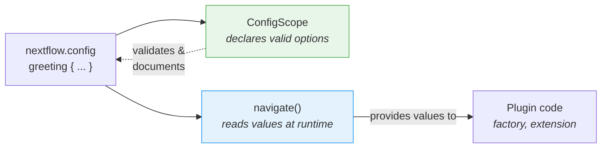

# Parte 6: Configuração

<span class="ai-translation-notice">:material-information-outline:{ .ai-translation-notice-icon } Tradução assistida por IA - [saiba mais e sugira melhorias](https://github.com/nextflow-io/training/blob/master/TRANSLATING.md)</span>

Seu plugin tem funções personalizadas e um observer, mas tudo está hardcoded.
Os usuários não conseguem desativar o contador de tarefas nem alterar o decorador sem editar o código-fonte e recompilar.

Na Parte 1, você usou os blocos `#!groovy validation {}` e `#!groovy co2footprint {}` no `nextflow.config` para controlar o comportamento do nf-schema e do nf-co2footprint.
Esses blocos de configuração existem porque os autores dos plugins construíram essa capacidade.
Nesta seção, você fará o mesmo para o seu próprio plugin.

**Objetivos:**

1. Permitir que os usuários personalizem o prefixo e o sufixo do decorador de saudações
2. Permitir que os usuários ativem ou desativem o plugin através do `nextflow.config`
3. Registrar um escopo de configuração formal para que o Nextflow reconheça o bloco `#!groovy greeting {}`

**O que você vai alterar:**

| Arquivo                    | Alteração                                                        |
| -------------------------- | ---------------------------------------------------------------- |
| `GreetingExtension.groovy` | Ler configuração de prefixo/sufixo em `init()`                   |
| `GreetingFactory.groovy`   | Ler valores de configuração para controlar a criação do observer |
| `GreetingConfig.groovy`    | Novo arquivo: classe formal `@ConfigScope`                       |
| `build.gradle`             | Registrar a classe de configuração como um extension point       |
| `nextflow.config`          | Adicionar um bloco `#!groovy greeting {}` para testá-lo          |

!!! tip "Começando a partir daqui?"

    Se você está entrando nesta parte agora, copie a solução da Parte 5 para usar como ponto de partida:

    ```bash
    cp -r solutions/5-observers/* .
    ```

!!! info "Documentação oficial"

    Para detalhes abrangentes sobre configuração, consulte a [documentação de escopos de configuração do Nextflow](https://nextflow.io/docs/latest/developer/config-scopes.html).

---

## 1. Tornar o decorador configurável

A função `decorateGreeting` envolve cada saudação com `*** ... ***`.
Os usuários podem querer marcadores diferentes, mas atualmente a única forma de alterá-los é editar o código-fonte e recompilar.

A sessão do Nextflow fornece um método chamado `session.config.navigate()` que lê valores aninhados do `nextflow.config`:

```groovy
// Lê 'greeting.prefix' do nextflow.config, usando '***' como padrão
final prefix = session.config.navigate('greeting.prefix', '***') as String
```

Isso corresponde a um bloco de configuração no `nextflow.config` do usuário:

```groovy title="nextflow.config"
greeting {
    prefix = '>>>'
}
```

### 1.1. Adicionar a leitura de configuração (isso vai falhar!)

Edite `GreetingExtension.groovy` para ler a configuração em `init()` e usá-la em `decorateGreeting()`:

```groovy title="GreetingExtension.groovy" linenums="35" hl_lines="7-8 18"
@CompileStatic
class GreetingExtension extends PluginExtensionPoint {

    @Override
    protected void init(Session session) {
        // Lê a configuração com valores padrão
        prefix = session.config.navigate('greeting.prefix', '***') as String
        suffix = session.config.navigate('greeting.suffix', '***') as String
    }

    // ... outros métodos sem alteração ...

    /**
    * Decora uma saudação com marcadores comemorativos
    */
    @Function
    String decorateGreeting(String greeting) {
        return "${prefix} ${greeting} ${suffix}"
    }
```

Tente compilar:

```bash
cd nf-greeting && make assemble
```

### 1.2. Observar o erro

A compilação falha:

```console
> Task :compileGroovy FAILED
GreetingExtension.groovy: 30: [Static type checking] - The variable [prefix] is undeclared.
 @ line 30, column 9.
           prefix = session.config.navigate('greeting.prefix', '***') as String
           ^

GreetingExtension.groovy: 31: [Static type checking] - The variable [suffix] is undeclared.
```

Em Groovy (e Java), você deve _declarar_ uma variável antes de usá-la.
O código tenta atribuir valores a `prefix` e `suffix`, mas a classe não tem campos com esses nomes.

### 1.3. Corrigir declarando variáveis de instância

Adicione as declarações de variáveis no início da classe, logo após a chave de abertura:

```groovy title="GreetingExtension.groovy" linenums="35" hl_lines="4-5"
@CompileStatic
class GreetingExtension extends PluginExtensionPoint {

    private String prefix = '***'
    private String suffix = '***'

    @Override
    protected void init(Session session) {
        // Lê a configuração com valores padrão
        prefix = session.config.navigate('greeting.prefix', '***') as String
        suffix = session.config.navigate('greeting.suffix', '***') as String
    }

    // ... restante da classe sem alteração ...
```

Essas duas linhas declaram **variáveis de instância** (também chamadas de campos) que pertencem a cada objeto `GreetingExtension`.
A palavra-chave `private` significa que apenas o código dentro desta classe pode acessá-las.
Cada variável é inicializada com um valor padrão de `'***'`.

Quando o plugin é carregado, o Nextflow chama o método `init()`, que sobrescreve esses padrões com o que o usuário definiu no `nextflow.config`.
Se o usuário não definiu nada, `navigate()` retorna o mesmo valor padrão, então o comportamento não muda.
O método `decorateGreeting()` então lê esses campos cada vez que é executado.

!!! tip "Aprendendo com os erros"

    Esse padrão de "declarar antes de usar" é fundamental em Java/Groovy, mas pode ser desconhecido para quem vem do Python ou R, onde as variáveis passam a existir no momento em que são atribuídas pela primeira vez.
    Vivenciar esse erro uma vez ajuda a reconhecê-lo e corrigi-lo rapidamente no futuro.

### 1.4. Compilar e testar

Compile e instale:

```bash
make install && cd ..
```

Atualize o `nextflow.config` para personalizar a decoração:

=== "Depois"

    ```groovy title="nextflow.config" hl_lines="7-10"
    // Configuração para exercícios de desenvolvimento de plugins
    plugins {
        id 'nf-schema@2.6.1'
        id 'nf-greeting@0.1.0'
    }

    greeting {
        prefix = '>>>'
        suffix = '<<<'
    }
    ```

=== "Antes"

    ```groovy title="nextflow.config"
    // Configuração para exercícios de desenvolvimento de plugins
    plugins {
        id 'nf-schema@2.6.1'
        id 'nf-greeting@0.1.0'
    }
    ```

Execute o pipeline:

```bash
nextflow run greet.nf -ansi-log false
```

```console title="Output (partial)"
Decorated: >>> Hello <<<
Decorated: >>> Bonjour <<<
...
```

O decorador agora usa o prefixo e o sufixo personalizados do arquivo de configuração.

Note que o Nextflow exibe um aviso de "Unrecognized config option" porque nada declarou `greeting` como um escopo válido ainda.
O valor ainda é lido corretamente via `navigate()`, mas o Nextflow o sinaliza como não reconhecido.
Você vai corrigir isso na Seção 3.

---

## 2. Tornar o contador de tarefas configurável

A factory de observers atualmente cria observers incondicionalmente.
Os usuários devem ser capazes de desativar o plugin inteiramente através da configuração.

A factory tem acesso à sessão do Nextflow e à sua configuração, portanto é o lugar certo para ler a configuração `enabled` e decidir se deve criar observers.

=== "Depois"

    ```groovy title="GreetingFactory.groovy" linenums="31" hl_lines="3-4"
    @Override
    Collection<TraceObserver> create(Session session) {
        final enabled = session.config.navigate('greeting.enabled', true)
        if (!enabled) return []

        return [
            new GreetingObserver(),
            new TaskCounterObserver()
        ]
    }
    ```

=== "Antes"

    ```groovy title="GreetingFactory.groovy" linenums="31"
    @Override
    Collection<TraceObserver> create(Session session) {
        return [
            new GreetingObserver(),
            new TaskCounterObserver()
        ]
    }
    ```

A factory agora lê `greeting.enabled` da configuração e retorna uma lista vazia se o usuário definiu como `false`.
Quando a lista está vazia, nenhum observer é criado, então os hooks de ciclo de vida do plugin são silenciosamente ignorados.

### 2.1. Compilar e testar

Recompile e instale o plugin:

```bash
cd nf-greeting && make install && cd ..
```

Execute o pipeline para confirmar que tudo ainda funciona:

```bash
nextflow run greet.nf -ansi-log false
```

??? exercise "Desativar o plugin inteiramente"

    Tente definir `greeting.enabled = false` no `nextflow.config` e execute o pipeline novamente.
    O que muda na saída?

    ??? solution "Solução"

        ```groovy title="nextflow.config" hl_lines="8"
        // Configuração para exercícios de desenvolvimento de plugins
        plugins {
            id 'nf-schema@2.6.1'
            id 'nf-greeting@0.1.0'
        }

        greeting {
            enabled = false
        }
        ```

        As mensagens "Pipeline is starting!", "Pipeline complete!" e a contagem de tarefas desaparecem porque a factory retorna uma lista vazia quando `enabled` é false.
        O pipeline em si ainda é executado, mas nenhum observer está ativo.

        Lembre-se de definir `enabled` de volta para `true` (ou remover a linha) antes de continuar.

---

## 3. Configuração formal com ConfigScope

A configuração do seu plugin funciona, mas o Nextflow ainda exibe avisos de "Unrecognized config option".
Isso acontece porque `session.config.navigate()` apenas lê valores; nada informou ao Nextflow que `greeting` é um escopo de configuração válido.

Uma classe `ConfigScope` preenche essa lacuna.
Ela declara quais opções seu plugin aceita, seus tipos e seus valores padrão.
Ela **não** substitui suas chamadas `navigate()`. Em vez disso, funciona em conjunto com elas:



Sem uma classe `ConfigScope`, `navigate()` ainda funciona, mas:

- O Nextflow avisa sobre opções não reconhecidas (como você já viu)
- Sem autocompletar no IDE para usuários escrevendo `nextflow.config`
- As opções de configuração não são autodocumentadas
- A conversão de tipos é manual (`as String`, `as boolean`)

Registrar uma classe de escopo de configuração formal corrige o aviso e resolve os três problemas.
Esse é o mesmo mecanismo por trás dos blocos `#!groovy validation {}` e `#!groovy co2footprint {}` que você usou na Parte 1.

### 3.1. Criar a classe de configuração

Crie um novo arquivo:

```bash
touch nf-greeting/src/main/groovy/training/plugin/GreetingConfig.groovy
```

Adicione a classe de configuração com todas as três opções:

```groovy title="GreetingConfig.groovy" linenums="1"
package training.plugin

import nextflow.config.spec.ConfigOption
import nextflow.config.spec.ConfigScope
import nextflow.config.spec.ScopeName
import nextflow.script.dsl.Description

/**
 * Opções de configuração para o plugin nf-greeting.
 *
 * Os usuários configuram isso no nextflow.config:
 *
 *     greeting {
 *         enabled = true
 *         prefix = '>>>'
 *         suffix = '<<<'
 *     }
 */
@ScopeName('greeting')                       // (1)!
class GreetingConfig implements ConfigScope { // (2)!

    GreetingConfig() {}

    GreetingConfig(Map opts) {               // (3)!
        this.enabled = opts.enabled as Boolean ?: true
        this.prefix = opts.prefix as String ?: '***'
        this.suffix = opts.suffix as String ?: '***'
    }

    @ConfigOption                            // (4)!
    @Description('Enable or disable the plugin entirely')
    boolean enabled = true

    @ConfigOption
    @Description('Prefix for decorated greetings')
    String prefix = '***'

    @ConfigOption
    @Description('Suffix for decorated greetings')
    String suffix = '***'
}
```

1. Mapeia para o bloco `#!groovy greeting { }` no `nextflow.config`
2. Interface obrigatória para classes de configuração
3. Tanto o construtor sem argumentos quanto o construtor Map são necessários para o Nextflow instanciar a configuração
4. `@ConfigOption` marca um campo como uma opção de configuração; `@Description` o documenta para ferramentas

Pontos principais:

- **`@ScopeName('greeting')`**: Mapeia para o bloco `greeting { }` na configuração
- **`implements ConfigScope`**: Interface obrigatória para classes de configuração
- **`@ConfigOption`**: Cada campo se torna uma opção de configuração
- **`@Description`**: Documenta cada opção para suporte ao language server (importado de `nextflow.script.dsl`)
- **Construtores**: Tanto o construtor sem argumentos quanto o construtor Map são necessários

### 3.2. Registrar a classe de configuração

Criar a classe não é suficiente por si só.
O Nextflow precisa saber que ela existe, então você a registra no `build.gradle` junto com os outros extension points.

=== "Depois"

    ```groovy title="build.gradle" hl_lines="4"
    extensionPoints = [
        'training.plugin.GreetingExtension',
        'training.plugin.GreetingFactory',
        'training.plugin.GreetingConfig'
    ]
    ```

=== "Antes"

    ```groovy title="build.gradle"
    extensionPoints = [
        'training.plugin.GreetingExtension',
        'training.plugin.GreetingFactory'
    ]
    ```

Note a diferença entre o registro da factory e dos extension points:

- **`extensionPoints` no `build.gradle`**: Registro em tempo de compilação. Informa ao sistema de plugins do Nextflow quais classes implementam extension points.
- **Método `create()` da factory**: Registro em tempo de execução. A factory cria instâncias de observers quando um fluxo de trabalho realmente inicia.

### 3.3. Compilar e testar

```bash
cd nf-greeting && make install && cd ..
nextflow run greet.nf -ansi-log false
```

O comportamento do pipeline é idêntico, mas o aviso "Unrecognized config option" desapareceu.

!!! note "O que mudou e o que não mudou"

    Sua `GreetingFactory` e `GreetingExtension` ainda usam `session.config.navigate()` para ler valores em tempo de execução.
    Nenhum desse código foi alterado.
    A classe `ConfigScope` é uma declaração paralela que informa ao Nextflow quais opções existem.
    Ambas as partes são necessárias: `ConfigScope` declara, `navigate()` lê.

Seu plugin agora tem a mesma estrutura que os plugins que você usou na Parte 1.
Quando o nf-schema expõe um bloco `#!groovy validation {}` ou o nf-co2footprint expõe um bloco `#!groovy co2footprint {}`, eles usam exatamente esse padrão: uma classe `ConfigScope` com campos anotados, registrada como um extension point.
Seu bloco `#!groovy greeting {}` funciona da mesma forma.

---

## Conclusão

Você aprendeu que:

- `session.config.navigate()` **lê** valores de configuração em tempo de execução
- Classes `@ConfigScope` **declaram** quais opções de configuração existem; elas funcionam em conjunto com `navigate()`, não em substituição a ele
- A configuração pode ser aplicada tanto a observers quanto a funções de extensão
- Variáveis de instância devem ser declaradas antes de serem usadas em Groovy/Java; `init()` as preenche a partir da configuração quando o plugin é carregado

| Caso de uso                                   | Abordagem recomendada                                                   |
| --------------------------------------------- | ----------------------------------------------------------------------- |
| Protótipo rápido ou plugin simples            | Apenas `session.config.navigate()`                                      |
| Plugin de produção com muitas opções          | Adicionar uma classe `ConfigScope` junto com suas chamadas `navigate()` |
| Plugin que você vai compartilhar publicamente | Adicionar uma classe `ConfigScope` junto com suas chamadas `navigate()` |

---

## O que vem a seguir?

Seu plugin agora tem todas as peças de um plugin de produção: funções personalizadas, trace observers e configuração voltada ao usuário.
O passo final é empacotá-lo para distribuição.

[Continuar para o Resumo :material-arrow-right:](summary.md){ .md-button .md-button--primary }
