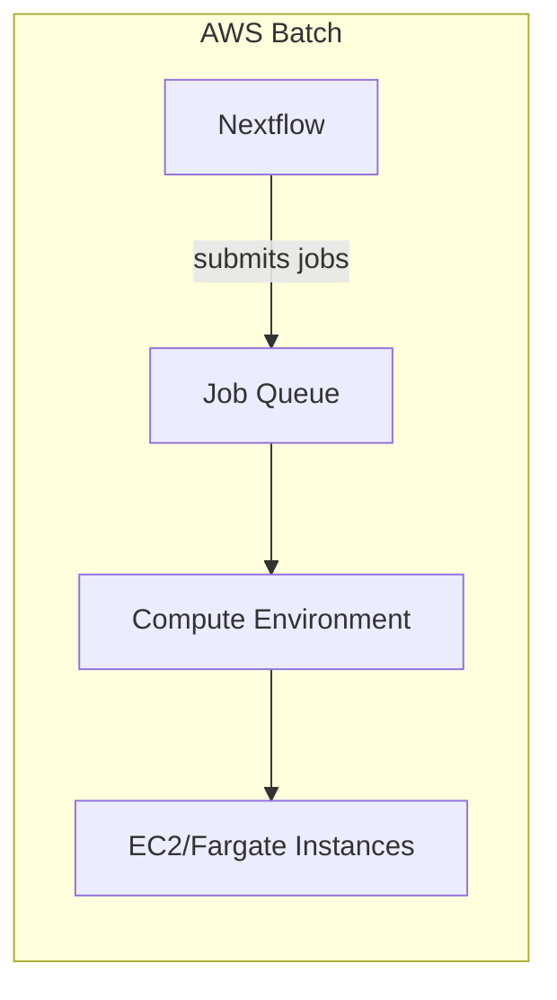
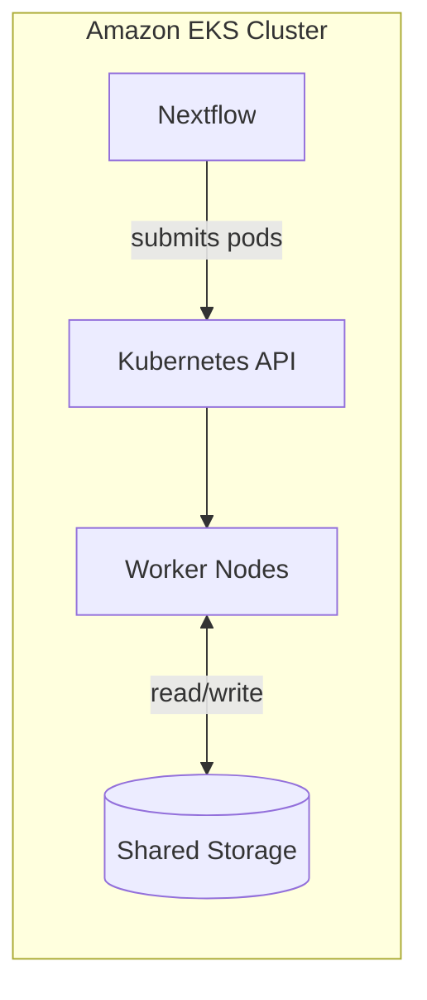

# Running on cloud executors

One of Nextflow's greatest strengths is its ability to run the same pipeline on different computing infrastructures without changing the pipeline code.
This side quest explores how executors work and how to configure your pipelines for cloud execution with AWS Batch and Amazon EKS.

### Learning goals

In this side quest, you'll learn how Nextflow executors abstract away infrastructure details and how to configure your pipelines for cloud execution.

By the end of this side quest, you'll be able to:

- Understand what executors are and why they matter
- List the major executor options available in Nextflow
- Configure AWS Batch executor settings
- Configure Kubernetes executor settings for Amazon EKS
- Use profiles to support multiple execution environments
- Understand cloud storage integration with S3
- Apply best practices for cost management and debugging

!!! note "This is a conceptual lesson"

    This side quest focuses on understanding concepts and configuration patterns.
    You don't need an AWS account to follow along - we'll examine configuration files and discuss how they work.

### Prerequisites

Before taking on this side quest, you should:

- Have completed the [Hello Nextflow](../../hello_nextflow/) tutorial or equivalent beginner's course
- Be comfortable with Nextflow configuration basics (nextflow.config, profiles)

---

## 0. Get started

#### Open the training codespace

If you haven't yet done so, make sure to open the training environment as described in the [Environment Setup](../envsetup/index.md).

[](https://codespaces.new/nextflow-io/training?quickstart=1&ref=master)

#### Move into the project directory

Let's move into the directory where the files for this tutorial are located.

```bash
cd side-quests/cloud_executors
```

#### Review the materials

You'll find a simple workflow and a set of configuration files demonstrating different execution environments.

```console title="Directory contents"
.
├── conf
│   ├── aws.config
│   ├── base.config
│   ├── eks.config
│   └── local.config
├── greetings.csv
├── main.nf
└── nextflow.config
```

#### Readiness checklist

- [ ] I understand this is a conceptual lesson about cloud execution
- [ ] My codespace is up and running
- [ ] I've set my working directory appropriately

---

## 1. Understanding executors

### 1.1. What are executors?

An **executor** determines where and how your pipeline tasks run.
When Nextflow executes a process, the executor handles:

- Submitting the task to the computing platform
- Monitoring task status
- Retrieving results and logs
- Managing resources (CPUs, memory)

The beauty of Nextflow's executor abstraction is that your pipeline code stays the same regardless of where it runs.
Only the configuration changes.

### 1.2. Local execution

By default, Nextflow uses the `local` executor, which runs tasks on your current machine:

```groovy title="Local executor (default)"
executor {
    name = 'local'
    cpus = 4
    memory = '8.GB'
}
```

This is what you've been using throughout Hello Nextflow.

### 1.3. Available executors

Nextflow supports many executors for different platforms:

| Executor       | Platform     | Use Case                        |
| -------------- | ------------ | ------------------------------- |
| `local`        | Your machine | Development, small jobs         |
| `slurm`        | HPC clusters | Academic/research computing     |
| `sge`          | HPC clusters | Grid Engine systems             |
| `pbs`          | HPC clusters | PBS/Torque systems              |
| `lsf`          | HPC clusters | LSF systems                     |
| `awsbatch`     | AWS          | Cloud computing on AWS          |
| `google-batch` | GCP          | Cloud computing on Google Cloud |
| `azurebatch`   | Azure        | Cloud computing on Azure        |
| `k8s`          | Kubernetes   | Container orchestration         |

Each executor has its own configuration options, but the core concepts are the same.

### Takeaway

Executors abstract away infrastructure details, letting you run the same pipeline on laptops, HPC clusters, or cloud platforms with only configuration changes.

### What's next?

Let's dive into AWS Batch, one of the most popular cloud executors.

---

## 2. AWS Batch fundamentals

### 2.1. What is AWS Batch?

AWS Batch is a managed service that runs containerized workloads on AWS.
It automatically provisions compute resources based on your job requirements.



### 2.2. Key AWS Batch concepts

**Compute Environment**: The infrastructure (EC2 instances or Fargate) where jobs run.
You define instance types, min/max vCPUs, and scaling policies.

**Job Queue**: Where jobs wait to be scheduled.
Queues are associated with one or more compute environments.

**Job Definition**: A template describing how to run a job (container image, resources, etc.).
Nextflow creates these automatically.

### 2.3. How Nextflow integrates

When you run a Nextflow pipeline with AWS Batch:

1. Nextflow translates each process task into an AWS Batch job
2. Jobs are submitted to your specified queue
3. AWS Batch provisions compute resources as needed
4. Containers run your process scripts
5. Results are written to S3
6. Nextflow monitors job status and retrieves outputs

### Takeaway

AWS Batch manages compute provisioning automatically.
You just need to set up the infrastructure once, then Nextflow handles job submission and monitoring.

### What's next?

Let's look at how to configure Nextflow for AWS Batch execution.

---

## 3. Configuring AWS Batch

### 3.1. Essential configuration

The minimum configuration for AWS Batch requires:

```groovy title="Minimal AWS Batch config"
executor {
    name = 'awsbatch'
    queueName = 'my-batch-queue'
}

aws {
    region = 'us-east-1'
}

workDir = 's3://my-bucket/work'

process {
    container = 'ubuntu:22.04'
}
```

Let's break down each part.

### 3.2. AWS authentication

Nextflow needs AWS credentials to submit jobs and access S3.
It uses the standard AWS credential chain, so any of these methods work:

**Option 1: Environment variables**

```bash
export AWS_ACCESS_KEY_ID=your-access-key
export AWS_SECRET_ACCESS_KEY=your-secret-key
export AWS_DEFAULT_REGION=us-east-1

nextflow run main.nf -profile aws
```

**Option 2: AWS credentials file**

If you've configured the AWS CLI (`aws configure`), Nextflow will use credentials from `~/.aws/credentials` automatically.

**Option 3: IAM instance profile**

If running Nextflow on an EC2 instance, it can use the instance's IAM role - no explicit credentials needed.

!!! tip "Separate credentials for Nextflow vs jobs"

    Nextflow needs credentials to *submit* jobs and access S3 from where you run it.
    The `jobRole` setting (covered below) controls what permissions the *jobs themselves* have when they run on Batch.

### 3.3. Executor settings

```groovy
executor {
    name = 'awsbatch'
    queueName = 'my-batch-queue'
}
```

- `name = 'awsbatch'`: Tells Nextflow to use the AWS Batch executor
- `queueName`: The AWS Batch job queue to submit jobs to

### 3.4. AWS settings

```groovy
aws {
    region = 'us-east-1'
    batch {
        jobRole = 'arn:aws:iam::123456789:role/nextflow-batch-role'
    }
}
```

- `region`: The AWS region where your Batch infrastructure lives
- `jobRole`: IAM role that jobs assume (needs S3 access at minimum)

### 3.5. Work directory

```groovy
workDir = 's3://my-bucket/work'
```

This is critical for cloud execution.
AWS Batch jobs need a shared filesystem to pass data between tasks.
S3 provides this.

!!! warning "Local workDir won't work"

    Unlike local execution, you cannot use a local work directory with AWS Batch.
    Jobs run on different machines and need shared storage.

### 3.6. Container requirement

```groovy
process {
    container = 'ubuntu:22.04'
}
```

AWS Batch runs everything in containers.
Every process must have a container specified, either globally or per-process.

### 3.7. Examine the example config

Look at the AWS config file in the example:

```bash
cat conf/aws.config
```

This shows a more complete configuration with optional features like Fusion and Wave.

### Takeaway

AWS Batch configuration requires:

- Executor name and queue
- AWS region and IAM role
- S3 work directory
- Container definitions

### What's next?

AWS Batch is great for many workloads, but Amazon EKS offers an alternative approach using Kubernetes.
Let's explore that option.

---

## 4. Amazon EKS fundamentals

!!! warning "EKS requires more setup than AWS Batch"

    If you're new to cloud execution, **start with AWS Batch**.
    It's simpler to set up and requires less infrastructure knowledge.

    EKS is primarily useful when your organization already runs Kubernetes clusters and wants to add Nextflow workloads to existing infrastructure.

### 4.1. What is Kubernetes?

Kubernetes (often abbreviated as "K8s") is a system for running and managing containerized applications across multiple machines.
Think of it as an orchestration layer that decides where and how to run your containers.

**Key Kubernetes concepts you'll encounter:**

- **Pod**: The basic unit of work in Kubernetes - a wrapper around one or more containers. In Nextflow terms, each process task runs as a pod.
- **Namespace**: A way to organize and isolate resources within a cluster (like folders for your Kubernetes objects).
- **Service Account**: An identity that pods use to interact with the Kubernetes API and access resources.
- **Persistent Volume (PV)**: Storage that exists independently of any pod - like a shared disk.
- **Persistent Volume Claim (PVC)**: A request for storage that pods use to access a Persistent Volume.

Amazon EKS is AWS's managed Kubernetes service - it handles the complex parts of running Kubernetes while you focus on your workloads.

### 4.2. How Nextflow uses Kubernetes



When you run a Nextflow pipeline on Kubernetes:

1. Nextflow talks to the Kubernetes API to create pods
2. Each process task becomes a separate pod
3. All pods access the same shared storage (so they can pass data between tasks)
4. Nextflow monitors pod status and collects results

The critical requirement is **shared storage** - because tasks run on different machines, they need a common place to read inputs and write outputs.

### 4.3. When to use EKS vs AWS Batch

**Choose AWS Batch when:**

- You're new to cloud execution
- You want the simplest setup
- You don't have existing Kubernetes infrastructure

**Choose EKS when:**

- Your organization already runs Kubernetes clusters
- You want to consolidate Nextflow workloads with other K8s applications
- Your team is comfortable with Kubernetes administration
- You need to run on multiple cloud providers with similar configuration

### Takeaway

EKS lets you run Nextflow on Kubernetes infrastructure.
It's more complex than AWS Batch but useful if you already have Kubernetes expertise and infrastructure.

### What's next?

Let's look at how to configure Nextflow for EKS execution.

---

## 5. Configuring Amazon EKS

This section covers two parts:

1. **Nextflow configuration** - what you put in `nextflow.config` (this is your responsibility)
2. **Kubernetes infrastructure** - the cluster setup (typically handled by your Kubernetes administrator)

For complete details, see the [Nextflow Kubernetes documentation](https://www.nextflow.io/docs/latest/kubernetes.html).

### 5.1. The Nextflow configuration

From Nextflow's perspective, the configuration is straightforward:

```groovy title="Minimal EKS config"
process {
    executor = 'k8s'
    container = 'ubuntu:22.04'
}

k8s {
    namespace = 'nextflow'
    serviceAccount = 'nextflow-sa'
    storageClaimName = 'nextflow-pvc'
    storageMountPath = '/workspace'
}

workDir = '/workspace/work'
```

Let's break down what each setting does:

| Setting | Purpose |
|---------|---------|
| `executor = 'k8s'` | Tells Nextflow to submit tasks as Kubernetes pods instead of running locally |
| `container` | Required - every task runs in a container on Kubernetes |
| `namespace` | Which Kubernetes namespace to create pods in (your admin will tell you this) |
| `serviceAccount` | The identity your pods use (your admin will create this) |
| `storageClaimName` | The name of the shared storage (your admin will set this up) |
| `storageMountPath` | Where the shared storage appears inside containers |
| `workDir` | Where Nextflow stores intermediate files (must be on the shared storage) |

See the [Nextflow configuration reference](https://www.nextflow.io/docs/latest/reference/config.html#scope-k8s) for all available `k8s` scope options.

### 5.2. What you need from your Kubernetes administrator

This guide assumes you have an EKS cluster already set up.
Before you can run Nextflow pipelines, ask your Kubernetes administrator to provide:

| You need | What it is | Example value |
|----------|------------|---------------|
| **Namespace** | Where your pods will run | `nextflow` |
| **Service account** | Identity with permission to create pods | `nextflow-sa` |
| **Storage claim name** | Shared storage accessible by all pods | `nextflow-pvc` |

Your administrator will need to set up:

- Shared storage with `ReadWriteMany` access (typically [Amazon EFS](https://aws.amazon.com/efs/))
- A service account with permissions to create and monitor pods

For infrastructure setup details, see the [Nextflow Kubernetes documentation](https://www.nextflow.io/docs/latest/kubernetes.html#requirements).

### 5.3. Running pipelines on EKS

To run a pipeline on EKS, you need access to the Kubernetes cluster.
This typically means having `kubectl` configured on your machine:

```bash
# Verify you can connect to the cluster
kubectl cluster-info

# Run the pipeline
nextflow run main.nf -profile eks
```

Your Kubernetes administrator can help you set up `kubectl` access if you don't have it.

### 5.4. Simplifying EKS with Seqera Platform

If you use Seqera Platform, you can leverage Fusion to access S3 directly without needing shared filesystem infrastructure like EFS.
This significantly simplifies the setup.

With Fusion enabled through Platform, your configuration becomes:

```groovy title="EKS config with Fusion (Platform users)"
process {
    executor = 'k8s'
    container = 'ubuntu:22.04'
}

k8s {
    namespace = 'nextflow'
    serviceAccount = 'nextflow-sa'
}

wave.enabled = true
fusion.enabled = true

workDir = 's3://my-bucket/work'
```

This approach requires IRSA (IAM Roles for Service Accounts) to grant S3 access to pods.
See the [Seqera Fusion documentation](https://docs.seqera.io/fusion) for setup details.

### Takeaway

Running Nextflow on EKS involves:

- **For pipeline developers**: A simple Nextflow config pointing to namespace, service account, and storage
- **For administrators**: Setting up shared storage (EFS) and service account permissions

If your organization already has Kubernetes infrastructure and expertise, EKS can be a good choice.
Otherwise, AWS Batch is simpler to get started with.

### What's next?

Let's see how to use profiles to switch between local, AWS Batch, and EKS execution.

---

## 6. Using profiles

### 6.1. Why profiles?

Profiles let you maintain multiple configurations in one file and switch between them at runtime.
This is essential for:

- Developing locally, running in production on cloud
- Testing with small resources, scaling up for real runs
- Supporting multiple cloud environments

### 6.2. Profile structure

Look at the main config file:

```bash
cat nextflow.config
```

```groovy title="nextflow.config"
// Include modular config files
includeConfig 'conf/base.config'

// Profile definitions
profiles {
    local {
        includeConfig 'conf/local.config'
    }
    aws {
        includeConfig 'conf/aws.config'
    }
    eks {
        includeConfig 'conf/eks.config'
    }
}
```

### 6.3. Running with profiles

To use a specific profile:

```bash
# Run locally (you can test this)
nextflow run main.nf -profile local

# Run on AWS Batch (requires AWS setup)
nextflow run main.nf -profile aws

# Run on EKS (requires EKS cluster access)
nextflow run main.nf -profile eks
```

You can also combine profiles:

```bash
nextflow run main.nf -profile aws,debug
```

### 6.4. Config file organization

A common pattern for production pipelines:

```
conf/
├── base.config      # Common settings (error handling, default resources)
├── local.config     # Local development settings
├── aws.config       # AWS Batch settings
├── eks.config       # Amazon EKS settings
├── slurm.config     # HPC cluster settings
└── test.config      # CI/CD testing settings
```

### Takeaway

Profiles provide clean separation between environments.
Use `includeConfig` to organize settings into modular files.

### What's next?

Let's explore cloud storage integration.

---

## 7. Cloud storage with S3

### 7.1. Why S3 for cloud execution?

When running on AWS Batch or EKS:

- Tasks run on ephemeral compute instances
- Instances may be in different availability zones
- Local storage doesn't persist between tasks

S3 provides:

- Shared storage accessible from any instance
- Durability and availability
- Integration with AWS security (IAM)

### 7.2. Configuring S3 work directory

```groovy
workDir = 's3://my-bucket/nextflow-work'
```

Nextflow automatically:

- Stages input files from S3 to the container
- Writes output files back to S3
- Manages the work directory structure

### 7.3. Publishing results to S3

You can publish final results to S3:

```groovy
process MY_PROCESS {
    publishDir 's3://my-bucket/results', mode: 'copy'

    // ...
}
```

Or using workflow outputs:

```groovy
output {
    directory 's3://my-bucket/results'
    // ...
}
```

### 7.4. Fusion filesystem

Fusion is a POSIX-compatible filesystem that provides faster S3 access:

```groovy
fusion {
    enabled = true
}

wave {
    enabled = true  // Required for Fusion
}
```

Benefits:

- No explicit staging - files appear as local paths
- Better performance for large files
- Reduced S3 API calls

!!! tip "Fusion requires Wave"

    Fusion works by injecting a filesystem layer into your containers.
    This requires the Wave container service to build custom container images.

### Takeaway

S3 is essential for both AWS Batch and EKS execution.
Fusion can improve performance by providing transparent S3 access.

### What's next?

Let's discuss practical considerations for cloud execution.

---

## 8. Practical considerations

### 8.1. Cost management

Cloud execution costs money. Key strategies:

**Use Spot Instances**

Spot instances cost up to 90% less than on-demand:

```groovy
aws {
    batch {
        spot = true
    }
}
```

!!! warning "Spot instance interruption"

    Spot instances can be terminated with 2 minutes notice.
    Nextflow handles this automatically with retries, but you should configure appropriate retry strategies.

**Set resource limits**

```groovy
process {
    cpus = 2
    memory = '4.GB'

    withLabel: 'intensive' {
        cpus = 16
        memory = '64.GB'
    }
}
```

**Monitor with Seqera Platform**

The Seqera Platform provides cost tracking and optimization insights.

### 8.2. Debugging cloud jobs

When things go wrong on the cloud:

**Check Nextflow logs**

```bash
cat .nextflow.log
```

**Check AWS Batch console**

The AWS Batch console shows job status, logs, and failure reasons.

**Enable detailed logging**

```bash
nextflow run main.nf -profile aws -with-trace -with-report
```

**Common issues:**

| Symptom                | Likely Cause                        |
| ---------------------- | ----------------------------------- |
| Jobs stuck in RUNNABLE | Compute environment has no capacity |
| Permission denied      | IAM role missing S3 permissions     |
| Container not found    | Image not in ECR or public registry |
| Out of memory          | Process needs more memory           |

### 8.3. Resume behavior

Resume works the same on cloud as locally:

```bash
nextflow run main.nf -profile aws -resume
```

The S3 work directory preserves intermediate results, so you don't re-run completed tasks.

### 8.4. Seqera Platform integration

For production cloud pipelines, consider Seqera Platform:

- Web-based monitoring and management
- Launch pipelines from a UI
- Cost tracking and optimization
- Team collaboration features

### Takeaway

Cloud execution requires attention to costs, debugging, and infrastructure setup.
Use spot instances, set appropriate resources, and leverage monitoring tools.

### What's next?

Let's summarize what we've learned.

---

## Summary

### Configuration checklists

**Before running on AWS Batch**, ensure you have:

- [ ] AWS account with Batch, S3, and IAM configured
- [ ] Batch compute environment created
- [ ] Batch job queue created
- [ ] S3 bucket for work directory
- [ ] IAM role with S3 and Batch permissions
- [ ] Nextflow config with executor, AWS, and workDir settings
- [ ] Container images accessible (ECR or public registry)

**Before running on Amazon EKS**, ensure you have:

- [ ] Access to an EKS cluster (via `kubectl`)
- [ ] Namespace, service account, and storage claim name from your administrator
- [ ] Nextflow config with `k8s` executor settings
- [ ] Container images accessible (ECR or public registry)

### Key configuration patterns

**Minimal AWS Batch config:**

```groovy
executor {
    name = 'awsbatch'
    queueName = 'my-queue'
}

aws.region = 'us-east-1'
workDir = 's3://my-bucket/work'
process.container = 'my-image:latest'
```

**Minimal EKS config:**

```groovy
process.executor = 'k8s'
process.container = 'my-image:latest'

k8s {
    namespace = 'nextflow'
    serviceAccount = 'nextflow-sa'
    storageClaimName = 'nextflow-pvc'
    storageMountPath = '/workspace'
}

workDir = '/workspace/work'
```

**With profiles:**

```groovy
profiles {
    local { process.executor = 'local' }
    aws {
        process.executor = 'awsbatch'
        executor.queueName = 'my-queue'
        workDir = 's3://bucket/work'
    }
    eks {
        process.executor = 'k8s'
        k8s.namespace = 'nextflow'
        k8s.storageClaimName = 'nextflow-pvc'
        workDir = '/workspace/work'
    }
}
```

### When to use cloud execution

| Scenario                        | Recommendation                     |
| ------------------------------- | ---------------------------------- |
| Development and testing         | Local executor                     |
| Small datasets, limited compute | Local or small HPC                 |
| Large datasets, need to scale   | Cloud (AWS Batch, EKS, GKE)        |
| Existing Kubernetes cluster     | EKS, GKE, or generic k8s executor  |
| Existing HPC infrastructure     | SLURM, PBS, etc.                   |
| Burst capacity beyond HPC       | Hybrid cloud                       |

### Additional resources

- [Nextflow AWS Batch documentation](https://www.nextflow.io/docs/latest/aws.html)
- [Nextflow Kubernetes documentation](https://www.nextflow.io/docs/latest/kubernetes.html)
- [AWS Batch user guide](https://docs.aws.amazon.com/batch/)
- [Amazon EKS user guide](https://docs.aws.amazon.com/eks/)
- [Amazon EFS CSI driver](https://docs.aws.amazon.com/eks/latest/userguide/efs-csi.html)
- [Seqera Platform](https://seqera.io/platform/)

---

## What's next?

Congratulations on completing this side quest!
You now understand how Nextflow executors work and how to configure pipelines for cloud execution with AWS Batch and Amazon EKS.

While this lesson was conceptual, you have the knowledge to set up cloud execution when you have access to AWS infrastructure.

Return to the [Side Quests](./index.md) menu to continue your training journey.
