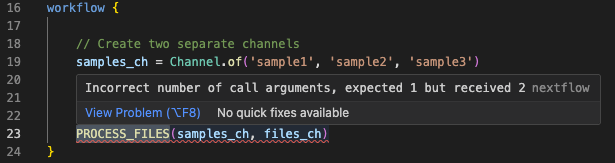

# Debugging Nextflow Workflows

Debugging is a critical skill that can save you hours of frustration and help you become a more effective Nextflow developer. Throughout your career, especially when you're starting out, you'll encounter bugs while building and maintaining your workflows. Learning systematic debugging approaches will help you identify and resolve issues quickly.

## What you should know first

This guide assumes you've completed the [Hello Nextflow](../hello_nextflow/) training course and are comfortable with foundational Nextflow concepts including basic workflow structure, processes, channels, and configuration.

This guide focuses on debugging techniques and workflows. For comprehensive coverage of IDE features that support debugging (syntax highlighting, error detection, etc.), see the dedicated [IDE Features for Nextflow Development](ide_features.md) side quest. We recommend completing the IDE training beforehand.

## What you'll learn here

This guide focuses on **systematic debugging techniques** for Nextflow workflows:

- **Common error patterns**: Understanding the most frequent types of errors and how to identify them
- **Syntax error debugging**: Using IDE features and Nextflow error messages effectively
- **Channel debugging**: Diagnosing data flow issues and channel structure problems
- **Process debugging**: Investigating execution failures and resource issues
- **Built-in debugging tools**: Leveraging Nextflow's trace, timeline, and reporting features
- **Advanced debugging techniques**: Using resume, stub running, and other advanced approaches

You'll encounter various types of errors when developing Nextflow workflows:

- **Syntax errors**: Code that doesn't conform to Nextflow DSL rules
- **Channel handling errors**: Wrong data shapes or channel operations
- **Process input/output mismatches**: Incompatible data types between processes
- **Configuration errors**: Invalid parameters or resource specifications
- **Resource requirement issues**: Insufficient memory, CPU, or storage
- **Container and software issues**: Missing dependencies or version conflicts

While these errors can initially seem overwhelming, this guide will teach you systematic approaches to quickly identify, understand, and resolve each type. By the end, you'll have a robust debugging methodology that transforms frustrating error messages into clear roadmaps for solutions.

---

## 0. Warmup

Let's move into the debugging exercise directory:

```bash
cd side-quests/debugging
```

You can set VSCode to focus on this directory:

```bash
code .
```

The directory contains example workflows with various types of bugs that we'll use for practice:

```bash
tree .
```

```console title="Project structure"
.
├── bad_bash_var.nf
├── bad_channel_shape.nf
├── bad_channel_shape_viewed_debug.nf
├── bad_channel_shape_viewed.nf
├── bad_number_inputs.nf
├── badpractice_syntax.nf
├── bad_resources.nf
├── bad_syntax.nf
├── buggy_workflow.nf
├── data
│   ├── sample_001.fastq.gz
│   ├── sample_002.fastq.gz
│   ├── sample_003.fastq.gz
│   ├── sample_004.fastq.gz
│   ├── sample_005.fastq.gz
│   └── sample_data.csv
├── exhausted.nf
├── invalid_process.nf
├── missing_output.nf
├── missing_software.nf
├── nextflow.config
└── no_such_var.nf

1 directory, 21 files
```

These files represent common debugging scenarios you'll encounter in real-world development.

### Takeaway

You're set up with example files containing various types of bugs that we'll debug systematically throughout this guide.

### What's next?

Learn to identify and fix the most common type of error: syntax errors.

---

## 1. Syntax Errors

Syntax errors are the most common type of error you'll encounter when writing Nextflow code. They occur when the code does not conform to the expected syntax rules of the Nextflow DSL. These errors prevent your workflow from running at all, so it's important to learn how to identify and fix them quickly.

### 1.1. Missing braces

One of the most common syntax errors, and sometimes one of the more complex ones to debug is **missing or mismatched brackets**.

Let's start with a practical example.

#### Run the pipeline

```bash
nextflow run bad_syntax.nf
```

You'll see an error message like this:

```console title="Syntax error output"
 N E X T F L O W   ~  version 25.04.3

Launching `bad_syntax.nf` [stupefied_bhabha] DSL2 - revision: ca6327fad2

ERROR ~ Script compilation error
- file : /workspaces/training/side-quests/debugging/bad_syntax.nf
- cause: Unexpected input: '{' @ line 3, column 23.
   process PROCESS_FILES {
                         ^

1 error

NOTE: If this is the beginning of a process or workflow, there may be a syntax error in the body, such as a missing or extra comma, for which a more specific error message could not be produced.

 -- Check '.nextflow.log' file for details
```

**Key elements of syntax error messages:**

- **File location**: Shows exactly which file contains the error (`- file : /workspaces/training/side-quests/debugging/bad_syntax.nf`)
- **Error description**: Explains what the parser found that it didn't expect (`- cause: Unexpected input: '{'`)
- **Line and column**: Points to where the parser encountered the problem (`@ line 3, column 23.`)
- **Context**: Shows the problematic line with a caret (^) pointing to location of an unclosed brace (`process PROCESS_FILES {`)
- **Additional notes**: Provides hints about common causes

#### Check the code

Now, let's examine `bad_syntax.nf` to understand what's causing the error:

```groovy title="bad_syntax.nf" hl_lines="14" linenums="1"
#!/usr/bin/env nextflow

process PROCESS_FILES {
    input:
    val sample_name

    output:
    path "${sample_name}_output.txt"

    script:
    """
    echo "Processing ${sample_name}" > ${sample_name}_output.txt
    """
// Missing closing brace for the process

workflow {

    // Create input channel
    input_ch = Channel.of('sample1', 'sample2', 'sample3')

    // Call the process with the input channel
    PROCESS_FILES(input_ch)
}
```

For the purpose of this example we've left a comment for you to show where the error is. The Nextflow VSCode extension should also be giving you some hints about what might be wrong, putting the mismatched brace in red and highlighting the premature end of the file:


**Debugging strategy for bracket errors:**

1. Use VS Code's bracket matching (place cursor next to a bracket)
2. Check the Problems panel for bracket-related messages
3. Ensure each opening `{` has a corresponding closing `}`

#### Fix the code

Replace the comment with the missing closing brace:

```groovy title="bad_syntax.nf (fixed)" hl_lines="14" linenums="1"
#!/usr/bin/env nextflow

process PROCESS_FILES {
    input:
    val sample_name

    output:
    path "${sample_name}_output.txt"

    script:
    """
    echo "Processing ${sample_name}" > ${sample_name}_output.txt
    """
}  // Add the missing closing brace

workflow {

    // Create input channel
    input_ch = Channel.of('sample1', 'sample2', 'sample3')

    // Call the process with the input channel
    PROCESS_FILES(input_ch)
}
```

#### Run the pipeline

Now run the workflow again to confirm it works:

```bash
nextflow run bad_syntax.nf
```

### 1.2. Using incorrect process keywords or directives

Another common syntax error is an **invalid process definition**. This can happen if you forget to define required blocks or use incorrect directives in the process definition.

#### Run the pipeline

```bash
nextflow run invalid_process.nf
```

You'll see an error like:

```console title="Invalid process keyword error"
 N E X T F L O W   ~  version 25.04.3

Launching `invalid_process.nf` [nasty_jepsen] DSL2 - revision: da9758d614

ERROR ~ Script compilation error
- file : /workspaces/training/side-quests/debugging/invalid_process.nf
- cause: Invalid process definition -- Unknown keyword `inputs` @ line 5, column 5.
       val sample_name
       ^

1 error


 -- Check '.nextflow.log' file for details
```

#### Check the code

Let's examine `invalid_process.nf` to see what's wrong:

```groovy title="invalid_process.nf" hl_lines="4" linenums="1"
#!/usr/bin/env nextflow

process PROCESS_FILES {
    inputs:  // ERROR: Should be 'input' not 'inputs'
    val sample_name

    output:
    path "${sample_name}_output.txt"

    script:
    """
    echo "Processing ${sample_name}" > ${sample_name}_output.txt
    """
}

workflow {

    // Create input channel
    input_ch = Channel.of('sample1', 'sample2', 'sample3')

    // Call the process with the input channel
    PROCESS_FILES(input_ch)
}
```

The error message was quite straightforward - we're using `inputs` instead of the correct `input` directive. You'll also see that the Nextflow VSCode exension is unhappy:


#### Fix the code

Replace the incorrect keyword with the correct one by referencing [the documentation](https://www.nextflow.io/docs/latest/process.html#):

```groovy title="invalid_process.nf (fixed)" hl_lines="4" linenums="1"
#!/usr/bin/env nextflow

process PROCESS_FILES {
    input:  // Fixed: Changed 'inputs' to 'input'
    val sample_name

    output:
    path "${sample_name}_output.txt"

    script:
    """
    echo "Processing ${sample_name}" > ${sample_name}_output.txt
    """
}

workflow {

    // Create input channel
    input_ch = Channel.of('sample1', 'sample2', 'sample3')

    // Call the process with the input channel
    PROCESS_FILES(input_ch)
}
```

#### Run the pipeline

Now run the workflow again to confirm it works:

```bash
nextflow run invalid_process.nf
```

### 1.3. Using bad variable names

The variable names you use in your script blocks must be valid, derived either from inputs or from groovy code inserted before the script. But when you're wrangling complexity at the start of pipeline development, it's easy to make mistakes in variable naming, and Nextflow will let you know quickly.

#### Run the pipeline

```bash
nextflow run no_such_var.nf
```

You should get a failure that looks like this:

```console title="No such variable error"
ERROR ~ Error executing process > 'PROCESS_FILES (3)'

Caused by:
  No such variable: undefined_var -- Check script 'no_such_var.nf' at line: 15


Source block:
  def output_prefix = "${sample_name}_processed"
  def timestamp = new Date().format("yyyy-MM-dd")
  """
  echo "Processing ${sample_name} on ${timestamp}" > ${output_prefix}.txt
  echo "Using undefined variable: ${undefined_var}" >> ${output_prefix}.txt  // ERROR: undefined_var not defined
  """

Tip: when you have fixed the problem you can continue the execution adding the option `-resume` to the run command line

 -- Check '.nextflow.log' file for details
```

#### Check the code

Let's examine `no_such_var.nf`:

```groovy title="no_such_var.nf" hl_lines="17" linenums="1"
#!/usr/bin/env nextflow

process PROCESS_FILES {
    input:
    val sample_name

    output:
    path "${sample_name}_output.txt"

    script:
    // Define variables in Groovy code before the script
    def output_prefix = "${sample_name}_processed"
    def timestamp = new Date().format("yyyy-MM-dd")

    """
    echo "Processing ${sample_name} on ${timestamp}" > ${output_prefix}.txt
    echo "Using undefined variable: ${undefined_var}" >> ${output_prefix}.txt  // ERROR: undefined_var not defined
    """
}

workflow {
    input_ch = Channel.of('sample1', 'sample2', 'sample3')
    PROCESS_FILES(input_ch)
}
```

The error message indicates that the variable is not recognized in the script template, and there you go- you should be able to see `${undefined_var}` used in the script block, but not defined elsewhere.

#### Fix the code

If you get a 'No such variable' error, you can fix it by either defining the variable (by correcting input variable names or editing groovy code before the script), or by removing it from the script block if it's not needed:

```groovy title="no_such_var.nf (fixed)" hl_lines="15-17" linenums="1"
#!/usr/bin/env nextflow

process PROCESS_FILES {
    input:
    val sample_name

    output:
    path "${sample_name}_output.txt"

    script:
    // Define variables in Groovy code before the script
    def output_prefix = "${sample_name}_processed"
    def timestamp = new Date().format("yyyy-MM-dd")

    """
    echo "Processing ${sample_name} on ${timestamp}" > ${output_prefix}.txt
    """  // Removed the line with undefined_var
}

workflow {
    input_ch = Channel.of('sample1', 'sample2', 'sample3')
    PROCESS_FILES(input_ch)
}
```

#### Run the pipeline

Now run the workflow again to confirm it works:

```bash
nextflow run no_such_var.nf
```

### 1.4. Bad use of Bash variables

Starting out in Nextflow, it can be difficult to understand the difference between Nextflow (Groovy) and Bash variables. This can generate another form of the bad variable error that appears when trying to use variables in the Bash content of the script block.

#### Run the pipeline

```bash
nextflow run bad_bash_var.nf
```

This throws the following error:

```console
ERROR ~ Error executing process > 'PROCESS_FILES (1)'

Caused by:
  No such variable: prefix -- Check script 'bad_bash_var.nf' at line: 11

```

#### Check the code

Let's examine `bad_bash_var.nf` to see what's causing the issue:

```groovy title="bad_bash_var.nf" hl_lines="13" linenums="1"
#!/usr/bin/env nextflow

process PROCESS_FILES {
    input:
    val sample_name

    output:
    path "${sample_name}_output.txt"

    script:
    """
    prefix="${sample_name}_output"
    echo "Processing ${sample_name}" > ${prefix}.txt  # ERROR: ${prefix} is Groovy syntax, not Bash
    """
}
```

In this example, we're defining the `prefix` variable in Bash, but in a Nexflow process the `$` syntax we used to refer to it (`${prefix}`) is interpretes as a Groovy variable, not Bash. The variable doesn't exist in the Groovy context, so we get a 'no such variable' error.

#### Fix the code

If you want to use a Bash variable, you must escape the dollar sign like this:

```groovy title="bad_bash_var.nf (fixed)" hl_lines="13" linenums="1"
#!/usr/bin/env nextflow

process PROCESS_FILES {
    input:
    val sample_name

    output:
    path "${sample_name}_output.txt"

    script:
    """
    prefix="${sample_name}_output"
    echo "Processing ${sample_name}" > \${prefix}.txt  # Fixed: Escaped the dollar sign
    """
}

workflow {
    input_ch = Channel.of('sample1', 'sample2', 'sample3')
    PROCESS_FILES(input_ch)
}
```

This tells Nextflow to interpret this as a Bash variable.

#### Run the pipeline

Now run the workflow again to confirm it works:

```bash
nextflow run bad_bash_var.nf
```

!!! tip "Groovy vs Bash Variables"

    For simple variable manipulations like string concatenation or prefix/suffix operations, it's usually more readable to use Groovy variables in the script section rather than Bash variables in the script block:

    ```groovy
    script:
    def output_prefix = "${sample_name}_processed"
    def output_file = "${output_prefix}.txt"
    """
    echo "Processing ${sample_name}" > ${output_file}
    """
    ```

    This approach avoids the need to escape dollar signs and makes the code easier to read and maintain.

### 1.5. Bad practice syntax errors when using the VSCode extension

The Nextflow VSCode extension sometimes highlights issues that are not (yet) fatal errors in Nextflow. For example, it's currently possible to define processes outside of the `workflow {` block, but it's not good practice and the extension will highlight this as a potential issue.

#### Run the pipeline

```bash
nextflow run badpractice_syntax.nf
```

When you run this workflow, it will execute successfully:

```console title="Successful execution despite bad practice"
N E X T F L O W   ~  version 25.04.3

Launching `badpractice_syntax.nf` [peaceful_euler] DSL2 - revision: 7b2c9a1d45

executor >  local (3)
[a1/b2c3d4] process > PROCESS_FILES (1) [100%] 3 of 3 ✔
```

#### Check the code

Let's examine `badpractice_syntax.nf` to see what the VSCode extension is warning about:

```groovy title="badpractice_syntax.nf" hl_lines="3"
#!/usr/bin/env nextflow

input_ch = Channel.of('sample1', 'sample2', 'sample3')  # WARNING: Channel defined outside workflow

process PROCESS_FILES {
    input:
    val sample_name

    output:
    path "${sample_name}_processed.txt"

    script:
    // Define variables in Groovy code before the script
    def output_prefix = "${sample_name}_processed"
    def timestamp = new Date().format("yyyy-MM-dd")

    """
    echo "Processing ${sample_name} on ${timestamp}" > ${output_prefix}.txt
    """
}

workflow {
    PROCESS_FILES(input_ch)
}
```

The VSCode extension will highlight the `input_ch` variable as being defined outside the workflow block, which is not recommended:


This won't prevent execution but could lead to confusion or unexpected behavior in larger workflows.

#### Fix the code

Follow the VSCode extension's recommendation by moving the channel definition inside the workflow block:

```groovy title="badpractice_syntax.nf (fixed)" hl_lines="21"
#!/usr/bin/env nextflow

process PROCESS_FILES {
    input:
    val sample_name

    output:
    path "${sample_name}_processed.txt"

    script:
    // Define variables in Groovy code before the script
    def output_prefix = "${sample_name}_processed"
    def timestamp = new Date().format("yyyy-MM-dd")

    """
    echo "Processing ${sample_name} on ${timestamp}" > ${output_prefix}.txt
    """
}

workflow {
    input_ch = Channel.of('sample1', 'sample2', 'sample3')  # Moved inside workflow block
    PROCESS_FILES(input_ch)
}
```

#### Run the pipeline

Run the workflow again to confirm it still works and the VSCode warning is resolved:

```bash
nextflow run badpractice_syntax.nf
```

Tighter restrictions on such things will likely become enforced in future Nextflow versions, so it's good practice to keep your input channels defined within the workflow block, and in general to follow any other recommendations the extension makes.

### Takeaway

You can systematically identify and fix syntax errors using Nextflow error messages and IDE visual indicators. Common syntax errors include missing braces, incorrect process keywords, undefined variables, and improper use of Bash vs. Nextflow variables. The VSCode extension helps catch many of these before runtime.

### What's next?

Learn to debug more complex channel structure errors that occur even when syntax is correct.

---

## 2. Channel Structure Errors

Channel structure errors are more subtle than syntax errors because the code is syntactically correct, but the data shapes don't match what processes expect. Nextflow will try to run the pipeline, but might find that the number of inputs doesn't match what it expects and fail. These errors typically only appear at runtime and require an understanding of the data flowing through your workflow.

### 2.1. Wrong Number of Input Channels

This error occurs when you pass a different number of channels than a process expects.

#### Run the pipeline

```bash
nextflow run bad_number_inputs.nf
```

```console title="Wrong number of channels error"
 N E X T F L O W   ~  version 25.04.3

Launching `bad_number_inputs.nf` [high_mendel] DSL2 - revision: 955705c51b

Process `PROCESS_FILES` declares 1 input channel but 2 were specified

 -- Check script 'bad_number_inputs.nf' at line: 23 or see '.nextflow.log' file for more details
```

#### Check the code

The error message clearly states that the process expects 1 input channel, but 2 were provided. Let's examine `bad_number_inputs.nf`:

```groovy title="bad_number_inputs.nf" hl_lines="5 23"
#!/usr/bin/env nextflow

process PROCESS_FILES {
    input:
        val sample_name  // Process expects only 1 input

    output:
        path "${sample_name}_output.txt"

    script:
    """
    echo "Processing ${sample_name}" > ${sample_name}_output.txt
    """
}

workflow {

    // Create two separate channels
    samples_ch = Channel.of('sample1', 'sample2', 'sample3')
    files_ch = Channel.of('file1.txt', 'file2.txt', 'file3.txt')

    // ERROR: Passing 2 channels but process expects only 1
    PROCESS_FILES(samples_ch, files_ch)
}
```

You should see the mismatched `PROCESS_FILES` call, supplying multiple input channels when the process only defines one. The VSCode extension will also under line process call in red, and supply a diagnostic message when you mouse over:



#### Fix the code

For this specific example, the process expects a single channel and doesn't require the second channel, so we can fix it by passing only the `samples_ch` channel:

```groovy title="bad_number_inputs.nf (fixed)" hl_lines="23"
#!/usr/bin/env nextflow

process PROCESS_FILES {
    input:
        val sample_name  // Process expects only 1 input

    output:
        path "${sample_name}_output.txt"

    script:
    """
    echo "Processing ${sample_name}" > ${sample_name}_output.txt
    """
}

workflow {

    // Create two separate channels
    samples_ch = Channel.of('sample1', 'sample2', 'sample3')
    files_ch = Channel.of('file1.txt', 'file2.txt', 'file3.txt')

    // Fixed: Pass only the channel the process expects
    PROCESS_FILES(samples_ch)
}
```

#### Run the pipeline

```bash
nextflow run bad_number_inputs.nf
```

More commonly than this example, you might add additional inputs to a process and forget to update the workflow call accordingly, which can lead to this type of error. Fortunately, this is one of the easier-to-understand and fix errors, as the error message is quite clear about the mismatch.

### 2.2. Mismatched channel arity

Some channel structure errors are much more subtle and produce no errors at all. Probably the most common of these reflects a challenge that new Nextflow users face in understanding that queue channels can be exhausted and run out of items, meaning the workflow finishes prematurely.

#### Run the pipeline

```bash
nextflow run exhausted.nf
```

When you run this workflow, it will execute without error, processing a single sample:

```console title="Exhausted channel output"
 N E X T F L O W   ~  version 25.04.3

Launching `exhausted.nf` [extravagant_gauss] DSL2 - revision: 08cff7ba2a

executor >  local (1)
[bd/f61fff] PROCESS_FILES (1) [100%] 1 of 1 ✔
```

#### Check the code

Let's examine `exhausted.nf` to see if that's right:

```groovy title="exhausted.nf" hl_lines="23 24"
#!/usr/bin/env nextflow

process PROCESS_FILES {
    input:
    val reference
    val sample_name

    output:
    path "${output_prefix}.txt"

    script:
    // Define variables in Groovy code before the script
    output_prefix = "${reference}_${sample_name}"
    def timestamp = new Date().format("yyyy-MM-dd")

    """
    echo "Processing ${sample_name} on ${timestamp}" > ${output_prefix}.txt
    """
}

workflow {

    reference_ch = Channel.of('baseline_reference')
    input_ch = Channel.of('sample1', 'sample2', 'sample3')

    PROCESS_FILES(reference_ch, input_ch)
}
```

The process only runs once instead of three times because the `reference_ch` channel is a queue channel that gets exhausted after the first process execution. When one channel is exhausted, the entire process stops, even if other channels still have items.

This is a common pattern where you have a single reference file that needs to be reused across multiple samples. The solution is to convert the reference channel to a value channel that can be reused indefinitely.

#### Fix the code

There are a couple of ways to address this depending on how many files are affected.

**Option 1**: You have a single reference file that you are re-using a lot. You can simply create a value channel type, which can be used over and over again. There are three ways to do this:

1. Use `Channel.value()`:

```groovy title="exhausted.nf (fixed - Option 1a)" hl_lines="2"
workflow {
    reference_ch = Channel.value('baseline_reference')  // Value channel can be reused
    input_ch = Channel.of('sample1', 'sample2', 'sample3')

    PROCESS_FILES(reference_ch, input_ch)
}
```

2. Use the `first()` [operator](https://www.nextflow.io/docs/latest/reference/operator.html#first):

```groovy title="exhausted.nf (fixed - Option 1b)" hl_lines="2"
workflow {
    reference_ch = Channel.of('baseline_reference').first()  // Convert to value channel
    input_ch = Channel.of('sample1', 'sample2', 'sample3')

    PROCESS_FILES(reference_ch, input_ch)
}
```

3. Use the `collect()` [operator](https://www.nextflow.io/docs/latest/reference/operator.html#collect):

```groovy title="exhausted.nf (fixed - Option 1c)" hl_lines="2"
workflow {
    reference_ch = Channel.of('baseline_reference').collect()  // Convert to value channel
    input_ch = Channel.of('sample1', 'sample2', 'sample3')

    PROCESS_FILES(reference_ch, input_ch)
}
```

**Option 2**: In more complex scenarios, perhaps where you have multiple reference files for all samples in the sample channel, you can use the `combine` operator to create a new channel that combines the two channels into tuples:

```groovy title="exhausted.nf (fixed - Option 2)" hl_lines="4"
workflow {
    reference_ch = Channel.of('baseline_reference')
    input_ch = Channel.of('sample1', 'sample2', 'sample3')
    combined_ch = reference_ch.combine(input_ch)  // Creates cartesian product

    PROCESS_FILES(combined_ch)
}
```

`.combine()` generates a cartesian product of the two channels, so each item in `reference_ch` will be paired with each item in `input_ch`. This allows the process to run for each sample while still using the reference.

> Note: This requires the process input to be adjusted and therefore is not suitable in all situations.

#### Run the pipeline

Try one of the fixes above and run the workflow again:

```bash
nextflow run exhausted.nf
```

You should now see all three samples being processed instead of just one.

### 2.3. Wrong Channel Content Structure

When workflows reach a certain level of complexity, it can be a little difficult to keep track of the internal structures of each channel, and people commonly generate mismatches between what the process expects and what the channel actually contains. This is more subtle than the issue we discussed earlier, where the number of channels was incorrect. In this case, you can have the correct number of input channels, but the internal structure of one or more of those channels doesn't match what the process expects.

#### Run the pipeline

```bash
nextflow run bad_channel_shape.nf
```

You will see an error like this:

```console title="Channel structure error"
Launching `bad_channel_shape.nf` [hopeful_pare] DSL2 - revision: ffd66071a1

executor >  local (3)
executor >  local (3)
[3f/c2dcb3] PROCESS_FILES (3) [  0%] 0 of 3 ✘
ERROR ~ Error executing process > 'PROCESS_FILES (1)'

Caused by:
  Missing output file(s) `[sample1, file1.txt]_output.txt` expected by process `PROCESS_FILES (1)`


Command executed:

  echo "Processing [sample1, file1.txt]" > [sample1, file1.txt]_output.txt

Command exit status:
  0

Command output:
  (empty)

Work dir:
  /workspaces/training/side-quests/debugging/work/d6/1fb69d1d93300bbc9d42f1875b981e

Tip: when you have fixed the problem you can continue the execution adding the option `-resume` to the run command line

 -- Check '.nextflow.log' file for details
```

#### Check the code

The square brackets in the error message provide the clue here - the process is treating the tuple as a single value, which is not what we want. Let's examine `bad_channel_shape.nf`:

```groovy title="bad_channel_shape.nf" hl_lines="5 20-22" linenums="16"
#!/usr/bin/env nextflow

process PROCESS_FILES {
    input:
        val sample_name  // Expects single value, gets tuple

    output:
        path "${sample_name}_output.txt"

    script:
    """
    echo "Processing ${sample_name}" > ${sample_name}_output.txt
    """
}

workflow {

    // Channel emits tuples, but process expects single values
    input_ch = Channel.of(
      ['sample1', 'file1.txt'],
      ['sample2', 'file2.txt'],
      ['sample3', 'file3.txt']
    )
    PROCESS_FILES(input_ch)
}
```

You can see that we're generating a channel composed of tuples: `['sample1', 'file1.txt']`, but the process expects a single value, `val sample_name`. The command executed shows that the process is trying to create a file named `[sample3, file3.txt]_output.txt`, which is not the intended output.

#### Fix the code

To fix this, if the process requires both inputs we could adjust the process to accept a tuple:

```groovy title="bad_channel_shape.nf (fixed - Option 1)" hl_lines="5"
#!/usr/bin/env nextflow

process PROCESS_FILES {
    input:
        tuple val(sample_name), path(file_name)  // Fixed: Accept tuple

    output:
        path "${sample_name}_output.txt"

    script:
    """
    echo "Processing ${sample_name}" > ${sample_name}_output.txt
    """
}

workflow {

    // Channel emits tuples, but process expects single values
    input_ch = Channel.of(
      ['sample1', 'file1.txt'],
      ['sample2', 'file2.txt'],
      ['sample3', 'file3.txt']
    )
    PROCESS_FILES(input_ch)
}
```

Or if, as in this example the process only needs the sample name, we can extract the first element of the tuple before passing it to the process:

```groovy title="bad_channel_shape.nf (fixed - Option 2)" hl_lines="24"
workflow {

    // Channel emits tuples, but process expects single values
    input_ch = Channel.of(
      ['sample1', 'file1.txt'],
      ['sample2', 'file2.txt'],
      ['sample3', 'file3.txt']
    )
    PROCESS_FILES(input_ch.map { it[0] })  // Fixed: Extract first element
}
```

#### Run the pipeline

Pick one of the solutions and re-run the workflow:

```bash
nextflow run bad_channel_shape.nf
```

### 2.4. Channel Debugging Techniques

#### Using `.view()` for Channel Inspection

The most powerful debugging tool for channels is the `.view()` operator. With `.view()`, you can understand the shape of your channels at all stages to help with debugging.

#### Run the pipeline

Run `bad_channel_shape_viewed.nf` to see this in action:

```bash
nextflow run bad_channel_shape_viewed.nf
```

You'll see output like this:

```console title="Channel debugging output"
 N E X T F L O W   ~  version 25.04.3

Launching `bad_channel_shape_viewed.nf` [maniac_poisson] DSL2 - revision: b4f24dc9da

executor >  local (3)
[c0/db76b3] PROCESS_FILES (3) [100%] 3 of 3 ✔
Channel content: [sample1, file1.txt]
Channel content: [sample2, file2.txt]
Channel content: [sample3, file3.txt]
After mapping: sample1
After mapping: sample2
After mapping: sample3
```

#### Check the code

Let's examine `bad_channel_shape_viewed.nf` to see how `.view()` is used:

```groovy title="bad_channel_shape_viewed.nf"
workflow {

    // Channel emits tuples, but process expects single values
    input_ch = Channel.of(
      ['sample1', 'file1.txt'],
      ['sample2', 'file2.txt'],
      ['sample3', 'file3.txt']
    )
    .view { "Channel content: $it" }  // Debug: Show original channel content
    .map { tuple -> tuple[0] }        // Transform: Extract first element
    .view { "After mapping: $it" }    // Debug: Show transformed channel content

    PROCESS_FILES(input_ch)
}
```

#### Fix the code

You can also save 'future you' a lot of trouble by commenting your workflow code to illustrate the channel structure:

```groovy title="bad_channel_shape_viewed.nf (with comments)"
workflow {

    // Channel emits tuples, but process expects single values
    input_ch = Channel.of(
            ['sample1', 'file1.txt'],
            ['sample2', 'file2.txt'],
            ['sample3', 'file3.txt'],
        ) // [sample_name, file_name]
        .map { tuple -> tuple[0] } // sample_name

    PROCESS_FILES(input_ch)
}
```

This will become more important as your workflows grow in complexity and channel structure becomes more opaque.

#### Run the pipeline

```bash
nextflow run bad_channel_shape_viewed.nf
```

### Takeaway

Many channel structure errors can be created with valid Nextflow syntax. You can debug channel structure errors by understanding data flow, using `.view()` operators for inspection, and recognizing error message patterns like square brackets indicating unexpected tuple structures.

### What's next?

Learn about errors created by process definitions.

---

## 3. Process Structure Errors

Process definitions are a relatively simple part of your Nextflow development, and many of your process-related errors will be unrelated to the Nextflow syntax itself.

Similarly to the channel issues we just discussed, it's possible to make syntactically valid process definitions that will still fail at runtime. Here are some common examples.

### 3.1. Missing Output Files

Commonly when writing new Nextflow processes, the command appears to run, but then a 'Missing output file(s)" error is reported.

#### Run the pipeline

```bash
nextflow run missing_output.nf
```

You'll see an error like this:

```console title="Missing output files error"
 N E X T F L O W   ~  version 25.04.3

Launching `missing_output.nf` [zen_stone] DSL2 - revision: 37ff61f926

executor >  local (3)
executor >  local (3)
[fd/2642e9] process > PROCESS_FILES (2) [ 66%] 2 of 3, failed: 2
ERROR ~ Error executing process > 'PROCESS_FILES (3)'

Caused by:
  Missing output file(s) `sample3.txt` expected by process `PROCESS_FILES (3)`


Command executed:

  echo "Processing sample3" > sample3_output.txt

Command exit status:
  0

Command output:
  (empty)

Work dir:
  /workspaces/training/side-quests/debugging/work/02/9604d49fb8200a74d737c72a6c98ed

Tip: when you have fixed the problem you can continue the execution adding the option `-resume` to the run command line

 -- Check '.nextflow.log' file for details
```

#### Check the code

The error message indicates that the process expected to produce an output file named `sample3.txt`, but the script actually creates `sample3_output.txt`. Let's examine `missing_output.nf`:

```groovy title="missing_output.nf"
process PROCESS_FILES {
    input:
    val sample_name

    output:
    path "${sample_name}.txt"  // Expects: sample3.txt

    script:
    """
    echo "Processing ${sample_name}" > ${sample_name}_output.txt  // Creates: sample3_output.txt
    """
}
```

This mismatch causes the process to fail. If you encounter this sort of error, go back and check that the outputs match between your process definition and your output block.

If the problem still isn't clear, check the process directory itself to identify the actual output files created. You can do this by looking in the work directory for the process:

```bash
❯ ls -h work/02/9604d49fb8200a74d737c72a6c98ed
sample3_output.txt
```

#### Fix the code

Fix the mismatch by making the output filename consistent:

```groovy title="missing_output.nf (fixed)" hl_lines="8,13"
process PROCESS_FILES {
    input:
    val sample_name

    output:
    path "${sample_name}_output.txt"  // Fixed: Match the script output

    script:
    """
    echo "Processing ${sample_name}" > ${sample_name}_output.txt
    """
}
```

#### Run the pipeline

```bash
nextflow run missing_output.nf
```

### 3.2. Missing software

`missing_software.nf` is an example similar to the others we've encountered in this module. There are no syntax errors, and this time we're using the `cowpy` command.

#### Run the pipeline

```bash
nextflow run missing_software.nf
```

You will see an error like this:

```console title="Missing software error"
ERROR ~ Error executing process > 'PROCESS_FILES (3)'

Caused by:
  Process `PROCESS_FILES (3)` terminated with an error exit status (127)


Command executed:

  cowpy sample3 > sample3_output.txt

Command exit status:
  127

Command output:
  (empty)

Command error:
  .command.sh: line 2: cowpy: command not found

Work dir:
  /workspaces/training/side-quests/debugging/work/82/42a5bfb60c9c6ee63ebdbc2d51aa6e

Tip: you can try to figure out what's wrong by changing to the process work dir and showing the script file named `.command.sh`

 -- Check '.nextflow.log' file for details
```

#### Check the code

Look out for that `127` exit code - it tells you exactly the problem. Let's examine `missing_software.nf`:

```groovy title="missing_software.nf"
process PROCESS_FILES {

    container 'community.wave.seqera.io/library/cowpy:1.1.5--3db457ae1977a273'

    input:
    val sample_name

    output:
    path "${sample_name}_output.txt"

    script:
    """
    cowpy ${sample_name} > ${sample_name}_output.txt
    """
}
```

Sometimes this is because a script is present in the workflow `bin` directory, but has not been made executable. Other times it is because the software is not installed in the container or environment where the workflow is running.

#### Fix the code

In this case the process has a container definition, so all we need to do is run the workflow with Docker enabled. We've set up a Docker profile for you in `nextflow.config`, so you can run the workflow with:

```bash
nextflow run missing_software.nf -profile docker
```

#### Run the pipeline

```bash
nextflow run missing_software.nf -profile docker
```

This should run successfully now.

!!! note

    To learn more about how nextflow uses containers, go back to [Hello Nextflow](../hello_nextflow/05_hello_containers.md)

### 3.3. Bad resource configuration

In production usage, you'll be configuring resources on your processes. For example `memory` defines the maximum amount of memory available to your process, and if the process exceeds that, your scheduler will typically kill the process and return an exit code of `137`. We can't demonstrate that here because we're using the `local` executor, but we can show something similar with `time`.

#### Run the pipeline

`bad_resources.nf` has process configuration with an unrealistic bound on time of 1 millisecond:

```bash
nextflow run bad_resources.nf -profile docker
```

This gives us an error:

```console title="Resource time limit error"
ERROR ~ Error executing process > 'PROCESS_FILES (1)'

Caused by:
Process exceeded running time limit (1ms)
```

#### Check the code

Let's examine `bad_resources.nf`:

```groovy title="bad_resources.nf"
process PROCESS_FILES {

    time '1 ms'  // ERROR: Unrealistic time limit

    input:
    val sample_name

    output:
    path "${sample_name}_output.txt"

    script:
    """
    sleep 1  // Takes 1 second, but time limit is 1ms
    cowpy ${sample_name} > ${sample_name}_output.txt
    """
}
```

#### Fix the code

Increase the time limit to a realistic value:

```groovy title="bad_resources.nf (fixed)" hl_lines="4"
process PROCESS_FILES {

    time '100 s'  // Fixed: Realistic time limit

    input:
    val sample_name

    output:
    path "${sample_name}_output.txt"

    script:
    """
    sleep 1
    cowpy ${sample_name} > ${sample_name}_output.txt
    """
}
```

#### Run the pipeline

```bash
nextflow run bad_resources.nf -profile docker
```

If you make sure to read your error messages failures like this should not puzzle you for too long. But make sure you understand the resource requirements of the commands you are running so that you can configure your resource directives appropriately.

### Takeaway

Process structure errors often appear when processes run but don't produce expected results. Key issues include mismatched output file names, missing software dependencies (`exit code 127`), and inadequate resource allocations. These errors require examining work directories and understanding error codes to diagnose effectively.

### What's next?

Learn about Nextflow's built-in debugging tools and systematic approaches to troubleshooting.

---

## 4. Built-in Debugging Tools and Advanced Techniques

Nextflow provides several powerful built-in tools for debugging and analyzing workflow execution. These tools help you understand what went wrong, where it went wrong, and how to fix it efficiently.

In [Hello Nextflow](../hello_nextflow/01_hello_world.md) you already saw the log and error files that nextflow produces for each task in the work directory:

- **`.command.sh`**: The exact script that was executed
- **`.command.run`**: The command wrapper used to run the task. This includes environment variables and other settings, for example the container image used.
- **`.command.err`**: Standard error output (most important for debugging)
- **`.command.out`**: Standard output from the command
- **`.command.log`**: Nextflow's execution log

We will use these files to debug the workflow.

### 4.1. Real-time Process Output

Sometimes you need to see what's happening inside running processes. You can enable real-time process output, which shows you exactly what each task is doing as it executes.

#### Run the pipeline

For example, `bad_channel_shape_viewed.nf` from our earlier examples printed channel content using `.view()`. We can also use the `debug` directive to echo variables from within the process itself, which we demonstrate in `bad_channel_shape_viewed_debug.nf`:

```bash
nextflow run bad_channel_shape_viewed_debug.nf
```

You will see output like this:

```console title="Real-time process output"
 N E X T F L O W   ~  version 25.04.3

Launching `bad_channel_shape_viewed_debug.nf` [agitated_crick] DSL2 - revision: ea3676d9ec

executor >  local (3)
[c6/2dac51] process > PROCESS_FILES (3) [100%] 3 of 3 ✔
Channel content: [sample1, file1.txt]
Channel content: [sample2, file2.txt]
Channel content: [sample3, file3.txt]
After mapping: sample1
After mapping: sample2
After mapping: sample3
Sample name inside process is sample2

Sample name inside process is sample1

Sample name inside process is sample3
```

#### Check the code

Let's examine `bad_channel_shape_viewed_debug.nf` to see how the `debug` directive works:

```groovy title="bad_channel_shape_viewed_debug.nf"
process PROCESS_FILES {
    debug true  // Enable real-time output

    input:
    val sample_name

    output:
    path "${sample_name}_output.txt"

    script:
    """
    echo "Sample name inside process is ${sample_name}"
    echo "Processing ${sample_name}" > ${sample_name}_output.txt
    """
}
```

#### Fix the code

Essentially the content of standard out from the process is printed to the terminal in real-time, which can be very useful for debugging. You can also use the `echo` directive for more targeted debugging:

```groovy title="bad_channel_shape_viewed_debug.nf (with echo)"
process PROCESS_FILES {
    echo true  // Alternative to debug for process output

    input:
    val sample_name

    output:
    path "${sample_name}_output.txt"

    script:
    """
    echo "Processing ${sample_name}" > ${sample_name}_output.txt
    """
}
```

#### Run the pipeline

```bash
nextflow run bad_channel_shape_viewed_debug.nf
```

### 4.2. Preview Mode

Sometimes you want to catch problems before any processes run. Nextflow provides a flag for this kind of proactive debugging: `-preview`.

#### Run the pipeline

The preview mode lets you test workflow logic without executing commands:

```bash
nextflow run workflow.nf -preview
```

This can be quite useful for quickly checking the structure of your workflow and ensuring that processes are connected correctly without running any actual commands.

#### Check the code

For example, for our first syntax error from earlier:

```bash
nextflow run bad_syntax.nf -preview
```

!!! note:

If you fixed the file, reintroduce the syntax error by changing `input` to `inputs`

You'll see output like this:

```console title="Preview mode output"
 N E X T F L O W   ~  version 25.04.3

Launching `bad_syntax.nf` [sick_fermi] DSL2 - revision: ca6327fad2

ERROR ~ Script compilation error
- file : /workspaces/training/side-quests/debugging/bad_syntax.nf
- cause: Unexpected input: '{' @ line 3, column 23.
   process PROCESS_FILES {
                         ^

1 error

NOTE: If this is the beginning of a process or workflow, there may be a syntax error in the body, such as a missing or extra comma, for which a more specific error message could not be produced.

 -- Check '.nextflow.log' file for details
```

#### Fix the code

Preview mode is particularly useful for catching syntax errors early without running any processes. It validates the workflow structure and process connections before execution.

#### Run the pipeline

```bash
nextflow run workflow.nf -preview
```

### 4.3. Stub Running for Logic Testing

Sometimes you encounter errors that are difficult to debug because the real commands take too long to run, require special software, or fail for complex reasons. In these cases, stub running provides an elegant solution by letting you test workflow logic without executing the actual commands.

#### Run the pipeline

When you're developing a Nextflow process, you can use the `stub` directive to define 'dummy' commands that generate outputs of the correct form without running the real command. This approach is particularly valuable when you want to verify that your workflow logic is correct before dealing with the complexities of the actual software.

For example, remember our `missing_software.nf` from earlier? The one where we had missing software that prevented the workflow running until we added `-profile docker`? Well, we can amend that process definition like:

```bash
nextflow run -stub missing_software.nf
```

This should run successfully even without Docker.

#### Check the code

Let's examine how to add stub functionality to `missing_software.nf`:

```groovy title="missing_software.nf (with stub)" hl_lines="17-19"
process PROCESS_FILES {

    container 'community.wave.seqera.io/library/cowpy:1.1.5--3db457ae1977a273'

    input:
    val sample_name

    output:
    path "${sample_name}_output.txt"

    script:
    """
    cowpy ${sample_name} > ${sample_name}_output.txt
    """

    stub:
    """
    touch ${sample_name}_output.txt
    """
}
```

The `touch` command we're using here doesn't depend on any software or appropriate inputs, it's just a placeholder.

#### Fix the code

The stub command doesn't run Cowpy, it just creates an empty file, so everything will run fine, and we know that our workflow logic is written correctly.

**Stub running helps debug:**

- Channel structure and data flow
- Process connections and dependencies
- Parameter propagation
- Workflow logic without software dependencies

#### Run the pipeline

```bash
nextflow run -stub missing_software.nf
```

### 4.4. Resume and Incremental Debugging

Once you've identified a problem using the techniques above, you need an efficient way to test your fixes without wasting time re-running successful parts of your workflow. This is where Nextflow's resume functionality becomes invaluable for debugging.

#### Run the pipeline

The resume feature allows you to quickly iterate on fixes by only re-running failed or modified tasks:

```bash
# Initial run (fails at some point)
nextflow run workflow.nf

# Fix the issue in your code, then resume
nextflow run workflow.nf -resume
```

#### Check the code

**Resume debugging strategy:**

1. Run workflow until failure
2. Examine work directory for failed task
3. Fix the specific issue
4. Resume to test only the fix
5. Repeat until workflow completes

#### Fix the code

Resume is particularly powerful for iterative debugging because it only re-runs processes that have changed or failed, saving significant time during development.

#### Run the pipeline

```bash
nextflow run workflow.nf -resume
```

### 4.5. Resource and Memory Debugging

Not all workflow failures are due to syntax or logic errors. In production environments, many debugging challenges stem from the host system itself for example due to resource constraints - processes that run out of memory, exceed time limits, or compete for system resources. Understanding how to diagnose and fix these issues is crucial for reliable workflow execution.

#### Run the pipeline

Resource problems often manifest as specific exit codes that give you immediate clues about what went wrong:

```bash
# Example of resource-related failures
nextflow run workflow.nf
```

#### Check the code

Common resource-related exit codes:

- **Exit 130**: Process killed (often CTRL+C)
- **Exit 137**: Process killed by system (usually out of memory)
- **Exit 127**: Command not found

Nextflow propagates errors thrown by the host system directly and logs them.

#### Fix the code

Nextflow is deliberately simple - it will submit tasks to the host machine or scheduler, which are executed there and transparently show any errors. Things go wrong within tools, syntax errors or invalid files. When a Nextflow pipeline fails, take a moment to check the error and see if it originates from _Nextflow_ or from the _tool_.

#### Run the pipeline

```bash
nextflow run workflow.nf
```

### 4.6. Systematic Debugging Approach

Now that you've learned individual debugging techniques - from trace files and work directories to preview mode, stub running, and resource monitoring - let's tie them together into a systematic methodology. Having a structured approach prevents you from getting overwhelmed by complex errors and ensures you don't miss important clues.

#### Run the pipeline

This methodology combines all the tools we've covered into an efficient workflow:

```bash
nextflow run workflow.nf -profile debug
```

#### Check the code

**Three-Phase Debugging Method:**

**Phase 1: Quick Assessment (5 minutes)**

1. Read the error message carefully
2. Check if it's a syntax, runtime, or resource error
3. Use preview mode to test basic logic

**Phase 2: Detailed Investigation (15-30 minutes)**

1. Find the work directory of the failed task
2. Examine log files
3. Add `.view()` operators to inspect channels

**Phase 3: Fix and Validate (15 minutes)**

1. Make minimal targeted fixes
2. Test with resume: `nextflow run workflow.nf -resume`
3. Verify complete workflow execution

#### Fix the code

To make this systematic approach even more efficient, you can create a dedicated debugging configuration that automatically enables all the tools you need:

```groovy title="nextflow.config (debug profile)"
profiles {
    debug {
        process {
            echo = true
            debug = true
            cleanup = false

            // Conservative resources for debugging
            maxForks = 1
            memory = '2.GB'
            cpus = 1
        }
    }
}
```

#### Run the pipeline

```bash
nextflow run workflow.nf -profile debug
```

### 4.7. Practical Debugging Exercise

Now it's time to put the systematic debugging approach into practice. The workflow `buggy_workflow.nf` contains several common errors that represent the types of issues you'll encounter in real-world development.

!!! exercise

    Use the systematic debugging approach to identify and fix all errors in `buggy_workflow.nf`. This workflow attempts to process sample data from a CSV file but contains multiple intentional bugs representing common debugging scenarios.

    Start by running the workflow to see the first error:

    ```bash
    nextflow run buggy_workflow.nf
    ```

    Apply the three-phase debugging method you've learned:

    **Phase 1: Quick Assessment**
    - Read error messages carefully
    - Identify whether errors are syntax, runtime, or resource-related
    - Use `-preview` mode to test basic logic

    **Phase 2: Detailed Investigation**
    - Examine work directories for failed tasks
    - Add `.view()` operators to inspect channels
    - Check log files in work directories

    **Phase 3: Fix and Validate**
    - Make targeted fixes
    - Use `-resume` to test fixes efficiently
    - Verify complete workflow execution

    **Debugging Tools at Your Disposal:**
    ```bash
    # Preview mode for syntax checking
    nextflow run buggy_workflow.nf -preview

    # Debug profile for detailed output
    nextflow run buggy_workflow.nf -profile debug

    # Stub running for logic testing
    nextflow run buggy_workflow.nf -stub-run

    # Resume after fixes
    nextflow run buggy_workflow.nf -resume
    ```

    ??? solution

        The `buggy_workflow.nf` contains 9 distinct errors covering all major debugging categories. Here's a systematic breakdown of each error and how to fix it:

        **Error 1: Syntax Error - Trailing Comma**
        ```groovy linenums="21"
        output:
            path "${sample_id}_result.txt",  // ERROR: Trailing comma
        ```
        **Fix:** Remove the trailing comma
        ```groovy linenums="21"
        output:
            path "${sample_id}_result.txt"
        ```

        **Error 2: Syntax Error - Missing Closing Brace**
        ```groovy linenums="24"
        script:
        """
        echo "Processing: ${sample}"
        cat ${input_file} > ${sample}_result.txt
        """
        // ERROR: Missing closing brace for processFiles process
        ```
        **Fix:** Add the missing closing brace
        ```groovy linenums="29"
        """
        echo "Processing: ${sample_id}"
        cat ${input_file} > ${sample_id}_result.txt
        """
        }  // Add missing closing brace
        ```

        **Error 3: Variable Name Error**
        ```groovy linenums="26"
        echo "Processing: ${sample}"     // ERROR: should be sample_id
        cat ${input_file} > ${sample}_result.txt  // ERROR: should be sample_id
        ```
        **Fix:** Use the correct input variable name
        ```groovy linenums="26"
        echo "Processing: ${sample_id}"
        cat ${input_file} > ${sample_id}_result.txt
        ```

        **Error 4: Resource Configuration Error**
        ```groovy linenums="36"
        time '1 ms'  // ERROR: Unrealistic time limit
        ```
        **Fix:** Increase to a realistic time limit
        ```groovy linenums="36"
        time '100 s'
        ```

        **Error 5: Bash Variable Escaping Error**
        ```groovy linenums="48"
        echo "Heavy computation $i for ${sample_id}"  // ERROR: $i not escaped
        ```
        **Fix:** Escape the bash variable
        ```groovy linenums="48"
        echo "Heavy computation \${i} for ${sample_id}"
        ```

        **Error 6: Output File Name Mismatch**
        ```groovy linenums="49"
        done > ${sample_id}.txt  // ERROR: Wrong filename, should match output declaration
        ```
        **Fix:** Match the output declaration
        ```groovy linenums="49"
        done > ${sample_id}_heavy.txt
        ```

        **Error 7: Channel Structure Error - Wrong Map Output**
        ```groovy linenums="83"
        .map { row -> row.sample_id }  // ERROR: processFiles expects tuple
        ```
        **Fix:** Return the tuple structure that processFiles expects
        ```groovy linenums="83"
        .map { row -> [row.sample_id, file(row.fastq_path)] }
        ```

        **Error 8: Undefined Variable Error**
        ```groovy linenums="87"
        heavy_ch = heavyProcess(sample_ids)  // ERROR: sample_ids undefined
        ```
        **Fix:** Use the correct channel and extract sample IDs
        ```groovy linenums="87"
        heavy_ch = heavyProcess(input_ch.map { it[0] })
        ```

        **Error 9: Channel Content Structure Mismatch**
        ```groovy linenums="85"
        processed_ch = processFiles(input_ch)  // ERROR: input_ch now contains tuples
        ```
        This error is actually fixed by Error 7's solution - once the map produces the correct tuple structure, this line works correctly.

        **Complete Corrected Workflow:**
        ```groovy linenums="1"
        #!/usr/bin/env nextflow

        /*
         * Corrected workflow for debugging exercises
         */

        params.input = 'data/sample_data.csv'
        params.output = 'results'

        process processFiles {
            publishDir "${params.output}/processed", mode: 'copy'

            input:
            tuple val(sample_id), path(input_file)

            output:
            path "${sample_id}_result.txt"

            script:
            """
            echo "Processing: ${sample_id}"
            cat ${input_file} > ${sample_id}_result.txt
            """
        }

        process heavyProcess {
            publishDir "${params.output}/heavy", mode: 'copy'

            time '100 s'

            input:
            val sample_id

            output:
            path "${sample_id}_heavy.txt"

            script:
            """
            for i in {1..1000000}; do
                echo "Heavy computation \${i} for ${sample_id}"
            done > ${sample_id}_heavy.txt
            """
        }

        process handleFiles {
            publishDir "${params.output}/files", mode: 'copy'

            input:
            path input_file

            output:
            path "processed_${input_file}"

            script:
            """
            if [ -f "${input_file}" ]; then
                cp ${input_file} processed_${input_file}
            fi
            """
        }

        workflow {
            input_ch = Channel
                .fromPath(params.input)
                .splitCsv(header: true)
                .map { row -> [row.sample_id, file(row.fastq_path)] }

            processed_ch = processFiles(input_ch)
            heavy_ch = heavyProcess(input_ch.map { it[0] })

            file_ch = Channel.fromPath("*.txt")
            handleFiles(file_ch)
        }
        ```

        **Error Categories Covered:**
        - **Syntax errors**: Missing braces, trailing commas, undefined variables
        - **Channel structure errors**: Wrong data shapes, undefined channels
        - **Process errors**: Output file mismatches, variable escaping
        - **Resource errors**: Unrealistic time limits

        **Key Debugging Lessons:**
        1. **Read error messages carefully** - they often point directly to the problem
        2. **Use systematic approaches** - fix one error at a time and test with `-resume`
        3. **Understand data flow** - channel structure errors are often the most subtle
        4. **Check work directories** - when processes fail, the logs tell you exactly what went wrong

### Takeaway

Effective Nextflow debugging combines understanding error messages, using built-in tools (trace files, work directories, preview mode), and applying systematic approaches. Practice with these examples builds the experience needed to debug real-world workflow issues efficiently.

---

## Summary

In this debugging guide you've developed a comprehensive toolkit for troubleshooting Nextflow workflows. You've learned:

**Section 1: Syntax Error Debugging**

1. How to interpret Nextflow error messages and locate problems
2. Common syntax errors: missing braces, incorrect keywords, undefined variables
3. Distinguishing between Nextflow (Groovy) and Bash variables
4. Using VS Code extension features for early error detection

**Section 2: Channel Structure Debugging**

1. Understanding channel cardinality and exhaustion issues
2. Debugging channel content structure mismatches
3. Using `.view()` operators for channel inspection
4. Recognizing error patterns like square brackets in output

**Section 3: Process Structure Debugging**

1. Diagnosing missing output file errors
2. Understanding exit codes (127 for missing software, 137 for memory issues)
3. Investigating work directories and command files
4. Configuring resources appropriately

**Section 4: Built-in Tools and Systematic Approaches**

1. Using trace files, timeline reports, and execution reports
2. Leveraging preview mode and real-time debugging
3. Implementing stub running for logic testing
4. Applying resume for efficient debugging cycles
5. Following a three-phase systematic debugging methodology

**Key Skills Acquired:**

- Reading and interpreting error messages effectively
- Using Nextflow's built-in debugging tools comprehensively
- Following systematic approaches to isolate and fix issues
- Understanding the relationship between workflow structure and runtime behavior
- Developing efficient debug-fix-test cycles

### What's next?

Apply these debugging skills in your own workflow development. The more you practice these techniques, the faster and more effective you'll become at identifying and resolving issues. Consider:

- **Building robust workflows** with built-in debugging from the start
- **Contributing to the community** by sharing debugging solutions
- **Developing testing strategies** to catch issues before they reach production using nf-test
- **Mentoring others** using the systematic approaches you've learned

Remember: effective debugging is a skill that improves with practice. The systematic methodology and comprehensive toolkit you've developed here will serve you well throughout your Nextflow development journey.

---
