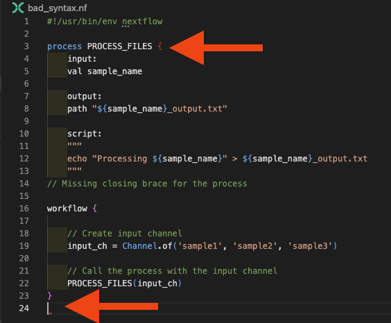

# Debugging Nextflow Workflows

Debugging is a critical skill that can save you hours of frustration and help you become a more effective Nextflow developer. Throughout your career, especially when you're starting out, you'll encounter bugs while building and maintaining your workflows. Learning systematic debugging approaches will help you identify and resolve issues quickly.

## What you should know first

This guide assumes you've completed the [Hello Nextflow](../hello_nextflow/) training course and are comfortable with foundational Nextflow concepts including basic workflow structure, processes, channels, and configuration.

This guide focuses on debugging techniques and workflows. For comprehensive coverage of IDE features that support debugging (syntax highlighting, error detection, etc.), see the dedicated [IDE Features for Nextflow Development](ide_features.md) side quest. We recommend completing the IDE training beforehand.

## What you'll learn here

This guide focuses on **systematic debugging techniques** for Nextflow workflows:

- **Common error patterns**: Understanding the most frequent types of errors and how to identify them
- **Syntax error debugging**: Using IDE features and Nextflow error messages effectively
- **Channel debugging**: Diagnosing data flow issues and channel structure problems
- **Process debugging**: Investigating execution failures and resource issues
- **Built-in debugging tools**: Leveraging Nextflow's trace, timeline, and reporting features
- **Advanced debugging techniques**: Using resume, stub running, and other advanced approaches

You'll encounter various types of errors when developing Nextflow workflows:

- **Syntax errors**: Code that doesn't conform to Nextflow DSL rules
- **Channel handling errors**: Wrong data shapes or channel operations
- **Process input/output mismatches**: Incompatible data types between processes
- **Configuration errors**: Invalid parameters or resource specifications
- **Resource requirement issues**: Insufficient memory, CPU, or storage
- **Container and software issues**: Missing dependencies or version conflicts

While these errors can initially seem overwhelming, this guide will teach you systematic approaches to quickly identify, understand, and resolve each type. By the end, you'll have a robust debugging methodology that transforms frustrating error messages into clear roadmaps for solutions.

---

## 0. Warmup

Let's move into the debugging exercise directory:

```bash
cd side-quests/debugging
```

You can set VSCode to focus on this directory:

```bash
code .
```

The directory contains example workflows with various types of bugs that we'll use for practice:

```bash
tree .
```

```console title="Project structure"
.
├── bad_bash_var.nf
├── bad_channel_shape_viewed_debug.nf
├── bad_channel_shape_viewed.nf
├── bad_channel_shape.nf
├── bad_number_inputs.nf
├── bad_resources.nf
├── bad_syntax.nf
├── buggy_workflow.nf
├── data
│   ├── sample_001.fastq.gz
│   ├── sample_002.fastq.gz
│   ├── sample_003.fastq.gz
│   ├── sample_004.fastq.gz
│   ├── sample_005.fastq.gz
│   └── sample_data.csv
├── exhausted.nf
├── invalid_process.nf
├── missing_output.nf
├── missing_software_stub.nf
├── missing_software.nf
├── nextflow.config
├── no_such_var.nf
└── nonlethal_syntax.nf

2 directories, 22 files
```

These files represent common debugging scenarios you'll encounter in real-world development.

### Takeaway

You're set up with example files containing various types of bugs that we'll debug systematically throughout this guide.

### What's next?

Learn to identify and fix the most common type of error: syntax errors.

---

## 1. Syntax Errors

Syntax errors are the most common type of error you'll encounter when writing Nextflow code. They occur when the code does not conform to the expected syntax rules of the Nextflow DSL. These errors prevent your workflow from running at all, so it's important to learn how to identify and fix them quickly.


### 1.1. Missing braces

One of the most common syntax errors, and sometimes one of the more complex ones to debug is **missing or mismatched brackets**.

Let's start with a practical example. Open `bad_syntax.nf` in VS Code to see a workflow with a missing closing brace, then try to run it:

```bash
nextflow run bad_syntax.nf
```

You'll see an error message like this:

```console title="Syntax error output"
 N E X T F L O W   ~  version 24.10.2

Launching `bad_syntax.nf` [extravagant_poisson] DSL2 - revision: ee497b3ca1

ERROR ~ Script compilation error
- file : /path/to/bad_syntax.nf
- cause: Unexpected input: '{' @ line 6, column 23.
   process PROCESS_FILES {
                         ^

1 error

NOTE: If this is the beginning of a process or workflow, there may be a syntax error in the body, such as a missing or extra comma, for which a more specific error message could not be produced.

 -- Check '.nextflow.log' file for details
```

**Key elements of syntax error messages:**

- **File location**: Shows exactly which file contains the error (`- file : /path/to/bad_syntax.nf`)
- **Error description**: Explains what the parser found that it didn't expect (`- cause: Unexpected input: '{'`)
- **Line and column**: Points to where the parser encountered the problem (`@ line 6, column 23.`)
- **Context**: Shows the problematic line with a caret (^) pointing to location of an unclosed brace (`process PROCESS_FILES {`)
- **Additional notes**: Provides hints about common causes

Now, open `bad_syntax.nf`:

```groovy title="bad_syntax.nf" hl_lines="14"
#!/usr/bin/env nextflow

process PROCESS_FILES {
    input:
    val sample_name

    output:
    path "${sample_name}_output.txt"

    script:
    """
    echo "Processing ${sample_name}" > ${sample_name}_output.txt
    """
// Missing closing brace for the process

workflow {

    // Create input channel
    input_ch = Channel.of('sample1', 'sample2', 'sample3')

    // Call the process with the input channel
    PROCESS_FILES(input_ch)
}
```

For the purpose of this example we've left a comment for you to show where the error is. The Nextflow VSCode extension should also be giving you some hints about what might be wrong, putting the mismatched brace in red and highlighting the premature end of the file:



**Debugging strategy for bracket errors:**

1. Use VS Code's bracket matching (place cursor next to a bracket)
2. Check the Problems panel for bracket-related messages
3. Ensure each opening `{` has a corresponding closing `}`

If you replace the comment with the missing closing brace, and run the workflow again, it should now run successfully:

```bash
nextflow run bad_syntax.nf
```

### 1.2. Using incorrect process keywords or directives

Next open the file `invalid_process.nf`.

Another common syntax error is an **invalid process definition**. This can happen if you forget to define required blocks or use incorrect directives in the process definition. Maybe you try to use `inputs` rather than the correction `input` directive:

```groovy title="invalid_process.nf" hl_lines="4"
#!/usr/bin/env nextflow

process PROCESS_FILES {
    inputs:
    val sample_name

    output:
    path "${sample_name}_output.txt"

    script:
    """
    echo "Processing ${sample_name}" > ${sample_name}_output.txt
    """
}

workflow {

    // Create input channel
    input_ch = Channel.of('sample1', 'sample2', 'sample3')

    // Call the process with the input channel
    PROCESS_FILES(input_ch)
}
```

Try to run this with

```console
nextflow run invalid_process.nf
```

and you'll see an error like:

```console title="Invalid process keyword error"
Nextflow 25.04.6 is available - Please consider updating your version to it

 N E X T F L O W   ~  version 24.10.2

Launching `invalid_process.nf` [happy_lorenz] DSL2 - revision: 2bfe3a8652

ERROR ~ Script compilation error
- file : /workspaces/training/side-quests/debugging/invalid_process.nf
- cause: Invalid process definition -- Unknown keyword `inputs` @ line 5, column 5.
       val sample_name
       ^

1 error


 -- Check '.nextflow.log' file for details
```

In these cases the error messaging is quite straightforward. You should be able to quickly replace the incorrect keyword with the correct on by referencing [the documentation](https://www.nextflow.io/docs/latest/process.html#):

```groovy title="Solution" hl_lines="4"
#!/usr/bin/env nextflow

process PROCESS_FILES {
    input:
    val sample_name

    output:
    path "${sample_name}_output.txt"

    script:
    """
    echo "Processing ${sample_name}" > ${sample_name}_output.txt
    """
}

workflow {

    // Create input channel
    input_ch = Channel.of('sample1', 'sample2', 'sample3')

    // Call the process with the input channel
    PROCESS_FILES(input_ch)
}
```

### 1.3. Using bad variable names

Next, open the file `no_such_var.nf`. Let's run it:

```console
nextflow run no_such_var.nf
```

you should get a failure that look's like this:

```console title="No such variable error"
ERROR ~ Error executing process > 'PROCESS_FILES (3)'

Caused by:
  No such variable: undefined_var -- Check script 'no_such_var.nf' at line: 15


Source block:
  def output_prefix = "${sample_name}_processed"
  def timestamp = new Date().format("yyyy-MM-dd")
  """
  echo "Processing ${sample_name} on ${timestamp}" > ${output_prefix}.txt
  echo "Using undefined variable: ${undefined_var}" >> ${output_prefix}.txt  // ERROR: undefined_var not defined
  """

Tip: when you have fixed the problem you can continue the execution adding the option `-resume` to the run command line

 -- Check '.nextflow.log' file for details
```

The variable names you use in your script blocks must be valid, derived either from inputs or from groovy code inserted before the script. This fails because `undefined_var` is not defined anywhere. The error message indicates that the variable is not recognized in the script template:

```groovy title="no_such_var.nf" hl_lines="17"
#!/usr/bin/env nextflow

process PROCESS_FILES {
    input:
    val sample_name

    output:
    path "${sample_name}_output.txt"

    script:
    // Define variables in Groovy code before the script
    def output_prefix = "${sample_name}_processed"
    def timestamp = new Date().format("yyyy-MM-dd")

    """
    echo "Processing ${sample_name} on ${timestamp}" > ${output_prefix}.txt
    echo "Using undefined variable: ${undefined_var}" >> ${output_prefix}.txt  // ERROR: undefined_var not defined
    """
}

workflow {
    input_ch = Channel.of('sample1', 'sample2', 'sample3')
    PROCESS_FILES(input_ch)
}
```

If you get a 'No such variable' error it will be because you've made a mistake like this. You can fix it by either defining the variable (by correcting input variable names or editing groovy code before the script), or by removing it from the script block if it's not needed:

For example, try changing the script like so and rerun it:

```groovy title="no_such_var.nf" hl_lines="15-17"
#!/usr/bin/env nextflow

process PROCESS_FILES {
    input:
    val sample_name

    output:
    path "${sample_name}_output.txt"

    script:
    // Define variables in Groovy code before the script
    def output_prefix = "${sample_name}_processed"
    def timestamp = new Date().format("yyyy-MM-dd")

    """
    echo "Processing ${sample_name} on ${timestamp}" > ${output_prefix}.txt
    """
}
```

This should succeed now:

```console
nextflow run no_such_var.nf
```

### 1.4. Bad use of Bash variables

Another form of the bad variable error appears when trying to use variabled in the Bash content of the script block. Open the file `bad_bash_var.nf` and run it:

```console
nextflow run bad_bash_var.nf
```

throws the following error:

```console
ERROR ~ Error executing process > 'PROCESS_FILES (1)'

Caused by:
  No such variable: prefix -- Check script 'bad_bash_var.nf' at line: 11

```

Let's look at line 11 to see, if we can spot the issue:

```groovy title="bad_bash_var.nf"
process PROCESS_FILES {
    input:
    val sample_name

    output:
    path "${sample_name}_output.txt"

    script:
    """
    prefix="${sample_name}_output"
    echo "Processing ${sample_name}" > ${prefix}.txt
    """
}
```

Starting out in Nextflow, it can be difficult to understand the difference between Nextflow (Groovy) and Bash variables. In this example, we're defining the `prefix` variable in Bash, but the syntax we used to refer to it (`${prefix}`) is Groovy syntax, not Bash syntax. The variable doesn't exist in the Groovy context, so we will get a 'no such variable' error if we try to run the workflow (you can do this by running `bad_bash_var.nf`).

If you want to use a Bash variable, you must escape the dollar sign like this:

```groovy title="Using Bash variables correctly"
echo "Processing ${sample_name}" > \${prefix}.txt
```

!!! tip "Groovy vs Bash Variables"

    For simple variable manipulations like string concatenation or prefix/suffix operations, it's usually more readable to use Groovy variables in the script section rather than Bash variables in the script block:

    ```groovy
    script:
    def output_prefix = "${sample_name}_processed"
    def output_file = "${output_prefix}.txt"
    """
    echo "Processing ${sample_name}" > ${output_file}
    """
    ```

    This approach avoids the need to escape dollar signs and makes the code easier to read and maintain.

### 1.5. Bad practice syntax errors when using the VSCode extension

The Nextflow VSCode extension sometimes highlights issues that are not (yet) fatal errors in Nextflow. For example, you should always define your input channels within the workflow block, and the extension will highlight this as a potential issue. Open `badpractice_syntax.nf` in VS Code to see an example:

```groovy title="badpractice_syntax.nf"
#!/usr/bin/env nextflow

input_ch = Channel.of('sample1', 'sample2', 'sample3')

process PROCESS_FILES {
    input:
    val sample_name

    output:
    path "${sample_name}_processed.txt"

    script:
    // Define variables in Groovy code before the script
    def output_prefix = "${sample_name}_processed"
    def timestamp = new Date().format("yyyy-MM-dd")

    """
    echo "Processing ${sample_name} on ${timestamp}" > ${output_prefix}.txt
    """
}

workflow {
    PROCESS_FILES(input_ch)
}
```

When you run this workflow, it will execute successfully, but the VSCode extension will highlight the `input_ch` variable as being defined outside the workflow block, which is not recommended:


This is a bad practice syntax error that won't prevent execution but could lead to confusion or unexpected behavior in larger workflows. Tighter restrictions on such things will likely become enforced in future Nextflow versions, so for this example it's good practice to keep your input channels defined within the workflow block, and in general to follow any other recommendations the extension makes.

### Takeaway

You can systematically identify and fix syntax errors using Nextflow error messages and IDE visual indicators. Common syntax errors include missing braces, incorrect process keywords, undefined variables, and improper use of Bash vs. Nextflow variables. The VSCode extension helps catch many of these before runtime.

### What's next?

Learn to debug more complex channel structure errors that occur even when syntax is correct.

---

## 2. Channel Structure Errors

Channel structure errors are more subtle than syntax errors because the code is syntactically correct, but the data shapes don't match what processes expect. Nextflow will try to run the pipeline, but might find that the number of files doesn't match what it expects and fail. These errors typically only appear at runtime and require an understanding of the data flowing through your workflow.

### 2.1. Wrong Number of Input Channels

This error occurs when you pass a different number of channels than a process expects. Open `bad_number_inputs.nf` in VS Code to see an example:

```groovy title="Wrong number of channels"
#!/usr/bin/env nextflow

process PROCESS_FILES {
    input:
        val sample_name  // Process expects only 1 input

    output:
        path "${sample_name}_output.txt"

    script:
    """
    echo "Processing ${sample_name}" > ${sample_name}_output.txt
    """
}

workflow {

    // Create two separate channels
    samples_ch = Channel.of('sample1', 'sample2', 'sample3')
    files_ch = Channel.of('file1.txt', 'file2.txt', 'file3.txt')

    // ERROR: Passing 2 channels but process expects only 1
    PROCESS_FILES(samples_ch, files_ch)
}
```

Run this workflow to see the error:

```bash
nextflow run bad_number_inputs.nf
```

```console title="Wrong number of channels error"
 N E X T F L O W   ~  version 24.10.2

Launching `bad_number_inputs.nf` [fabulous_kirch] DSL2 - revision: 177eb7aa24

Process `PROCESS_FILES` declares 1 input channel but 2 were specified

 -- Check script 'bad_number_inputs.nf' at line: 22 or see '.nextflow.log' file for more details
```

The error message clearly states that the process expects 1 input channel, but 2 were provided. For this specific example, the process expects a single channel and doesn't require the second channel, so we can fix it by passing only the `samples_ch` channel. More commonly, you might add additional inputs to a process and forget to update the workflow call accordingly, which can lead to this type of error. Fortunately, this is one of the easier-to-understand and fix errors, as the error message is quite clear about the mismatch.

### 2.2. Mismatched channel arity

Some channel structure errors are much more subtle and produce no errors at all. Probably the most common of these reflects a challenge that new Nextflow users face in understanding that queue channels can be exhausted and run out of samples, meaning the workflow finishes prematurely. Open `exhausted.nf` in VS Code to see an example:

```groovy title="exhausted.nf"
#!/usr/bin/env nextflow

process PROCESS_FILES {
    input:
    val reference
    val sample_name

    output:
    path "${output_prefix}.txt"

    script:
    // Define variables in Groovy code before the script
    output_prefix = "${reference}_${sample_name}"
    def timestamp = new Date().format("yyyy-MM-dd")

    """
    echo "Processing ${sample_name} on ${timestamp}" > ${output_prefix}.txt
    """
}

workflow {

    reference_ch = Channel.of('baseline_reference')
    input_ch = Channel.of('sample1', 'sample2', 'sample3')

    PROCESS_FILES(reference_ch, input_ch)
}
```

Let's run it:

```console
nextflow run exhausted.nf
```

What do you see?

When you run this workflow, it will execute without error, but it will only process the first sample:

```console title="Exhausted channel output"
 N E X T F L O W   ~  version 24.10.2

Launching `exhausted.nf` [magical_mayer] DSL2 - revision: 4ec9570696

executor >  local (1)
[b3/42dbdb] process > PROCESS_FILES (1) [100%] 1 of 1 ✔
```

This happens because the `reference_ch` channel is exhausted after the first process execution, despite the `input_ch` channel having more items to process.

Here, we create two queue channels, a reference to be passed to all `PROCESS_FILE` instances, and a channel of sample names. The process expects both inputs, but we pass them as separate channels.

This pattern of a single reference file in a channel is very common, so this error occurs frequently. If you see a process only running once when you expect it to run multiple times, check that you're not exhausting a channel that should be reused.

There are a couple of ways to address this. You can simply create a value channel type, which can be used over and over again:

```groovy
    reference_ch = Channel.value('baseline_reference')
```

or by using `collect()`

```groovy
    reference_ch_value = reference_ch.collect()
```

In more complex scenarios, perhaps where you have a more complex situation than a single reference channel, you can use the `combine` operator to create a new channel that combines the two channels into tuples:

```groovy
    reference_ch = Channel.of('baseline_reference')
    input_ch = Channel.of('sample1', 'sample2', 'sample3')
    combined_ch = reference_ch.combine(input_ch)
```

`.combine()` generates a cartesian product of the two channels, so each item in `reference_ch` will be paired with each item in `input_ch`. This allows the process to run for each sample while still using the reference.

> Note: This requires the process input to be adjusted and therefore is not suitable in all situations.

### 2.3. Wrong Channel Content Structure

When workflows reach a certain level of complexity, it can be a little difficult to keep track of the internal structures of each channel, and people commonly generate mismatches between what the process expects and what the channel actually contains. This is more subtle to the issue we discussed earlier, where the number of channels was incorrect. In this case, the channel may have the right number of items, but the structure of those items doesn't match what the process expects.

Open `bad_channel_shape.nf` in VS Code:

```groovy title="Wrong channel structure"
#!/usr/bin/env nextflow

// Channel emits tuples, but process expects single values
input_ch = Channel.of(
    ['sample1', 'file1.txt'],
    ['sample2', 'file2.txt'],
    ['sample3', 'file3.txt']
)

process PROCESS_FILES {
    input:
        val sample_name  // Expects single value, gets tuple

    output:
        path "${sample_name}_output.txt"

    script:
    """
    echo "Processing ${sample_name}" > ${sample_name}_output.txt
    """
}

workflow {
    PROCESS_FILES(input_ch)
}
```

You may be able to see that we're generating a channel composed of tuples: `['sample1', 'file1.txt']`, but the process expects a single value, `val sample_name`. When you run this workflow:

```bash
nextflow run bad_channel_shape.nf
```

... you will see an error like this:

```console title="Channel structure error"
 N E X T F L O W   ~  version 24.10.2

Launching `bad_channel_shape.nf` [amazing_colden] DSL2 - revision: a2ad080712

executor >  local (3)
[73/80099d] process > PROCESS_FILES (1) [100%] 3 of 3, failed: 3 ✘

ERROR ~ Error executing process > 'PROCESS_FILES (3)'

Caused by:
  Missing output file(s) `[sample3, file3.txt]_output.txt` expected by process `PROCESS_FILES (3)`

Command executed:
  echo "Processing [sample3, file3.txt]" > [sample3, file3.txt]_output.txt

Work dir:
  /path/to/work/a9/ab2d19f5b30be56b56c099e0daa63a

Tip: when you have fixed the problem you can continue the execution adding the option `-resume` to the run command line
```

The square brackets in the error message provides the clue here, the process is treating the tuple as a single value, which is not what we want. The command executed shows that the process is trying to create a file named `[sample3, file3.txt]_output.txt`, which is not the intended output.

To fix this, if the process requires both inputs we could adjust the process to accept a tuple:

```groovy title="Fixing channel structure"
    tuple val(sample_name), path(file_name)
```

Or if, as in this example the process only needs the sample name, we can extract the first element of the tuple before passing it to the process:

```groovy title="Extracting single value from tuple"
    PROCESS_FILES(input_ch).map { it[0] }  // Extract first element
```

### 2.4. Channel Debugging Techniques

#### Using `.view()` for Channel Inspection

The most powerful debugging tool for channels is the `.view()` operator:

```groovy
    input_ch = Channel.of(
        ['sample1', 'file1.txt'],
        ['sample2', 'file2.txt']
    )
    .view { "Channel content: $it" }
    .map { tuple -> tuple[0] }
    .view { "After mapping: $it" }
```

With `.view()`, you can understand the shape of your channels at all stages to help with debugging. Run `bad_channel_shape_viewed.nf` to see this in action:

```console title="Channel debugging output"
 N E X T F L O W   ~  version 24.10.2

Launching `bad_channel_shape_viewed.nf` [ecstatic_sinoussi] DSL2 - revision: b4f24dc9da

executor >  local (3)
[5f/5272c6] process > PROCESS_FILES (2) [100%] 3 of 3 ✔
Channel content: [sample1, file1.txt]
Channel content: [sample2, file2.txt]
Channel content: [sample3, file3.txt]
After mapping: sample1
After mapping: sample2
After mapping: sample3
```

You can also save 'future you' a lot of trouble by commenting your workflow code to illustrate the channel structure:

```groovy
    input_ch = Channel.of(
            ['sample1', 'file1.txt'],
            ['sample2', 'file2.txt'],
            ['sample3', 'file3.txt'],
        ) // [sample_name, file_name]
        .map { tuple -> tuple[0] } // sample_name
```

This will become more important as your workflows grow in complexity and channel structure becomes more opaque.

### Takeaway

Many channel structure errors can be created with valid Nextflow syntax. You can debug channel structure errors by understanding data flow, using `.view()` operators for inspection, and recognizing error message patterns like square brackets indicating unexpected tuple structures.

### What's next?

Learn about errors created by process definitions.

---

## 3. Process Structure Errors

Process definitions are a relatively simple part of your Nextflow development, and many of your process-related errors will be unrelated to the Nextflow syntax itself.

Similarly to the channel issues we just discussed, it's possible to make syntactically valid process definitions that will still fail at runtime. Here are some common examples.

### 3.1. Missing Output Files

Commonly when writing new Nextflow processes, the command appears to run, but then a 'Missing output file(s)" error is reported. Try to run this example:

```bash
nextflow run missing_output.nf
```

You'll see an error like this:

```console title="Missing output files error"
 N E X T F L O W   ~  version 24.10.2

Launching `missing_output.nf` [zen_stone] DSL2 - revision: 37ff61f926

executor >  local (3)
executor >  local (3)
[fd/2642e9] process > PROCESS_FILES (2) [ 66%] 2 of 3, failed: 2
ERROR ~ Error executing process > 'PROCESS_FILES (3)'

Caused by:
  Missing output file(s) `sample3.txt` expected by process `PROCESS_FILES (3)`


Command executed:

  echo "Processing sample3" > sample3_output.txt

Command exit status:
  0

Command output:
  (empty)

Work dir:
  /workspaces/training/side-quests/debugging/work/02/9604d49fb8200a74d737c72a6c98ed

Tip: when you have fixed the problem you can continue the execution adding the option `-resume` to the run command line

 -- Check '.nextflow.log' file for details
```

Open `missing_output.nf` in VS Code to see the process definition:

```groovy title="missing_output.nf"
process PROCESS_FILES {
    input:
    val sample_name

    output:
    path "${sample_name}.txt"

    script:
    """
    echo "Processing ${sample_name}" > ${sample_name}_output.txt
    """
}
```

The error message indicates that the process expected to produce an output file named `sample3.txt`, but the script actually creates `sample3_output.txt`. This mismatch causes the process to fail.

If you encounter this sort of error, go back and check that the outputs match between your process definition and your output block. If the problem still isn't clear, check the process directory itself to identify the actual output files created. You can do this by looking in the work directory for the process:

```bash
❯ ls -h work/02/9604d49fb8200a74d737c72a6c98ed
sample3_output.txt
```

### 3.2. Missing software

`missing_software.nf` is an example similar to the others we've encountered in this module. There are no syntax errors, and this time we're using the `cowpy` command. If you try to run this workflow:

```bash
nextflow run missing_software.nf
```

... you will see an error like this:

```console title="Missing software error"
ERROR ~ Error executing process > 'PROCESS_FILES (3)'

Caused by:
  Process `PROCESS_FILES (3)` terminated with an error exit status (127)


Command executed:

  cowpy sample3 > sample3_output.txt

Command exit status:
  127

Command output:
  (empty)

Command error:
  .command.sh: line 2: cowpy: command not found

Work dir:
  /workspaces/training/side-quests/debugging/work/82/42a5bfb60c9c6ee63ebdbc2d51aa6e

Tip: you can try to figure out what's wrong by changing to the process work dir and showing the script file named `.command.sh`

 -- Check '.nextflow.log' file for details
```

Look out for that `127` exit code, it tells you exactly the problem. Sometimes this is because a script is present in the workflow `bin` directory, but has not been made executable. Other times it is because the software is not installed in the container or environment where the workflow is running. You either need to install the software on the host machine (not usually recommended), or make it available to the process by other means. In this case the process has a container definition:

```groovy title="missing_software.nf"
process PROCESS_FILES {

    container 'community.wave.seqera.io/library/cowpy:1.1.5--3db457ae1977a273'

    input:
    val sample_name

    output:
    path "${sample_name}_output.txt"

    script:
    """
    cowpy ${sample_name} > ${sample_name}_output.txt
    """
}
```

So all we need to to do is run the workflow with Docker enabled. We've set up a Docker profile for you in `nextflow.config`, so you can run the workflow with:

```bash
nextflow run missing_software.nf -profile docker
```

... and everything should run successfully.

### 3.3. Bad resource configuration

In production usage, you'll be configuring resources on your processes. For example `memory` defines the maximum amount of memory available to your process, and if the process exceeds that, your scheduler will typically kill the process and return an exit code of `137`. We can't demonstrate that here because we're using the `local` executor, but we can show something similar with `time`.

`bad_resources.nf` has process configuration with an unrealistic bound on time of 1 millisecond:

```groovy
process PROCESS_FILES {

    container 'community.wave.seqera.io/library/cowpy:1.1.5--3db457ae1977a273'

    time '1 ms'

    input:
    val sample_name

    output:
    path "${sample_name}_output.txt"

    script:
    """
    cowpy ${sample_name} > ${sample_name}_output.txt
    """
}
```

Trying to run this like:

```console title="Resource time limit error"
nextflow run bad_resources.nf -profile docker
```

... gives us an error:

\```console
ERROR ~ Error executing process > 'PROCESS_FILES (1)'

Caused by:
Process exceeded running time limit (1ms)

\```

If you make sure to read your error messages failures like this should not puzzle you for too long. But make sure you understand the resource requirements of the commands you are running so that you can configure your resource directives appropriately.

### Takeaway

Process structure errors often appear when processes run but don't produce expected results. Key issues include mismatched output file names, missing software dependencies (exit code 127), and inadequate resource allocations. These errors require examining work directories and understanding error codes to diagnose effectively.

### What's next?

Learn about Nextflow's built-in debugging tools and systematic approaches to troubleshooting.

---

## 4. Built-in Debugging Tools and Advanced Techniques

Nextflow provides several powerful built-in tools for debugging and analyzing workflow execution. These tools help you understand what went wrong, where it went wrong, and how to fix it efficiently.

### 4.1. Execution Reports and Trace Files

#### Generate Complete Debugging Information

Always run with comprehensive reporting when debugging, either by adding flags to your command line:

```bash
nextflow run workflow.nf -with-trace -with-timeline -with-report
````

... or by setting them in configuration:

```groovy
trace {
    enabled = true
    overwrite = true
    file = "${params.output}/trace.txt"
}

timeline {
    enabled = true
    file = "${params.output}/timeline.html"
    overwrite = true
}

report {
    enabled = true
    file = "${params.output}/report.html"
    overwrite = true
}
```

We've done this for you in the `nextflow.config` file, so you can run most of the debugging examples in this guide and automatically get comprehensive debugging information.

This generates three essential debugging files:

- **`trace.txt`**: Detailed execution data for each task
- **`timeline.html`**: Visual timeline of process execution
- **`report.html`**: Execution summary and resource usage

#### Understanding the Trace File

The trace file is your primary tool for understanding what happened. Let's run one our early failing workflows to generate a trace file:

```bash
nextflow run bad_channel_shape.nf
```

... then look at the generated `trace.txt` file:

```bash
cat results/trace.txt
```

```console title="Trace file content"
task_id hash    native_id       name    status  exit    submit  duration        realtime        %cpu    peak_rss        peak_vmem       rchar   wchar
2       1c/c77799       12008   PROCESS_FILES (2)       FAILED  0       2025-07-28 12:36:54.221 69ms    0ms     -       -       -       -       -
3       e9/21b3b0       12009   PROCESS_FILES (3)       FAILED  0       2025-07-28 12:36:54.226 68ms    0ms     -       -       -       -       -
1       6b/552ab7       12010   PROCESS_FILES (1)       FAILED  0       2025-07-28 12:36:54.231 64ms    0ms     -       -       -       -       -
```

Interestingly for this particular error the exit codes are all `0`, which is a little confusing, but the status is `FAILED` for each task. This is because this example error mis-named the outputs. The exit code is collected from the command executed, which all ran fine, givin us the `0` exit code, but the process failed because the output files were not created as expected.

**Key debugging columns:**

- **status**: COMPLETED, FAILED, ABORTED - shows which tasks failed
- **exit**: Exit code (0 = success, non-zero = error)
- **hash**: Work directory identifier for examining failed tasks
- **rss**: Peak memory usage - helps identify memory issues

Find failed tasks quickly:

```bash
grep "FAILED" results/trace.txt
```

#### Work Directory Investigation

In [Hello Nextflow](../hello_nextflow/) you learned that each task creates a work directory. This directory contains all the files generated during execution, including the command script, output files, and logs. You can find the work directory for a failed task using its hash from the trace file.

Each task creates a work directory with complete debugging information:

```bash
# Use the hash from trace.txt to find the work directory
ls -a work/1c/c77799*/
```

```console title="Work directory contents"
.               ..              .command.begin  .command.err    .command.log    .command.out    .command.run    .command.sh     .command.trace  .exitcode       [sample2,
```

In this example we we can see the weird output file with the square brackets, which is the cause of the failure. If you look at the `.command.err` file, it will contain the error message from the command that was run:

```bash
cat work/1c/c77799*/.command.err
```

... but in this case it will be empty, because the command ran successfully, but the output file was not created as expected. The `.command.sh` file contains the exact command that was executed:

```bash
cat work/1c/c77799*/.command.sh
```

```
#!/bin/bash -ue
echo "Processing [sample2, file2.txt]" > [sample2, file2.txt]_output.txt
```

... looking at this file would have told us exactly the problem was.

**Essential debugging files:**

- **`.command.sh`**: The exact script that was executed
- **`.command.run`**: The command wrapper used to run the task. This includes environment variables and other settings, for example the container image used.
- **`.command.err`**: Standard error output (most important for debugging)
- **`.command.out`**: Standard output from the command
- **`.command.log`**: Nextflow's execution log

### 4.2. Preview Mode and Process Debugging

While trace files help you understand what went wrong after execution, sometimes you want to catch problems before any processes run, or see what's happening in real-time. Nextflow provides two key approaches for this kind of proactive debugging.

#### Dry Run Testing

The first approach is preview mode, which lets you test workflow logic without executing commands:

```bash
nextflow run workflow.nf -preview
```

This can be quite useful for quickly checking the structure of your workflow and ensuring that processes are connected correctly without running any actual commands. For example, for our first syntax errror from earlier:

```bash
nextflow run bad_syntax.nf -preview
```

```console title="Preview mode output"
 N E X T F L O W   ~  version 24.10.2

Launching `bad_syntax.nf` [sick_fermi] DSL2 - revision: ca6327fad2

ERROR ~ Script compilation error
- file : /workspaces/training/side-quests/debugging/bad_syntax.nf
- cause: Unexpected input: '{' @ line 3, column 23.
   process PROCESS_FILES {
                         ^

1 error

NOTE: If this is the beginning of a process or workflow, there may be a syntax error in the body, such as a missing or extra comma, for which a more specific error message could not be produced.

 -- Check '.nextflow.log' file for details
```

#### Real-time Process Output

Preview mode catches structural issues before execution, but sometimes you need to see what's happening inside running processes. The second approach is enabling real-time process output, which shows you exactly what each task is doing as it executes.

For example, `bad_channel_shape_viewed.nf` from our earlier examples printed channel content using `.view()`. We can also use the `debug` directive to echo variables from within the process itself, which we demonstrate in `bad_channel_shape_viewed_debug.nf`:

```groovy title="bad_channel_shape_viewed_debug.nf"
process PROCESS_FILES {
    debug true

    input:
    val sample_name

    output:
    path "${sample_name}_output.txt"

    script:
    """
    echo "Sample name inside process is ${sample_name}"
    echo "Processing ${sample_name}" > ${sample_name}_output.txt
    """
}
```

If you run this:

```bash
nextflow run bad_channel_shape_viewed_debug.nf
```

... you will see:

```console title="Real-time process output"
 N E X T F L O W   ~  version 24.10.2
 N E X T F L O W   ~  version 24.10.2

Launching `bad_channel_shape_viewed_debug.nf` [agitated_crick] DSL2 - revision: ea3676d9ec

executor >  local (3)
[c6/2dac51] process > PROCESS_FILES (3) [100%] 3 of 3 ✔
Channel content: [sample1, file1.txt]
Channel content: [sample2, file2.txt]
Channel content: [sample3, file3.txt]
After mapping: sample1
After mapping: sample2
After mapping: sample3
Sample name inside process is sample2

Sample name inside process is sample1

Sample name inside process is sample3
```

Essentially the content of standard out from the process is printed to the terminal in real-time, which can be very useful for debugging.

### 4.3. Stub Running for Logic Testing

Sometimes you encounter errors that are difficult to debug because the real commands take too long to run, require special software, or fail for complex reasons. In these cases, stub running provides an elegant solution by letting you test workflow logic without executing the actual commands.

When you're developing a Nextflow process, you can use the `stub` directive to define 'dummy' commands that generate outputs of the correct form without running the real command. This approach is particularly valuable when you want to verify that your workflow logic is correct before dealing with the complexities of the actual software.

For example, remember our `missing_software.nf` from earlier? The one where we had missing software that prevented the workflow running until we added `-profile docker`? Well, we can amend that process definition like:

```
process PROCESS_FILES {

    container 'community.wave.seqera.io/library/cowpy:1.1.5--3db457ae1977a273'

    input:
    val sample_name

    output:
    path "${sample_name}_output.txt"

    script:
    """
    cowpy ${sample_name} > ${sample_name}_output.txt
    """

    stub:
    """
    touch ${sample_name}_output.txt
    """
}
```

(you'll see this in `missing_software_stub.nf`)

The `touch` command we're using here doesn't depend on any software or appropriate inputs, it's just a placeholder.

Then, if we wanted to check workflow logic without worrying about the software, we can use `-stub`, without `-profile docker`:

```bash
nextflow run -stub missing_software_stub.nf
```

The stub command doesn't run Cowpy, it just creates an empty file, so everything will run fine, and we know that our workflow logic is written correctly.

**Stub running helps debug:**

- Channel structure and data flow
- Process connections and dependencies
- Parameter propagation
- Workflow logic without software dependencies

### 4.4. Resume and Incremental Debugging

Once you've identified a problem using the techniques above, you need an efficient way to test your fixes without wasting time re-running successful parts of your workflow. This is where Nextflow's resume functionality becomes invaluable for debugging.

#### Efficient Debug-Fix-Test Cycles

The resume feature allows you to quickly iterate on fixes by only re-running failed or modified tasks:

```bash
# Initial run (fails at some point)
nextflow run workflow.nf -with-trace

# Fix the issue in your code, then resume
nextflow run workflow.nf -resume -with-trace
```

**Resume debugging strategy:**

1. Run workflow until failure
2. Examine trace file and work directory for failed task
3. Fix the specific issue
4. Resume to test only the fix
5. Repeat until workflow completes

#### Process Isolation for Testing

Sometimes even with resume, debugging complex workflows can be slow because you have to wait for upstream processes to complete before testing your fix. In these cases, you can isolate specific processes for faster testing by temporarily modifying your workflow:

```groovy
workflow {
    ch_input = Channel.fromPath(params.input)

    results_qc = FASTQC(ch_input)
    // results_trim = TRIMMOMATIC(results_qc)  // Comment out for debugging
    // results_align = BWA_MEM(results_trim)

    // Test only the problematic process
    PROBLEMATIC_PROCESS(results_qc)
}
```

Create minimal test workflows:

```groovy title="test_process.nf"
#!/usr/bin/env nextflow

include { PROBLEMATIC_PROCESS } from './modules/process.nf'

workflow {
    // Minimal test input
    test_input = Channel.of(['test_sample', file('data/small_test.fastq')])

    PROBLEMATIC_PROCESS(test_input)

    // Inspect output
    PROBLEMATIC_PROCESS.out.view { "Process output: $it" }
}
```

### 4.5. Resource and Memory Debugging

Not all workflow failures are due to syntax or logic errors. In production environments, many debugging challenges stem from resource constraints - processes that run out of memory, exceed time limits, or compete for system resources. Understanding how to diagnose and fix these issues is crucial for reliable workflow execution.

#### Identifying Resource Issues

Resource problems often manifest as specific exit codes that give you immediate clues about what went wrong:

- **Exit 130**: Process killed (often CTRL+C)
- **Exit 137**: Process killed by system (usually out of memory)
- **Exit 127**: Command not found

Check memory usage patterns:

```bash
# Sort processes by memory usage
sort -k11 -nr trace.txt | head -10

# Find memory-related failures
grep -E "(137|killed)" trace.txt
```

#### Dynamic Resource Allocation

Automatically retry with more resources:

```groovy
process ADAPTIVE_PROCESS {
    memory { task.attempt == 1 ? '4.GB' : task.attempt == 2 ? '8.GB' : '16.GB' }

    errorStrategy { task.exitStatus in [130,140] ? 'retry' : 'finish' }
    maxRetries 2

    script:
    """
    echo "Attempt ${task.attempt} with ${task.memory} memory"
    your_command --memory ${task.memory.toGiga()}G
    """
}
```

### 4.6. Systematic Debugging Approach

Now that you've learned individual debugging techniques - from trace files and work directories to preview mode, stub running, and resource monitoring - let's tie them together into a systematic methodology. Having a structured approach prevents you from getting overwhelmed by complex errors and ensures you don't miss important clues.

#### Three-Phase Debugging Method

This methodology combines all the tools we've covered into an efficient workflow:

**Phase 1: Quick Assessment (5 minutes)**

1. Read the error message carefully
2. Check if it's a syntax, runtime, or resource error
3. Use preview mode to test basic logic

**Phase 2: Detailed Investigation (15-30 minutes)**

1. Generate trace files: `nextflow run workflow.nf -with-trace -resume`
2. Find failed tasks: `grep "FAILED" trace.txt`
3. Examine work directories for failed tasks
4. Add `.view()` operators to inspect channels

**Phase 3: Fix and Validate (15 minutes)**

1. Make minimal targeted fixes
2. Test with resume: `nextflow run workflow.nf -resume`
3. Verify complete workflow execution

#### Debugging Configuration Profile

To make this systematic approach even more efficient, you can create a dedicated debugging configuration that automatically enables all the tools you need:

```groovy
profiles {
    debug {
        process {
            echo = true
            debug = true
            cleanup = false

            // Conservative resources for debugging
            maxForks = 1
            memory = '2.GB'
            cpus = 1
        }

        trace {
            enabled = true
            file = 'debug_trace.txt'
        }

        timeline {
            enabled = true
            file = 'debug_timeline.html'
        }

        report {
            enabled = true
            file = 'debug_report.html'
        }
    }
}
```

Use the debug profile:

```bash
nextflow run workflow.nf -profile debug
```

### 4.7. Practical Debugging Exercise

Now it's time to put the systematic debugging approach into practice. The workflow `buggy_workflow.nf` contains several common errors that represent the types of issues you'll encounter in real-world development. This exercise will help you experience how the three-phase debugging method works with actual problems.

**Your mission**: Debug the workflow using the systematic approach and techniques from this guide. Here are the debugging strategies you can apply:

**Start with a basic run** to see what fails first:

```bash
nextflow run buggy_workflow.nf
```

**Generate debugging information** once you get past syntax errors:

```bash
nextflow run buggy_workflow.nf -with-trace -with-timeline -with-report
```

**Check for failed tasks** in the trace file:

```bash
grep "FAILED" results/trace.txt
```

**Investigate work directories** for failed tasks using the hash from trace:

```bash
# Use the actual hash from your trace file
ls -la work/[hash]*/
cat work/[hash]*/.command.err
cat work/[hash]*/.command.sh
```

**Test workflow logic** without worrying about command execution:

```bash
nextflow run buggy_workflow.nf -stub-run
```

**Use resume** to test fixes without re-running successful tasks:

```bash
nextflow run buggy_workflow.nf -resume
```

**Add channel debugging** if data flow seems problematic:

```groovy
input_channel
    .view { "Channel content: $it" }
    .map { /* your operations */ }
    .view { "After mapping: $it" }
```

**Try preview mode** to check workflow structure:

```bash
nextflow run buggy_workflow.nf -preview
```

**Expected Issues**: The workflow contains syntax errors, channel structure problems, process input/output mismatches, and missing output files. All should be familiar from the examples in this guide.

**Getting Stuck**: If you encounter an error type not covered in this guide, examine the error message location and type, then check the work directory for clues. Remember that Nextflow error messages usually point you toward the solution.

**Solution**: Once you've worked through the debugging process, you can compare your approach with the corrected version in `side-quests/solutions/development_best_practices/buggy_workflow.nf`.

### Takeaway

Effective Nextflow debugging combines understanding error messages, using built-in tools (trace files, work directories, preview mode), and applying systematic approaches. Practice with these examples builds the experience needed to debug real-world workflow issues efficiently.

### What's next?

Apply these debugging skills in your own workflow development and explore:

- **[Development Best Practices](development_best_practices.md)**: Prevent bugs with systematic development approaches
- **[IDE Features](ide_features.md)**: Leverage VS Code features for faster error detection

---

## Summary

In this debugging guide you've developed a comprehensive toolkit for troubleshooting Nextflow workflows. You've learned:

**Section 1: Syntax Error Debugging**

1. How to interpret Nextflow error messages and locate problems
2. Common syntax errors: missing braces, incorrect keywords, undefined variables
3. Distinguishing between Nextflow (Groovy) and Bash variables
4. Using VS Code extension features for early error detection

**Section 2: Channel Structure Debugging**

1. Understanding channel cardinality and exhaustion issues
2. Debugging channel content structure mismatches
3. Using `.view()` operators for channel inspection
4. Recognizing error patterns like square brackets in output

**Section 3: Process Structure Debugging**

1. Diagnosing missing output file errors
2. Understanding exit codes (127 for missing software, 137 for memory issues)
3. Investigating work directories and command files
4. Configuring resources appropriately

**Section 4: Built-in Tools and Systematic Approaches**

1. Using trace files, timeline reports, and execution reports
2. Leveraging preview mode and real-time debugging
3. Implementing stub running for logic testing
4. Applying resume for efficient debugging cycles
5. Following a three-phase systematic debugging methodology

**Key Skills Acquired:**

- Reading and interpreting error messages effectively
- Using Nextflow's built-in debugging tools comprehensively
- Following systematic approaches to isolate and fix issues
- Understanding the relationship between workflow structure and runtime behavior
- Developing efficient debug-fix-test cycles

### What's next?

Apply these debugging skills in your own workflow development. The more you practice these techniques, the faster and more effective you'll become at identifying and resolving issues. Consider:

- **Building robust workflows** with built-in debugging from the start
- **Contributing to the community** by sharing debugging solutions
- **Developing testing strategies** to catch issues before they reach production
- **Mentoring others** using the systematic approaches you've learned

Remember: effective debugging is a skill that improves with practice. The systematic methodology and comprehensive toolkit you've developed here will serve you well throughout your Nextflow development journey.

---
