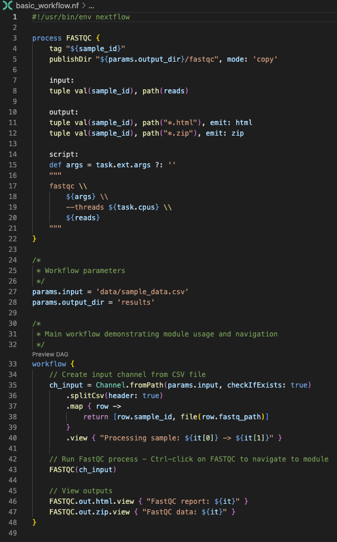
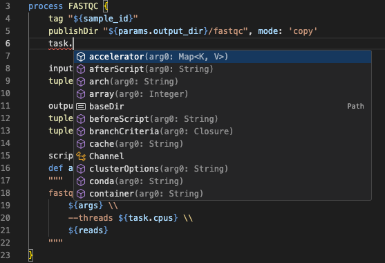
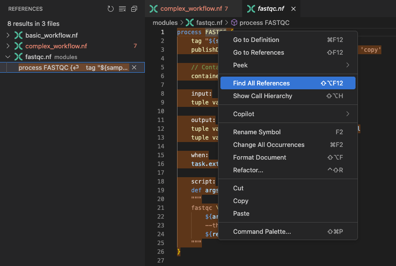
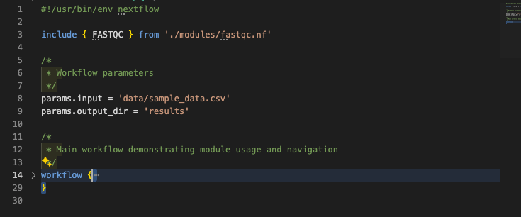

# Development Environment

Modern Integrated Development Environments (IDEs) can dramatically transform your Nextflow development experience. This side quest focuses specifically on leveraging VS Code and its Nextflow extension to write code faster, catch errors early, and navigate complex workflows efficiently.

!!! note "This isn't a traditional tutorial"

    Unlike other training modules, this guide is organized as a collection of quick hints, tips, and practical examples rather than a step-by-step tutorial. Each section can be explored independently based on your interests and current development needs. Feel free to jump around and focus on the features that will be most immediately useful to your workflow development.

## What you should know first

This guide assumes you've completed the [Hello Nextflow](../hello_nextflow/) training course and are comfortable with foundational Nextflow concepts including:

- **Basic workflow structure**: Understanding processes, workflows, and how they connect together
- **Channel operations**: Creating channels, passing data between processes, and using basic operators
- **Modules and organization**: Creating reusable modules and using include statements
- **Configuration basics**: Using `nextflow.config` for parameters, process directives, and profiles

## What you'll learn here

This guide focuses on **IDE productivity features** that will make you a more efficient Nextflow developer:

- **Advanced syntax highlighting**: Understanding what VS Code is showing you about your code structure
- **Intelligent auto-completion**: Leveraging context-aware suggestions for faster code writing
- **Error detection and diagnostics**: Catching syntax errors before you run your workflow
- **Code navigation**: Quickly moving between processes, modules, and definitions
- **Formatting and organization**: Maintaining consistent, readable code style
- **AI-assisted development** (optional): Using modern AI tools integrated with your IDE

!!! info "Why IDE features now?"

    You've likely already been using VS Code during the [Hello Nextflow](../hello_nextflow/) course, but we kept the focus on learning Nextflow fundamentals rather than IDE features. Now that you're comfortable with basic Nextflow concepts like processes, workflows, channels, and modules, you're ready to leverage the sophisticated IDE features that will make you a more efficient developer.

    Think of this as "leveling up" your development environment - the same editor you've been using has much more powerful capabilities that become truly valuable once you understand what they're helping you with.

---

## 0. Setup and Warmup

Let's set up a workspace specifically for exploring IDE features:

```bash title="Navigate to the IDE features directory"
cd side-quests/ide_features
```

Open this directory in VS Code:

```bash title="Open VS Code in current directory"
code .
```

The `ide_features` directory contains example workflows that demonstrate various IDE features:

```bash title="Show directory structure"
tree .
```

```console title="Project structure"
tree .
.
├── basic_workflow.nf
├── complex_workflow.nf
├── data
│   ├── sample_001.fastq.gz
│   ├── sample_002.fastq.gz
│   ├── sample_003.fastq.gz
│   ├── sample_004.fastq.gz
│   ├── sample_005.fastq.gz
│   └── sample_data.csv
├── modules
│   ├── fastqc.nf
│   ├── star.nf
│   └── utils.nf
└── nextflow.config

3 directories, 12 files
```

!!! note "About the Example Files"

    - `basic_workflow.nf` is a working basic workflow that you can run and modify
    - `complex_workflow.nf` is designed for illustration only to demonstrate navigation features - it may not run successfully but shows realistic multi-file workflow structure

### Keyboard Shortcuts

Some of the features in this guide will use optional keyboard shortcuts. You may well be accessing this material via GitHub Codespaces in browser, and in this case sometimes the shortcuts will not work as expected because they're used for other things in your system.

If you are running VS Code locally, as you probably will be when you're actually writing workflows, the shortcuts will work as described.

If you are using a Mac, some (not all) keyboard shortcuts will use "cmd" instead of "ctrl", and we'll indicate this in the text like `Ctrl/Cmd`.

### 0.1. Installing the Nextflow Extension

!!! note "Already Using Devcontainers?"

    If you're working in **GitHub Codespaces** or using a **local devcontainer**, the Nextflow extension is likely already installed and configured for you. You can skip the manual installation steps below and proceed directly to exploring the extension features.

To install the extension manually:

1. Open VS Code
2. Go to the Extensions view by clicking the extensions icon to the left:  (shortcut `Ctrl/Cmd+Shift+X` if you're running VSCode locally)
3. Search for "Nextflow"
4. Install the official Nextflow extension


### 0.2. Workspace Layout

Since you've been using VS Code throughout Hello Nextflow, you're already familiar with the basics. Here's how to organize your workspace efficiently for this session:

- **Editor Area**: For viewing and editing files. You can split this into multiple panes to compare files side by side.
- **File Explorer** click () (`Ctrl/Cmd+Shift+E`): The local files and folders on your system. Keep this open on the left to navigate between files
- **Integrated Terminal** (`Ctrl+Shift+` backtick for both Windows and MacOS): A terminal for interacting with the computer at the bottom. Use this to run Nextflow or other commands.
- **Problems Panel** (`Ctrl+Shift+M`): VS Code will show any errors and problems it detects here. This is useful for highlighting issues at a glance.

You can drag panels around or hide them (`Ctrl/Cmd+B` to toggle the sidebar) to customize your layout as we work through the examples.

### Takeaway

You have VS Code set up with the Nextflow extension and understand the workspace layout for efficient development.

### What's next?

Learn how syntax highlighting helps you understand Nextflow code structure at a glance.

---

## 1. Syntax Highlighting and Code Structure

Now that your workspace is set up, let's explore how VS Code's syntax highlighting helps you read and write Nextflow code more effectively.

### 1.1. Nextflow Syntax Elements

Open `basic_workflow.nf` to see syntax highlighting in action:



Notice how VS Code highlights:

- **Keywords** (`process`, `workflow`, `input`, `output`, `script`) in distinct colors
- **String literals** and **parameters** with different styling
- **Comments** in a muted color
- **Variables** and **function calls** with appropriate emphasis
- **Code blocks** with proper indentation guides

!!! note "Theme-Dependent Colors"

    The specific colors you see will depend on your VS Code theme (dark/light mode), color settings, and any customizations you've made. The important thing is that different syntax elements are visually distinguished from each other, making code structure easier to understand regardless of your chosen color scheme.

### 1.2. Understanding Code Structure

The syntax highlighting helps you quickly identify:

- **Process boundaries**: Clear distinction between different processes
- **Input/output blocks**: Easy to spot data flow definitions
- **Script blocks**: The actual commands being executed
- **Channel operations**: Data transformation steps
- **Configuration directives**: Process-specific settings

This visual organization becomes invaluable when working with complex workflows containing multiple processes and intricate data flows.

### Takeaway

You understand how VS Code's syntax highlighting helps you read Nextflow code structure and identify different language elements for faster development.

### What's next?

Learn how intelligent auto-completion speeds up code writing with context-aware suggestions.

---

## 2. Intelligent Auto-completion

VS Code's auto-completion features help you write code faster and with fewer errors by suggesting appropriate options based on context.

### 2.1. Context-Aware Suggestions

The auto-completion options vary depending on where you are in your code:

#### Channel Operations

Open `basic_workflow.nf` again and try typing `channel.` in the workflow block:


You'll see suggestions for:

- `fromPath()` - Create channel from file paths
- `fromFilePairs()` - Create channel from paired files
- `of()` - Create channel from values
- `fromSRA()` - Create channel from SRA accessions
- And many more...

This helps you quickly find the right channel factory to use without needing to remember exact method names.

You can also discover the operators available to apply to channels. For example, type `FASTQC.out.html.` to see available operations:


#### Process Directives

Inside a process script block, type `task.` to see available runtime properties:



#### Configuration

Open nextflow.config and type `process.` anywhere to see available process directives:


You'll see suggestions for:

- `executor`
- `memory`
- `cpus`

This saves time when configuring processes and works across different configuration scopes. For example, try typing `docker.` to see Docker-specific configuration options.

### Takeaway

You can use VS Code's intelligent auto-completion to discover available channel operations, process directives, and configuration options without memorizing syntax.

### What's next?

Learn how real-time error detection helps you catch issues before running your workflow, simply by reading the code.

## 3. Error Detection and Diagnostics

VS Code's real-time error detection helps you catch issues before running your workflow.

### 3.1. Syntax Error Detection

Let's create a deliberate error to see the detection in action. Open `basic_workflow.nf` and change the process name from `FASTQC` to `FASTQ` (or any other invalid name). VS Code will immediately highlight the error in the workflow block with a red squiggly underline:


### 3.2. Problems Panel

Beyond individual error highlighting, VS Code provides a centralized Problems panel that aggregates all errors, warnings, and info messages across your workspace. Open it with `Ctrl/Cmd+Shift+M` and use the filter icon to show only errors relevant to the current file:


Click on any issue to jump directly to the problematic line


Fix the error by changing the process name back to `FASTQC`.

### 3.3. Common Error Patterns

Common errors in Nextflow syntax include:

- **Missing brackets**: Unmatched `{` or `}`
- **Incomplete blocks**: Missing required sections in processes
- **Invalid syntax**: Malformed Nextflow DSL
- **Typos in keywords**: Misspelled process directives
- **Channel mismatches**: Type incompatibilities

The Nextflow language server highlights these issues in the Problems panel. You can check these out early to avoid syntax errors while running a pipeline.

### Takeaway

You can use VS Code's error detection and Problems panel to catch syntax errors and issues before running your workflow, saving time and preventing frustration.

### What's next?

Learn how to efficiently navigate between processes, modules, and definitions in complex workflows.

---

## 4. Code Navigation and Symbol Management

Efficient navigation is crucial when working with complex workflows spanning multiple files. To understand this, replace the process definition in `basic_workflow.nf` with an import for the module we've provided you:

=== "After"

    ```groovy title="basic_workflow.nf" linenums="3"
    include { FASTQC } from './modules/fastqc.nf'
    ```

=== "Before"

    ```groovy title="basic_workflow.nf" linenums="3"
    process FASTQC {
        tag "${sample_id}"
        publishDir "${params.output_dir}/fastqc", mode: 'copy'

        input:
        tuple val(sample_id), path(reads)

        output:
        tuple val(sample_id), path("*.html"), emit: html
        tuple val(sample_id), path("*.zip"), emit: zip

        script:
        def args = task.ext.args ?: ''
        """
        fastqc \\
            ${args} \\
            --threads ${task.cpus} \\
            ${reads}
        """
    }
    ```

### 4.1. Go to Definition

If you mouse over a process name like `FASTQC`, you'll see a popup with the module interface (inputs and outputs):


This feature is particularly valuable when authoring workflows, as it allows you to understand the module interface without opening the module file directly.

You can quickly navigate to any process, module, or variable definition using **Ctrl/Cmd-click** . Mouse over the link to the module file at the top of the script, and follow the link as suggested:


The same thing works for process names. Go back to `basic_workflow.nf` and try this on the `FASTQC` process name in the workflow block. This links you directly to the process name (which is the same as the module file in this example, but could be part-way through a much larger file).

To go back to where you were, use **Alt+←** (or **Ctrl+-** on Mac). This is a powerful way to explore code without losing your place.

Now let's explore navigation in a more complex workflow using `complex_workflow.nf` (the illustration-only file mentioned earlier). This workflow contains multiple processes defined in separate module files, as well as some inline ones. While complex multi-file structures can be challenging to navigate manually, the ability to jump to definitions makes exploration much more manageable.

1. Open `complex_workflow.nf`
2. Navigate to module definitions
3. Use **Alt+←** (or **Ctrl+-**) to navigate back
4. Navigate to the `FASTQC` process name in the workflow block. This links you directly to the process name (which is the same as the module file in this example, but could be part-way through a much larger file).
5. Navigate back again
6. Navigate to the `TRIM_GALORE` process in the workflow block. This is defined inline, so it won't take you to a separate file, but it will still show you the process definition, and you can still navigate back to where you were.

### 4.2. Symbol Navigation

With `complex_workflow.nf` still open, you can get an overview of all symbols in the file by typing `@` into the search bar at the top of VSCode (the keyboard shortcut is `Ctrl/Cmd+Shift+O`, but may not work in Codespaces). This opens the symbol navigation panel, which lists all symbols in the current file:


This shows:

- All process definitions
- Workflow definitions (there are two workflows defined in this file)
- Function definitions

Start typing to filter results.

### 4.3. Find All References

Understanding where a process or variable is used throughout your codebase can be very helpful. For instance, if you want to find all references to the `FASTQC` process, start by navigating to its definition. You can do this by opening `modules/fastqc.nf` directly, or by using VS Code's quick navigation feature with `Ctrl/Cmd-click` as we did above. Once at the process definition, right-click on the `FASTQC` process name and select "Find All References" from the context menu to see all instances where it is used.



This feature displays all instances where `FASTQC` is referenced within your workspace, including its usage in the two distinct workflows. This insight is crucial for assessing the potential impact of modifications to the `FASTQC` process.

### 4.4. Outline Panel

The Outline panel, located in the Explorer sidebar (click ), provides a convenient overview of all symbols in your current file. This feature allows you to quickly navigate and manage the structure of your code by displaying functions, variables, and other key elements in a hierarchical view.


Use the Outline panel to navigate quickly to different parts of your code without using the file browser.

### 4.5. DAG visualization

VS Code's Nextflow extension can visualize your workflow as a Directed Acyclic Graph (DAG). This helps you understand the data flow and dependencies between processes. Open `complex_workflow.nf` and click the "Preview DAG" button above `workflow {` (the second `workflow` block in this file):


This is just the 'entry' workflow, but you can also preview the DAG for the inner workflows by clicking the "Preview DAG" button above the workflow `RNASEQ_PIPELINE {` further up:


For this workflow, you can use the nodes in the DAG to navigate to the corresponding process definitions in the code. Click on a node, and it will take you to the relevant process definition in the editor. Particularly when a workflow grows to a large size, this can really help you to navigate around the code and understand how the processes are connected.

### Takeaway

You can navigate complex workflows efficiently using go-to-definition, symbol search, find references, and DAG visualization to understand code structure and dependencies.

### What's next?

Learn how to work effectively across multiple interconnected files in larger Nextflow projects.

## 5. Working Across Multiple Files

Real Nextflow development involves working with multiple interconnected files. Let's explore how VS Code helps you manage complex projects efficiently.

### 5.1. Quick File Navigation

With `complex_workflow.nf` open, you'll notice it imports several modules. Let's practice quick navigation between them.

Press **Ctrl+P** (or **Cmd+P**) and start typing "fast":

VS Code will show you matching files. Select `modules/fastqc.nf` to jump there instantly. This is much faster than clicking through the file explorer when you know roughly what file you're looking for.

Try this with other patterns:

- Type "star" to find the STAR alignment module file (`star.nf`)
- Type "utils" to find utility functions file (`utils.nf`)
- Type "config" to jump to configuration files (`nextflow.config`)

### 5.2. Split Editor for Multi-file Development

When working with modules, you often need to see both the main workflow and module definitions simultaneously. Let's set this up:

1. Open `complex_workflow.nf`
2. Open `modules/fastqc.nf` in a new tab
3. Right-click on the `modules/fastqc.nf` tab and select "Split Right"
4. Now you can see both files side by side


This is invaluable when:

- Checking module interfaces while writing workflow calls, and the preview is not enough
- Comparing similar processes across different modules
- Debugging data flow between workflow and modules

### 5.3. Project-wide Search

Sometimes you need to find where specific patterns are used across your entire project. Press `Ctrl/Cmd+Shift+F` to open the search panel.

Try searching for `publishDir` across the workspace:


This shows you every file that uses publish directories, helping you:

- Understand output organization patterns
- Find examples of specific directives
- Ensure consistency across modules

### Takeaway

You can manage complex multi-file projects using quick file navigation, split editors, and project-wide search to work efficiently across workflows and modules.

### What's next?

Learn how code formatting and maintenance features keep your workflows organized and readable.

---

## 6. Code Formatting and Maintenance

Proper code formatting is essential not only for aesthetics but also for enhancing readability, comprehension, and the ease of updating complex workflows.

### 6.1. Automatic Formatting in Action

Open `basic_workflow.nf` and deliberately mess up the formatting:

- Remove some indentation: Highlight the entire document and press `shift+tab` lots of times to remove as many indentations as possible.
- Add extra spaces in random places: the `channel.fromPath` statement, add 30 spaces after the `(`.
- Break some lines awkwardly: Add a new line between the the `.view {` operator and the `Processing sample:` string but do not add a corresponding newline before the closing parenthesis `}`.

Now press `Shift+Alt+F` (or `Shift+Option+F` on MacOS) to auto-format:

VS Code immediately:

- Fixes indentation to show process structure clearly
- Aligns similar elements consistently
- Removes unnecessary whitespace
- Maintains readable line breaks

Note that automatic formatting may not resolve every code style issue. The Nextflow language server aims to keep your code tidy, but it also respects your personal preferences in certain areas. For example, if you remove indentation inside the `script` block of a process, the formatter will leave it as-is, since you might intentionally prefer that style.

Currently, there is no strict style enforcement for Nextflow, so the language server offers some flexibility. However, it will consistently apply formatting rules around method and function definitions to maintain clarity.

### 6.2. Code Organization Features

#### Quick Commenting

Select a block of code in your workflow and press **Ctrl+/** (or **Cmd+/**) to comment it out:

```groovy
// workflow {
//     ch_input = channel.fromPath(params.input)
//         .splitCsv(header: true)
//         .map { row -> [row.sample_id, file(row.fastq_path)] }
//
//     FASTQC(ch_input)
// }
```

This is perfect for:

- Temporarily disabling parts of workflows during development
- Adding explanatory comments to complex channel operations
- Documenting workflow sections

Use **Ctrl+/** (or **Cmd+/**) again to uncomment the code.

#### Code Folding for Overview

In `complex_workflow.nf`, notice the small arrows next to process definitions. Click them to fold (collapse) processes:



This gives you a high-level overview of your workflow structure without getting lost in implementation details.

#### Bracket Matching

Place your cursor next to any `{` or `}` bracket and VS Code highlights the matching bracket. Use **Ctrl+Shift+\\** (or **Cmd+Shift+\\**) to jump between matching brackets.

This is crucial for:

- Understanding process boundaries
- Finding missing or extra brackets
- Navigating nested workflow structures

#### Multi-line Selection and Editing

For editing multiple lines simultaneously, VS Code offers powerful multi-cursor capabilities:

- **Multi-line selection**: Hold **Ctrl+Alt** (or **Cmd+Option** for MacOS) and use arrow keys to select multiple lines
- **Multi-line indenting**: Select multiple lines and use **Tab** to indent or **Shift+Tab** to outdent entire blocks

This is particularly useful for:

- Indenting entire process blocks consistently
- Adding comments to multiple lines at once
- Editing similar parameter definitions across multiple processes

### Takeaway

You can maintain clean, readable code using automatic formatting, commenting features, code folding, bracket matching, and multi-line editing to organize complex workflows efficiently.

### What's next?

Learn how VS Code integrates with your broader development workflow beyond just editing code.

---

## 7. Development Workflow Integration

VS Code integrates well with your development workflow beyond just editing code.

### 7.1. Version Control Integration

!!! note "Codespaces and Git Integration"

    If you're working in **GitHub Codespaces**, some Git integration features may not work as expected, particularly keyboard shortcuts for Source Control. You may have also declined to open the directory as a Git repository during initial setup, which is fine for training purposes.

If your project is a git repository (as this is), VS Code shows:

- Modified files with colored indicators
- Git status in the status bar
- Inline diff views
- Commit and push capabilities

Open the Source Control panel using the source control button () (`Ctrl+Shift+G` or `Cmd+Shift+G` if you're working with VSCode locally) to see git changes and stage commits directly in the editor.


### 7.2. Running and Inspecting Workflows

Let's run a workflow and then inspect the results. In the integrated terminal (`Ctrl+Shift+` backtick in both Windows and MacOS), run the basic workflow:

```bash title="Run the basic workflow"
nextflow run basic_workflow.nf --input data/sample_data.csv --output_dir results
```

While the workflow runs, you'll see real-time output in the terminal. After completion, you can use VS Code to inspect results without leaving your editor:

1. **Navigate to work directories**: Use the file explorer or terminal to browse `.nextflow/work`
2. **Open log files**: Click on log file paths in terminal output to open them directly in VS Code
3. **Inspect outputs**: Browse published results directories in the file explorer
4. **View execution reports**: Open HTML reports directly in VS Code or your browser

This keeps everything in one place rather than switching between multiple applications.

### Takeaway

You can integrate VS Code with version control and workflow execution to manage your entire development process from a single interface.

### What's next?

See how all these IDE features work together in your daily development workflow.

---

## 8. Recap and quick notes

Here are some quick notes on each of the IDE features discussed above:

### 8.1. Starting a New Feature

1. **Quick file open** (`Ctrl+P` or `Cmd+P`) to find relevant existing modules
2. **Split editor** to view similar processes side by side
3. **Symbol navigation** (`Ctrl+Shift+O` or `Cmd+Shift+O`) to understand file structure
4. **Auto-completion** to write new code quickly

### 8.2. Debugging Issues

1. **Problems panel** (`Ctrl+Shift+M` or `Cmd+Shift+M`) to see all errors at once
2. **Go to definition** (`Ctrl-click` or `Cmd-click`) to understand process interfaces
3. **Find all references** to see how processes are used
4. **Project-wide search** to find similar patterns or issues

### 8.3. Refactoring and Improvement

1. **Project-wide search** (`Ctrl+Shift+F` or `Cmd+Shift+F`) to find patterns
2. **Auto-formatting** (`Shift+Alt+F` or `Shift+Option+F`) to maintain consistency
3. **Code folding** to focus on structure
4. **Git integration** to track changes

---

## Summary

You have now had a whistle-stop tour of VS Code's IDE features for Nextflow development. These tools will make you significantly more productive by:

- **Reducing errors** through real-time syntax checking
- **Speeding up development** with intelligent auto-completion
- **Improving navigation** in complex multi-file workflows
- **Maintaining quality** through consistent formatting
- **Enhancing understanding** through advanced highlighting and structure visualization

We don't expect you to remember everything, but now you know that these features exist you will be able to find them when you need them. As you continue developing Nextflow workflows, these IDE features will become second nature, allowing you to focus on writing high-quality code rather than wrestling with syntax and structure.

### What's next?

Apply these IDE skills while working through other training modules, for example:

- **[nf-test](nf-test.md)**: Create comprehensive test suites for your workflows
- **[Hello nf-core](../../hello_nf-core/)**: Build production-quality pipelines with community standards

The true power of these IDE features emerges as you work on larger, more complex projects. Start incorporating them into your workflow gradually—within a few sessions, they'll become second nature and transform how you approach Nextflow development.

From catching errors before they slow you down to navigating complex codebases with ease, these tools will make you a more confident and efficient developer.

Happy coding!
