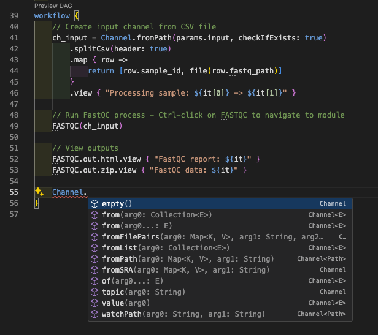
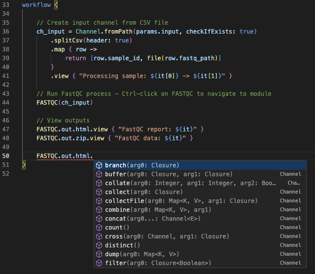
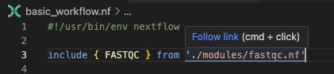
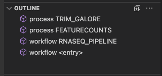
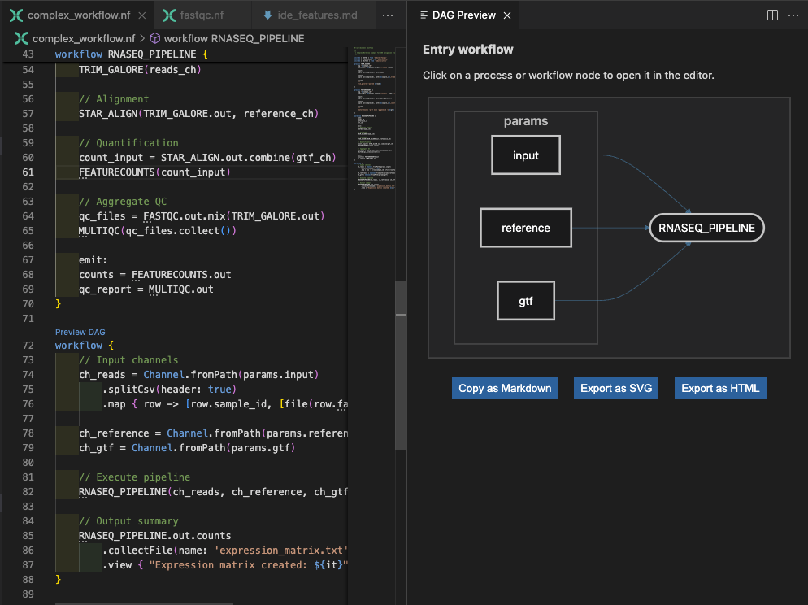
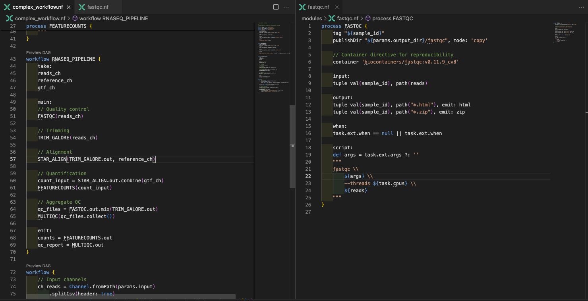
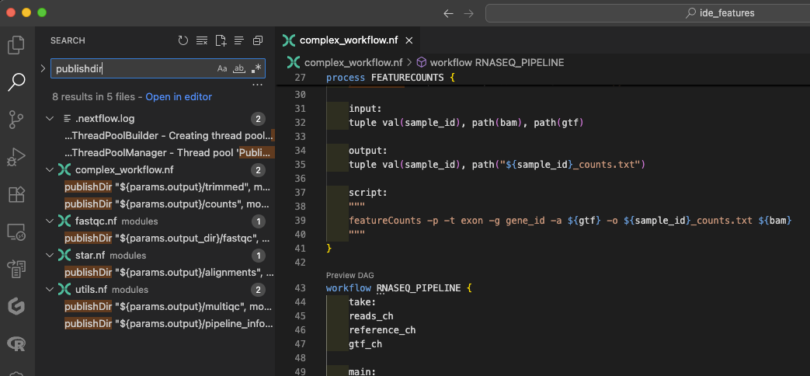

# IDE Features for Nextflow Development

Modern Integrated Development Environments (IDEs) can dramatically transform your Nextflow development experience. This side quest focuses specifically on leveraging VS Code and its Nextflow extension to write code faster, catch errors early, and navigate complex workflows efficiently.

## What you should know first

This guide assumes you've completed the [Hello Nextflow](../hello_nextflow/) training course and are comfortable with foundational Nextflow concepts including:

- **Basic workflow structure**: Understanding processes, workflows, and how they connect together
- **Channel operations**: Creating channels, passing data between processes, and using basic operators
- **Modules and organization**: Creating reusable modules and using include statements
- **Configuration basics**: Using `nextflow.config` for parameters, process directives, and profiles

## What you'll learn here

This guide focuses on **IDE productivity features** that will make you a more efficient Nextflow developer:

- **Advanced syntax highlighting**: Understanding what VS Code is showing you about your code structure
- **Intelligent auto-completion**: Leveraging context-aware suggestions for faster code writing
- **Error detection and diagnostics**: Catching syntax errors before you run your workflow
- **Code navigation**: Quickly moving between processes, modules, and definitions
- **Formatting and organization**: Maintaining consistent, readable code style
- **AI-assisted development** (optional): Using modern AI tools integrated with your IDE

!!! info "Why IDE features now?"

    You've likely already been using VS Code during the [Hello Nextflow](../hello_nextflow/) course, but we kept the focus on learning Nextflow fundamentals rather than IDE features. Now that you're comfortable with basic Nextflow concepts like processes, workflows, channels, and modules, you're ready to leverage the sophisticated IDE features that will make you a more efficient developer.

    Think of this as "leveling up" your development environment - the same editor you've been using has much more powerful capabilities that become truly valuable once you understand what they're helping you with.

---

## 0. Setup and Warmup

Let's set up a workspace specifically for exploring IDE features:

```bash title="Navigate to the IDE features directory"
cd side-quests/ide_features
```

Open this directory in VS Code:

```bash title="Open VS Code in current directory"
code .
```

The `ide_features` directory contains example workflows that demonstrate various IDE features:

```bash title="Show directory structure"
tree .
```

```console title="Project structure"
tree .
.
├── basic_workflow.nf
├── complex_workflow.nf
├── data
│   ├── sample_001.fastq.gz
│   ├── sample_002.fastq.gz
│   ├── sample_003.fastq.gz
│   ├── sample_004.fastq.gz
│   ├── sample_005.fastq.gz
│   └── sample_data.csv
├── modules
│   ├── fastqc.nf
│   ├── star.nf
│   └── utils.nf
└── nextflow.config

3 directories, 12 files
```

!!! note "About the Example Files"

    - `basic_workflow.nf` is a working basic workflow that you can run and modify
    - `complex_workflow.nf` is designed for illustration only to demonstrate navigation features - it may not run successfully but shows realistic multi-file workflow structure

### 0.1. Installing the Nextflow Extension

!!! note "Already Using Devcontainers?"

    If you're working in **GitHub Codespaces** or using a **local devcontainer**, the Nextflow extension is likely already installed and configured for you. You can skip the manual installation steps below and proceed directly to exploring the extension features.

To install the extension manually:

1. Open VS Code
2. Go to the Extensions view (`Ctrl+Shift+X` or `Cmd+Shift+X`)
3. Search for "Nextflow"
4. Install the official Nextflow extension


### 0.2. Workspace Layout

Since you've been using VS Code throughout Hello Nextflow, you're already familiar with the basics. Here's how to organize your workspace efficiently for this session:

- **File Explorer** (`Ctrl+Shift+E`): Keep this open on the left to navigate between files
- **Integrated Terminal** (`Ctrl+Shift+` backtick): Open at the bottom for running Nextflow commands
- **Editor Area**: Split this when comparing files side by side
- **Problems Panel** (`Ctrl+Shift+M`): Useful for seeing syntax errors at a glance

You can drag panels around or hide them (`Ctrl+B` to toggle the sidebar) to customize your layout as we work through the examples.

### 0.3. AI-Assisted Development Setup (Optional)

!!! note "AI Features Are Optional"

    All core IDE skills can be completed without AI tools. AI assistance is designed to supplement, not replace, fundamental development knowledge.

The Nextflow VS Code extension includes integration with Seqera AI via GitHub Copilot. To set Copilot up, follow the [official VS Code GitHub Copilot setup guide](https://code.visualstudio.com/docs/copilot/setup).

Once GitHub Copilot is configured, you can access Nextflow-specific AI assistance by:

1. Opening the Copilot chat (`Ctrl+Shift+I` or `Cmd+Shift+I`)
2. Typing `@Seqera` followed by your question for Nextflow-specific guidance
3. If desired, switch to agent mode and ask to apply suggestions

This integration provides context-aware suggestions and explanations tailored to Nextflow development.

### Takeaway

You have VS Code set up with the Nextflow extension and understand the workspace layout for efficient development.

### What's next?

Learn how syntax highlighting helps you understand Nextflow code structure at a glance.

---

## 1. Syntax Highlighting and Code Structure

Now that your workspace is set up, let's explore how VS Code's syntax highlighting helps you read and write Nextflow code more effectively.

### 1.1. Nextflow Syntax Elements

Open `basic_workflow.nf` to see syntax highlighting in action:


Notice how VS Code highlights:

- **Keywords** (`process`, `workflow`, `input`, `output`, `script`) in distinct colors
- **String literals** and **parameters** with different styling
- **Comments** in a muted color
- **Variables** and **function calls** with appropriate emphasis
- **Code blocks** with proper indentation guides

!!! note "Theme-Dependent Colors"

    The specific colors you see will depend on your VS Code theme (dark/light mode), color settings, and any customizations you've made. The important thing is that different syntax elements are visually distinguished from each other, making code structure easier to understand regardless of your chosen color scheme.

### 1.2. Understanding Code Structure

The syntax highlighting helps you quickly identify:

- **Process boundaries**: Clear distinction between different processes
- **Input/output blocks**: Easy to spot data flow definitions
- **Script blocks**: The actual commands being executed
- **Channel operations**: Data transformation steps
- **Configuration directives**: Process-specific settings

This visual organization becomes invaluable when working with complex workflows containing multiple processes and intricate data flows.

### Takeaway

You understand how VS Code's syntax highlighting helps you read Nextflow code structure and identify different language elements for faster development.

### What's next?

Learn how intelligent auto-completion speeds up code writing with context-aware suggestions.

---

## 2. Intelligent Auto-completion

VS Code's auto-completion features help you write code faster and with fewer errors by suggesting appropriate options based on context.

### 2.1. Context-Aware Suggestions

The auto-completion options vary depending on where you are in your code:

#### Channel Operations

Open `basic_workflow.nf` again and try typing `Channel.` in the workflow block:



You'll see suggestions for:

- `fromPath()` - Create channel from file paths
- `fromFilePairs()` - Create channel from paired files
- `of()` - Create channel from values
- `fromSRA()` - Create channel from SRA accessions
- And many more...

This helps you quickly find the right channel factory to use without needing to remember exact method names.

You can also discover the operators available to apply to channels. For example, type `FASTQC.out.html.` to see available operations:



#### Process Directives

Inside a process script block, type `task.` to see available runtime properties:


#### Configuration

Open nextflow.config and type `process.` anywhere to see available process directives:


You'll see suggestions for:

- `executor`
- `memory`
- `cpus`

This saves time when configuring processes and works across different configuration scopes—try typing `docker.` to see Docker-specific configuration options.

### Takeaway

You can use VS Code's intelligent auto-completion to discover available channel operations, process directives, and configuration options without memorizing syntax.

### What's next?

Learn how real-time error detection helps you catch issues before running your workflow.

## 3. Error Detection and Diagnostics

VS Code's real-time error detection helps you catch issues before running your workflow.

### 3.1. Syntax Error Detection

Let's create a deliberate error to see the detection in action. Open `basic_workflow.nf` and change the process name from `FASTQC` to `FASTQ` (or any other invalid name). VS Code will immediately highlight the error in the workflow block with a red squiggly underline:


### 3.2. Problems Panel

Beyond individual error highlighting, VS Code provides a centralized Problems panel that aggregates all errors, warnings, and info messages across your workspace. Open it with `Ctrl+Shift+M` (or `Cmd+Shift+M`) and use the filter icon to show only errors relevant to the current file:


Click on any issue to jump directly to the problematic line


### 3.3. Common Error Patterns

The extension helps identify:

- **Missing brackets**: Unmatched `{` or `}`
- **Incomplete blocks**: Missing required sections in processes
- **Invalid syntax**: Malformed Nextflow DSL
- **Typos in keywords**: Misspelled process directives
- **Channel mismatches**: Type incompatibilities

### Takeaway

You can use VS Code's error detection and Problems panel to catch syntax errors and issues before running your workflow, saving time and preventing frustration.

### What's next?

Learn how to efficiently navigate between processes, modules, and definitions in complex workflows.

---

## 4. Code Navigation and Symbol Management

Efficient navigation is crucial when working with complex workflows spanning multiple files. To understand this, replace the process definition in `basic_workflow.nf` with an import for the module we've provided you:

```groovy
include { FASTQC } from './modules/fastqc.nf'
```

### 4.1. Go to Definition

Mouse over the `FASTQC` process name in the workflow block. You'll see a tooltip with the definition:


This feature is particularly valuable when authoring workflows, as it allows you to understand the module interface without opening the module file directly.

You can quickly navigate to any process, module, or variable definition using **Ctrl-click** (or **Cmd-click** on Mac). Mouse over the link to the module file at the top of the script, and follow the link as suggested:



Try this on the `FASTQC` process name in the workflow block. This links you directly to the process name (which is the same as the module file in this example, but could be part-way through a much larger file).

Now let's explore navigation in a more complex workflow using `complex_workflow.nf` (the illustration-only file mentioned earlier). This workflow contains multiple processes defined in separate module files, as well as some inline ones. While complex multi-file structures can be challenging to navigate manually, the ability to jump to definitions makes exploration much more manageable.

1. Open `complex_workflow.nf`
2. Ctrl-click on different process names
3. Navigate to module definitions
4. Use **Alt+←** (or **Ctrl+-**) to navigate back

### 4.2. Symbol Navigation

With `complex_workflow.nf` still open, you can get an overview of all symbols in the file by pressing **Ctrl+Shift+O** (or **Cmd+Shift+O**):


This shows:

- All process definitions
- Workflow definitions (there are two workflows defined in this file)
- Function definitions

Start typing to filter results.

### 4.3. Workspace Symbol Search

Press **Ctrl+T** (or **Cmd+T**) to search symbols across your entire workspace:

- Find processes across all files
- Locate module definitions
- Search for specific functions

### 4.4. Find All References

Sometimes it's useful to understand where a process or variable is used throughout your codebase. In this example, if you want to see where the `FASTQC` process is referenced. Open the file `modules/fastqc.nf` and right-click on the `FASTQC` process name. Select "Find All References" from the context menu:


This will show you all places where `FASTQC` is referenced in your workspace, including the two separate workflows we've used it in. This would help us understand the impact of any changes we make to the `FASTQC` process.

### 4.5. Outline Panel

Use the Outline panel in the Explorer sidebar on the left for a persistent view of the symbols in the current file:



### 4.6. DAG visualization

VS Code's Nextflow extension can visualize your workflow as a Directed Acyclic Graph (DAG). This helps you understand the data flow and dependencies between processes. Open `complex_workflow.nf` and click the "Preview DAG" button above `workflow {` (the second `workflow` block in this file):



This is just the 'entry' workflow, but you can also preview the DAG for the inner workflows by clicking the "Preview DAG" button above the workflow `RNASEQ_PIPELINE {` further up:


### Takeaway

You can navigate complex workflows efficiently using go-to-definition, symbol search, find references, and DAG visualization to understand code structure and dependencies.

### What's next?

Learn how to work effectively across multiple interconnected files in larger Nextflow projects.

## 5. Working Across Multiple Files

Real Nextflow development involves working with multiple interconnected files. Let's explore how VS Code helps you manage complex projects efficiently.

### 5.1. Quick File Navigation

With `complex_workflow.nf` open, you'll notice it imports several modules. Let's practice quick navigation between them.

Press **Ctrl+P** (or **Cmd+P**) and start typing "fast":

VS Code will show you matching files. Select `modules/fastqc.nf` to jump there instantly. This is much faster than clicking through the file explorer when you know roughly what file you're looking for.

Try this with other patterns:
- Type "star" to find the STAR alignment module
- Type "utils" to find utility functions
- Type "config" to jump to configuration files

### 5.2. Split Editor for Multi-file Development

When working with modules, you often need to see both the main workflow and module definitions simultaneously. Let's set this up:

1. Open `complex_workflow.nf`
2. Open `modules/fastqc.nf` in a new tab
3. Right-click on the `modules/fastqc.nf` tab and select "Split Right"
4. Now you can see both files side by side



This is invaluable when:
- Checking module interfaces while writing workflow calls
- Comparing similar processes across different modules
- Debugging data flow between workflow and modules

### 5.3. Project-wide Search

Sometimes you need to find where specific patterns are used across your entire project. Press **Ctrl+Shift+F** (or **Cmd+Shift+F**) to open the search panel.

Try searching for `publishDir` across the workspace:



This shows you every file that uses publish directories, helping you:
- Understand output organization patterns
- Find examples of specific directives
- Ensure consistency across modules

### Takeaway

You can manage complex multi-file projects using quick file navigation, split editors, and project-wide search to work efficiently across workflows and modules.

### What's next?

Learn how code formatting and maintenance features keep your workflows organized and readable.

---

## 6. Code Formatting and Maintenance

Good code formatting isn't just about aesthetics - it makes complex workflows easier to understand and maintain.

### 6.1. Automatic Formatting in Action

Open `basic_workflow.nf` and deliberately mess up the formatting:
- Remove some indentation
- Add extra spaces in random places
- Break some lines awkwardly

Now press **Shift+Alt+F** (or **Shift+Option+F**) to auto-format:

VS Code immediately:
- Fixes indentation to show process structure clearly
- Aligns similar elements consistently
- Removes unnecessary whitespace
- Maintains readable line breaks

### 6.2. Code Organization Features

#### Quick Commenting

Select a block of code in your workflow and press **Ctrl+/** (or **Cmd+/**) to comment it out:

```groovy
// workflow {
//     ch_input = Channel.fromPath(params.input)
//         .splitCsv(header: true)
//         .map { row -> [row.sample_id, file(row.fastq_path)] }
//
//     FASTQC(ch_input)
// }
```

This is perfect for:
- Temporarily disabling parts of workflows during development
- Adding explanatory comments to complex channel operations
- Documenting workflow sections

Use **Ctrl+/** (or **Cmd+/**) again to uncomment the code.

#### Code Folding for Overview

In `complex_workflow.nf`, notice the small arrows next to process definitions. Click them to fold (collapse) processes:


This gives you a high-level overview of your workflow structure without getting lost in implementation details.

#### Bracket Matching

Place your cursor next to any `{` or `}` bracket and VS Code highlights the matching bracket. Use **Ctrl+Shift+\\** (or **Cmd+Shift+\\**) to jump between matching brackets.

This is crucial for:
- Understanding process boundaries
- Finding missing or extra brackets
- Navigating nested workflow structures

### Takeaway

You can maintain clean, readable code using automatic formatting, commenting features, code folding, and bracket matching to organize complex workflows.

### What's next?

Learn how VS Code integrates with your broader development workflow beyond just editing code.

---

## 7. Development Workflow Integration

VS Code integrates well with your development workflow beyond just editing code.

### 7.1. Version Control Integration

If your project is a git repository (as this is), VS Code shows:
- Modified files with colored indicators
- Git status in the status bar
- Inline diff views
- Commit and push capabilities

Open the Source Control panel (`Ctrl+Shift+G` or `Cmd+Shift+G`) to see git changes and stage commits directly in the editor.

### 7.2. Output and Log Inspection

After running a workflow, you can use VS Code to inspect results without leaving your editor:

1. **Navigate to work directories**: Use the file explorer or terminal to browse `.nextflow/work`
2. **Open log files**: Click on log file paths in terminal output to open them directly in VS Code
3. **Inspect outputs**: Browse published results directories in the file explorer
4. **View execution reports**: Open HTML reports directly in VS Code or your browser

This keeps everything in one place rather than switching between multiple applications.

### Takeaway

You can integrate VS Code with version control and workflow execution to manage your entire development process from a single interface.

### What's next?

Explore optional AI-assisted development features that can accelerate learning and development.

---

## 8. AI-Assisted Development (Optional)

!!! note "AI Features Are Optional"

    This section is for users with AI coding assistants. All core IDE skills above are sufficient for effective development.

### 8.1. Practical AI Assistance

If you have GitHub Copilot with Seqera AI integration, here are some practical scenarios to enhance your development workflow.

Open the Copilot chat (`Ctrl+Shift+I` or `Cmd+Shift+I`) and try these scenarios:

#### Understanding Complex Code

Select the channel operation in `complex_workflow.nf` and ask:

```text
@Seqera explain this channel operation step by step
```


#### Getting Error Help

Create a syntax error in `basic_workflow.nf` (e.g., remove a required input channel), then run the workflow to generate an error. In the terminal, highlight the error message, right-click, and select 'Copilot' → 'Add Terminal Selection to Chat'.

Then ask:

```text
@Seqera I'm getting this error. How do I fix this?
```

#### Generating New Processes

For generating new code, try asking for help creating a new process:

```text
@Seqera create a process that runs MultiQC to aggregate FastQC reports
```

### 8.2. Code Generation Workflow

AI can help you:

1. **Start with a description**: "I need a process that runs BWA alignment"
2. **Get a basic template**: AI provides the process structure
3. **Refine with questions**: "How do I add memory requirements?"
4. **Iterate and improve**: "Make this more robust with error handling"

This accelerates development while teaching you Nextflow patterns and best practices.

### Takeaway

You can optionally use AI assistance for code explanation, error debugging, and process generation to accelerate development and learning.

### What's next?

See how all these IDE features work together in your daily development workflow.

---

## 9. Daily Development Workflow

Putting it all together, here's how these IDE features work in practice:

### 9.1. Starting a New Feature

1. **Quick file open** (`Ctrl+P`) to find relevant existing modules
2. **Split editor** to view similar processes side by side
3. **Symbol navigation** (`Ctrl+Shift+O`) to understand file structure
4. **Auto-completion** to write new code quickly

### 9.2. Debugging Issues

1. **Problems panel** (`Ctrl+Shift+M`) to see all errors at once
2. **Go to definition** (`Ctrl+click`) to understand process interfaces
3. **Find all references** to see how processes are used
4. **Project-wide search** to find similar patterns or issues

### 9.3. Refactoring and Improvement

1. **Project-wide search** (`Ctrl+Shift+F`) to find patterns
2. **Auto-formatting** (`Shift+Alt+F`) to maintain consistency
3. **Code folding** to focus on structure
4. **Git integration** to track changes

### 9.4. Essential Keyboard Shortcuts

These high-impact shortcuts will give you the biggest productivity boost:

**Navigation:**
- `Ctrl+P` / `Cmd+P`: Quick file open
- `Ctrl+Shift+O` / `Cmd+Shift+O`: Go to symbol
- `F12` or `Ctrl+Click`: Go to definition

**Editing:**
- `Shift+Alt+F` / `Shift+Option+F`: Format document
- `Ctrl+/` / `Cmd+/`: Toggle comments
- `Ctrl+Shift+M` / `Cmd+Shift+M`: Problems panel

**Development:**
- `Ctrl+Shift+F` / `Cmd+Shift+F`: Search across files
- `Shift+F12`: Find all references
- `Ctrl+Shift+G` / `Cmd+Shift+G`: Source control panel

---

## Summary

You now have comprehensive knowledge of VS Code's IDE features for Nextflow development. These tools will make you significantly more productive by:

- **Reducing errors** through real-time syntax checking
- **Speeding up development** with intelligent auto-completion
- **Improving navigation** in complex multi-file workflows
- **Maintaining quality** through consistent formatting
- **Enhancing understanding** through advanced highlighting and structure visualization

### What's next?

Apply these IDE skills while working through other training modules:

- **[Development Best Practices](development_best_practices.md)**: Learn systematic debugging and development workflows
- **[nf-test](nf-test.md)**: Create comprehensive test suites for your workflows
- **[Hello nf-core](../../hello_nf-core/)**: Build production-quality pipelines with community standards

The true power of these IDE features emerges as you work on larger, more complex projects. Start incorporating them into your workflow gradually—within a few sessions, they'll become second nature and transform how you approach Nextflow development.

From catching errors before they slow you down to navigating complex codebases with ease, these tools will make you a more confident and efficient developer.

Happy coding!
