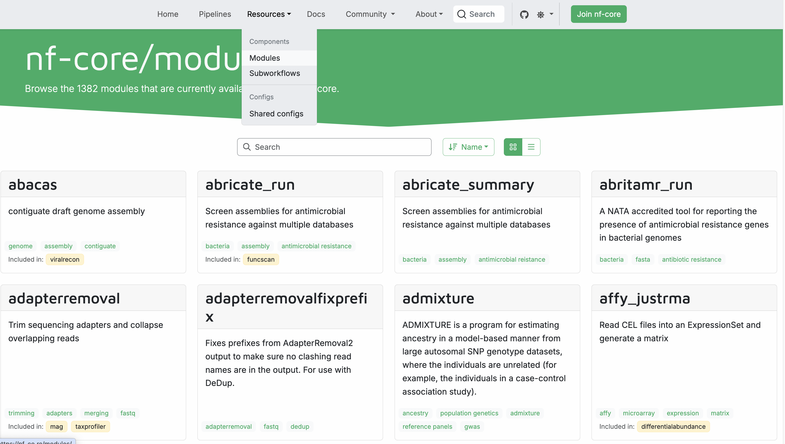
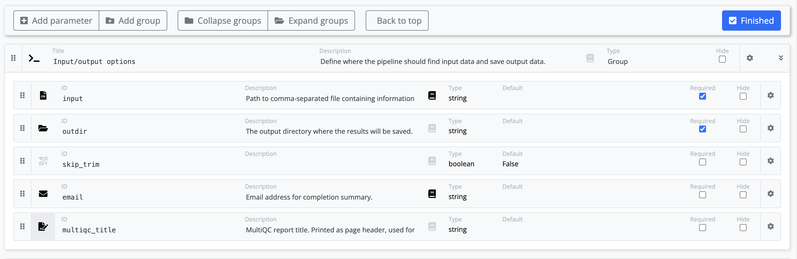

# nf-core

nf-core is a community effort to develop and maintain a curated set of analysis pipelines built using Nextflow. It was created by several core facilities wanting to consolidate their analysis development and is governed by community members from academia and industry. It is an open community that anyone can join and contribute to.


nf-core provides a standardized set of best practices, guidelines, and templates for building and sharing scientific pipelines.
These pipelines are designed to be modular, scalable, and portable, allowing researchers to easily adapt and execute them using their own data and compute resources.

One of the key benefits of nf-core is that it promotes open development, testing, and peer review, ensuring that the pipelines are robust, well-documented, and validated against real-world datasets.
This helps to increase the reliability and reproducibility of scientific analyses and ultimately enables researchers to accelerate their scientific discoveries.

nf-core is published in Nature Biotechnology: [Nat Biotechnol 38, 276–278 (2020). Nature Biotechnology](https://www.nature.com/articles/s41587-020-0439-x). An updated preprint is available at [bioRxiv](https://www.biorxiv.org/content/10.1101/2024.05.10.592912v1).

In this tutorial you will explore using and writing nf-core pipelines:

- Part I: Run nf-core pipeline
  In Part I, you will learn where you can find information about a particular nf-core pipeline and how to run one with provided test data.
- Part II: Develop an nf-core-like pipeline
  In Part II, you will use a simplified version of the nf-core template to write a nf-core-style pipeline. The pipeline consists of two modules to process FastQ data: `fastqe` and `seqtk`. It uses an input from a sample sheet, validates it, and produces a multiqc report.

# Warmup

Let's move into the project directory.

```bash
cd side-quests/nf-core
```

The `nf-core` directory has the file content like:

```console title="Directory contents"
nf-core
└── data
  └── sequencer_samplesheet.csv
```

We will first run a pipeline in this directory and then build our own. We need the `sequencer_samplesheet.csv` for part 2. For now you can ignore it.

# Part I: Run nf-core pipelines

nf-core uses their website [nf-co.re](https://nf-co.re) to centrally display all information such as: general documentation and help articles, documentation for each of its pipelines, blog posts, event annoucenments, etc..

## nf-core website

Each released pipeline has a dedicated page that includes 6 documentation sections:

- **Introduction:** An introduction and overview of the pipeline
- **Usage:** Descriptions of how to execute the pipeline
- **Parameters:** Grouped pipeline parameters with descriptions
- **Output:** Descriptions and examples of the expected output files
- **Results:** Example output files generated from the full test dataset
- **Releases & Statistics:** Pipeline version history and statistics

You should read the pipeline documentation carefully to understand what a given pipeline does and how it can be configured before attempting to run it.

Go to the nf-core website and find the documentation for the [nf-core/demo pipeline](https://nf-co.re/demo/).

Find out:

- which tools the pipeline will run (Check the tab: `Introduction`)
- which parameters the pipeline has (Check the tab: `Parameters`)
- what the output files (Check the tab: `Output`)

### Takeaway

You know where to find information about a particular nf-core pipeline: where to find general information, where the parameters are described, and where you can find a description on the output that the pipelines produce.

### What's next?

Next, we'll show you how to run your first nf-core pipeline.

## Running an nf-core pipeline

Let's start by creating a new subdirectory to run the pipeline in:

    ```bash
    mkdir nf-core-demo
    cd nf-core-demo
    ```

!!!tip

    You can run this from anywhere, but by creating a new folder all logs and output files that will be generated are bundled in one place.

Whenever you're ready, run the command:

```bash
nextflow pull nf-core/demo
```

Nextflow will `pull` the pipeline code.

```console title="Output"
Checking nf-core/demo ...
 downloaded from https://github.com/nf-core/demo.git - revision: 04060b4644 [master]
```

To be clear, you can do this with any Nextflow pipeline that is appropriately set up in GitHub, not just nf-core pipelines.
However nf-core is the largest open curated collection of Nextflow pipelines.

Now that we've got the pipeline pulled, we can try running it!

### Trying out an nf-core pipeline with the test profile

Conveniently, every nf-core pipeline comes with a `test` profile.
This is a minimal set of configuration settings for the pipeline to run using a small test dataset that is hosted on the [nf-core/test-datasets](https://github.com/nf-core/test-datasets) repository. It's a great way to try out a pipeline at small scale.

The `test` profile for `nf-core/demo` is shown below:

```groovy title="conf/test.config" linenums="1" hl_lines="26"
/*
~~~~~~~~~~~~~~~~~~~~~~~~~~~~~~~~~~~~~~~~~~~~~~~~~~~~~~~~~~~~~~~~~~~~~~~~~~~~~~~~~~~~~~~~
    Nextflow config file for running minimal tests
~~~~~~~~~~~~~~~~~~~~~~~~~~~~~~~~~~~~~~~~~~~~~~~~~~~~~~~~~~~~~~~~~~~~~~~~~~~~~~~~~~~~~~~~
    Defines input files and everything required to run a fast and simple pipeline test.

    Use as follows:
        nextflow run nf-core/demo -profile test,<docker/singularity> --outdir <OUTDIR>

----------------------------------------------------------------------------------------
*/

process {
    resourceLimits = [
        cpus: 4,
        memory: '15.GB',
        time: '1.h'
    ]
}

params {
    config_profile_name        = 'Test profile'
    config_profile_description = 'Minimal test dataset to check pipeline function'

    // Input data
    input  = 'https://raw.githubusercontent.com/nf-core/test-datasets/viralrecon/samplesheet/samplesheet_test_illumina_amplicon.csv'

}
```

This tells us that the `nf-core/demo` `test` profile already specifies the input parameter, so you don't have to provide any input yourself.
However, the `outdir` parameter is not included in the `test` profile, so you have to add it to the execution command using the `--outdir` flag.

Here, we're also going to specify `-profile docker`, which by nf-core convention enables the use of Docker.

Lets' try it!

```bash
nextflow run nf-core/demo -profile docker,test --outdir results
```

Here's the console output from the pipeline:

```console title="Output"
 N E X T F L O W   ~  version 24.10.0

Launching `https://github.com/nf-core/demo` [maniac_jones] DSL2 - revision: 04060b4644 [master]


------------------------------------------------------
                                        ,--./,-.
        ___     __   __   __   ___     /,-._.--~'
  |\ | |__  __ /  ` /  \ |__) |__         }  {
  | \| |       \__, \__/ |  \ |___     \`-._,-`-,
                                        `._,._,'
  nf-core/demo 1.0.1
------------------------------------------------------
Input/output options
  input                     : https://raw.githubusercontent.com/nf-core/test-datasets/viralrecon/samplesheet/samplesheet_test_illumina_amplicon.csv
  outdir                    : results

Institutional config options
  config_profile_name       : Test profile
  config_profile_description: Minimal test dataset to check pipeline function

Core Nextflow options
  revision                  : master
  runName                   : maniac_jones
  containerEngine           : docker
  launchDir                 : /workspaces/training/side-quests/nf-core/nf-core-demo
  workDir                   : /workspaces/training/side-quests/nf-core/nf-core-demo/work
  projectDir                : /workspaces/.nextflow/assets/nf-core/demo
  userName                  : gitpod
  profile                   : docker,test
  configFiles               :

!! Only displaying parameters that differ from the pipeline defaults !!
------------------------------------------------------* The pipeline
  https://doi.org/10.5281/zenodo.12192442

* The nf-core framework
    https://doi.org/10.1038/s41587-020-0439-x

* Software dependencies
    https://github.com/nf-core/demo/blob/master/CITATIONS.md

executor >  local (7)
[3c/a00024] NFC…_DEMO:DEMO:FASTQC (SAMPLE2_PE) | 3 of 3 ✔
[94/d1d602] NFC…O:DEMO:SEQTK_TRIM (SAMPLE2_PE) | 3 of 3 ✔
[ab/460670] NFCORE_DEMO:DEMO:MULTIQC           | 1 of 1 ✔
-[nf-core/demo] Pipeline completed successfully-
Completed at: 05-Mar-2025 09:46:21
Duration    : 1m 54s
CPU hours   : (a few seconds)
Succeeded   : 7
```

Isn't that neat?

You can also explore the `results` directory produced by the pipeline.

```console title="Output"
results/
├── fastqc
│   ├── SAMPLE1_PE
│   ├── SAMPLE2_PE
│   └── SAMPLE3_SE
├── fq
│   ├── SAMPLE1_PE
│   ├── SAMPLE2_PE
│   └── SAMPLE3_SE
├── multiqc
│   ├── multiqc_data
│   ├── multiqc_plots
│   └── multiqc_report.html
└── pipeline_info
    ├── execution_report_2025-03-05_09-44-26.html
    ├── execution_timeline_2025-03-05_09-44-26.html
    ├── execution_trace_2025-03-05_09-44-26.txt
    ├── nf_core_pipeline_software_mqc_versions.yml
    ├── params_2025-03-05_09-44-29.json
    └── pipeline_dag_2025-03-05_09-44-26.html
```

If you're curious about what that all means, check out [the nf-core/demo pipeline documentation page](https://nf-co.re/demo/1.0.1/)!

And that's all you need to know for now.
Congratulations! You have now run your first nf-core pipeline.

### Takeaway

You know how to run an nf-core pipeline using its built-in test profile.

### What's next?

Celebrate and take a break! Next, we'll show you how to use nf-core tooling to build your own pipeline.

# Part II: Create a basic pipeline from template

We will now start developing our own nf-core style pipeline.
The nf-core collection currently offers, [72 subworkflows](https://nf-co.re/subworkflows/) and [over 1300 modules](https://nf-co.re/modules/) that you can use to build your own pipelines. Subworkflows are 'composable' workflows, such as those you may have encountered in the [Workflows of workflows side quest](./workflows_of_workflows.md), providing ready-made chunks of logic you can you can use in your own worklfows.

The nf-core community provides a [command line tool](https://nf-co.re/docs/nf-core-tools) with helper functions to use and develop pipelines, including to install those components.

We have pre-installed nf-core tools, and here, we will use them to create and develop a new pipeline.

View all of the tooling using the `nf-core --help` argument.

```bash
nf-core --help
```

## Creating your pipeline

Before we start, let's create a new subfolder in the current `nf-core` directory:

```
cd ..
mkdir nf-core-pipeline
cd nf-core-pipeline
```

!!! hint "Open a new window in VSCode"

    If you are working with VS Code you can open a new window to reduce visual clutter:

    ```bash
    code .
    ```

Let's start by creating a new pipeline with the `nf-core pipelines create` command:

All nf-core pipelines are based on a common template, a standardized pipeline skeleton that can be used to streamline development with shared features and components.

The `nf-core pipelines create` command creates a new pipeline using the nf-core base template with a pipeline name, description, and author. It is the first and most important step for creating a pipeline that will integrate with the wider Nextflow ecosystem.

```bash
nf-core pipelines create
```

Running this command will open a Text User Interface (TUI) for pipeline creation.

<div style="text-align: center;">
    <iframe width="560" height="315" src="https://www.youtube.com/embed/VwjXNXONHlY?si=d0HkFSISnKn76TeI" title="YouTube video player" frameborder="0" allow="accelerometer; autoplay; clipboard-write; encrypted-media; gyroscope; picture-in-picture; web-share" allowfullscreen="" data-ruffle-polyfilled=""></iframe>
</div>

Template features can be flexibly included or excluded at the time of creation, follow these steps create your first pipeline using the `nf-core pipelines create` TUI:

1. Run the `nf-core pipelines create` command
2. Select **Let's go!** on the welcome screen
3. Select **Custom** on the Choose pipeline type screen
4. Enter your pipeline details, replacing < YOUR NAME > with your own name, then select **Next**

- **GitHub organisation:** myorg
- **Workflow name:** myfirstpipeline
- **A short description of your pipeline:** My first pipeline
- **Name of the main author / authors:** < YOUR NAME >

5. On the Template features screen, set "Toggle all features" to **off**, then **enable**:

- `Add configuration files`
- `Use multiqc`
- `Use nf-core components`
- `Use nf-schema`
- `Add documentation`
- `Add testing profiles`

6. Select **Finish** on the Final details screen
7. Wait for the pipeline to be created, then select **Continue**
8. Select **Finish without creating a repo** on the Create GitHub repository screen
9. Select **Close** on the HowTo create a GitHub repository page

If run successfully, you will see a new folder in your current directory named `myorg-myfirstpipeline`.

### Testing your pipeline

Let's try to run our new pipeline:

```bash
cd myorg-myfirstpipeline
nextflow run . -profile docker,test --outdir results
```

The pipeline should run successfully!

Here's the console output from the pipeline:

```console title="Output"
 N E X T F L O W   ~  version 24.10.0

Launching `./main.nf` [infallible_kilby] DSL2 - revision: fee0bcf390

Downloading plugin nf-schema@2.3.0
Input/output options
  input                     : https://raw.githubusercontent.com/nf-core/test-datasets/viralrecon/samplesheet/samplesheet_test_illumina_amplicon.csv
  outdir                    : results

Institutional config options
  config_profile_name       : Test profile
  config_profile_description: Minimal test dataset to check pipeline function

Generic options
  trace_report_suffix       : 2025-03-05_10-17-59

Core Nextflow options
  runName                   : infallible_kilby
  containerEngine           : docker
  launchDir                 : /workspaces/training/side-quests/nf-core/nf-core-pipeline/myorg-myfirstpipeline
  workDir                   : /workspaces/training/side-quests/nf-core/nf-core-pipeline/myorg-myfirstpipeline/work
  projectDir                : /workspaces/training/side-quests/nf-core/nf-core-pipeline/myorg-myfirstpipeline
  userName                  : gitpod
  profile                   : docker,test
  configFiles               : /workspaces/training/side-quests/nf-core/nf-core-pipeline/myorg-myfirstpipeline/nextflow.config

!! Only displaying parameters that differ from the pipeline defaults !!
------------------------------------------------------
executor >  local (1)
[02/510003] MYO…PELINE:MYFIRSTPIPELINE:MULTIQC | 1 of 1 ✔
-[myorg/myfirstpipeline] Pipeline completed successfully-
```

Let's dissect what we are seeing.

The nf-core pipeline template is a working pipeline and comes preconfigured with some modules. Here, we only run [MultiQC](https://multiqc.info/)

At the top, you see all parameters displayed that differ from the pipeline defaults. Most of these are default or were set by applying the `test` profile.

Additionally we used the `docker` profile to use docker for software packaging. nf-core provides this as a profile for convenience to enable the docker feature but we could do it with configuration as we did with the earlier module.

### Template tour

The nf-core pipeline template comes packed with a lot of files and folders. While creating the pipeline, we selected a subset of the nf-core features. The features we selected are now included as files and directories in our repository.

While the template may feel overwhelming, a complete understanding isn't required to start developing your pipeline. Let's look at the important places that we need to touch during pipeline development.

#### Workflows, subworkflows, and modules

The nf-core pipeline template has a `main.nf` script that calls `myfirstpipeline.nf` from the `workflows` folder. The `myfirstpipeline.nf` file inside the workflows folder is the central pipeline file that is used to bring everything else together.

Instead of having one large monolithic pipeline script, it's broken up into smaller script components, namely, modules and subworkflows:

- **Modules:** Wrappers around a single process
- **Subworkflows:** Two or more modules that are packaged together as a mini workflow

<figure class="excalidraw">
    --8<-- "docs/side_quests/img/nf-core/nested.excalidraw.svg"
</figure>

Within your pipeline repository, `modules` and `subworkflows` are stored within `local` and `nf-core` folders. The `nf-core` folder is for components that have come from the nf-core GitHub repository while the `local` folder is for components that have been developed independently (usually things very specific to a pipeline):

```console
modules/
├── local
│   └── <toolname>.nf
│   .
│
└── nf-core
    ├── <tool name>
    │   ├── environment.yml
    │   ├── main.nf
    │   ├── meta.yml
    │   └── tests
    │       ├── main.nf.test
    │       ├── main.nf.test.snap
    │       └── tags.yml
    .
```

Modules from nf-core follow a similar structure and contain a small number of additional files for testing using [nf-test](https://www.nf-test.com/) and documentation about the module.

!!!note

    Some nf-core modules are also split into command specific directories:

    ```console
    │
    └── <tool name>
        └── <command>
            ├── environment.yml
            ├── main.nf
            ├── meta.yml
            └── tests
                ├── main.nf.test
                ├── main.nf.test.snap
                ├── nextflow.config
                └── tags.yml
    ```

!!!note

    The nf-core template does not come with a local modules folder by default.

#### Configuration files

The nf-core pipeline template utilizes Nextflow's flexible customization options and has a series of configuration files throughout the template.

In the template, the `nextflow.config` file is a central configuration file and is used to set default values for parameters and other configuration options. The majority of these configuration options are applied by default while others (e.g., software dependency profiles) are included as optional profiles.

There are several configuration files that are stored in the `conf` folder and are added to the configuration by default or optionally as profiles:

- `base.config`: A 'blank slate' config file, appropriate for general use on most high-performance computing environments. This defines broad bins of resource usage, for example, which are convenient to apply to modules.
- `modules.config`: Additional module directives and arguments.
- `test.config`: A profile to run the pipeline with minimal test data.
- `test_full.config`: A profile to run the pipeline with a full-sized test dataset.

#### `nextflow_schema.json`

The `nextflow_schema.json` is a file used to store parameter related information including type, description and help text in a machine readable format. The schema is used for various purposes, including automated parameter validation, help text generation, and interactive parameter form rendering in UI interfaces.

#### `assets/schema_input.json`

The `schema_input.json` is a file used to define the input samplesheet structure. Each column can have a type, pattern, description and help text in a machine readable format. The schema is used for various purposes, including automated validation, and providing helpful error messages.

### Takeaway

You used the nf-core tooling to create a template pipeline. You customized it with components you wanted to use for this pipeline focusing on a handful important ones. You also learned about each of the pieces you have installed and have a general idea of the locations of important files. Lastly, you checked that the template pipeline works by running it as is.

### What's next?

Congratulations and take a break! In the next step, we will investigate the default input data, that the pipeline comes with.

---

## Check the input data

Above, we said that the `test` profile comes with small test files that are stored in the nf-core. Let's check what type of files we are dealing with to plan our expansion. Remember that we can inspect any channel content using the `view` operator:

```groovy title="workflows/myfirstpipeline.nf" linenums="27"
ch_samplesheet.view()
```

!!!note

    nf-core is making heavy use of more complex workflow encapsulation. The `main.nf` that you used in the hello-series imports and calls the workflow in the file `workflows/myfirstpipeline.nf`. This is the file we will work in today.

and the run command:

```bash
nextflow run . -profile docker,test --outdir results
```

The output should look like the below. We see that we have FASTQ files as input and each set of files is accompanied by some metadata: the `id` and whether or not they are single end:

```console title="Output"
[['id':'SAMPLE1_PE', 'single_end':false], [/nf-core/test-datasets/viralrecon/illumina/amplicon/sample1_R1.fastq.gz, /nf-core/test-datasets/viralrecon/illumina/amplicon/sample1_R2.fastq.gz]]
[['id':'SAMPLE2_PE', 'single_end':false], [/nf-core/test-datasets/viralrecon/illumina/amplicon/sample2_R1.fastq.gz, /nf-core/test-datasets/viralrecon/illumina/amplicon/sample2_R2.fastq.gz]]
[['id':'SAMPLE3_SE', 'single_end':true], [/nf-core/test-datasets/viralrecon/illumina/amplicon/sample1_R1.fastq.gz, /nf-core/test-datasets/viralrecon/illumina/amplicon/sample2_R1.fastq.gz]]
```

You can comment the `view` statement for now. We will use it later during this training to inspect the channel content again.

### Takeaway

The pipeline template comes with a default samplesheet. You learned what is part of this samplesheet so you can use it in the next steps when we want to add and run modules in the pipeline.

### What's next?

In the next step you will start adding your first nf-core module to the pipeline: seqtk.

---

## Add an nf-core module

nf-core provides a large library of modules and subworkflows: pre-made nextflow wrappers around tools that can be installed into nextflow pipelines. They are designed to be flexible but may require additional configuration to suit different use cases.

Currently, there are more than [1400 nf-core modules](https://nf-co.re/modules) and [70 nf-core subworkflows](https://nf-co.re/subworkflows) (March 2025) available. Modules and subworkflows can be listed, installed, updated, removed, and patched using nf-core tooling.

While you could develop a module for this tool independently, you can save a lot of time and effort by leveraging nf-core modules and subworkflows.

Let's see which modules are available:

```console
nf-core modules list remote
```

This command lists all currently available modules, > 1400. An easier way to find them is to go to the nf-core website and visit the modules subpage [https://nf-co.re/modules](https://nf-co.re/modules). Here you can search for modules by name or tags, find documentation for each module, and see which nf-core pipeline are using the module:



### Install an nf-core module

Now let's add another tool to the pipeline.

`Seqtk` is a fast and lightweight tool for processing sequences in the FASTA or FASTQ format. Here, you will use the [`seqtk trim`](https://github.com/lh3/seqtk) command to trim FASTQ files.

In your pipeline, you will add a new step that will take FASTQ files from the sample sheet as inputs and will produce trimmed fastq files that can be used as an input for other tools and version information about the seqtk tools to mix into the inputs for the MultiQC process.

<figure class="excalidraw">
    --8<-- "docs/side_quests/img/nf-core/pipeline.excalidraw.svg"
</figure>

The `nf-core modules install` command can be used to install the `seqtk/trim` module directly from the nf-core repository:

```
nf-core modules install
```

!!!warning

    You need to be in the myorg-myfirstpipeline directory when executing `nf-core modules install`

You can follow the prompts to find and install the module you are interested in:

```console
? Tool name: seqtk/trim
```

Once selected, the tooling will install the module in the `modules/nf-core/` folder and suggest code that you can add to your main workflow file (`workflows/myfirstpipeline.nf`).

```console
INFO     Installing 'seqtk/trim'
INFO     Use the following statement to include this module:

include { SEQTK_TRIM } from '../modules/nf-core/seqtk/trim/main'
```

To enable reporting and reproducibility, modules and subworkflows from the nf-core repository are tracked using hashes in the `modules.json` file. When modules are installed or removed using the nf-core tooling the `modules.json` file will be automatically updated.

When you open the `modules.json`, you will see an entry for each module that is currently installed from the nf-core modules repository. You can open the file with the VS Code user interface by clicking on it in `myorg-myfirstpipeline/modules.json`:

```console
"nf-core": {
    "multiqc": {
        "branch": "master",
        "git_sha": "cf17ca47590cc578dfb47db1c2a44ef86f89976d",
        "installed_by": ["modules"]
    },
    "seqtk/trim": {
        "branch": "master",
        "git_sha": "666652151335353eef2fcd58880bcef5bc2928e1",
        "installed_by": ["modules"]
    }
}
```

### Add the module to your pipeline

Although the module has been installed in your local pipeline repository, it is not yet added to your pipeline.

The suggested `include` statement needs to be added to your `workflows/myfirstpipeline.nf` file and the process call (with inputs) needs to be added to the workflow block.

```groovy title="workflows/myfirstpipeline.nf" linenums="6"
include { SEQTK_TRIM             } from '../modules/nf-core/seqtk/trim/main'
include { MULTIQC                } from '../modules/nf-core/multiqc/main'
```

To add the `SEQTK_TRIM` module to your workflow you will need to check what inputs are required.

You can view the input channels for the module by opening the `./modules/nf-core/seqtk/trim/main.nf` file.

```groovy title="modules/nf-core/seqtk/trim/main.nf" linenums="11"
input:
tuple val(meta), path(reads)
```

Each nf-core module also has a `meta.yml` file which describes the inputs and outputs. This meta file is rendered on the [nf-core website](https://nf-co.re/modules/seqtk_trim), or can be viewed using the `nf-core modules info` command:

```console
nf-core modules info seqtk/trim
```

It outputs a table with all defined inputs and outputs of the module:

```console title="Output"

╭─ Module: seqtk/trim  ─────────────────────────────────────────────────────────────────────────────╮
│ Location: modules/nf-core/seqtk/trim                                                              │
│ 🔧 Tools: seqtk                                                                                   │
│ 📖 Description: Trim low quality bases from FastQ files                                           │
╰───────────────────────────────────────────────────────────────────────────────────────────────────╯
               ╷                                                                       ╷
 📥 Inputs     │Description                                                            │     Pattern
╺━━━━━━━━━━━━━━┿━━━━━━━━━━━━━━━━━━━━━━━━━━━━━━━━━━━━━━━━━━━━━━━━━━━━━━━━━━━━━━━━━━━━━━━┿━━━━━━━━━━━━╸
 input[0]      │                                                                       │
╶──────────────┼───────────────────────────────────────────────────────────────────────┼────────────╴
  meta  (map)  │Groovy Map containing sample information e.g. [ id:'test',             │
               │single_end:false ]                                                     │
╶──────────────┼───────────────────────────────────────────────────────────────────────┼────────────╴
  reads  (file)│List of input FastQ files                                              │*.{fastq.gz}
               ╵                                                                       ╵
                      ╷                                                                ╷
 📥 Outputs           │Description                                                     │     Pattern
╺━━━━━━━━━━━━━━━━━━━━━┿━━━━━━━━━━━━━━━━━━━━━━━━━━━━━━━━━━━━━━━━━━━━━━━━━━━━━━━━━━━━━━━━┿━━━━━━━━━━━━╸
 reads                │                                                                │
╶─────────────────────┼────────────────────────────────────────────────────────────────┼────────────╴
  meta  (map)         │Groovy Map containing sample information e.g. [ id:'test',      │
                      │single_end:false ]                                              │
╶─────────────────────┼────────────────────────────────────────────────────────────────┼────────────╴
  *.fastq.gz  (file)  │Filtered FastQ files                                            │*.{fastq.gz}
╶─────────────────────┼────────────────────────────────────────────────────────────────┼────────────╴
 versions             │                                                                │
╶─────────────────────┼────────────────────────────────────────────────────────────────┼────────────╴
  versions.yml  (file)│File containing software versions                               │versions.yml
                      ╵                                                                ╵

 Use the following statement to include this module:

 include { SEQTK_TRIM } from '../modules/nf-core/seqtk/trim/main'
```

Using this module information you can work out what inputs are required for the `SEQTK_TRIM` process:

1.  `tuple val(meta), path(reads)`

    - A tuple (basically a fixed-length list) with a meta _map_ (we will talk about meta maps more in the next section) and a list of FASTQ _files_
    - The channel `ch_samplesheet` used by the `FASTQC` process can be used as the reads input.

Only one input channel is required, and it already exists, so it can be added to your `firstpipeline.nf` file without any additional channel creation or modifications.

_Before:_

```groovy title="workflows/myfirstpipeline.nf" linenums="30"
//
// Collate and save software versions
//
```

_After:_

```groovy title="workflows/myfirstpipeline.nf" linenums="29"
//
// MODULE: Run SEQTK_TRIM
//
SEQTK_TRIM (
    ch_samplesheet
)
//
// Collate and save software versions
//
```

Let's test it:

```bash
nextflow run . -profile docker,test --outdir results
```

```console title="Output"
 N E X T F L O W   ~  version 24.10.0

Launching `./main.nf` [admiring_davinci] DSL2 - revision: fee0bcf390

Input/output options
  input                     : https://raw.githubusercontent.com/nf-core/test-datasets/viralrecon/samplesheet/samplesheet_test_illumina_amplicon.csv
  outdir                    : results

Institutional config options
  config_profile_name       : Test profile
  config_profile_description: Minimal test dataset to check pipeline function

Generic options
  trace_report_suffix       : 2025-03-05_10-40-35

Core Nextflow options
  runName                   : admiring_davinci
  containerEngine           : docker
  launchDir                 : /workspaces/training/side-quests/nf-core/nf-core-pipeline/myorg-myfirstpipeline
  workDir                   : /workspaces/training/side-quests/nf-core/nf-core-pipeline/myorg-myfirstpipeline/work
  projectDir                : /workspaces/training/side-quests/nf-core/nf-core-pipeline/myorg-myfirstpipeline
  userName                  : gitpod
  profile                   : docker,test
  configFiles               : /workspaces/training/side-quests/nf-core/nf-core-pipeline/myorg-myfirstpipeline/nextflow.config

!! Only displaying parameters that differ from the pipeline defaults !!
------------------------------------------------------
executor >  local (4)
[a8/d4ccea] MYO…PELINE:SEQTK_TRIM (SAMPLE1_PE) | 3 of 3 ✔
[fb/d907c3] MYO…PELINE:MYFIRSTPIPELINE:MULTIQC | 1 of 1 ✔
-[myorg/myfirstpipeline] Pipeline completed successfully-
```

### Inspect results folder

Default nf-core configuration directs the output of each process into the `<outdir>/<TOOL>`. After running the previous command, you
should have a `results` folder that looks something like this:

```console
results/
├── multiqc
│   ├── multiqc_data
│   └── multiqc_report.html
├── pipeline_info
│   ├── execution_report_2025-03-05_10-17-59.html
│   ├── execution_report_2025-03-05_10-28-16.html
│   ├── execution_report_2025-03-05_10-40-35.html
│   ├── execution_timeline_2025-03-05_10-17-59.html
│   ├── execution_timeline_2025-03-05_10-28-16.html
│   ├── execution_timeline_2025-03-05_10-40-35.html
│   ├── execution_trace_2025-03-05_10-17-59.txt
│   ├── execution_trace_2025-03-05_10-28-16.txt
│   ├── execution_trace_2025-03-05_10-40-35.txt
│   ├── myfirstpipeline_software_mqc_versions.yml
│   ├── params_2025-03-05_10-18-03.json
│   ├── params_2025-03-05_10-28-19.json
│   ├── params_2025-03-05_10-40-37.json
│   ├── pipeline_dag_2025-03-05_10-17-59.html
│   ├── pipeline_dag_2025-03-05_10-28-16.html
│   └── pipeline_dag_2025-03-05_10-40-35.html
└── seqtk
    ├── SAMPLE1_PE_sample1_R1.fastq.gz
    ├── SAMPLE1_PE_sample1_R2.fastq.gz
    ├── SAMPLE2_PE_sample2_R1.fastq.gz
    ├── SAMPLE2_PE_sample2_R2.fastq.gz
    ├── SAMPLE3_SE_sample1_R1.fastq.gz
    └── SAMPLE3_SE_sample2_R1.fastq.gz
```

The outputs from the `multiqc` and `seqtk` modules are published in their respective subdirectories. In addition, by default, nf-core pipelines generate a set of reports. These files are stored in the`pipeline_info` subdirectory and time-stamped so that runs don't overwrite each other.

### Handle modules output

As with the inputs, you can view the outputs for the module by opening the `/modules/nf-core/seqtk/trim/main.nf` file, use the `nf-core modules info seqtk/trim`, or check the `meta.yml`.

```groovy title="modules/nf-core/seqtk/trim/main.nf" linenums="13"
output:
tuple val(meta), path("*.fastq.gz"), emit: reads
path "versions.yml"                , emit: versions
```

To help with organization and readability it is beneficial to create named output channels.

For `SEQTK_TRIM`, the `reads` output could be put into a channel named `ch_trimmed`.

```groovy title="workflows/myfirstpipeline.nf" linenums="32"
ch_trimmed  = SEQTK_TRIM.out.reads
```

All nf-core modules have a common output channel: `versions`. The channel contains a file that lists the tool version used in the module. MultiQC can collect all tool versions and print them out in a table in the results folder. This is useful to later track which version was actually run.

It is beneficial to immediately mix the tool versions into the `ch_versions` channel so they can be used as input for the `MULTIQC` process and passed to the final report.

```groovy title="workflows/myfirstpipeline.nf" linenums="33"
ch_versions = ch_versions.mix(SEQTK_TRIM.out.versions.first())
```

!!! note

    The `first` operator is used to emit the first item from `SEQTK_TRIM.out.versions` to avoid duplication.

### Add a parameter to the `seqtk/trim` tool

nf-core modules should be flexible and usable across many different pipelines. Therefore, optional tool parameters are typically not set in an nf-core/module. Instead, additional configuration options on how to run the tool, like its parameters or filename, can be applied to a module using the `conf/modules.config` file on the pipeline level. Process selectors (e.g., `withName`) are used to apply configuration options to modules selectively. Process selectors must be used within the `process` scope.

The parameters or arguments of a tool can be changed using the directive `args`. You can find many examples of how arguments are added to modules in nf-core pipelines, for example, the nf-core/demo [modules.config](https://github.com/nf-core/demo/blob/master/conf/modules.config) file.

Add this snippet to your `conf/modules.config` file (using the `params` scope) to call the `seqtk/trim` tool with the argument `-b 5` to trim 5 bp from the left end of each read:

```console title="conf/modules.config" linenums="21"
withName: 'SEQTK_TRIM' {
    ext.args = "-b 5"
}
```

Run the pipeline again and check if the new parameter is applied:

```bash
nextflow run . -profile docker,test --outdir results

[67/cc3d2f] process > MYORG_MYFIRSTPIPELINE:MYFIRSTPIPELINE:SEQTK_TRIM (SAMPLE1_PE) [100%] 3 of 3 ✔
[b4/a1b41b] process > MYORG_MYFIRSTPIPELINE:MYFIRSTPIPELINE:MULTIQC                 [100%] 1 of 1 ✔
```

Copy the hash you see in your console output (here `6c/34e549`; it is different for _each_ run). You can `ls` using tab-completion in your `work` directory to expand the complete hash.
In this folder you will find various log files. The `.command.sh` file contains the resolved command:

```bash
less work/6c/34e549912696b6757f551603d135bb/.command.sh
```

We can see, that the parameter `-b 5`, that we set in the `modules.config` is applied to the task:

```console title="Output"
#!/usr/bin/env bash -C -e -u -o pipefail
printf "%s\n" sample2_R1.fastq.gz sample2_R2.fastq.gz | while read f;
do
    seqtk \
        trimfq \
        -b 5 \
        $f \
        | gzip --no-name > SAMPLE2_PE_$(basename $f)
done

cat <<-END_VERSIONS > versions.yml
"MYORG_MYFIRSTPIPELINE:MYFIRSTPIPELINE:SEQTK_TRIM":
    seqtk: $(echo $(seqtk 2>&1) | sed 's/^.*Version: //; s/ .*$//')
END_VERSIONS
```

### Takeaway

You changed the pipeline template and added the nf-core/module `seqtk` to your pipeline. You then changed the default tool command by editing the `modules.config` for this tool. You also made the output available in the workflow so it can be used by other modules in the pipeline.

### What's next?

In the next step we will add a pipeline parameter to allow users to skip the trimming step run by `seqtk`.

---

## Adding parameters to your pipeline

Any option that a pipeline user may want to configure regularly, whether in the specific modules used or the options passed to them, should be made into a pipeline-level parameter so it can easily be overridden. nf-core defines some standards for providing parameters.

Here, as a simple example, you will add a new parameter to your pipeline that will skip the `SEQTK_TRIM` process.
That parameter will be accessible in the pipeline script, and we can use it to control how the pipeline runs. .

### Default values

In the nf-core template the default values for parameters are set in the `nextflow.config` in the base repository.

Any new parameters should be added to the `nextflow.config` with a default value within the `params` scope.

Parameter names should be unique and easily identifiable.

We can a new parameter `skip_trim` to your `nextflow.config` file and set it to `false`.

```groovy title="nextflow.config" linenums="15"
// Trimming
skip_trim                   = false
```

### Adding parameters to your pipeline

#### Using the parameter

Here, an `if` statement that is depended on the `skip_trim` parameter can be used to control the execution of the `SEQTK_TRIM` process. An `!` can be used to imply the logical "not".

Thus, if the `skip_trim` parameter is **not** `true`, the `SEQTK_TRIM` will be be executed.

```groovy title="workflows/myfirstpipeline.nf" linenums="29"
//
// MODULE: Run SEQTK_TRIM
//
if (!params.skip_trim) {
    SEQTK_TRIM (
        ch_samplesheet
    )
    ch_trimmed  = SEQTK_TRIM.out.reads
    ch_versions = ch_versions.mix(SEQTK_TRIM.out.versions.first())
}
```

Now your if statement has been added to your main workflow file and has a default setting in your `nextflow.config` file, you will be able to flexibly skip the new trimming step using the `skip_trim` parameter.

We can now run the pipeline with the new `skip_trim` parameter to check it is working:

```console
nextflow run . -profile test,docker --outdir results --skip_trim
```

You should see that the `SEQTK_TRIM` process has been skipped in your execution:

```console title="Output"
!! Only displaying parameters that differ from the pipeline defaults !!
------------------------------------------------------
WARN: The following invalid input values have been detected:

* --skip_trim: true


executor >  local (1)
[7b/8b60a0] process > MYORG_MYFIRSTPIPELINE:MYFIRSTPIPELINE:MULTIQC [100%] 1 of 1 ✔
-[myorg/myfirstpipeline] Pipeline completed successfully-
```

### Validate input parameters

When we ran the pipeline, we saw a warning message:

```console
WARN: The following invalid input values have been detected:

* --skip_trim: true
```

Parameters are validated through the `nextflow_schema.json` file. This file is also used by the nf-core website (for example, in [nf-core/mag](https://nf-co.re/mag/3.2.1/parameters/)) to render the parameter documentation and print the pipeline help message (`nextflow run . --help`). If you have added parameters and they have not been documented in the `nextflow_schema.json` file, then the input validation does not recognize the parameter.

The `nextflow_schema.json` file can get very big and very complicated very quickly, and is hard to manually edit. Fortunately, the `nf-core pipelines schema build` command is designed to support developers write, check, validate, and propose additions to your `nextflow_schema.json` file.

```console
nf-core pipelines schema build
```

This will enable you to launch a web builder to edit this file in your web browser rather than trying to edit this file manually.

```console
INFO     [✓] Default parameters match schema validation
INFO     [✓] Pipeline schema looks valid (found 18 params)
✨ Found 'params.skip_trim' in the pipeline config, but not in the schema. Add to pipeline schema? [y/n]: y
INFO     Writing schema with 19 params: 'nextflow_schema.json'
🚀  Launch web builder for customization and editing? [y/n]: y
```

Using the web builder you can add add details about your new parameters.

The parameters that you have added to your pipeline will be added to the bottom of the `nf-core pipelines schema build` file. Some information about these parameters will be automatically filled based on the default value from your `nextflow.config`. You will be able to categorize your new parameters into a group, add icons, and add descriptions for each.



!!!note

    Ungrouped parameters in schema will cause a warning.

Once you have made your edits you can click `Finished` and all changes will be automatically added to your `nextflow_schema.json` file.

If you rerun the previous command, the warning should disappear:

```console
nextflow run . -profile test,docker --outdir results --skip_trim


!! Only displaying parameters that differ from the pipeline defaults !!
------------------------------------------------------
executor >  local (1)
[6c/c78d0c] process > MYORG_MYFIRSTPIPELINE:MYFIRSTPIPELINE:MULTIQC [100%] 1 of 1 ✔
-[myorg/myfirstpipeline] Pipeline completed successfully-
```

### Takeaway

You added a new parameter to the pipeline. Your pipeline can now run `seqtk` or the user can decide to skip it. You learned how parameters are handeled in nf-core using the JSON schema and how this gives you additional features, such as help text and validation.

### What's next?

In the next step we will take a look at how we track metadata related to an input file.

---

## Meta maps

Datasets often contain additional information relevant to the analysis, such as a sample name, information about sequencing protocols, or other conditions needed in the pipeline to process certain samples together, determine their output name, or adjust parameters.

By convention, nf-core tracks this information as `meta` maps. These are `key`-`value` pairs that are passed into modules together with the files. We already saw this briefly when inspecting the `input` for `seqtk`:

```groovy title="modules/nf-core/seqtk/trim/main.nf" linenums="11"
input:
tuple val(meta), path(reads)
```

If we uncomment our earlier `view` statement:

```groovy title="workflows/myfirstpipeline.nf" linenums="28"
ch_samplesheet.view()
```

and run the pipeline again, we can see the current content of the `meta` maps:

```console title="meta map"
[[id:SAMPLE1_PE, single_end:false], ....]
```

You can add any field that you require to the `meta` map. By default, nf-core modules expect an `id` field.

### Takeaway

In this section you learned, that a `meta` map is used to pass along additional information for a sample in nf-core. It is a `map` (or dictionary) that allows you to assign arbitray keys to track any information you require in the workflow.

### What's next?

In the next step we will take a look how we can add a new key to the `meta` map using the samplesheet.

---

## Simple Samplesheet adaptations

nf-core pipelines typically use samplesheets as inputs to the pipelines. This allows us to:

- validate each entry and print specific error messages.
- attach information to each input file.
- track which datasets are processed.

Samplesheets are comma-separated text files with a header row specifying the column names, followed by one entry per row. For example, the samplesheet ([link](https://raw.githubusercontent.com/nf-core/test-datasets/viralrecon/samplesheet/samplesheet_test_illumina_amplicon.csv)) that we have been using during this teaching module looks like this:

```csv title="samplesheet_test_illumina_amplicon.csv"
sample,fastq_1,fastq_2
SAMPLE1_PE,https://raw.githubusercontent.com/nf-core/test-datasets/viralrecon/illumina/amplicon/sample1_R1.fastq.gz,https://raw.githubusercontent.com/nf-core/test-datasets/viralrecon/illumina/amplicon/sample1_R2.fastq.gz
SAMPLE2_PE,https://raw.githubusercontent.com/nf-core/test-datasets/viralrecon/illumina/amplicon/sample2_R1.fastq.gz,https://raw.githubusercontent.com/nf-core/test-datasets/viralrecon/illumina/amplicon/sample2_R2.fastq.gz
SAMPLE3_SE,https://raw.githubusercontent.com/nf-core/test-datasets/viralrecon/illumina/amplicon/sample1_R1.fastq.gz,
SAMPLE3_SE,https://raw.githubusercontent.com/nf-core/test-datasets/viralrecon/illumina/amplicon/sample2_R1.fastq.gz,
```

The structure of the samplesheet is specified in its own schema file in `assets/schema_input.json`. Each column has its own entry together with information about the column:

```json title="assets/schema_input.json"
"properties": {
    "sample": {
        "type": "string",
        "pattern": "^\\S+$",
        "errorMessage": "Sample name must be provided and cannot contain spaces",
        "meta": ["id"]
    },
    "fastq_1": {
        "type": "string",
        "format": "file-path",
        "exists": true,
        "pattern": "^\\S+\\.f(ast)?q\\.gz$",
        "errorMessage": "FastQ file for reads 1 must be provided, cannot contain spaces and must have extension '.fq.gz' or '.fastq.gz'"
    },
    "fastq_2": {
        "type": "string",
        "format": "file-path",
        "exists": true,
        "pattern": "^\\S+\\.f(ast)?q\\.gz$",
        "errorMessage": "FastQ file for reads 2 cannot contain spaces and must have extension '.fq.gz' or '.fastq.gz'"
    }
},
"required": ["sample", "fastq_1"]
```

This validates that the samplesheet has at least two columns: `sample` and `fastq1` (`"required": ["sample", "fastq_1"]`). It also checks that `fastq1` and `fastq2` are files, and that the file endings match a particular pattern.
Lastly, `sample` is information about the files that we want to attach and pass along the pipeline. nf-core uses `meta` maps for this: objects that have a key and a value. We can indicate this in the schema file directly by using the meta field:

```json title="Sample column"
    "sample": {
        "type": "string",
        "pattern": "^\\S+$",
        "errorMessage": "Sample name must be provided and cannot contain spaces",
        "meta": ["id"]
    },
```

This sets the key name as `id` and the value that is in the `sample` column, for example `SAMPLE1_PE`:

```console title="meta"
[id: SAMPLE1_PE]
```

By adding a new entry into the JSON schema, we can attach additional meta information that we want to track. This will automatically validate it for us and add it to the meta map.

Let's add some new meta information, like the `sequencer` as an optional column:

```json title="assets/schema_input.json"
"properties": {
    "sample": {
        "type": "string",
        "pattern": "^\\S+$",
        "errorMessage": "Sample name must be provided and cannot contain spaces",
        "meta": ["id"]
    },
    "sequencer": {
        "type": "string",
        "pattern": "^\\S+$",
        "meta": ["sequencer"]
    },
    "fastq_1": {
        "type": "string",
        "format": "file-path",
        "exists": true,
        "pattern": "^\\S+\\.f(ast)?q\\.gz$",
        "errorMessage": "FastQ file for reads 1 must be provided, cannot contain spaces and must have extension '.fq.gz' or '.fastq.gz'"
    },
    "fastq_2": {
        "type": "string",
        "format": "file-path",
        "exists": true,
        "pattern": "^\\S+\\.f(ast)?q\\.gz$",
        "errorMessage": "FastQ file for reads 2 cannot contain spaces and must have extension '.fq.gz' or '.fastq.gz'"
    }
},
"required": ["sample", "fastq_1"]
```

We can now run our normal tests with the old samplesheet:

```console
nextflow run . -profile docker,test --outdir results
```

The meta map now has a new key `sequencer`, that is empty because we did not specify a value yet:

```console title="output"
[['id':'SAMPLE1_PE', 'sequencer':[], 'single_end':false], ... ]
[['id':'SAMPLE2_PE', 'sequencer':[], 'single_end':false], ... ]
[['id':'SAMPLE3_SE', 'sequencer':[], 'single_end':true], ... ]
```

We have also prepared a new samplesheet, that has the `sequencer` column. You can overwrite the existing input with this command:

```console
nextflow run . -profile docker,test --outdir results --input ../../data/sequencer_samplesheet.csv
```

This populates the `sequencer` and we can see it in the pipeline, when `view`ing the samplesheet channel:

```console title="output"
[['id':'SAMPLE1_PE', 'sequencer':'sequencer1', 'single_end':false], ... ]
[['id':'SAMPLE2_PE', 'sequencer':'sequencer2', 'single_end':false], ... ]
[['id':'SAMPLE3_SE', 'sequencer':'sequencer3', 'single_end':true], ... ]
```

We can comment the `ch_samplesheet.view()` line or remove it. We are not going to use it anymore in this training section.

### Use the new meta key in the pipeline

We can access this new meta value in the pipeline and use it to, for example, only enable trimming for samples from a particular sequencer. The [branch operator](https://www.nextflow.io/docs/stable/reference/operator.html#branch) let's us split
an input channel into several new output channels based on a selection criteria:

```groovy title="workflows/myfirstpipeline.nf" linenums="31"
ch_seqtk_in = ch_samplesheet.branch { meta, reads ->
    to_trim: meta["sequencer"] == "sequencer2"
    other: true
}

SEQTK_TRIM (
    ch_seqtk_in.to_trim
)
```

If we now rerun our default test, no reads are being trimmed (even though we did not specify `--skip_trim`):

```console
nextflow run . -profile docker,test --outdir results

[-        ] process > MYORG_MYFIRSTPIPELINE:MYFIRSTPIPELINE:SEQTK_TRIM          -
[5a/f580bc] process > MYORG_MYFIRSTPIPELINE:MYFIRSTPIPELINE:MULTIQC             [100%] 1 of 1 ✔
```

If we use the samplesheet with the `sequencer` set, only one sample will be trimmed:

```console
nextflow run . -profile docker,test --outdir results --input ../../data/sequencer_samplesheet.csv -resume

[47/fdf9de] process > MYORG_MYFIRSTPIPELINE:MYFIRSTPIPELINE:SEQTK_TRIM (SAMPLE2_PE) [100%] 1 of 1 ✔
[2a/a742ae] process > MYORG_MYFIRSTPIPELINE:MYFIRSTPIPELINE:MULTIQC                 [100%] 1 of 1 ✔
```

If you want to learn more about how to fine tune and develop the samplesheet schema further, visit [nf-schema](https://nextflow-io.github.io/nf-schema/2.2/nextflow_schema/sample_sheet_schema_specification/).

### Takeaway

You explored how different samplesheets can provide different sets of additional information to your data files. You know how to adapt the samplesheet validation and how this is reflected in the pipeline in the `,meta` map.

### What's next?

In the next step we will add a module that is not yet in nf-core.

---

## Create a custom module for your pipeline

nf-core offers a comprehensive set of modules that have been created and curated by the community. However, as a developer, you may be interested in bespoke pieces of software that are not apart of the nf-core repository or customizing a module that already exists.

In this instance, we will write a local module for the QC Tool [FastQE](https://fastqe.com/), which computes stats for FASTQ files and print those stats as emoji.

This section should feel familiar to the `hello_modules` section.

### Create the module

!!! note "New module contributions are always welcome and encouraged!"

    If you have a module that you would like to contribute back to the community, reach out on the nf-core slack or open a pull request to the modules repository.

Start by using the nf-core tooling to create a sceleton local module:

```console
nf-core modules create
```

It will ask you to enter the tool name and some configurations for the module. We will use the defaults here:

    - Specify the tool name: `Name of tool/subtool: fastqe`
    - Add the author name: `GitHub Username: (@<your-name>):`
    - Accept the defaults for the remaining prompts by typing `enter`

This will create a new file in `modules/local/fastqe.nf` that already contains the container and conda definitions, the general structure of the process, and a number of TODO statements to guide you through the adaptation.

!!! warning

    If the module already exists locally, the command will fail to prevent you from accidentally overwriting existing work:

    ```console
    INFO     Repository type: pipeline
    INFO     Press enter to use default values (shown in brackets) or type your own responses. ctrl+click underlined text to open links.
    CRITICAL Module file exists already: 'modules/local/fastqe.nf'. Use '--force' to overwrite
    ```

Let's open the modules file: `modules/local/fastq.nf`.

You will notice, that it still calls `samtools` and the input are `bam`.

From our sample sheet, we know we have fastq files instead, so let's change the input definition accordingly:

```groovy title="modules/local/fastqe.nf" linenums="38"
tuple val(meta), path(reads)
```

The output of this tool is a tsv file with the emoji annotation, let's adapt the output as well:

```groovy title="modules/local/fastqe.nf" linenums="42"
tuple val(meta), path("*.tsv"), emit: tsv
```

The script section still calls `samtools`. Let's change this to the proper call of the tool:

```groovy title="modules/local/fastqe.nf" linenums="62"
    fastqe \\
        $args \\
        $reads \\
        --output ${prefix}.tsv
```

And at last, we need to adapt the version retrieval. This tool does not have a version command, so we will add the release number manually:

```groovy title="modules/local/fastqe.nf" linenums="52"
    def VERSION = '0.3.3'
```

and write it to a file in the script section:

```groovy title="modules/local/fastqe.nf" linenums="70"
        fastqe: $VERSION
```

We will not cover [`stubs`](https://www.nextflow.io/docs/latest/process.html#stub) in this training. They are not necessary to run a module, so let's remove them for now:

```groovy title="modules/local/fastqe.nf" linenums="74"
stub:
    def args = task.ext.args ?: ''
    def prefix = task.ext.prefix ?: "${meta.id}"
    // TODO nf-core: A stub section should mimic the execution of the original module as best as possible
    //               Have a look at the following examples:
    //               Simple example: https://github.com/nf-core/modules/blob/818474a292b4860ae8ff88e149fbcda68814114d/modules/nf-core/bcftools/annotate/main.nf#L47-L63
    //               Complex example: https://github.com/nf-core/modules/blob/818474a292b4860ae8ff88e149fbcda68814114d/modules/nf-core/bedtools/split/main.nf#L38-L54
    """
    touch ${prefix}.bam

    cat <<-END_VERSIONS > versions.yml
    "${task.process}":
        fastqe: \$(samtools --version |& sed '1!d ; s/samtools //')
    END_VERSIONS
    """
```

If you think this looks a bit messy and just want to add a complete final version, here's one we made earlier and we've removed all the commented out instructions:

```groovy title="modules/local/fastqe.nf" linenums="1"
process FASTQE {
    tag "$meta.id"
    label 'process_single'

    conda "${moduleDir}/environment.yml"
    container "${ workflow.containerEngine == 'singularity' && !task.ext.singularity_pull_docker_container ?
        'https://depot.galaxyproject.org/singularity/fastqe:0.3.3--pyhdfd78af_0':
        'biocontainers/fastqe:0.3.3--pyhdfd78af_0' }"

    input:
    tuple val(meta), path(reads)

    output:
    tuple val(meta), path("*.tsv"), emit: tsv
    path "versions.yml"           , emit: versions

    when:
    task.ext.when == null || task.ext.when

    script:
    def args = task.ext.args ?: ''
    def prefix = task.ext.prefix ?: "${meta.id}"
    def VERSION = '0.3.3'
    """
    fastqe \\
        $args \\
        $reads \\
        --output ${prefix}.tsv

    cat <<-END_VERSIONS > versions.yml
    "${task.process}":
        fastqe: $VERSION
    END_VERSIONS
    """
}
```

### Include the module into the pipeline

The module is now ready in your `modules/local` folder, but not yet included in your pipeline. Similar to `seqtk/trim` we need to add it to `workflows/myfirstpipeline.nf`:

_Before:_

```groovy title="workflows/myfirstpipeline.nf" linenums="1"
/*
~~~~~~~~~~~~~~~~~~~~~~~~~~~~~~~~~~~~~~~~~~~~~~~~~~~~~~~~~~~~~~~~~~~~~~~~~~~~~~~~~~~~~~~~
    IMPORT MODULES / SUBWORKFLOWS / FUNCTIONS
~~~~~~~~~~~~~~~~~~~~~~~~~~~~~~~~~~~~~~~~~~~~~~~~~~~~~~~~~~~~~~~~~~~~~~~~~~~~~~~~~~~~~~~~
*/
include { SEQTK_TRIM             } from '../modules/nf-core/seqtk/trim/main'
include { MULTIQC                } from '../modules/nf-core/multiqc/main'
```

_After:_

```groovy title="workflows/myfirstpipeline.nf" linenums="1"
/*
~~~~~~~~~~~~~~~~~~~~~~~~~~~~~~~~~~~~~~~~~~~~~~~~~~~~~~~~~~~~~~~~~~~~~~~~~~~~~~~~~~~~~~~~
    IMPORT MODULES / SUBWORKFLOWS / FUNCTIONS
~~~~~~~~~~~~~~~~~~~~~~~~~~~~~~~~~~~~~~~~~~~~~~~~~~~~~~~~~~~~~~~~~~~~~~~~~~~~~~~~~~~~~~~~
*/
include { FASTQE                 } from '../modules/local/fastqe'
include { SEQTK_TRIM             } from '../modules/nf-core/seqtk/trim/main'
include { MULTIQC                } from '../modules/nf-core/multiqc/main'
```

and call it on our input data:

```groovy title="workflows/myfirstpipeline.nf" linenums="45"
    FASTQE(ch_samplesheet)
    ch_versions = ch_versions.mix(FASTQE.out.versions.first())
```

Let's run the pipeline again:

```console
nextflow run . -profile docker,test --outdir results
```

In the results folder, you should now see a new subdirectory `fastqe/`, with the mean read qualities:

```console title="SAMPLE1_PE.tsv"
Filename	Statistic	Qualities
sample1_R1.fastq.gz	mean	😝 😝 😝 😝 😝 😁 😁 😁 😁 😁 😁 😁 😁 😁 😁 😁 😁 😁 😁 😁 😁 😁 😁 😁 😁 😁 😁 😁 😁 😁 😁 😁 😁 😁 😁 😁 😁 😁 😁 😁 😁 😁 😁 😁 😁 😁 😁 😁 😁 😁 😁 😁 😁 😁 😁 😁 😁 😁 😁 😁 😁 😁 😁 😁 😁 😁 😁 😁 😁 😁 😁 😁 😁 😁 😁 😁 😁 😁 😁 😁 😁 😁 😁 😁 😁 😁 😁 😁 😁 😁 😁 😁 😁 😁 😁 😁 😁 😁 😁 😁 😁 😁 😁 😁 😁 😁 😁 😁 😉 😉 😜 😜 😜 😉 😉 😁 😁 😁 😁 😁 😁 😁 😁 😁 😁 😁 😁 😁 😁 😁 😁 😁 😁 😁 😁 😁 😁 😁 😁 😁 😁 😁 😁 😁 😁 😁 😁 😁 😁 😁 😁 😁 😁 😁 😁 😁 😁 😁 😁 😁 😁 😁 😁 😁 😁 😁 😁 😁 😁 😁 😁 😉 😛 😜 😉 😉 😉 😉 😜 😜 😉 😉 😉 😉 😉 😁 😁 😁 😉 😉 😉 😉 😉 😉 😉 😉 😉 😉 😉 😉 😉 😉 😉 😉 😉 😉 😉 😉 😉 😉 😉 😉 😉 😉 😉 😉 😉 😉 😉 😉 😉 😉 😉 😉 😉 😉 😉 😉 😉 😉 😉 😉 😉 😉 😉 😉 😉 😉 😉 😉 😉 😉 😉 😉 😉 😉 😉 😉 😉 😉 😉 😉 😉 😉 😉 😉 😉 😉 😉 😉 😉 😉 😉 😉 😉 😉 😉 😉 😉 😉 😉 😉 😉 😉 😜 😉 😉 😉 😉 😉 😜 😜 😜 😜 😜 😜 😜 😜 😜 😜 😜 😜 😜 😜 😛 😜 😜 😛 😛 😛 😚
sample1_R2.fastq.gz	mean	😌 😌 😌 😝 😝 😉 😉 😉 😉 😉 😉 😉 😉 😉 😉 😉 😉 😉 😉 😉 😉 😉 😉 😉 😉 😉 😉 😉 😉 😉 😉 😉 😉 😉 😉 😉 😉 😉 😉 😉 😉 😉 😉 😉 😉 😉 😉 😉 😉 😉 😉 😉 😉 😉 😉 😉 😉 😉 😉 😉 😉 😉 😉 😉 😉 😉 😉 😉 😉 😉 😉 😉 😉 😉 😉 😉 😉 😉 😉 😉 😉 😉 😉 😉 😉 😉 😉 😉 😉 😉 😉 😉 😉 😉 😉 😉 😉 😉 😉 😉 😉 😉 😉 😉 😉 😉 😉 😉 😉 😉 😉 😉 😉 😉 😉 😉 😉 😉 😉 😉 😉 😉 😜 😉 😉 😉 😉 😉 😉 😉 😉 😉 😉 😉 😉 😉 😉 😉 😉 😉 😉 😉 😉 😉 😉 😉 😉 😉 😉 😉 😉 😉 😉 😉 😉 😉 😉 😉 😉 😉 😉 😉 😉 😉 😉 😉 😉 😉 😉 😉 😉 😉 😉 😉 😉 😉 😉 😉 😉 😉 😉 😉 😉 😉 😉 😉 😉 😉 😉 😉 😉 😉 😉 😉 😉 😉 😉 😉 😉 😉 😉 😉 😉 😉 😉 😉 😉 😉 😉 😉 😉 😉 😉 😉 😉 😉 😜 😉 😉 😜 😜 😉 😜 😜 😜 😜 😜 😜 😜 😜 😜 😜 😜 😜 😛 😜 😜 😜 😛 😜 😜 😜 😜 😛 😜 😛 😛 😛 😛 😛 😛 😛 😛 😛 😛 😛 😛 😝 😛 😝 😝 😝 😝 😝 😝 😝 😝 😝 😝 😝 😝 😝 😝 😌 😌 😌 😌 😌 😌 😌 😌 😌 😌 😌 😌 😌 😌 😌 😌 😌 😌 😌 😋 😋 😋 😋 😋 😋 😋 😋 😀
```

### Takeaway

You added a new local module to the pipeline. We touched on how the module template files in nf-core look like and which aspects you need to adapt to add your own tool.

---

# Summary

In this side-quest you got an introduction to nf-core. You've learned:

- Part 1: How to run nf-core pipelines
  1. Where to find information about nf-core pipelines
  2. How to run a nf-core pipelines
- Part 2: How to create an nf-core pipelines:
  1. About nf-core tooling
  2. About the nf-core template:
  - How to create a basic nf-core pipeline
  - What files are in the temaplte
  3. About nf-core/modules:
  - How to find one
  - How to install it
  - How to configure it in the `modules.config`
  4. About parameters:
  - Where to add it in the workflow code
  - How to set a default in the `nextflow.config`
  - How to validated the parameter using the `nextflow_schema.json`
  5. About `meta` maps:
  - What a `meta` map is
  - How to access information from it
  - How to add new fields in the `assets/schema_input.json`
  - How to add a column in the samplesheet to track additional `meta` information
  6. About developping a local module:
  - How to create a module sceleton file using nf-core tooling
  - How to adapt the sceleton file
  - How to include the module in the pipeline

## What's next?

Check out the [nf-core documentation](https://nf-co.re) to learn more. You can join the [nf-core community slack](https://nf-co.re/join#slack) where most of the exchange happens. You might want to:

- Get involved in the development of an nf-core pipeline
- Contribute nf-core components
- Contribute a pipeline to nf-core (before you do, check their [guidelines](https://nf-co.re/docs/guidelines/pipelines/overview#ask-the-community))
- Start developping your own nf-core style pipeline
