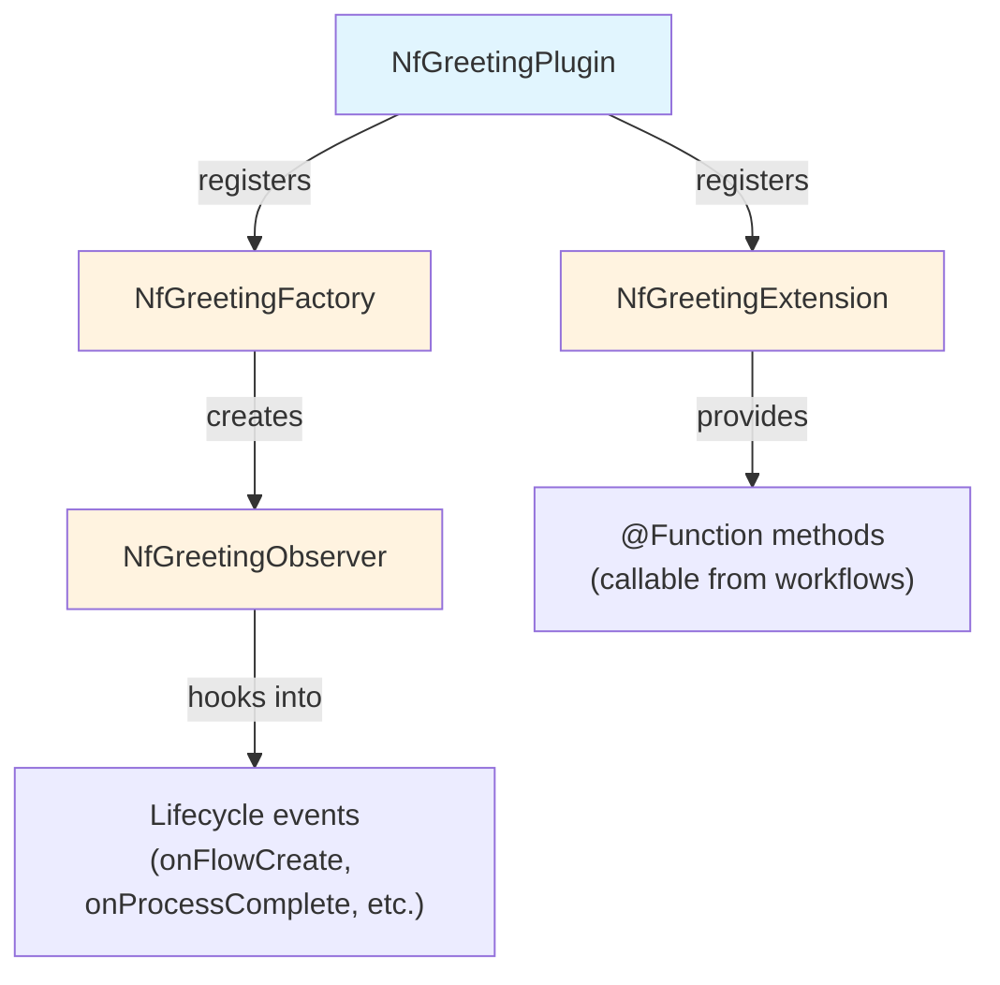
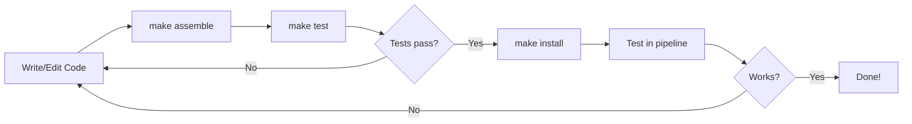

# Nextflow plugins

Nextflow's plugin system allows you to extend the language with custom functions, executors, and more.
In this side quest, you'll learn how to use existing plugins and optionally build your own.

!!! warning "Development sections are advanced"

    Using existing plugins (sections 1-2) is straightforward and valuable for all Nextflow users.

    However, **developing your own plugins** (sections 3 onwards) is an advanced topic.
    It involves Java/Groovy programming, build tools, and software engineering concepts that may be unfamiliar if you come from a pure bioinformatics background.

    Most Nextflow users will never need to develop plugins. The existing plugin ecosystem covers the vast majority of use cases.
    If development sections feel challenging, focus on sections 1-2 and bookmark the rest for later.

### Learning goals

In this side quest, you'll learn how to use existing Nextflow plugins and optionally create your own.

By the end of this side quest, you'll be able to:

**Using plugins (sections 1-2):**

- Understand what plugins are and how they extend Nextflow
- Install and configure existing plugins in your workflows
- Import and use plugin functions

**Developing plugins (sections 3-10):**

- Create a new plugin project
- Implement custom functions and trace observers
- Build, test, and distribute your plugin

### Prerequisites

Before taking on this side quest, you should:

- Have completed the [Hello Nextflow](../../hello_nextflow/) tutorial or equivalent beginner's course

For plugin development sections (3 onwards):

- Have Java 21 or later installed (check with `java -version`)
- Have basic familiarity with object-oriented programming concepts

!!! note "Development environment"

    This side quest requires Java and Gradle for building plugins.
    The training Codespace comes with Java pre-installed.

??? info "What are Java, Groovy, and Gradle?"

    If these terms are unfamiliar, here's a quick primer:

    **Java** is a widely-used programming language. Nextflow itself is built with Java, and plugins must be compatible with the Java runtime.

    **Groovy** is a programming language that runs on Java and is designed to be more concise and flexible. Nextflow's DSL is based on Groovy, which is why Nextflow syntax looks the way it does. Plugin code is typically written in Groovy.

    **Gradle** is a build tool that compiles code, runs tests, and packages software. You don't need to understand Gradle deeply; we'll use simple commands like `./gradlew build`.

    The good news: you don't need to be an expert in any of these. Many successful Nextflow plugin authors come from bioinformatics backgrounds, not Java development. We'll explain the relevant concepts as we go, and the plugin template handles most of the complexity for you.

---

## 0. Get started

### 0.1. Open the training codespace

If you haven't yet done so, make sure to open the training environment as described in the [Environment Setup](../envsetup/index.md).

[](https://codespaces.new/nextflow-io/training?quickstart=1&ref=master)

### 0.2. Verify Java installation

Check that Java is available:

```bash
java -version
```

You should see Java 21 or later.

### 0.3. Move into the project directory

```bash
cd side-quests/plugin_development
```

### 0.4. Review the materials

```console title="Directory contents"
.
├── greetings.csv
├── main.nf
├── nextflow.config
└── random_id_example.nf
```

We have a simple greeting pipeline and materials for both using and developing plugins.

### 0.5. What we'll cover

1. **Using plugins** (sections 1-2): Understand plugin architecture and use existing plugins like `nf-hello`
2. **Building a plugin** (sections 3-10): Create `nf-greeting` with custom functions and observers

### 0.6. Readiness checklist

- [ ] My codespace is running
- [ ] Java is installed (required for plugin development sections)

---

## 1. Plugin architecture

Before diving into plugin usage and development, let's understand what plugins are and how they extend Nextflow.

<!-- TODO: Add Excalidraw diagram showing plugin architecture
     File: docs/side_quests/img/plugin-architecture.excalidraw.svg
     Content: Show Nextflow core with extension points (Functions,
     Observers, etc.) and a plugin connecting to them via PF4J
-->

### 1.1. How plugins extend Nextflow

Nextflow's plugin system is built on [PF4J](https://pf4j.org/), a lightweight plugin framework for Java.
Plugins can extend Nextflow in several ways:

| Extension Type  | Purpose                                  | Example                 |
| --------------- | ---------------------------------------- | ----------------------- |
| Functions       | Custom functions callable from workflows | `samplesheetToList()`   |
| Executors       | Custom task execution backends           | AWS Batch, Kubernetes   |
| Filesystems     | Custom storage backends                  | S3, Azure Blob          |
| Trace Observers | Monitor workflow execution               | Custom logging, metrics |

<!-- TODO: Add Excalidraw diagram showing extension types
     File: docs/side_quests/img/plugin-extension-types.excalidraw.svg
     Content: Visual showing where each extension type plugs in:
     - Functions: called from workflow/process scripts
     - Trace Observers: hook into lifecycle events
     - Executors: submit tasks to compute backends
     - Filesystems: access remote storage
-->

Plugins can enhance Nextflow's functionality without modifying its core code, making them ideal for adding supplementary features to pipelines.

### 1.2. Why use plugins?

You can define custom functions directly in your Nextflow scripts, so why use plugins?

| Approach            | Best for               | Limitations                                 |
| ------------------- | ---------------------- | ------------------------------------------- |
| **Local functions** | Project-specific logic | Copy-paste between pipelines, no versioning |
| **Plugins**         | Reusable utilities     | Requires Java/Groovy knowledge to create    |

Plugins are ideal when you need to:

- Share functionality across multiple pipelines
- Extend existing pipelines with extra features (e.g., Slack notifications)
- Version and manage dependencies properly
- Access Nextflow internals (channels, sessions, lifecycle events, etc.)
- Integrate with external infrastructure (cloud platforms, storage systems)

### Takeaway

Plugins extend Nextflow through well-defined extension points: functions, observers, executors, and filesystems.
They allow the community to add features to Nextflow without modifying its core.

### What's next?

Let's see how to use existing plugins before we build our own.

---

## 2. Using existing plugins

Nextflow has a growing ecosystem of plugins that extend its functionality.
Let's see how to discover, install, and use them.

!!! tip "This is the most important section for most users"

    Even if you never develop your own plugin, knowing how to use existing plugins is valuable.
    Many powerful features are available through plugins, such as input validation with nf-schema.
    If plugin development seems daunting, focus on mastering this section first.

!!! info "Local vs published plugins"

    When you add a plugin to your `nextflow.config`, Nextflow automatically downloads it from the [plugin registry](https://registry.nextflow.io/) the first time you run your pipeline.
    The plugin is then cached locally in `$NXF_HOME/plugins/` (typically `~/.nextflow/plugins/`).

    Later in this tutorial (section 3 onwards), we'll develop our own plugin and install it locally for testing.
    Section 10 covers how to publish plugins for others to use.

!!! info "Official documentation"

    This section covers the essentials of using plugins.
    For comprehensive details, see the [official Nextflow plugins documentation](https://www.nextflow.io/docs/latest/plugins/plugins.html).

### 2.1. Discovering plugins

The [Nextflow Plugin Registry](https://registry.nextflow.io/) is the central hub for finding available plugins.
Browse the registry to discover plugins for:

- Input validation and samplesheet parsing
- Cloud platform integration (AWS, Google Cloud, Azure)
- Provenance tracking and reporting
- Notifications (Slack, Teams)
- And more

Each plugin page in the registry shows:

- Description and purpose
- Available versions
- Installation instructions
- Links to documentation and source code


You can also search GitHub for repositories with the `nf-` prefix, as most Nextflow plugins follow this naming convention.

??? exercise "Explore the registry"

    Take a few minutes to browse the [Nextflow Plugin Registry](https://registry.nextflow.io/).

    1. Find a plugin that provides Slack notifications
    2. Look at nf-schema - how many downloads does it have?
    3. Find a plugin that was released in the last month

    This familiarity will help you discover useful plugins for your own pipelines.

### 2.2. Installing plugins

Plugins are declared in your `nextflow.config` file using the `plugins {}` block:

```groovy title="nextflow.config"
plugins {
    id 'nf-schema@2.1.1'
}
```

Key points:

- Use the `id` keyword followed by the plugin name
- Specify a version with `@version` (recommended for reproducibility); if omitted, the latest version is used
- Nextflow automatically downloads plugins from the registry at runtime

### 2.3. Importing plugin functions

Once a plugin is installed, you can import its functions using the familiar `include` syntax with a special `plugin/` prefix:

```groovy title="main.nf"
include { samplesheetToList } from 'plugin/nf-schema'
```

This imports the `samplesheetToList` function from the nf-schema plugin, making it available in your workflow.

### 2.4. Example: Using nf-schema for validation

The nf-schema plugin is widely used in nf-core pipelines for input validation.
Here's how it works in practice:

```groovy title="main.nf" linenums="1"
#!/usr/bin/env nextflow

include { samplesheetToList } from 'plugin/nf-schema'

params.input = 'samplesheet.csv'

workflow {
    // Validate and parse input samplesheet
    ch_samples = Channel.fromList(
        samplesheetToList(params.input, "assets/schema_input.json")
    )

    ch_samples.view { sample -> "Sample: $sample" }
}
```

The `samplesheetToList` function:

1. Reads the input CSV file
2. Validates it against a JSON schema
3. Returns a list of validated entries
4. Throws helpful errors if validation fails

This pattern is used extensively in nf-core pipelines to ensure input data is valid before processing begins.

### 2.5. Plugin configuration

Some plugins accept configuration options in `nextflow.config`:

```groovy title="nextflow.config"
plugins {
    id 'nf-schema@2.1.1'
}

// Plugin-specific configuration
validation {
    monochromeLogs = true
    ignoreParams = ['custom_param']
}
```

Each plugin documents its configuration options.
Check the plugin's documentation for available settings.

### 2.6. Try it: Using the nf-hello plugin

The [nf-hello](https://github.com/nextflow-io/nf-hello) plugin provides a `randomString` function that generates random strings.
Let's use it in a workflow.

#### See the starting point

First, look at what we're working with. The `random_id_example.nf` file contains a workflow with an embedded `randomString` function:

```bash
cat random_id_example.nf
```

Notice the function is defined locally in the file. Run it to see how it works:

```bash
nextflow run random_id_example.nf
```

This works, but the function is trapped in this file. Let's replace it with the plugin version.

#### Configure the plugin

First, add the plugin to your `nextflow.config`:

```groovy title="nextflow.config"
plugins {
    id 'nf-hello@0.5.0'
}
```

#### Use the plugin function

Create a workflow that uses `randomString` to generate sample IDs:

```groovy title="random_id_example.nf"
#!/usr/bin/env nextflow

include { randomString } from 'plugin/nf-hello'

workflow {
    // Generate random IDs for each sample
    Channel.of('sample_A', 'sample_B', 'sample_C')
        .map { sample -> "${sample}_${randomString(8)}" }
        .view()
}
```

#### Run it

```bash
nextflow run random_id_example.nf
```

```console title="Output"
sample_A_xK9mPq2R
sample_B_Lw3nYh8J
sample_C_Bf5tVc1D
```

(Your random strings will be different!)

The first run downloads the plugin automatically. Any pipeline using `nf-hello@0.5.0` gets the exact same `randomString` function.

Note that we're using a function someone else wrote. The development burden is on the plugin developer, not the pipeline developer. Nextflow also handles installing and updating plugins on your behalf.

### Takeaway

Using plugins is straightforward: declare them in `nextflow.config`, import their functions, and use them in your workflows.
The plugin ecosystem extends Nextflow with features like validation, cloud integration, and provenance tracking.

### What's next?

Now that you understand how to use plugins, let's build our own.

---

## 3. Creating a plugin project

!!! info "Official documentation"

    This section and those that follow cover plugin development essentials.
    For comprehensive details, see the [official Nextflow plugin development documentation](https://www.nextflow.io/docs/latest/plugins/developing-plugins.html).

### 3.1. Using the Nextflow plugin create command

The easiest way to create a plugin is with the built-in command:

```bash
nextflow plugin create nf-greeting training
```

This scaffolds a complete plugin project.
The first argument is the plugin name, and the second is your organization name (used for the package namespace).

!!! tip "Manual creation"

    You can also create plugin projects manually or use the [nf-hello template](https://github.com/nextflow-io/nf-hello) on GitHub as a starting point.

### 3.2. Understand the plugin architecture

Before diving into the generated files, let's understand how the pieces fit together:



| Class                  | Purpose                                              |
| ---------------------- | ---------------------------------------------------- |
| `NfGreetingPlugin`     | Entry point that registers all extension points      |
| `NfGreetingExtension`  | Contains `@Function` methods callable from workflows |
| `NfGreetingFactory`    | Creates trace observer instances                     |
| `NfGreetingObserver`   | Hooks into workflow lifecycle events                 |

This separation keeps concerns organized: functions go in the Extension, event handling goes in Observers created by the Factory.

### 3.3. Examine the generated project

Change into the plugin directory:

```bash
cd nf-greeting
```

List the contents:

```bash
tree
```

You should see:

```console
.
├── build.gradle
├── COPYING
├── gradle
│   └── wrapper
│       ├── gradle-wrapper.jar
│       └── gradle-wrapper.properties
├── gradlew
├── Makefile
├── README.md
├── settings.gradle
└── src
    ├── main
    │   └── groovy
    │       └── training
    │           └── plugin
    │               ├── NfGreetingExtension.groovy
    │               ├── NfGreetingFactory.groovy
    │               ├── NfGreetingObserver.groovy
    │               └── NfGreetingPlugin.groovy
    └── test
        └── groovy
            └── training
                └── plugin
                    └── NfGreetingObserverTest.groovy

11 directories, 13 files
```

### 3.4. Understand settings.gradle

```bash
cat settings.gradle
```

```groovy title="settings.gradle"
rootProject.name = 'nf-greeting'
```

This simply sets the project name.

### 3.5. Understand build.gradle

```bash
cat build.gradle
```

Key sections in the build file:

```groovy title="build.gradle"
plugins {
    id 'io.nextflow.nextflow-plugin' version '0.0.1-alpha4'
}

version = '0.1.0'

nextflowPlugin {
    nextflowVersion = '24.10.0'

    provider = 'training'
    className = 'training.plugin.NfGreetingPlugin'
    extensionPoints = [
        'training.plugin.NfGreetingExtension',
        'training.plugin.NfGreetingFactory'
    ]

    publishing {
        registry {
            url = 'https://nf-plugins-registry.dev-tower.net/api'
            authToken = project.findProperty('pluginRegistry.accessToken')
        }
    }
}
```

The `nextflowPlugin` block configures:

- `nextflowVersion`: Minimum Nextflow version required
- `provider`: Your name or organization
- `className`: The main plugin class (uses your package name)
- `extensionPoints`: Classes providing extensions (functions, observers, etc.)
- `publishing`: Configuration for publishing to the plugin registry (optional)

### Takeaway

The `nextflow plugin create` command scaffolds a complete project.
The `build.gradle` file configures the plugin metadata and dependencies.

### What's next?

Let's implement our custom functions.

---

## 4. Implementing custom functions

### 4.1. The PluginExtensionPoint class

Functions are defined in classes that extend `PluginExtensionPoint`.
Open the extension file:

```bash
cat src/main/groovy/training/plugin/NfGreetingExtension.groovy
```

The template includes a sample `sayHello` function.
We'll replace it with our own functions, adding them one at a time to understand the pattern.

??? info "Understanding the Groovy syntax"

    If the code looks unfamiliar, here's a breakdown of the key elements:

    **`package training.plugin`** - Declares which package (folder structure) this code belongs to. This must match the directory structure.

    **`import ...`** - Brings in code from other packages, similar to Python's `import` or R's `library()`.

    **`@CompileStatic`** - An annotation (marked with `@`) that tells Groovy to check types at compile time. This catches errors earlier.

    **`class NfGreetingExtension extends PluginExtensionPoint`** - Defines a class that inherits from `PluginExtensionPoint`. The `extends` keyword means "this class is a type of that class."

    **`@Override`** - Indicates we're replacing a method from the parent class.

    **`@Function`** - The key annotation that makes a method available as a Nextflow function.

    **`String reverseGreeting(String greeting)`** - A method that takes a String parameter and returns a String. In Groovy, you can often omit `return`; the last expression is returned automatically.

### 4.2. Add the first function: reverseGreeting

Let's replace the template's `sayHello` function with our first custom function that reverses a greeting string.

Edit `src/main/groovy/training/plugin/NfGreetingExtension.groovy` to replace the `sayHello` method:

=== "After"

    ```groovy title="NfGreetingExtension.groovy" linenums="24" hl_lines="8-14"
    @CompileStatic
    class NfGreetingExtension extends PluginExtensionPoint {

        @Override
        protected void init(Session session) {
        }

        /**
         * Reverse a greeting string
         */
        @Function
        String reverseGreeting(String greeting) {
            return greeting.reverse()
        }

    }
    ```

=== "Before"

    ```groovy title="NfGreetingExtension.groovy" linenums="24" hl_lines="12-20"
    /**
     * Implements a custom function which can be imported by
     * Nextflow scripts.
     */
    @CompileStatic
    class NfGreetingExtension extends PluginExtensionPoint {

        @Override
        protected void init(Session session) {
        }

        /**
         * Say hello to the given target.
         *
         * @param target
         */
        @Function
        void sayHello(String target) {
            println "Hello, ${target}!"
        }

    }
    ```

The key parts of this function:

- **`@Function`** - This annotation makes the method callable from Nextflow workflows
- **`String reverseGreeting(String greeting)`** - Takes a String, returns a String
- **`greeting.reverse()`** - Groovy's built-in string reversal method

### 4.3. Add the second function: decorateGreeting

Now add a second function that wraps a greeting with decorative markers.

Add this method after `reverseGreeting`, before the closing brace of the class:

=== "After"

    ```groovy title="NfGreetingExtension.groovy" linenums="24" hl_lines="16-22"
    @CompileStatic
    class NfGreetingExtension extends PluginExtensionPoint {

        @Override
        protected void init(Session session) {
        }

        /**
         * Reverse a greeting string
         */
        @Function
        String reverseGreeting(String greeting) {
            return greeting.reverse()
        }

        /**
         * Decorate a greeting with celebratory markers
         */
        @Function
        String decorateGreeting(String greeting) {
            return "*** ${greeting} ***"
        }

    }
    ```

=== "Before"

    ```groovy title="NfGreetingExtension.groovy" linenums="24"
    @CompileStatic
    class NfGreetingExtension extends PluginExtensionPoint {

        @Override
        protected void init(Session session) {
        }

        /**
         * Reverse a greeting string
         */
        @Function
        String reverseGreeting(String greeting) {
            return greeting.reverse()
        }

    }
    ```

This function uses Groovy string interpolation (`"*** ${greeting} ***"`) to embed the greeting variable inside a string.

### 4.4. Add the third function: friendlyGreeting

Finally, add a function that demonstrates default parameter values.

Add this method after `decorateGreeting`:

=== "After"

    ```groovy title="NfGreetingExtension.groovy" linenums="24" hl_lines="24-30"
    @CompileStatic
    class NfGreetingExtension extends PluginExtensionPoint {

        @Override
        protected void init(Session session) {
        }

        /**
         * Reverse a greeting string
         */
        @Function
        String reverseGreeting(String greeting) {
            return greeting.reverse()
        }

        /**
         * Decorate a greeting with celebratory markers
         */
        @Function
        String decorateGreeting(String greeting) {
            return "*** ${greeting} ***"
        }

        /**
         * Convert greeting to a friendly format with a name
         */
        @Function
        String friendlyGreeting(String greeting, String name = 'World') {
            return "${greeting}, ${name}!"
        }

    }
    ```

=== "Before"

    ```groovy title="NfGreetingExtension.groovy" linenums="24"
    @CompileStatic
    class NfGreetingExtension extends PluginExtensionPoint {

        @Override
        protected void init(Session session) {
        }

        /**
         * Reverse a greeting string
         */
        @Function
        String reverseGreeting(String greeting) {
            return greeting.reverse()
        }

        /**
         * Decorate a greeting with celebratory markers
         */
        @Function
        String decorateGreeting(String greeting) {
            return "*** ${greeting} ***"
        }

    }
    ```

The `String name = 'World'` syntax provides a default value, just like in Python.
Users can call `friendlyGreeting('Hello')` or `friendlyGreeting('Hello', 'Alice')`.

### 4.5. Understanding the @Function annotation

The `@Function` annotation marks a method as callable from Nextflow workflows.

Key requirements:

- **Methods must be public**: In Groovy, methods are public by default
- **Return type**: Can be any serializable type (`String`, `List`, `Map`, etc.)
- **Parameters**: Can have any number of parameters, including default values

Once defined, functions are available via the `include` statement:

```groovy
include { reverseGreeting; decorateGreeting } from 'plugin/nf-greeting'
```

### 4.6. The init() method

The `init()` method is called when the plugin loads:

```groovy
@Override
void init(Session session) {
    // Access session configuration
    // Initialize resources
    // Set up state
}
```

You can access configuration via `session.config`.

### Takeaway

Functions are defined with the `@Function` annotation in `PluginExtensionPoint` subclasses.
They become available to import in Nextflow workflows.

### What's next?

Let's build and test our plugin.

---

## 5. Building and testing

??? info "Why do we need to build?"

    If you're used to scripting languages like Python, R, or even Nextflow's DSL, you might wonder why we need a "build" step at all.
    In those languages, you write code and run it directly.

    Nextflow plugins are written in Groovy, which runs on the Java Virtual Machine (JVM).
    JVM languages need to be **compiled** before they can run. The human-readable source code is converted into bytecode that the JVM can execute.

    The build process:

    1. **Compiles** your Groovy code into JVM bytecode
    2. **Packages** it into a JAR file (Java ARchive, like a ZIP of compiled code)
    3. **Bundles** metadata so Nextflow knows how to load the plugin

    The build tools handle all this automatically. Just run `make assemble` and let Gradle do the work.

The plugin development cycle follows a simple pattern:



### 5.1. Build the plugin

The Makefile provides convenient commands:

```bash
make assemble
```

Or directly with the Gradle wrapper:

```bash
./gradlew assemble
```

??? info "What is `./gradlew`?"

    The `./gradlew` script is the **Gradle wrapper**, a small script included with the project that automatically downloads and runs the correct version of Gradle.

    This means you don't need Gradle installed on your system.
    The first time you run `./gradlew`, it will download Gradle (which may take a moment), then run your command.

    The `make` commands in the Makefile are just shortcuts that call `./gradlew` for you.

??? example "Build output"

    The first time you run this, Gradle will download itself (this may take a minute):

    ```console
    Downloading https://services.gradle.org/distributions/gradle-8.14-bin.zip
    ...10%...20%...30%...40%...50%...60%...70%...80%...90%...100%

    Welcome to Gradle 8.14!
    ...

    Deprecated Gradle features were used in this build...

    BUILD SUCCESSFUL in 23s
    4 actionable tasks: 4 executed
    ```

    **Don't worry about the warnings!**

    - **"Downloading gradle..."**: This only happens the first time. Subsequent builds are much faster.
    - **"Deprecated Gradle features..."**: This warning comes from the plugin template, not your code. It's safe to ignore.
    - **"BUILD SUCCESSFUL"**: This is what matters! Your plugin compiled without errors.

### 5.2. Write unit tests

Good plugins have tests.
Tests verify that your code works correctly and help catch bugs when you make changes later.

??? info "What are unit tests?"

    **Unit tests** are small pieces of code that automatically check if your functions work correctly.
    Each test calls a function with known inputs and checks that the output matches what you expect.

    For example, if you have a function that reverses strings, a test might check that `reverse("Hello")` returns `"olleH"`.

    Tests are valuable because:

    - They catch bugs before users do
    - They give you confidence to make changes without breaking things
    - They serve as documentation showing how functions should be used

    You don't need to write tests to use a plugin, but they're good practice for any code you plan to share or maintain.

The generated project includes a test for the Observer class, but we need to create a new test file for our extension functions.

#### Understanding Spock tests

The plugin template uses [Spock](https://spockframework.org/), a testing framework for Groovy that reads almost like plain English.
Here's the basic structure:

```groovy
def 'should reverse a greeting'() {   // (1)!
    given:                             // (2)!
    def ext = new NfGreetingExtension()

    expect:                            // (3)!
    ext.reverseGreeting('Hello') == 'olleH'
}
```

1. **Test name in quotes**: Describes what the test checks. Use plain English!
2. **`given:` block**: Set up what you need for the test (create objects, prepare data)
3. **`expect:` block**: The actual checks. Each line should be `true` for the test to pass

This structure makes tests readable: "Given an extension object, expect that `reverseGreeting('Hello')` equals `'olleH'`."

#### Create the test file

```bash
touch src/test/groovy/training/plugin/NfGreetingExtensionTest.groovy
```

Open it in your editor and add the following content:

```groovy title="src/test/groovy/training/plugin/NfGreetingExtensionTest.groovy" linenums="1"
package training.plugin

import spock.lang.Specification

/**
 * Tests for the greeting extension functions
 */
class NfGreetingExtensionTest extends Specification {

    def 'should reverse a greeting'() {
        given:
        def ext = new NfGreetingExtension()

        expect:
        ext.reverseGreeting('Hello') == 'olleH'
        ext.reverseGreeting('Bonjour') == 'ruojnoB'
    }

    def 'should decorate a greeting'() {
        given:
        def ext = new NfGreetingExtension()

        expect:
        ext.decorateGreeting('Hello') == '*** Hello ***'
    }

    def 'should create friendly greeting with default name'() {
        given:
        def ext = new NfGreetingExtension()

        expect:
        ext.friendlyGreeting('Hello') == 'Hello, World!'
    }

    def 'should create friendly greeting with custom name'() {
        given:
        def ext = new NfGreetingExtension()

        expect:
        ext.friendlyGreeting('Hello', 'Alice') == 'Hello, Alice!'
    }
}
```

### 5.3. Run the tests

```bash
make test
```

Or:

```bash
./gradlew test
```

??? example "Test output"

    ```console
    BUILD SUCCESSFUL in 5s
    6 actionable tasks: 2 executed, 4 up-to-date
    ```

    **Where are the test results?** Gradle hides detailed output when all tests pass - "BUILD SUCCESSFUL" means everything worked! If any test fails, you'll see detailed error messages.

### 5.4. View the test report

To see detailed results for each test, you can view the HTML test report that Gradle generates.

Start a simple web server in the test report directory:

```bash
pushd build/reports/tests/test
python -m http.server
```

VS Code will prompt you to open the application in your browser.
Click through to your test class to see individual test results:


The report shows each test method, its duration, and whether it passed or failed.
This confirms that all four of our greeting functions are being tested correctly.

Press ++ctrl+c++ in the terminal to stop the server when you're done, then return to the plugin directory:

```bash
popd
```

!!! tip "If the build fails"

    Build errors can be intimidating, but they usually point to a specific problem.
    Common issues include:

    - **Syntax errors**: A missing bracket, quote, or semicolon. The error message usually includes a line number.
    - **Import errors**: A class name is misspelled or the import statement is missing.
    - **Type errors**: You're passing the wrong type of data to a function.
    - **"cannot find symbol"**: You're using a variable that wasn't declared. Check that you've added the instance variable (e.g., `private String prefix`) before using it.

    Read the error message carefully. It often tells you exactly what's wrong and where.
    If you're stuck, compare your code character-by-character with the examples.

??? warning "Common runtime issues"

    Even if the build succeeds, you might encounter issues when running:

    - **"Plugin not found"**: Did you run `make install`? The plugin must be installed locally before Nextflow can use it.
    - **"Unknown function"**: Check that you've imported the function with `include { functionName } from 'plugin/nf-greeting'`.
    - **Wrong directory**: Make sure you're in the right directory. Use `pwd` to check, and `cd ..` or `cd nf-greeting` as needed.
    - **IDE showing errors**: The VS Code Nextflow extension may show warnings for plugin imports. If the build succeeds and Nextflow runs correctly, you can ignore these.

### 5.5. Install locally

To use the plugin with Nextflow, install it to your local plugins directory:

```bash
make install
```

??? example "Expected output"

    ```console
    > Task :installPlugin
    Plugin nf-greeting@0.1.0 installed to /home/codespace/.nextflow/plugins

    BUILD SUCCESSFUL in 1s
    ```

    The exact path will vary depending on your environment, but you should see "Plugin nf-greeting@0.1.0 installed" and "BUILD SUCCESSFUL".

This copies the plugin to `$NXF_HOME/plugins/` (typically `~/.nextflow/plugins/`).

### Takeaway

Use `make assemble` to compile and `make test` to run tests.
Install with `make install` to use the plugin locally.

### What's next?

Let's use our plugin in a workflow.

---

## 6. Using your plugin

### 6.1. Configure the plugin

Go back to the pipeline directory:

```bash
cd ..
```

Edit `nextflow.config` to replace the `nf-hello` plugin with our new `nf-greeting` plugin:

=== "After"

    ```groovy title="nextflow.config" hl_lines="3"
    // Configuration for plugin development exercises
    plugins {
        id 'nf-greeting@0.1.0'
    }
    ```

=== "Before"

    ```groovy title="nextflow.config" hl_lines="3"
    // Configuration for plugin development exercises
    plugins {
        id 'nf-hello@0.5.0'
    }
    ```

We're replacing `nf-hello` with `nf-greeting` because we want to use our own plugin's functions instead.

!!! note "What about random_id_example.nf?"

    The `random_id_example.nf` file we modified earlier still imports from `nf-hello`, so it won't work with this config change.
    That's fine - we won't use it again. We'll work with `main.nf` from here on.

!!! note "Version required for local plugins"

    When using locally installed plugins, you must specify the version (e.g., `nf-greeting@0.1.0`).
    Published plugins in the registry can use just the name.

### 6.2. Import and use functions

We provided a simple greeting pipeline in `main.nf` that reads greetings from a CSV file and writes them to output files.

#### See the starting point

First, run the pipeline as-is to see what we're working with:

```bash
nextflow run main.nf
```

```console title="Output"
Output: Hello
Output: Bonjour
Output: Holà
Output: Ciao
Output: Hallo
```

Now let's look at the code:

```bash
cat main.nf
```

```groovy title="main.nf (starting point)"
#!/usr/bin/env nextflow

params.input = 'greetings.csv'

process SAY_HELLO {
    input:
        val greeting
    output:
        stdout
    script:
    """
    echo '$greeting'
    """
}

workflow {
    greeting_ch = channel.fromPath(params.input)
                        .splitCsv(header: true)
                        .map { row -> row.greeting }
    SAY_HELLO(greeting_ch)
    SAY_HELLO.out.view { result -> "Output: ${result.trim()}" }
}
```

Now let's enhance it to use our plugin functions.
Edit `main.nf` to import and use the custom functions:

=== "After"

    ```groovy title="main.nf" hl_lines="4-5 15-18 28-30 33" linenums="1"
    #!/usr/bin/env nextflow

    // Import custom functions from our plugin
    include { reverseGreeting } from 'plugin/nf-greeting'
    include { decorateGreeting } from 'plugin/nf-greeting'

    params.input = 'greetings.csv'

    process SAY_HELLO {
        input:
            val greeting
        output:
            stdout
        script:
        // Use our custom plugin function to decorate the greeting
        def decorated = decorateGreeting(greeting)
        """
        echo '$decorated'
        """
    }

    workflow {
        greeting_ch = channel.fromPath(params.input)
                            .splitCsv(header: true)
                            .map { row -> row.greeting }

        // Demonstrate using reverseGreeting function
        greeting_ch
            .map { greeting -> reverseGreeting(greeting) }
            .view { reversed -> "Reversed: $reversed" }

        SAY_HELLO(greeting_ch)
        SAY_HELLO.out.view { result -> "Decorated: ${result.trim()}" }
    }
    ```

=== "Before"

    ```groovy title="main.nf" linenums="1" hl_lines="11 12 21"
    #!/usr/bin/env nextflow

    params.input = 'greetings.csv'

    process SAY_HELLO {
        input:
            val greeting
        output:
            stdout
        script:
        """
        echo '$greeting'
        """
    }

    workflow {
        greeting_ch = channel.fromPath(params.input)
                            .splitCsv(header: true)
                            .map { row -> row.greeting }
        SAY_HELLO(greeting_ch)
        SAY_HELLO.out.view { result -> "Output: ${result.trim()}" }
    }
    ```

The key changes:

- **Lines 4-5**: Import our plugin functions using `include { function } from 'plugin/plugin-name'`
- **Lines 17-18**: Use `decorateGreeting()` **inside the process script** to transform the greeting before output
- **Lines 28-30**: Use `reverseGreeting()` **in a `map` operation** to transform channel items in the workflow

Plugin functions work in both process scripts and workflow operations.

### 6.3. Run the pipeline

```bash
nextflow run main.nf
```

??? example "Output"

    ```console
    N E X T F L O W   ~  version 25.04.3

    Launching `main.nf` [elated_marconi] DSL2 - revision: cd8d52c97c

    Pipeline is starting! 🚀
    executor >  local (5)
    [fe/109754] process > SAY_HELLO (5) [100%] 5 of 5 ✔
    Reversed: olleH
    Reversed: ruojnoB
    Reversed: àloH
    Reversed: oaiC
    Reversed: ollaH
    Decorated: *** Hello ***
    Decorated: *** Bonjour ***
    Decorated: *** Holà ***
    Decorated: *** Ciao ***
    Decorated: *** Hallo ***
    Pipeline complete! 🎉
    ```

    The "Pipeline is starting!" and "Pipeline complete!" messages come from the `NfGreetingObserver` trace observer that was included in the generated plugin template.

The `decorateGreeting()` function wraps each greeting with decorative markers, and `reverseGreeting()` shows the reversed strings.

### Takeaway

Import plugin functions with `include { function } from 'plugin/plugin-id'`.
Once imported, you can use them anywhere:

- **In process scripts**: `decorateGreeting()` transforms data before output
- **In workflow operations**: `reverseGreeting()` in a `map` closure

### What's next?

Let's explore other extension types.

---

## 7. Trace observers

In section 1.1, we saw that plugins can provide many types of extensions.
So far we've implemented custom functions.
Now let's explore **trace observers**, which let you hook into workflow lifecycle events.

### 7.1. Understanding the existing trace observer

Remember the "Pipeline is starting! 🚀" message when you ran the pipeline?
That came from the `NfGreetingObserver` class in your plugin.

Look at the observer code:

```bash
cat nf-greeting/src/main/groovy/training/plugin/NfGreetingObserver.groovy
```

This observer hooks into workflow lifecycle events.
Trace observers can respond to many events:

| Method              | When it's called        |
| ------------------- | ----------------------- |
| `onFlowCreate`      | Workflow starts         |
| `onFlowComplete`    | Workflow finishes       |
| `onProcessStart`    | A task begins execution |
| `onProcessComplete` | A task finishes         |
| `onProcessCached`   | A cached task is reused |
| `onFilePublish`     | A file is published     |

This enables powerful use cases like custom reports, Slack notifications, or metrics collection.

### 7.2. Try it: Add a task counter observer

Rather than modifying the existing observer, let's create a new one that counts completed tasks.
We'll build it up progressively - first a minimal version, then add features.

#### Step 1: Create a minimal observer

Create a new file:

```bash
touch nf-greeting/src/main/groovy/training/plugin/TaskCounterObserver.groovy
```

Start with the simplest possible observer - just print a message when any task completes:

```groovy title="nf-greeting/src/main/groovy/training/plugin/TaskCounterObserver.groovy" linenums="1"
package training.plugin

import groovy.transform.CompileStatic
import nextflow.processor.TaskHandler
import nextflow.trace.TraceObserver
import nextflow.trace.TraceRecord

/**
 * Observer that responds to task completion
 */
@CompileStatic
class TaskCounterObserver implements TraceObserver {

    @Override
    void onProcessComplete(TaskHandler handler, TraceRecord trace) {
        println "✓ Task completed!"
    }
}
```

This is the minimum needed:

- Import the required classes (`TraceObserver`, `TaskHandler`, `TraceRecord`)
- Create a class that `implements TraceObserver`
- Override `onProcessComplete` to do something when a task finishes

#### Step 2: Register the observer

The `NfGreetingFactory` creates observers. Take a look at it:

```bash
cat nf-greeting/src/main/groovy/training/plugin/NfGreetingFactory.groovy
```

```groovy title="NfGreetingFactory.groovy (starting point)"
@CompileStatic
class NfGreetingFactory implements TraceObserverFactory {

    @Override
    Collection<TraceObserver> create(Session session) {
        return List.<TraceObserver>of(new NfGreetingObserver())
    }
}
```

Edit `NfGreetingFactory.groovy` to add our new observer:

=== "After"

    ```groovy title="NfGreetingFactory.groovy" linenums="31" hl_lines="3-6"
    @Override
    Collection<TraceObserver> create(Session session) {
        return [
            new NfGreetingObserver(),
            new TaskCounterObserver()
        ]
    }
    ```

=== "Before"

    ```groovy title="NfGreetingFactory.groovy" linenums="31" hl_lines="3"
    @Override
    Collection<TraceObserver> create(Session session) {
        return List.<TraceObserver>of(new NfGreetingObserver())
    }
    ```

!!! note "Groovy list syntax"

    We've replaced the Java-style `List.<TraceObserver>of(...)` with Groovy's simpler list literal `[...]`.
    Both return a `Collection`, but the Groovy syntax is more readable when adding multiple items.

Build, install, and test:

```bash
cd nf-greeting && make assemble && make install && cd ..
nextflow run main.nf -ansi-log false
```

You should see "✓ Task completed!" printed five times (once per task):

```console title="Expected output (partial)"
...
[be/bd8e72] Submitted process > SAY_HELLO (2)
✓ Task completed!
[5b/d24c2b] Submitted process > SAY_HELLO (1)
✓ Task completed!
...
```

It works! Our observer is responding to task completion events. Now let's make it more useful.

#### Step 3: Add counting logic

Update `TaskCounterObserver.groovy` to track a count and report a summary:

```groovy title="nf-greeting/src/main/groovy/training/plugin/TaskCounterObserver.groovy" linenums="1" hl_lines="14 17-18 22-24"
package training.plugin

import groovy.transform.CompileStatic
import nextflow.processor.TaskHandler
import nextflow.trace.TraceObserver
import nextflow.trace.TraceRecord

/**
 * Observer that counts completed tasks
 */
@CompileStatic
class TaskCounterObserver implements TraceObserver {

    private int taskCount = 0

    @Override
    void onProcessComplete(TaskHandler handler, TraceRecord trace) {
        taskCount++
        println "📊 Tasks completed so far: ${taskCount}"
    }

    @Override
    void onFlowComplete() {
        println "📈 Final task count: ${taskCount}"
    }
}
```

The key additions:

- **Line 14**: A private instance variable `taskCount` persists across method calls
- **Lines 17-18**: Increment the counter and print the running total
- **Lines 22-24**: `onFlowComplete` is called once when the workflow finishes - perfect for a summary

Rebuild and test:

```bash
cd nf-greeting && make assemble && make install && cd ..
nextflow run main.nf -ansi-log false
```

```console title="Expected output"
N E X T F L O W  ~  version 25.04.3
Launching `main.nf` [pensive_engelbart] DSL2 - revision: 85fefd90d0
Pipeline is starting! 🚀
Reversed: olleH
Reversed: ruojnoB
Reversed: àloH
Reversed: oaiC
Reversed: ollaH
[be/bd8e72] Submitted process > SAY_HELLO (2)
[5b/d24c2b] Submitted process > SAY_HELLO (1)
[14/1f9dbe] Submitted process > SAY_HELLO (3)
Decorated: *** Bonjour ***
Decorated: *** Hello ***
[85/a6b3ad] Submitted process > SAY_HELLO (4)
📊 Tasks completed so far: 1
📊 Tasks completed so far: 2
Decorated: *** Holà ***
📊 Tasks completed so far: 3
Decorated: *** Ciao ***
[3c/be6686] Submitted process > SAY_HELLO (5)
📊 Tasks completed so far: 4
Decorated: *** Hallo ***
📊 Tasks completed so far: 5
Pipeline complete! 👋
📈 Final task count: 5
```

!!! tip "Why `-ansi-log false`?"

    By default, Nextflow's ANSI progress display overwrites previous lines to show a clean, updating view of progress.
    This means you'd only see the *final* task count, not the intermediate "Tasks completed so far" messages - they'd be overwritten as new output arrives.

    Using `-ansi-log false` disables this behavior and shows all output sequentially, which is essential when testing observers that print messages during execution.
    Without this flag, you might think your observer isn't working when it actually is - the output is just being overwritten.

### Takeaway

Trace observers hook into workflow lifecycle events like `onFlowCreate`, `onProcessComplete`, and `onFlowComplete`.
They're useful for custom logging, metrics collection, notifications, and reporting.

### What's next?

Let's see how plugins can read configuration from `nextflow.config`.

---

## 8. Configuration

### 8.1. Configuration-driven behavior

Plugins can read configuration from `nextflow.config`, letting users customize behavior.

The `session.config.navigate()` method reads nested configuration values:

```groovy
// Read 'greeting.enabled' from nextflow.config, defaulting to true
final enabled = session.config.navigate('greeting.enabled', true)
```

This lets users control plugin behavior without modifying code:

```groovy title="nextflow.config"
greeting {
    enabled = false
}
```

??? info "Alternative: Type-safe configuration (advanced)"

    For production plugins, you can define configuration as a proper class with annotations instead of using `session.config.navigate()`.
    This enables IDE autocompletion, linting support, and type checking.

    Here's what it looks like:

    ```groovy title="GreetingConfig.groovy"
    package training.plugin

    import nextflow.config.dsl.ConfigOption
    import nextflow.config.dsl.ConfigScope

    @ConfigScope('greeting')
    class GreetingConfig {

        @ConfigOption
        boolean enabled = true

        @ConfigOption
        String prefix = '***'

        @ConfigOption
        String suffix = '***'

        @ConfigOption('taskCounter.verbose')
        boolean taskCounterVerbose = true
    }
    ```

    You'd then register this in `build.gradle`:

    ```groovy
    extensionPoints = [
        'training.plugin.NfGreetingExtension',
        'training.plugin.NfGreetingFactory',
        'training.plugin.GreetingConfig'  // Add config class
    ]
    ```

    And access it in your code:

    ```groovy
    @Override
    protected void init(Session session) {
        def config = session.configScope(GreetingConfig)
        prefix = config.prefix
        suffix = config.suffix
    }
    ```

    **Benefits**: IDE autocompletion for users, type validation, cleaner code.

    **Trade-off**: More boilerplate, requires understanding annotations.

    The `session.config.navigate()` approach we use in this tutorial works well for most cases.
    See the [official documentation](https://nextflow.io/docs/latest/developer/config-scopes.html) for full details.

### 8.2. Try it: Make the task counter configurable

Let's add configuration options to:

1. Enable/disable the entire greeting plugin
2. Control whether per-task counter messages are shown

First, edit `TaskCounterObserver.groovy` to accept a configuration flag:

=== "After"

    ```groovy title="TaskCounterObserver.groovy" linenums="1" hl_lines="14 17-19 24-26"
    package training.plugin

    import groovy.transform.CompileStatic
    import nextflow.processor.TaskHandler
    import nextflow.trace.TraceObserver
    import nextflow.trace.TraceRecord

    /**
     * Observer that counts completed tasks
     */
    @CompileStatic
    class TaskCounterObserver implements TraceObserver {

        private final boolean verbose
        private int taskCount = 0

        TaskCounterObserver(boolean verbose) {
            this.verbose = verbose
        }

        @Override
        void onProcessComplete(TaskHandler handler, TraceRecord trace) {
            taskCount++
            if (verbose) {
                println "📊 Tasks completed so far: ${taskCount}"
            }
        }

        @Override
        void onFlowComplete() {
            println "📈 Final task count: ${taskCount}"
        }
    }
    ```

=== "Before"

    ```groovy title="TaskCounterObserver.groovy" linenums="1" hl_lines="19"
    package training.plugin

    import groovy.transform.CompileStatic
    import nextflow.processor.TaskHandler
    import nextflow.trace.TraceObserver
    import nextflow.trace.TraceRecord

    /**
     * Observer that counts completed tasks
     */
    @CompileStatic
    class TaskCounterObserver implements TraceObserver {

        private int taskCount = 0

        @Override
        void onProcessComplete(TaskHandler handler, TraceRecord trace) {
            taskCount++
            println "📊 Tasks completed so far: ${taskCount}"
        }

        @Override
        void onFlowComplete() {
            println "📈 Final task count: ${taskCount}"
        }
    }
    ```

The key changes:

- **Line 14**: Add a `verbose` flag to control whether per-task messages are printed
- **Lines 17-19**: Constructor that accepts the verbose setting
- **Lines 24-26**: Only print per-task messages if `verbose` is true

Now update `NfGreetingFactory.groovy` to read the configuration and pass it to the observer:

=== "After"

    ```groovy title="NfGreetingFactory.groovy" linenums="31" hl_lines="3-6 9"
    @Override
    Collection<TraceObserver> create(Session session) {
        final enabled = session.config.navigate('greeting.enabled', true)
        if (!enabled) return []

        final verbose = session.config.navigate('greeting.taskCounter.verbose', true) as boolean
        return [
            new NfGreetingObserver(),
            new TaskCounterObserver(verbose)
        ]
    }
    ```

=== "Before"

    ```groovy title="NfGreetingFactory.groovy" linenums="31"
    @Override
    Collection<TraceObserver> create(Session session) {
        return [
            new NfGreetingObserver(),
            new TaskCounterObserver()
        ]
    }
    ```

The factory now:

- **Lines 33-34**: Reads the `greeting.enabled` config and returns early if disabled
- **Line 36**: Reads the `greeting.taskCounter.verbose` config (defaulting to `true`)
- **Line 39**: Passes the verbose setting to the `TaskCounterObserver` constructor

Rebuild and reinstall the plugin:

```bash
cd nf-greeting && make assemble && make install && cd ..
```

Now update `nextflow.config` to disable the per-task messages:

=== "After"

    ```groovy title="nextflow.config" linenums="1" hl_lines="5-7"
    plugins {
        id 'nf-greeting@0.1.0'
    }

    greeting {
        // enabled = false        // Disable plugin entirely
        taskCounter.verbose = false  // Disable per-task messages
    }
    ```

=== "Before"

    ```groovy title="nextflow.config" linenums="1"
    plugins {
        id 'nf-greeting@0.1.0'
    }
    ```

Run the pipeline and observe that only the final count appears:

```bash
nextflow run main.nf -ansi-log false
```

```console title="Expected output"
N E X T F L O W  ~  version 25.04.3
Launching `main.nf` [stoic_wegener] DSL2 - revision: 63f3119fbc
Pipeline is starting! 🚀
Reversed: olleH
Reversed: ruojnoB
Reversed: àloH
Reversed: oaiC
Reversed: ollaH
[5e/9c1f21] Submitted process > SAY_HELLO (2)
[20/8f6f91] Submitted process > SAY_HELLO (1)
[6d/496bae] Submitted process > SAY_HELLO (4)
[5c/a7fe10] Submitted process > SAY_HELLO (3)
[48/18199f] Submitted process > SAY_HELLO (5)
Decorated: *** Hello ***
Decorated: *** Bonjour ***
Decorated: *** Holà ***
Decorated: *** Ciao ***
Decorated: *** Hallo ***
Pipeline complete! 👋
📈 Final task count: 5
```

### 8.3. Try it: Make the decorator configurable

Let's make the `decorateGreeting` function use configurable prefix/suffix.
We'll intentionally make a common mistake to understand how Groovy/Java handles variables.

#### Step 1: Add the configuration reading (this will fail!)

Edit `NfGreetingExtension.groovy` to read configuration in `init()` and use it in `decorateGreeting()`:

```groovy title="NfGreetingExtension.groovy" linenums="35" hl_lines="5-6 17"
@CompileStatic
class NfGreetingExtension extends PluginExtensionPoint {

    @Override
    protected void init(Session session) {
        // Read configuration with defaults
        prefix = session.config.navigate('greeting.prefix', '***') as String
        suffix = session.config.navigate('greeting.suffix', '***') as String
    }

    // ... other methods unchanged ...

    /**
    * Decorate a greeting with celebratory markers
    */
    @Function
    String decorateGreeting(String greeting) {
        return "${prefix} ${greeting} ${suffix}"
    }
```

Now try to build:

```bash
cd nf-greeting && make assemble
```

#### Step 2: Observe the error

The build fails with an error like:

```console
> Task :compileGroovy FAILED
NfGreetingExtension.groovy: 30: [Static type checking] - The variable [prefix] is undeclared.
 @ line 30, column 9.
           prefix = session.config.navigate('greeting.prefix', '***') as String
           ^

NfGreetingExtension.groovy: 31: [Static type checking] - The variable [suffix] is undeclared.
```

**What went wrong?** In Groovy (and Java), you can't just use a variable - you must *declare* it first.
We're trying to assign values to `prefix` and `suffix`, but we never told the class that these variables exist.

#### Step 3: Fix by declaring instance variables

Add the variable declarations at the top of the class, right after the opening brace:

```groovy title="NfGreetingExtension.groovy" linenums="35" hl_lines="4-5"
@CompileStatic
class NfGreetingExtension extends PluginExtensionPoint {

    private String prefix = '***'
    private String suffix = '***'

    @Override
    protected void init(Session session) {
        // Read configuration with defaults
        prefix = session.config.navigate('greeting.prefix', '***') as String
        suffix = session.config.navigate('greeting.suffix', '***') as String
    }

    // ... rest of class unchanged ...
```

The `private String prefix = '***'` line does two things:

1. **Declares** a variable named `prefix` that can hold a String
2. **Initializes** it with a default value of `'***'`

Now the `init()` method can assign new values to these variables, and `decorateGreeting()` can read them.

#### Step 4: Build again

```bash
make assemble
```

This time it should succeed with "BUILD SUCCESSFUL".

```bash
make install && cd ..
```

!!! tip "Learning from errors"

    This "declare before use" pattern is fundamental to Java/Groovy but unfamiliar if you come from Python or R where variables spring into existence when you first assign them.
    Experiencing this error once helps you recognize and fix it quickly in the future.

To see the decorated output, update `main.nf` to change the output message:

=== "After"

    ```groovy title="main.nf (workflow section)" linenums="23" hl_lines="11"
    workflow {
        greeting_ch = channel.fromPath(params.input)
                            .splitCsv(header: true)
                            .map { row -> row.greeting }

        greeting_ch
            .map { greeting -> reverseGreeting(greeting) }
            .view { reversed -> "Reversed: $reversed" }

        SAY_HELLO(greeting_ch)
        SAY_HELLO.out.view { result -> "Decorated with custom prefix: ${result.trim()}" }
    }
    ```

=== "Before"

    ```groovy title="main.nf (workflow section)" linenums="23"
    workflow {
        greeting_ch = channel.fromPath(params.input)
                            .splitCsv(header: true)
                            .map { row -> row.greeting }

        greeting_ch
            .map { greeting -> reverseGreeting(greeting) }
            .view { reversed -> "Reversed: $reversed" }

        SAY_HELLO(greeting_ch)
        SAY_HELLO.out.view { result -> "Decorated: ${result.trim()}" }
    }
    ```

Now update `nextflow.config` to customize the decoration:

=== "After"

    ```groovy title="nextflow.config" hl_lines="7-8"
    plugins {
        id 'nf-greeting@0.1.0'
    }

    greeting {
        taskCounter.verbose = false
        prefix = '>>>'
        suffix = '<<<'
    }
    ```

=== "Before"

    ```groovy title="nextflow.config"
    plugins {
        id 'nf-greeting@0.1.0'
    }

    greeting {
        taskCounter.verbose = false
    }
    ```

Run the pipeline and observe the changed decoration style:

```bash
nextflow run main.nf -ansi-log false
```

```console title="Expected output"
N E X T F L O W  ~  version 25.04.3
Launching `main.nf` [nostalgic_leibniz] DSL2 - revision: 7d4c977882
Pipeline is starting! 🚀
Reversed: olleH
Reversed: ruojnoB
Reversed: àloH
Reversed: oaiC
Reversed: ollaH
[ef/0979a4] Submitted process > SAY_HELLO (2)
[8e/c79e5e] Submitted process > SAY_HELLO (1)
[dc/c5e8c2] Submitted process > SAY_HELLO (4)
Decorated with custom prefix: >>> Bonjour <<<
Decorated with custom prefix: >>> Hello <<<
[b9/47d0b8] Submitted process > SAY_HELLO (3)
Decorated with custom prefix: >>> Ciao <<<
[89/846018] Submitted process > SAY_HELLO (5)
Decorated with custom prefix: >>> Holà <<<
Decorated with custom prefix: >>> Hallo <<<
Pipeline complete! 👋
📈 Final task count: 5
```

### Takeaway

Plugins can read configuration using `session.config.navigate()`, letting users customize behavior without modifying code.

### What's next?

Let's briefly cover some advanced extension types, then look at how to share your plugin.

---

## 9. Advanced extension types

Some extension types require significant infrastructure or deep Nextflow knowledge to implement.
This section provides a conceptual overview. For implementation details, see the [Nextflow plugin documentation](https://www.nextflow.io/docs/latest/plugins/developing-plugins.html).

### 9.1. Executors

Executors define how tasks are submitted to compute resources:

- AWS Batch, Google Cloud Batch, Azure Batch
- Kubernetes, SLURM, PBS, LSF
- Creating a custom executor is complex and typically done by platform vendors

### 9.2. Filesystems

Filesystems define how files are accessed:

- S3, Google Cloud Storage, Azure Blob
- Custom storage systems
- Creating a custom filesystem requires implementing Java NIO interfaces

### Takeaway

Executors and filesystems are advanced extension types typically created by platform vendors or for specialized infrastructure needs.

### What's next?

Let's look at how to share your plugin with others.

---

## 10. Distributing your plugin

Once your plugin is working locally, you have two options for sharing it:

| Distribution method  | Use case                                           | Approval required          |
| -------------------- | -------------------------------------------------- | -------------------------- |
| **Public registry**  | Open source plugins for the community              | Yes (name must be claimed) |
| **Internal hosting** | Private/proprietary plugins within an organization | No                         |

### 10.1. Publishing to the public registry

The [Nextflow plugin registry](https://registry.nextflow.io/) is the official way to share plugins with the community.

!!! tip "Plugin registry"

    The Nextflow plugin registry is currently in public preview.
    See the [Nextflow documentation](https://www.nextflow.io/docs/latest/guides/gradle-plugin.html#publishing-a-plugin) for the latest details.

#### Claim your plugin name

Before publishing, claim your plugin name in the registry:

1. Go to the [Nextflow plugin registry](https://registry.nextflow.io/)
2. Sign in with your GitHub account
3. Claim your plugin name (e.g., `nf-greeting`)

You can claim a name before the plugin exists to reserve it.

#### Configure API credentials

Create a Gradle properties file to store your registry credentials:

```bash
touch ~/.gradle/gradle.properties
```

Add your API key (obtain this from the registry after signing in):

```properties title="~/.gradle/gradle.properties"
npr.apiKey=YOUR_API_KEY_HERE
```

!!! warning "Keep your API key secret"

    Don't commit this file to version control.
    The `~/.gradle/` directory is outside your project, so it won't be included in your repository.

#### Prepare for release

Before publishing, ensure your plugin is ready:

1. **Update the version** in `build.gradle` (use [semantic versioning](https://semver.org/))
2. **Run tests** to ensure everything works: `make test`
3. **Update documentation** in your README

```groovy title="build.gradle"
version = '1.0.0'  // Use semantic versioning: MAJOR.MINOR.PATCH
```

#### Publish to the registry

Run the release command from your plugin directory:

```bash
cd nf-greeting
make release
```

This builds the plugin and publishes it to the registry in one step.

??? info "What `make release` does"

    The `make release` command runs `./gradlew publishPlugin`, which:

    1. Compiles your plugin code
    2. Runs tests
    3. Packages the plugin as a JAR file
    4. Uploads to the Nextflow plugin registry
    5. Makes it available for users to install

#### Using published plugins

Once published, users can install your plugin without any local setup:

```groovy title="nextflow.config"
plugins {
    id 'nf-greeting'        // Latest version
    id 'nf-greeting@1.0.0'  // Specific version (recommended)
}
```

Nextflow automatically downloads the plugin from the registry on first use.

### 10.2. Internal distribution

Organizations often need to distribute plugins internally without using the public registry.
This is useful for proprietary plugins, plugins under development, or plugins that shouldn't be publicly available.

!!! note "What internal distribution provides"

    Internal distribution uses a simple `plugins.json` file that tells Nextflow where to download plugin ZIP files.
    This is **not** a full self-hosted registry (no web UI, search, or automatic updates).
    A full self-hosted registry solution may be available in the future.

#### Build the plugin ZIP

The ZIP file will be at `build/distributions/`:

```bash
./gradlew assemble
ls build/distributions/
# nf-myplugin-0.1.0.zip
```

#### Host the files

Host the ZIP file(s) somewhere accessible to your users:

- Internal web server
- S3 bucket (with appropriate access)
- GitHub releases (for private repos)
- Shared network drive (using `file://` URLs)

#### Create the plugins.json index

Create a `plugins.json` file that describes available plugins:

```json
[
  {
    "id": "nf-myplugin",
    "releases": [
      {
        "version": "1.0.0",
        "url": "https://internal.example.com/plugins/nf-myplugin-1.0.0.zip",
        "date": "2025-01-09T10:00:00Z",
        "sha512sum": "5abe4cbc643ca0333cba545846494b17488d19d17...",
        "requires": ">=24.04.0"
      }
    ]
  }
]
```

Host this file alongside your plugin ZIPs (or anywhere accessible).

??? tip "Generating the checksum"

    ```bash
    sha512sum nf-myplugin-1.0.0.zip | awk '{print $1}'
    ```

??? info "plugins.json field reference"

    | Field | Description |
    |-------|-------------|
    | `id` | Plugin identifier (e.g., `nf-myplugin`) |
    | `version` | Semantic version string |
    | `url` | Direct download URL to the plugin ZIP |
    | `date` | ISO 8601 timestamp |
    | `sha512sum` | SHA-512 checksum of the ZIP file |
    | `requires` | Minimum Nextflow version (e.g., `>=24.04.0`) |

#### Configure Nextflow to use your index

Set the environment variable before running Nextflow:

```bash
export NXF_PLUGINS_TEST_REPOSITORY="https://internal.example.com/plugins/plugins.json"
```

Then use the plugin as normal:

```groovy title="nextflow.config"
plugins {
    id 'nf-myplugin@1.0.0'
}
```

!!! tip "Setting the variable permanently"

    Add the export to your shell profile (`~/.bashrc`, `~/.zshrc`) or set it in your CI/CD pipeline configuration.

### 10.3. Versioning best practices

Follow semantic versioning for your releases:

| Version change            | When to use                       | Example                                    |
| ------------------------- | --------------------------------- | ------------------------------------------ |
| **MAJOR** (1.0.0 → 2.0.0) | Breaking changes                  | Removing a function, changing return types |
| **MINOR** (1.0.0 → 1.1.0) | New features, backward compatible | Adding a new function                      |
| **PATCH** (1.0.0 → 1.0.1) | Bug fixes, backward compatible    | Fixing a bug in existing function          |

### Takeaway

Use the public registry for open source plugins (requires claiming a name).
For internal distribution, host plugin ZIPs and a `plugins.json` index, then set `NXF_PLUGINS_TEST_REPOSITORY`.
Use semantic versioning to communicate changes to users.

### What's next?

Let's summarize what we've learned.

---

## Summary

### Plugin development checklist

- [ ] Java 21+ installed
- [ ] Create project with `nextflow plugin create <name> <org>`
- [ ] Implement extension class with `@Function` methods
- [ ] Optionally add `TraceObserver` implementations for workflow events
- [ ] Write unit tests
- [ ] Build with `make assemble`
- [ ] Install with `make install`
- [ ] Enable in `nextflow.config` with `plugins { id 'plugin-id' }`
- [ ] Import functions with `include { fn } from 'plugin/plugin-id'`

### Key code patterns

**Function definition:**

```groovy
@Function
String myFunction(String input, String optional = 'default') {
    return input.transform()
}
```

**Plugin configuration:**

```groovy
nextflowPlugin {
    provider = 'my-org'
    className = 'my.org.MyPlugin'
    extensionPoints = ['my.org.MyExtension']
}
```

**Using in workflows:**

```groovy
include { myFunction } from 'plugin/my-plugin'

workflow {
    channel.of('a', 'b', 'c')
        .map { item -> myFunction(item) }
        .view()
}
```

### Extension point summary

| Type     | Annotation  | Purpose                 |
| -------- | ----------- | ----------------------- |
| Function | `@Function` | Callable from workflows |

### Additional resources

**Official documentation:**

- [Using plugins](https://www.nextflow.io/docs/latest/plugins/plugins.html): comprehensive guide to installing and configuring plugins
- [Developing plugins](https://www.nextflow.io/docs/latest/plugins/developing-plugins.html): detailed plugin development reference

**Plugin discovery:**

- [Nextflow Plugin Registry](https://registry.nextflow.io/): browse and discover available plugins
- [Plugin registry docs](https://www.nextflow.io/docs/latest/plugins/plugin-registry.html): registry documentation

**Examples and references:**

- [nf-hello](https://github.com/nextflow-io/nf-hello): simple example plugin (great starting point)
- [Nextflow plugins repository](https://github.com/nextflow-io/plugins): collection of official plugins for reference

---

## What's next?

Congratulations on completing this side quest!

**If you completed sections 1-2**, you now know how to discover, configure, and use existing plugins to extend your Nextflow pipelines.
This knowledge will help you leverage the growing ecosystem of community plugins.

**If you completed sections 3-10**, you've also learned how to create your own plugins, implementing custom functions, trace observers, and more.
Plugin development opens up powerful possibilities for:

- Sharing reusable functions across your organization
- Integrating with external services and APIs
- Custom monitoring and reporting
- Supporting new execution platforms

Whether you're using existing plugins or building your own, you now have the tools to extend Nextflow beyond its core capabilities.

Return to the [Side Quests](./index.md) menu to continue your training journey.
