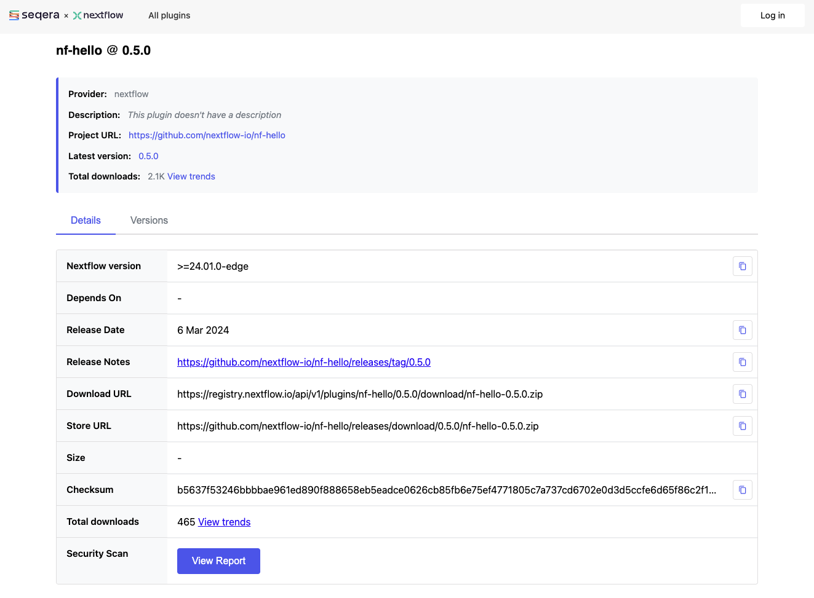
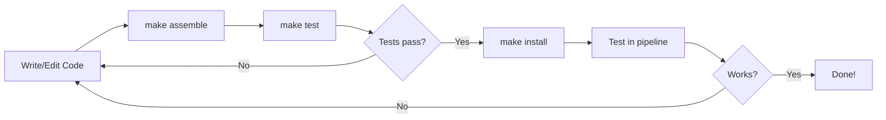
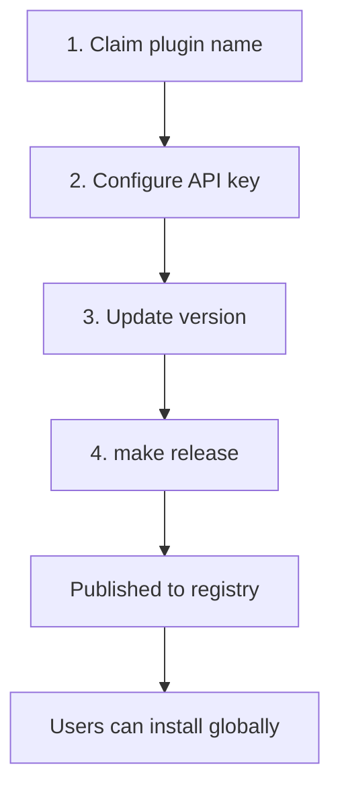

# Nextflow plugins

Nextflow's plugin system allows you to extend the language with custom functions, operators, executors, and more.
In this side quest, you'll learn how to use existing plugins and optionally build your own.

!!! warning "Development sections are advanced"

    Using existing plugins (sections 1-2) is straightforward and valuable for all Nextflow users.

    However, **developing your own plugins** (sections 3 onwards) is an advanced topic.
    It involves Java/Groovy programming, build tools, and software engineering concepts that may be unfamiliar if you come from a pure bioinformatics background.

    Most Nextflow users will never need to develop plugins - the existing plugin ecosystem covers the vast majority of use cases.
    If development sections feel challenging, focus on sections 1-2 and bookmark the rest for later.

### Learning goals

In this side quest, you'll learn how to use existing Nextflow plugins and optionally create your own.

By the end of this side quest, you'll be able to:

**Using plugins (sections 1-2):**

- Understand what plugins are and how they extend Nextflow
- Install and configure existing plugins in your workflows
- Import and use plugin functions

**Developing plugins (sections 3-10):**

- Create a new plugin project
- Implement custom functions, operators, and trace observers
- Build, test, and publish your plugin

### Prerequisites

Before taking on this side quest, you should:

- Have completed the [Hello Nextflow](../../hello_nextflow/) tutorial or equivalent beginner's course

For plugin development sections (3 onwards):

- Have Java 17 or later installed (check with `java -version`)
- Have basic familiarity with object-oriented programming concepts

!!! note "Development environment"

    This side quest requires Java and Gradle for building plugins.
    The training Codespace comes with Java pre-installed.

??? info "What are Java, Groovy, and Gradle?"

    If these terms are unfamiliar, here's a quick primer:

    **Java** is a widely-used programming language. Nextflow itself is built with Java, and plugins must be compatible with the Java runtime.

    **Groovy** is a programming language that runs on Java and is designed to be more concise and flexible. Nextflow's DSL is based on Groovy, which is why Nextflow syntax looks the way it does. Plugin code is typically written in Groovy.

    **Gradle** is a build tool that compiles code, runs tests, and packages software. Think of it like `make` but for Java/Groovy projects. You don't need to understand Gradle deeply - we'll use simple commands like `./gradlew build`.

    The good news: you don't need to be an expert in any of these. We'll explain the relevant concepts as we go.

---

## 0. Get started

#### Open the training codespace

If you haven't yet done so, make sure to open the training environment as described in the [Environment Setup](../envsetup/index.md).

[](https://codespaces.new/nextflow-io/training?quickstart=1&ref=master)

#### Verify Java installation

Check that Java is available:

```bash
java -version
```

You should see Java 17 or later.

#### Move into the project directory

```bash
cd side-quests/plugin_development
```

#### Review the materials

```console title="Directory contents"
.
├── greetings.csv
├── main.nf
├── nextflow.config
└── random_id_example.nf
```

We have a simple greeting pipeline and materials for both using and developing plugins.

#### What we'll cover

1. **Using plugins** (sections 1-2): Understand plugin architecture and use existing plugins like `nf-hello`
2. **Building a plugin** (sections 3-10): Create `nf-greeting` with custom functions, operators, and observers

#### Readiness checklist

- [ ] My codespace is running
- [ ] Java is installed (required for plugin development sections)

---

## 1. Plugin architecture

Before diving into plugin usage and development, let's understand what plugins are and how they extend Nextflow.

<!-- TODO: Add Excalidraw diagram showing plugin architecture
     File: docs/side_quests/img/plugin-architecture.excalidraw.svg
     Content: Show Nextflow core with extension points (Functions, Operators,
     Observers, etc.) and a plugin connecting to them via PF4J
-->

### 1.1. How plugins extend Nextflow

Nextflow's plugin system is built on [PF4J](https://pf4j.org/), a lightweight plugin framework for Java.
Plugins can extend Nextflow in several ways:

| Extension Type  | Purpose                                  | Example                 |
| --------------- | ---------------------------------------- | ----------------------- |
| Functions       | Custom functions callable from workflows | `reverseString()`       |
| Operators       | Custom channel operators                 | `myFilter()`            |
| Factories       | Create new channel types                 | `mySource()`            |
| Executors       | Custom task execution backends           | AWS Batch, Kubernetes   |
| Filesystems     | Custom storage backends                  | S3, Azure Blob          |
| Trace Observers | Monitor workflow execution               | Custom logging, metrics |

<!-- TODO: Add Excalidraw diagram showing extension types
     File: docs/side_quests/img/plugin-extension-types.excalidraw.svg
     Content: Visual showing where each extension type plugs in:
     - Functions: called from workflow/process scripts
     - Operators: transform channels (between processes)
     - Factories: create channels (workflow entry points)
     - Trace Observers: hook into lifecycle events
     - Executors: submit tasks to compute backends
     - Filesystems: access remote storage
-->

As you can see, plugins are much more than just custom functions - they can fundamentally extend how Nextflow works.

### 1.2. Why use plugins?

You can define custom functions directly in your Nextflow scripts, so why use plugins?

| Approach            | Best for               | Limitations                                 |
| ------------------- | ---------------------- | ------------------------------------------- |
| **Local functions** | Project-specific logic | Copy-paste between pipelines, no versioning |
| **Plugins**         | Reusable utilities     | Requires Java/Groovy knowledge to create    |

While custom functions are the most common plugin use case, remember that plugins can provide much more - operators, observers, executors, and filesystems.

Plugins are ideal when you need to:

- Share functionality across multiple pipelines
- Distribute reusable code to the community
- Version and manage dependencies properly
- Access Nextflow internals (channels, sessions, lifecycle events, etc.)
- Integrate with external infrastructure (cloud platforms, storage systems)

### Takeaway

Plugins extend Nextflow through well-defined extension points - not just functions, but operators, observers, executors, and more.
They're ideal for sharing reusable functionality across pipelines and the community.

### What's next?

Let's see how to use existing plugins before we build our own.

---

## 2. Using existing plugins

Nextflow has a growing ecosystem of plugins that extend its functionality.
Let's see how to discover, install, and use them.

!!! tip "This is the most important section for most users"

    Even if you never develop your own plugin, knowing how to use existing plugins is valuable.
    Many powerful features - like input validation with nf-schema - come from plugins.
    If plugin development seems daunting, focus on mastering this section first.

!!! info "Official documentation"

    This section covers the essentials of using plugins.
    For comprehensive details, see the [official Nextflow plugins documentation](https://www.nextflow.io/docs/latest/plugins/plugins.html).

### 2.1. Discovering plugins

The [Nextflow Plugin Registry](https://registry.nextflow.io/) is the central hub for finding available plugins.
Browse the registry to discover plugins for:

- Input validation and samplesheet parsing
- Cloud platform integration (AWS, Google Cloud, Azure)
- Provenance tracking and reporting
- Notifications (Slack, Teams)
- And more

Each plugin page in the registry shows:

- Description and purpose
- Available versions
- Installation instructions
- Links to documentation and source code



You can also search GitHub for repositories with the `nf-` prefix, as most Nextflow plugins follow this naming convention.

### 2.2. Installing plugins

Plugins are declared in your `nextflow.config` file using the `plugins {}` block:

```groovy title="nextflow.config"
plugins {
    id 'nf-schema@2.1.1'
}
```

Key points:

- Use the `id` keyword followed by the plugin name
- Specify a version with `@version` (recommended for reproducibility)
- Nextflow automatically downloads plugins from the plugin registry

### 2.3. Importing plugin functions

Once a plugin is installed, you can import its functions using the familiar `include` syntax with a special `plugin/` prefix:

```groovy title="main.nf"
include { samplesheetToList } from 'plugin/nf-schema'
```

This imports the `samplesheetToList` function from the nf-schema plugin, making it available in your workflow.

### 2.4. Example: Using nf-schema for validation

The nf-schema plugin is widely used in nf-core pipelines for input validation.
Here's how it works in practice:

```groovy title="main.nf" linenums="1"
#!/usr/bin/env nextflow

include { samplesheetToList } from 'plugin/nf-schema'

params.input = 'samplesheet.csv'

workflow {
    // Validate and parse input samplesheet
    ch_samples = Channel.fromList(
        samplesheetToList(params.input, "assets/schema_input.json")
    )

    ch_samples.view { sample -> "Sample: $sample" }
}
```

The `samplesheetToList` function:

1. Reads the input CSV file
2. Validates it against a JSON schema
3. Returns a list of validated entries
4. Throws helpful errors if validation fails

This pattern is used extensively in nf-core pipelines to ensure input data is valid before processing begins.

### 2.5. Popular community plugins

Here are some useful plugins available in the Nextflow ecosystem:

| Plugin        | Purpose                                       |
| ------------- | --------------------------------------------- |
| nf-schema     | Input validation and samplesheet parsing      |
| nf-prov       | Provenance reporting (RO-Crate format)        |
| nf-wave       | Container provisioning with Wave              |
| nf-amazon     | AWS integration (S3, Batch)                   |
| nf-google     | Google Cloud integration (GCS, Batch)         |
| nf-azure      | Azure integration (Blob Storage, Batch)       |
| nf-cloudcache | Cloud-based caching for distributed execution |

### 2.6. Plugin configuration

Some plugins accept configuration options in `nextflow.config`:

```groovy title="nextflow.config"
plugins {
    id 'nf-schema@2.1.1'
}

// Plugin-specific configuration
validation {
    monochromeLogs = true
    ignoreParams = ['custom_param']
}
```

Each plugin documents its configuration options.
Check the plugin's documentation for available settings.

### 2.7. Try it: From local function to plugin

Let's see the difference between a local function and a plugin function in practice.

The [nf-hello](https://github.com/nextflow-io/nf-hello) plugin provides a `randomString` function that generates random strings of a given length.
We've provided `random_id_example.nf` which has a local implementation of the same functionality.

#### Run the local function version

Take a look at the starting file:

```bash
cat random_id_example.nf
```

```groovy title="random_id_example.nf"
#!/usr/bin/env nextflow

// Local function - must be copied to every pipeline that needs it
def randomString(int length) {
    def chars = 'ABCDEFGHIJKLMNOPQRSTUVWXYZabcdefghijklmnopqrstuvwxyz0123456789'
    def random = new Random()
    return (1..length).collect { chars[random.nextInt(chars.length())] }.join()
}

workflow {
    // Generate random IDs for each sample
    Channel.of('sample_A', 'sample_B', 'sample_C')
        | map { sample -> "${sample}_${randomString(8)}" }
        | view
}
```

Run it:

```bash
nextflow run random_id_example.nf
```

```console title="Output"
sample_A_xK9mPq2R
sample_B_Lw3nYh8J
sample_C_Bf5tVc1D
```

(Your random strings will be different!)

This works, but if you wanted to use `randomString` in another pipeline, you'd have to copy the function definition.

#### Replace with the plugin

Now let's replace our local function with the one from the `nf-hello` plugin.

Edit `random_id_example.nf` to import the function from the plugin instead of defining it locally:

=== "After (plugin)"

    ```groovy title="random_id_example.nf" hl_lines="3-4"
    #!/usr/bin/env nextflow

    // Import function from plugin - no local definition needed
    include { randomString } from 'plugin/nf-hello'

    workflow {
        // Generate random IDs for each sample
        Channel.of('sample_A', 'sample_B', 'sample_C')
            | map { sample -> "${sample}_${randomString(8)}" }
            | view
    }
    ```

=== "Before (local)"

    ```groovy title="random_id_example.nf" hl_lines="3-8"
    #!/usr/bin/env nextflow

    // Local function - must be copied to every pipeline that needs it
    def randomString(int length) {
        def chars = 'ABCDEFGHIJKLMNOPQRSTUVWXYZabcdefghijklmnopqrstuvwxyz0123456789'
        def random = new Random()
        return (1..length).collect { chars[random.nextInt(chars.length())] }.join()
    }

    workflow {
        // Generate random IDs for each sample
        Channel.of('sample_A', 'sample_B', 'sample_C')
            | map { sample -> "${sample}_${randomString(8)}" }
            | view
    }
    ```

Run it again with the `-plugins` flag to load the plugin:

```bash
nextflow run random_id_example.nf -plugins nf-hello@0.5.0
```

!!! tip "Config vs command line"

    We introduced plugins using `nextflow.config` (section 2.2), but here we use the `-plugins` flag.
    Both approaches work:

    - **`nextflow.config`**: Best for production pipelines where you want plugins locked to specific versions
    - **`-plugins` flag**: Handy for quick testing or trying out a plugin without modifying config files

    For a real pipeline, you'd typically add the plugin to `nextflow.config` so it's always available.

The first run will download the plugin automatically. The output is the same, but now the function comes from a versioned, shareable plugin.

The key difference: one import line replaces the entire function definition.
Any pipeline can use `nf-hello@0.5.0` and get the exact same `randomString` function.

### Takeaway

Using plugins is straightforward: declare them in `nextflow.config` or load them with `-plugins`, then import their functions and use them in your workflows.
The plugin ecosystem extends Nextflow with powerful features like validation, cloud integration, and provenance tracking.

### What's next?

Now that you understand how to use plugins, let's build our own.

---

## 3. Creating a plugin project

!!! info "Official documentation"

    This section and those that follow cover plugin development essentials.
    For comprehensive details, see the [official Nextflow plugin development documentation](https://www.nextflow.io/docs/latest/plugins/developing-plugins.html).

### 3.1. Using the Nextflow plugin create command

The easiest way to create a plugin is with the built-in command:

```bash
nextflow plugin create nf-greeting training
```

This scaffolds a complete plugin project.
The first argument is the plugin name, and the second is your organization name (used for the package namespace).

!!! tip "Manual creation"

    You can also create plugin projects manually or use the [nf-hello template](https://github.com/nextflow-io/nf-hello) on GitHub as a starting point.

### 3.2. Examine the generated project

Change into the plugin directory:

```bash
cd nf-greeting
```

List the contents:

```bash
tree
```

You should see:

```console
.
├── build.gradle
├── COPYING
├── gradle
│   └── wrapper
│       ├── gradle-wrapper.jar
│       └── gradle-wrapper.properties
├── gradlew
├── Makefile
├── README.md
├── settings.gradle
└── src
    ├── main
    │   └── groovy
    │       └── training
    │           └── plugin
    │               ├── NfGreetingExtension.groovy
    │               ├── NfGreetingFactory.groovy
    │               ├── NfGreetingObserver.groovy
    │               └── NfGreetingPlugin.groovy
    └── test
        └── groovy
            └── training
                └── plugin
                    └── NfGreetingObserverTest.groovy

11 directories, 13 files
```

### 3.3. Understand settings.gradle

```bash
cat settings.gradle
```

```groovy title="settings.gradle"
rootProject.name = 'nf-greeting'
```

This simply sets the project name.

### 3.4. Understand build.gradle

```bash
cat build.gradle
```

Key sections in the build file:

```groovy title="build.gradle"
plugins {
    id 'io.nextflow.nextflow-plugin' version '0.0.1-alpha4'
}

version = '0.1.0'

nextflowPlugin {
    nextflowVersion = '24.10.0'

    provider = 'training'
    className = 'training.plugin.NfGreetingPlugin'
    extensionPoints = [
        'training.plugin.NfGreetingExtension',
        'training.plugin.NfGreetingFactory'
    ]

    publishing {
        registry {
            url = 'https://nf-plugins-registry.dev-tower.net/api'
            authToken = project.findProperty('pluginRegistry.accessToken')
        }
    }
}
```

The `nextflowPlugin` block configures:

- `nextflowVersion`: Minimum Nextflow version required
- `provider`: Your name or organization
- `className`: The main plugin class (uses your package name)
- `extensionPoints`: Classes providing extensions (functions, factories, etc.)
- `publishing`: Configuration for publishing to the plugin registry (optional)

### Takeaway

The `nextflow plugin create` command scaffolds a complete project.
The `build.gradle` file configures the plugin metadata and dependencies.

### What's next?

Let's implement our custom functions.

---

## 4. Implementing custom functions

### 4.1. The PluginExtensionPoint class

Functions are defined in classes that extend `PluginExtensionPoint`.
Open the extension file:

```bash
cat src/main/groovy/training/plugin/NfGreetingExtension.groovy
```

The template includes sample functions. Let's replace them with our greeting functions.

### 4.2. Create our functions

The template includes a simple `sayHello` function.
Let's replace it with our greeting manipulation functions.

Edit the file to replace the `sayHello` function with our three new functions:

=== "After"

    ```groovy title="src/main/groovy/training/plugin/NfGreetingExtension.groovy" hl_lines="31-53" linenums="1"
    /*
     * Copyright 2025, Seqera Labs
     *
     * Licensed under the Apache License, Version 2.0 (the "License");
     * you may not use this file except in compliance with the License.
     * You may obtain a copy of the License at
     *
     *     http://www.apache.org/licenses/LICENSE-2.0
     *
     * Unless required by applicable law or agreed to in writing, software
     * distributed under the License is distributed on an "AS IS" BASIS,
     * WITHOUT WARRANTIES OR CONDITIONS OF ANY KIND, either express or implied.
     * See the License for the specific language governing permissions and
     * limitations under the License.
     */

    package training.plugin

    import groovy.transform.CompileStatic
    import nextflow.Session
    import nextflow.plugin.extension.Function
    import nextflow.plugin.extension.PluginExtensionPoint

    @CompileStatic
    class NfGreetingExtension extends PluginExtensionPoint {

        @Override
        protected void init(Session session) {
        }

        /**
         * Reverse a greeting string
         */
        @Function
        String reverseGreeting(String greeting) {
            return greeting.reverse()
        }

        /**
         * Decorate a greeting with celebratory markers
         */
        @Function
        String decorateGreeting(String greeting) {
            return "*** ${greeting} ***"
        }

        /**
         * Convert greeting to a friendly format with a name
         */
        @Function
        String friendlyGreeting(String greeting, String name = 'World') {
            return "${greeting}, ${name}!"
        }

    }
    ```

=== "Before"

    ```groovy title="src/main/groovy/training/plugin/NfGreetingExtension.groovy" hl_lines="35-43" linenums="1"
    /*
     * Copyright 2025, Seqera Labs
     *
     * Licensed under the Apache License, Version 2.0 (the "License");
     * you may not use this file except in compliance with the License.
     * You may obtain a copy of the License at
     *
     *     http://www.apache.org/licenses/LICENSE-2.0
     *
     * Unless required by applicable law or agreed to in writing, software
     * distributed under the License is distributed on an "AS IS" BASIS,
     * WITHOUT WARRANTIES OR CONDITIONS OF ANY KIND, either express or implied.
     * See the License for the specific language governing permissions and
     * limitations under the License.
     */

    package training.plugin

    import groovy.transform.CompileStatic
    import nextflow.Session
    import nextflow.plugin.extension.Function
    import nextflow.plugin.extension.PluginExtensionPoint

    /**
     * Implements a custom function which can be imported by
     * Nextflow scripts.
     */
    @CompileStatic
    class NfGreetingExtension extends PluginExtensionPoint {

        @Override
        protected void init(Session session) {
        }

        /**
         * Say hello to the given target.
         *
         * @param target
         */
        @Function
        void sayHello(String target) {
            println "Hello, ${target}!"
        }

    }
    ```

??? info "Understanding the Groovy syntax"

    If this code looks unfamiliar, here's a breakdown of the key elements:

    **`package training.plugin`** - Declares which package (folder structure) this code belongs to. This must match the directory structure.

    **`import ...`** - Brings in code from other packages, similar to Python's `import` or R's `library()`.

    **`@CompileStatic`** - An annotation (marked with `@`) that tells Groovy to check types at compile time. This catches errors earlier.

    **`class NfGreetingExtension extends PluginExtensionPoint`** - Defines a class that inherits from `PluginExtensionPoint`. The `extends` keyword means "this class is a type of that class."

    **`@Override`** - Indicates we're replacing a method from the parent class.

    **`@Function`** - The key annotation that makes a method available as a Nextflow function.

    **`String reverseGreeting(String greeting)`** - A method that takes a String parameter and returns a String. In Groovy, you can often omit `return` - the last expression is returned automatically.

    **`String name = 'World'`** - A parameter with a default value, just like in Python.

### 4.3. Understanding the @Function annotation

The `@Function` annotation marks a method as callable from Nextflow workflows:

```groovy
@Function
public String reverseGreeting(String greeting) {
    return greeting.reverse()
}
```

Key requirements:

- **Methods must be public**: In Groovy, methods are public by default, so the `public` keyword is optional but shown here for clarity
- **Return type**: Can be any serializable type (`String`, `List`, `Map`, etc.)
- **Parameters**: Can have any number of parameters, including default values:

```groovy
@Function
public String decorateGreeting(String greeting, String prefix = ">>> ", String suffix = " <<<") {
    return "${prefix}${greeting}${suffix}"
}
```

Once defined, functions are available via the `include` statement:

```groovy
include { reverseGreeting; decorateGreeting } from 'plugin/nf-greeting'
```

### 4.4. The init() method

The `init()` method is called when the plugin loads:

```groovy
@Override
void init(Session session) {
    // Access session configuration
    // Initialize resources
    // Set up state
}
```

You can access configuration via `session.config`.

### Takeaway

Functions are defined with the `@Function` annotation in `PluginExtensionPoint` subclasses.
They become available to import in Nextflow workflows.

### What's next?

Let's build and test our plugin.

---

## 5. Building and testing

??? info "Why do we need to build?"

    If you're used to scripting languages like Python, R, or even Nextflow's DSL, you might wonder why we need a "build" step at all.
    In those languages, you write code and run it directly.

    Nextflow plugins are written in Groovy, which runs on the Java Virtual Machine (JVM).
    JVM languages need to be **compiled** before they can run - the human-readable source code is converted into bytecode that the JVM can execute.

    The build process:

    1. **Compiles** your Groovy code into JVM bytecode
    2. **Packages** it into a JAR file (Java ARchive - like a ZIP of compiled code)
    3. **Bundles** metadata so Nextflow knows how to load the plugin

    Don't worry - the build tools handle all this automatically. You just run `make assemble` and let Gradle do the work.

The plugin development cycle follows a simple pattern:



### 5.1. Build the plugin

The Makefile provides convenient commands:

```bash
make assemble
```

Or directly with the Gradle wrapper:

```bash
./gradlew assemble
```

??? info "What is `./gradlew`?"

    The `./gradlew` script is the **Gradle wrapper** - a small script included with the project that automatically downloads and runs the correct version of Gradle.

    This means you don't need Gradle installed on your system.
    The first time you run `./gradlew`, it will download Gradle (which may take a moment), then run your command.

    The `make` commands in the Makefile are just shortcuts that call `./gradlew` for you.

??? example "Build output"

    The first time you run this, Gradle will download itself (this may take a minute):

    ```console
    Downloading https://services.gradle.org/distributions/gradle-8.14-bin.zip
    ...10%...20%...30%...40%...50%...60%...70%...80%...90%...100%

    Welcome to Gradle 8.14!
    ...

    Deprecated Gradle features were used in this build...

    BUILD SUCCESSFUL in 23s
    4 actionable tasks: 4 executed
    ```

    **Don't worry about the warnings!**

    - **"Downloading gradle..."**: This only happens the first time. Subsequent builds are much faster.
    - **"Deprecated Gradle features..."**: This warning comes from the plugin template, not your code. It's safe to ignore.
    - **"BUILD SUCCESSFUL"**: This is what matters! Your plugin compiled without errors.

### 5.2. Write unit tests

Good plugins have tests.
Tests verify that your code works correctly and help catch bugs when you make changes later.

??? info "What are unit tests?"

    **Unit tests** are small pieces of code that automatically check if your functions work correctly.
    Each test calls a function with known inputs and checks that the output matches what you expect.

    For example, if you have a function that reverses strings, a test might check that `reverse("Hello")` returns `"olleH"`.

    Tests are valuable because:

    - They catch bugs before users do
    - They give you confidence to make changes without breaking things
    - They serve as documentation showing how functions should be used

    You don't need to write tests to use a plugin, but they're good practice for any code you plan to share or maintain.

The generated project includes a test for the Observer class, but we need to create a new test file for our extension functions.

#### Understanding Spock tests

The plugin template uses [Spock](https://spockframework.org/), a testing framework for Groovy that reads almost like plain English.
Here's the basic structure:

```groovy
def 'should reverse a greeting'() {   // (1)!
    given:                             // (2)!
    def ext = new NfGreetingExtension()

    expect:                            // (3)!
    ext.reverseGreeting('Hello') == 'olleH'
}
```

1. **Test name in quotes** - Describes what the test checks. Use plain English!
2. **`given:` block** - Set up what you need for the test (create objects, prepare data)
3. **`expect:` block** - The actual checks. Each line should be `true` for the test to pass

This structure makes tests readable: "Given an extension object, expect that `reverseGreeting('Hello')` equals `'olleH'`."

#### Create the test file

```bash
touch src/test/groovy/training/plugin/NfGreetingExtensionTest.groovy
```

Open it in your editor and add the following content:

```groovy title="src/test/groovy/training/plugin/NfGreetingExtensionTest.groovy" linenums="1"
package training.plugin

import spock.lang.Specification

/**
 * Tests for the greeting extension functions
 */
class NfGreetingExtensionTest extends Specification {

    def 'should reverse a greeting'() {
        given:
        def ext = new NfGreetingExtension()

        expect:
        ext.reverseGreeting('Hello') == 'olleH'
        ext.reverseGreeting('Bonjour') == 'ruojnoB'
    }

    def 'should decorate a greeting'() {
        given:
        def ext = new NfGreetingExtension()

        expect:
        ext.decorateGreeting('Hello') == '*** Hello ***'
    }

    def 'should create friendly greeting with default name'() {
        given:
        def ext = new NfGreetingExtension()

        expect:
        ext.friendlyGreeting('Hello') == 'Hello, World!'
    }

    def 'should create friendly greeting with custom name'() {
        given:
        def ext = new NfGreetingExtension()

        expect:
        ext.friendlyGreeting('Hello', 'Alice') == 'Hello, Alice!'
    }
}
```

### 5.3. Run the tests

```bash
make test
```

Or:

```bash
./gradlew test
```

??? example "Test output"

    ```console
    BUILD SUCCESSFUL in 5s
    6 actionable tasks: 2 executed, 4 up-to-date
    ```

    **Where are the test results?** Gradle hides detailed output when all tests pass - "BUILD SUCCESSFUL" means everything worked! If any test fails, you'll see detailed error messages.

### 5.4. View the test report

To see detailed results for each test, you can view the HTML test report that Gradle generates.

Start a simple web server in the test report directory:

```bash
pushd build/reports/tests/test
python -m http.server
```

VS Code will prompt you to open the application in your browser.
Click through to your test class to see individual test results:


The report shows each test method, its duration, and whether it passed or failed.
This confirms that all four of our greeting functions are being tested correctly.

Press ++ctrl+c++ in the terminal to stop the server when you're done, then return to the plugin directory:

```bash
popd
```

!!! tip "If the build fails"

    Build errors can be intimidating, but they usually point to a specific problem.
    Common issues include:

    - **Syntax errors**: A missing bracket, quote, or semicolon. The error message usually includes a line number.
    - **Import errors**: A class name is misspelled or the import statement is missing.
    - **Type errors**: You're passing the wrong type of data to a function.

    Read the error message carefully - it often tells you exactly what's wrong and where.
    If you're stuck, compare your code character-by-character with the examples.

### 5.5. Install locally

To use the plugin with Nextflow, install it to your local plugins directory:

```bash
make install
```

This copies the plugin to `~/.nextflow/plugins/`.

### Takeaway

Use `make assemble` to compile and `make test` to run tests.
Install with `make install` to use the plugin locally.

### What's next?

Let's use our plugin in a workflow.

---

## 6. Using your plugin

### 6.1. Configure the plugin

Go back to the pipeline directory:

```bash
cd ..
```

Edit `nextflow.config` to add the plugins block with your plugin and version:

=== "After"

    ```groovy title="nextflow.config" hl_lines="2-4"
    // Configuration for plugin development exercises
    plugins {
        id 'nf-greeting@0.1.0'
    }
    ```

=== "Before"

    ```groovy title="nextflow.config"
    // Configuration for plugin development exercises
    ```

!!! note "Version required for local plugins"

    When using locally installed plugins, you must specify the version (e.g., `nf-greeting@0.1.0`).
    Published plugins in the registry can use just the name.

### 6.2. Import and use functions

We provided a simple greeting pipeline in `main.nf` that reads greetings from a CSV file and writes them to output files.
Take a quick look at it:

```bash
cat main.nf
```

```groovy title="main.nf (starting point)"
#!/usr/bin/env nextflow

params.input = 'greetings.csv'

process SAY_HELLO {
    input:
        val greeting
    output:
        stdout
    script:
    """
    echo '$greeting'
    """
}

workflow {
    greeting_ch = channel.fromPath(params.input)
                        .splitCsv(header: true)
                        .map { row -> row.greeting }
    SAY_HELLO(greeting_ch)
    SAY_HELLO.out.view { result -> "Output: ${result.trim()}" }
}
```

Run it to see the basic output:

```bash
nextflow run main.nf
```

```console title="Output"
Output: Hello
Output: Bonjour
Output: Holà
Output: Ciao
Output: Hallo
```

Now let's enhance it to use our plugin functions.
Edit `main.nf` to import and use the custom functions:

=== "After"

    ```groovy title="main.nf" hl_lines="4-5 15-18 28-30 33" linenums="1"
    #!/usr/bin/env nextflow

    // Import custom functions from our plugin
    include { reverseGreeting } from 'plugin/nf-greeting'
    include { decorateGreeting } from 'plugin/nf-greeting'

    params.input = 'greetings.csv'

    process SAY_HELLO {
        input:
            val greeting
        output:
            stdout
        script:
        // Use our custom plugin function to decorate the greeting
        def decorated = decorateGreeting(greeting)
        """
        echo '$decorated'
        """
    }

    workflow {
        greeting_ch = channel.fromPath(params.input)
                            .splitCsv(header: true)
                            .map { row -> row.greeting }

        // Demonstrate using reverseGreeting function
        greeting_ch
            .map { greeting -> reverseGreeting(greeting) }
            .view { reversed -> "Reversed: $reversed" }

        SAY_HELLO(greeting_ch)
        SAY_HELLO.out.view { result -> "Decorated: ${result.trim()}" }
    }
    ```

=== "Before"

    ```groovy title="main.nf" linenums="1" hl_lines="11 12 21"
    #!/usr/bin/env nextflow

    params.input = 'greetings.csv'

    process SAY_HELLO {
        input:
            val greeting
        output:
            stdout
        script:
        """
        echo '$greeting'
        """
    }

    workflow {
        greeting_ch = channel.fromPath(params.input)
                            .splitCsv(header: true)
                            .map { row -> row.greeting }
        SAY_HELLO(greeting_ch)
        SAY_HELLO.out.view { result -> "Output: ${result.trim()}" }
    }
    ```

The key changes:

- **Lines 4-5**: Import our plugin functions using `include { function } from 'plugin/plugin-name'`
- **Lines 17-18**: Use `decorateGreeting()` **inside the process script** to transform the greeting before output
- **Lines 28-30**: Use `reverseGreeting()` **in a `map` operation** to transform channel items in the workflow

This demonstrates that plugin functions work in both contexts - inside process definitions (where they run on compute nodes) and in workflow channel operations (where they run on the Nextflow head process).

### 6.3. Run the pipeline

```bash
nextflow run main.nf
```

??? example "Output"

    ```console
    N E X T F L O W   ~  version 25.04.3

    Launching `main.nf` [elated_marconi] DSL2 - revision: cd8d52c97c

    Pipeline is starting! 🚀
    executor >  local (5)
    [fe/109754] process > SAY_HELLO (5) [100%] 5 of 5 ✔
    Reversed: olleH
    Reversed: ruojnoB
    Reversed: àloH
    Reversed: oaiC
    Reversed: ollaH
    Decorated: *** Hello ***
    Decorated: *** Bonjour ***
    Decorated: *** Holà ***
    Decorated: *** Ciao ***
    Decorated: *** Hallo ***
    Pipeline complete! 🎉
    ```

    The "Pipeline is starting!" and "Pipeline complete!" messages come from the `NfGreetingObserver` trace observer that was included in the generated plugin template.

The `decorateGreeting()` function wraps each greeting with decorative markers, and `reverseGreeting()` shows the reversed strings - all powered by our plugin functions!

### Takeaway

Import plugin functions with `include { function } from 'plugin/plugin-id'`.
Once imported, you can use them anywhere:

- **In process scripts** - like `decorateGreeting()` transforming data before output
- **In workflow operations** - like `reverseGreeting()` inside a `map` closure

### What's next?

Let's explore other extension types.

---

## 7. Trace observers

In section 1.1, we saw that plugins can provide many types of extensions.
So far we've implemented custom functions.
Now let's explore **trace observers**, which let you hook into workflow lifecycle events.

### 7.1. Understanding the existing trace observer

Remember the "Pipeline is starting! 🚀" message when you ran the pipeline?
That came from the `NfGreetingObserver` class in your plugin.

Look at the observer code:

```bash
cat nf-greeting/src/main/groovy/training/plugin/NfGreetingObserver.groovy
```

This observer hooks into workflow lifecycle events.
Trace observers can respond to many events:

| Method              | When it's called        |
| ------------------- | ----------------------- |
| `onFlowCreate`      | Workflow starts         |
| `onFlowComplete`    | Workflow finishes       |
| `onProcessStart`    | A task begins execution |
| `onProcessComplete` | A task finishes         |
| `onProcessCached`   | A cached task is reused |
| `onFilePublish`     | A file is published     |

This enables powerful use cases like custom reports, Slack notifications, or metrics collection.

### 7.2. Try it: Add a task counter observer

Rather than modifying the existing observer, let's create a new one that counts completed tasks.
This reinforces the concepts while doing something different.

Create a new file:

```bash
touch nf-greeting/src/main/groovy/training/plugin/TaskCounterObserver.groovy
```

Add the following content:

```groovy title="nf-greeting/src/main/groovy/training/plugin/TaskCounterObserver.groovy" linenums="1"
package training.plugin

import groovy.transform.CompileStatic
import nextflow.processor.TaskHandler
import nextflow.trace.TraceObserver
import nextflow.trace.TraceRecord

/**
 * Observer that counts completed tasks
 */
@CompileStatic
class TaskCounterObserver implements TraceObserver {

    private int taskCount = 0

    @Override
    void onProcessComplete(TaskHandler handler, TraceRecord trace) {
        taskCount++
        println "📊 Tasks completed so far: ${taskCount}"
    }

    @Override
    void onFlowComplete() {
        println "📈 Final task count: ${taskCount}"
    }
}
```

Now we need to register this observer with the plugin.
The `NfGreetingFactory` creates observers - take a look at it:

```bash
cat nf-greeting/src/main/groovy/training/plugin/NfGreetingFactory.groovy
```

```groovy title="NfGreetingFactory.groovy (starting point)"
@CompileStatic
class NfGreetingFactory implements TraceObserverFactory {

    @Override
    Collection<TraceObserver> create(Session session) {
        return List.<TraceObserver>of(new NfGreetingObserver())
    }
}
```

Edit `NfGreetingFactory.groovy` to add our new observer:

=== "After"

    ```groovy title="NfGreetingFactory.groovy" linenums="31" hl_lines="3-6"
    @Override
    Collection<TraceObserver> create(Session session) {
        return [
            new NfGreetingObserver(),
            new TaskCounterObserver()
        ]
    }
    ```

=== "Before"

    ```groovy title="NfGreetingFactory.groovy" linenums="31" hl_lines="2"
    @Override
    Collection<TraceObserver> create(Session session) {
        return List.<TraceObserver>of(new NfGreetingObserver())
    }
    ```

Rebuild and reinstall:

```bash
cd nf-greeting && make assemble && make install && cd ..
```

Run the pipeline with `-ansi-log false` to see all observer output:

```bash
nextflow run main.nf -ansi-log false
```

```console title="Expected output (excerpt)"
Pipeline is starting! 🚀
[be/bd8e72] Submitted process > SAY_HELLO (2)
[5b/d24c2b] Submitted process > SAY_HELLO (1)
...
📊 Tasks completed so far: 1
📊 Tasks completed so far: 2
...
📊 Tasks completed so far: 5
Pipeline complete! 👋
📈 Final task count: 5
```

!!! tip "Why `-ansi-log false`?"

    By default, Nextflow's ANSI progress display overwrites previous lines.
    Using `-ansi-log false` shows all output sequentially, which is useful when testing observers that print messages during execution.

### Takeaway

Trace observers hook into workflow lifecycle events like `onFlowCreate`, `onProcessComplete`, and `onFlowComplete`.
They're useful for custom logging, metrics collection, notifications, and reporting.

### What's next?

Let's explore custom channel operators.

---

## 8. Custom operators and factories

### 8.1. When functions aren't enough

We've used `@Function` to create `reverseGreeting()`.
But functions have a limitation: they work on **individual values**, not channels.

Consider this pattern:

```groovy
// Using a function - must wrap in map()
greeting_ch
    .map { greeting -> reverseGreeting(greeting) }
    .view()
```

With a custom **operator**, you can work directly on channels:

```groovy
// Using an operator - cleaner syntax
greeting_ch
    .reverseAll()
    .view()
```

Operators are useful when you need to:

- Transform entire channels (not just individual items)
- Combine or split channels
- Add channel-level behaviors (filtering, grouping, etc.)

### 8.2. Try it: Add a shoutAll operator

Let's add an operator that converts all items in a channel to uppercase.

Edit `nf-greeting/src/main/groovy/training/plugin/NfGreetingExtension.groovy` to add an operator:

=== "After"

    ```groovy title="NfGreetingExtension.groovy" hl_lines="6-8 55-67"
    package training.plugin

    import groovy.transform.CompileStatic
    import nextflow.Session
    import nextflow.plugin.extension.Function
    import nextflow.plugin.extension.Operator
    import nextflow.plugin.extension.PluginExtensionPoint
    import groovyx.gpars.dataflow.DataflowReadChannel
    import groovyx.gpars.dataflow.DataflowWriteChannel
    import nextflow.extension.CH
    import nextflow.extension.DataflowHelper

    @CompileStatic
    class NfGreetingExtension extends PluginExtensionPoint {

        @Override
        protected void init(Session session) {
        }

        /**
         * Reverse a greeting string
         */
        @Function
        String reverseGreeting(String greeting) {
            return greeting.reverse()
        }

        /**
         * Decorate a greeting with celebratory markers
         */
        @Function
        String decorateGreeting(String greeting) {
            return "*** ${greeting} ***"
        }

        /**
         * Convert greeting to a friendly format with a name
         */
        @Function
        String friendlyGreeting(String greeting, String name = 'World') {
            return "${greeting}, ${name}!"
        }

        /**
         * Operator: Convert all items in a channel to uppercase
         */
        @Operator
        DataflowWriteChannel shoutAll(DataflowReadChannel source) {
            final target = CH.create()
            DataflowHelper.subscribeImpl(source, [
                onNext: { item -> target.bind(item.toString().toUpperCase()) },
                onComplete: { target.bind(Channel.STOP) }
            ])
            return target
        }
    }
    ```

=== "Before"

    ```groovy title="NfGreetingExtension.groovy"
    package training.plugin

    import groovy.transform.CompileStatic
    import nextflow.Session
    import nextflow.plugin.extension.Function
    import nextflow.plugin.extension.PluginExtensionPoint

    @CompileStatic
    class NfGreetingExtension extends PluginExtensionPoint {

        @Override
        protected void init(Session session) {
        }

        /**
         * Reverse a greeting string
         */
        @Function
        String reverseGreeting(String greeting) {
            return greeting.reverse()
        }

        /**
         * Decorate a greeting with celebratory markers
         */
        @Function
        String decorateGreeting(String greeting) {
            return "*** ${greeting} ***"
        }

        /**
         * Convert greeting to a friendly format with a name
         */
        @Function
        String friendlyGreeting(String greeting, String name = 'World') {
            return "${greeting}, ${name}!"
        }
    }
    ```

Rebuild and reinstall:

```bash
cd nf-greeting && make assemble && make install && cd ..
```

Now test the operator by editing `main.nf` to use it:

=== "After"

    ```groovy hl_lines="6 34-36"
    #!/usr/bin/env nextflow

    // Import custom functions from our plugin
    include { reverseGreeting } from 'plugin/nf-greeting'
    include { decorateGreeting } from 'plugin/nf-greeting'
    include { shoutAll } from 'plugin/nf-greeting'

    params.input = 'greetings.csv'

    process SAY_HELLO {

        input:
            val greeting

        output:
            path "${greeting}-output.txt"

        script:
        // Use our custom plugin function to decorate the greeting
        def decorated = decorateGreeting(greeting)
        """
        echo '$decorated' > '${greeting}-output.txt'
        """
    }

    workflow {

        greeting_ch = channel.fromPath(params.input)
                            .splitCsv(header: true)
                            .map { row -> row.greeting }

        // Demonstrate using the shoutAll operator
        greeting_ch
            .shoutAll()
            .view { shouted -> "SHOUTED: $shouted" }

        // Demonstrate using reverseGreeting function
        greeting_ch
            .map { greeting -> reverseGreeting(greeting) }
            .view { reversed -> "Reversed: $reversed" }

        SAY_HELLO(greeting_ch)

        SAY_HELLO.out.view()
    }
    ```

=== "Before"

    ```groovy
    #!/usr/bin/env nextflow

    // Import custom functions from our plugin
    include { reverseGreeting } from 'plugin/nf-greeting'
    include { decorateGreeting } from 'plugin/nf-greeting'

    params.input = 'greetings.csv'

    // ... rest of file unchanged
    ```

Run it:

```bash
nextflow run main.nf
```

```console title="Expected output (partial)"
SHOUTED: HELLO
SHOUTED: BONJOUR
SHOUTED: HOLÀ
SHOUTED: CIAO
SHOUTED: HALLO
Reversed: olleH
...
```

### 8.3. Channel factories

You may have noticed `NfGreetingFactory.groovy` in your plugin.
Factories create things - in this case, trace observers.

But plugins can also provide **channel factories** that create new ways to generate channels.
For example, a plugin could provide:

```groovy
// Hypothetical channel factory
channel.fromDatabase('SELECT * FROM samples')
```

The nf-schema plugin uses this pattern for `samplesheetToList()`.

Creating channel factories is advanced and requires deep understanding of Nextflow internals.
For most use cases, functions and operators are sufficient.

### Takeaway

Custom operators work on entire channels rather than individual values, providing cleaner syntax for channel transformations.
Channel factories can create new channel sources but require advanced Nextflow knowledge.

### What's next?

Let's see how plugins can read configuration from `nextflow.config`.

---

## 9. Configuration

### 9.1. Configuration-driven behavior

Plugins can read configuration from `nextflow.config`, letting users customize behavior.

Look at the existing factory code - it already checks configuration:

```groovy
final enabled = session.config.navigate('greeting.enabled', true)
```

This means users can disable your plugin's observers:

```groovy title="nextflow.config"
greeting {
    enabled = false
}
```

### 9.2. Try it: Make the decorator configurable

Let's make the `decorateGreeting` function use configurable prefix/suffix.

Edit `NfGreetingExtension.groovy`:

=== "After"

    ```groovy hl_lines="3-4 10-12 25-26"
    @CompileStatic
    class NfGreetingExtension extends PluginExtensionPoint {

        private String prefix = '***'
        private String suffix = '***'

        @Override
        protected void init(Session session) {
            // Read configuration with defaults
            prefix = session.config.navigate('greeting.prefix', '***') as String
            suffix = session.config.navigate('greeting.suffix', '***') as String
        }

        // ... other functions ...

        /**
         * Decorate a greeting with configurable markers
         */
        @Function
        String decorateGreeting(String greeting) {
            return "${prefix} ${greeting} ${suffix}"
        }

        // ... rest of file ...
    }
    ```

=== "Before"

    ```groovy
    @CompileStatic
    class NfGreetingExtension extends PluginExtensionPoint {

        @Override
        protected void init(Session session) {
        }

        // ... other functions ...

        /**
         * Decorate a greeting with celebratory markers
         */
        @Function
        String decorateGreeting(String greeting) {
            return "*** ${greeting} ***"
        }

        // ... rest of file ...
    }
    ```

Rebuild and reinstall the plugin.

Now users can customize the decoration in `nextflow.config`:

```groovy title="nextflow.config"
plugins {
    id 'nf-greeting@0.1.0'
}

greeting {
    prefix = '>>>'
    suffix = '<<<'
}
```

Run the pipeline and observe the changed decoration style:

```bash
nextflow run main.nf
```

```console title="Output (excerpt)"
Decorated: >>> Hello <<<
Decorated: >>> Bonjour <<<
...
```

### 9.3. Executors and filesystems (conceptual)

Some extension types require significant infrastructure to demonstrate:

**Executors** define how tasks are submitted to compute resources:

- AWS Batch, Google Cloud Batch, Azure Batch
- Kubernetes, SLURM, PBS, LSF
- Creating a custom executor is complex and typically done by platform vendors

**Filesystems** define how files are accessed:

- S3, Google Cloud Storage, Azure Blob
- Custom storage systems
- Creating a custom filesystem requires implementing Java NIO interfaces

These are documented in the [Nextflow plugin documentation](https://www.nextflow.io/docs/latest/plugins/developing-plugins.html) for advanced users.

### Takeaway

Plugins can read configuration using `session.config.navigate()`, letting users customize behavior without modifying code.
Executors and filesystems are advanced extension types typically created by platform vendors.

### What's next?

Let's look at how to share your plugin with others.

---

## 10. Publishing your plugin

Once your plugin is working locally, you can share it with the Nextflow community through the [plugin registry](https://registry.nextflow.io/).



!!! tip "Plugin registry"

    The Nextflow plugin registry is currently in public preview.
    See the [Nextflow documentation](https://www.nextflow.io/docs/latest/guides/gradle-plugin.html#publishing-a-plugin) for the latest details.

### 10.1. Claim your plugin name

Before publishing, claim your plugin name in the registry:

1. Go to the [Nextflow plugin registry](https://registry.nextflow.io/)
2. Sign in with your GitHub account
3. Claim your plugin name (e.g., `nf-greeting`)

You can claim a name before the plugin exists - this reserves it for you.

### 10.2. Configure API credentials

Create a Gradle properties file to store your registry credentials:

```bash
touch ~/.gradle/gradle.properties
```

Add your API key (obtain this from the registry after signing in):

```properties title="~/.gradle/gradle.properties"
npr.apiKey=YOUR_API_KEY_HERE
```

!!! warning "Keep your API key secret"

    Don't commit this file to version control.
    The `~/.gradle/` directory is outside your project, so it won't be included in your repository.

### 10.3. Prepare for release

Before publishing, ensure your plugin is ready:

1. **Update the version** in `build.gradle` (use [semantic versioning](https://semver.org/))
2. **Run tests** to ensure everything works: `make test`
3. **Update documentation** in your README

```groovy title="build.gradle"
version = '1.0.0'  // Use semantic versioning: MAJOR.MINOR.PATCH
```

### 10.4. Publish to the registry

Run the release command from your plugin directory:

```bash
cd nf-greeting
make release
```

This builds the plugin and publishes it to the registry in one step.

??? info "What `make release` does"

    The `make release` command runs `./gradlew publishPlugin`, which:

    1. Compiles your plugin code
    2. Runs tests
    3. Packages the plugin as a JAR file
    4. Uploads to the Nextflow plugin registry
    5. Makes it available for users to install

### 10.5. Using published plugins

Once published, users can install your plugin without any local setup:

```groovy title="nextflow.config"
plugins {
    id 'nf-greeting'        // Latest version
    id 'nf-greeting@1.0.0'  // Specific version (recommended)
}
```

Nextflow automatically downloads the plugin from the registry on first use.

### 10.6. Versioning best practices

Follow semantic versioning for your releases:

| Version change            | When to use                       | Example                                    |
| ------------------------- | --------------------------------- | ------------------------------------------ |
| **MAJOR** (1.0.0 → 2.0.0) | Breaking changes                  | Removing a function, changing return types |
| **MINOR** (1.0.0 → 1.1.0) | New features, backward compatible | Adding a new function                      |
| **PATCH** (1.0.0 → 1.0.1) | Bug fixes, backward compatible    | Fixing a bug in existing function          |

### Takeaway

Publishing involves claiming your plugin name, configuring API credentials, and running `make release`.
Use semantic versioning to communicate changes to users.

### What's next?

Let's summarize what we've learned.

---

## Summary

### Plugin development checklist

- [ ] Java 17+ installed
- [ ] Create project with `nextflow plugin create <name> <org>`
- [ ] Implement extension class with `@Function` methods
- [ ] Write unit tests
- [ ] Build with `make assemble`
- [ ] Install with `make install`
- [ ] Enable in `nextflow.config` with `plugins { id 'plugin-id' }`
- [ ] Import functions with `include { fn } from 'plugin/plugin-id'`

### Key code patterns

**Function definition:**

```groovy
@Function
String myFunction(String input, String optional = 'default') {
    return input.transform()
}
```

**Plugin configuration:**

```groovy
nextflowPlugin {
    provider = 'my-org'
    className = 'my.org.MyPlugin'
    extensionPoints = ['my.org.MyExtension']
}
```

**Using in workflows:**

```groovy
include { myFunction } from 'plugin/my-plugin'

workflow {
    channel.of('a', 'b', 'c')
        .map { myFunction(it) }
        .view()
}
```

### Extension point summary

| Type     | Annotation  | Purpose                 |
| -------- | ----------- | ----------------------- |
| Function | `@Function` | Callable from workflows |
| Operator | `@Operator` | Transform channels      |
| Factory  | `@Factory`  | Create channels         |

### Additional resources

**Official documentation:**

- [Using plugins](https://www.nextflow.io/docs/latest/plugins/plugins.html) - comprehensive guide to installing and configuring plugins
- [Developing plugins](https://www.nextflow.io/docs/latest/plugins/developing-plugins.html) - detailed plugin development reference

**Plugin discovery:**

- [Nextflow Plugin Registry](https://registry.nextflow.io/) - browse and discover available plugins
- [Plugin registry docs](https://www.nextflow.io/docs/latest/plugins/plugin-registry.html) - registry documentation

**Examples and references:**

- [nf-hello](https://github.com/nextflow-io/nf-hello) - simple example plugin (great starting point)
- [Nextflow plugins repository](https://github.com/nextflow-io/plugins) - collection of official plugins for reference

---

## What's next?

Congratulations on completing this side quest!

**If you completed sections 1-2**, you now know how to discover, configure, and use existing plugins to extend your Nextflow pipelines.
This knowledge will help you leverage the growing ecosystem of community plugins.

**If you completed sections 3-10**, you've also learned how to create your own plugins, implementing custom functions, operators, trace observers, and more.
Plugin development opens up powerful possibilities for:

- Sharing reusable functions across your organization
- Integrating with external services and APIs
- Custom monitoring and reporting
- Supporting new execution platforms

Whether you're using existing plugins or building your own, you now have the tools to extend Nextflow beyond its core capabilities.

Return to the [Side Quests](./index.md) menu to continue your training journey.
