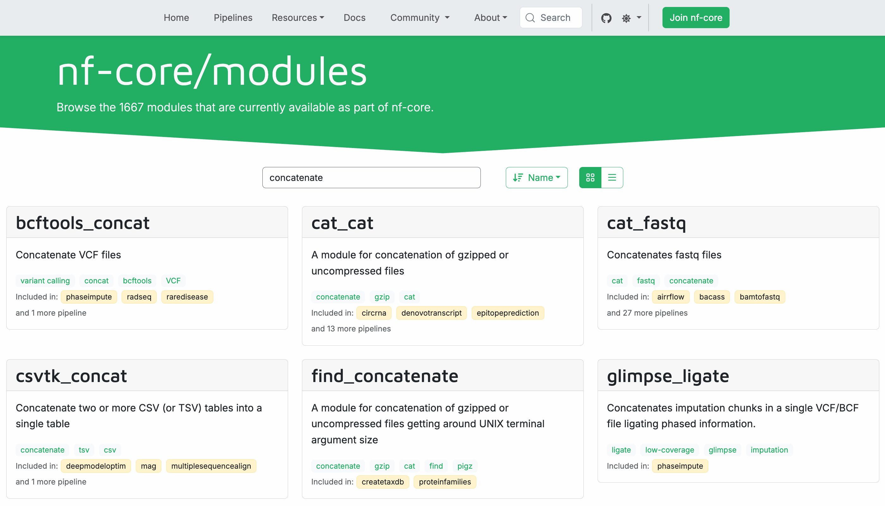

# Bölüm 3: Bir nf-core modülü kullanma

<span class="ai-translation-notice">:material-information-outline:{ .ai-translation-notice-icon } Yapay Zeka Destekli Çeviri - [daha fazla bilgi ve iyileştirme önerileri](https://github.com/nextflow-io/training/blob/master/TRANSLATING.md)</span>

Hello nf-core eğitim kursunun bu üçüncü bölümünde, mevcut bir nf-core modülünü nasıl bulacağınızı, kuracağınızı ve pipeline'ınızda kullanacağınızı gösteriyoruz.

nf-core ile çalışmanın en büyük avantajlarından biri, [nf-core/modules](https://github.com/nf-core/modules) deposundan önceden oluşturulmuş ve test edilmiş modüllerden yararlanabilmektir.
Her işlemi sıfırdan yazmak yerine, en iyi uygulamaları takip eden topluluk tarafından sürdürülen modülleri kurabilir ve kullanabilirsiniz.

Bunun nasıl çalıştığını göstermek için, `core-hello` pipeline'ındaki özel `collectGreetings` modülünü nf-core/modules'ten `cat/cat` modülü ile değiştireceğiz.

??? info "Bu bölüme nasıl başlanır"

    Kursun bu bölümü, [Bölüm 2: Hello'yu nf-core için yeniden yazma](./02_rewrite_hello.md) bölümünü tamamladığınızı ve çalışan bir `core-hello` pipeline'ına sahip olduğunuzu varsayar.

    Bölüm 2'yi tamamlamadıysanız veya bu bölüm için yeni başlamak istiyorsanız, `core-hello-part2` çözümünü başlangıç noktanız olarak kullanabilirsiniz.
    `hello-nf-core/` dizini içinden şu komutu çalıştırın:

    ```bash
    cp -r solutions/core-hello-part2 core-hello
    cd core-hello
    ```

    Bu, modül eklemeye hazır tamamen işlevsel bir nf-core pipeline'ı sağlar.
    Aşağıdaki komutu çalıştırarak başarıyla çalıştığını test edebilirsiniz:

    ```bash
    nextflow run . --outdir core-hello-results -profile test,docker --validate_params false
    ```

---

## 1. Uygun bir nf-core modülü bulma ve kurma

İlk olarak, mevcut bir nf-core modülünü nasıl bulacağımızı ve pipeline'ımıza nasıl kuracağımızı öğrenelim.

`collectGreetings` işlemini değiştirmeyi hedefliyoruz. Bu işlem, birden fazla selamlama dosyasını tek bir dosyada birleştirmek için Unix `cat` komutunu kullanıyor.
Dosyaları birleştirmek çok yaygın bir işlemdir, bu nedenle bu amaç için nf-core'da zaten tasarlanmış bir modül olması mantıklıdır.

Hadi başlayalım.

### 1.1. nf-core web sitesinde mevcut modüllere göz atma

nf-core projesi, [https://nf-co.re/modules](https://nf-co.re/modules) adresinde merkezi bir modül kataloğu tutar.

Web tarayıcınızda modüller sayfasına gidin ve 'concatenate' aramak için arama çubuğunu kullanın.



Gördüğünüz gibi, birçok sonuç var ve bunların çoğu çok spesifik dosya türlerini birleştirmek için tasarlanmış modüller.
Bunlar arasında, genel amaçlı olan `cat_cat` adlı bir modül görmelisiniz.

!!! note "Modül adlandırma kuralı"

    Alt çizgi (`_`) karakteri, modül adlarında eğik çizgi (`/`) karakterinin yerine kullanılır.

    nf-core modülleri, bir araç birden fazla komut sağladığında `yazılım/komut` adlandırma kuralını takip eder, örneğin `samtools/view` (samtools paketi, view komutu) veya `gatk/haplotypecaller` (GATK paketi, HaplotypeCaller komutu).
    Yalnızca bir ana komut sağlayan araçlar için modüller `fastqc` veya `multiqc` gibi tek seviyeli isimler kullanır.

Modül belgelerini görüntülemek için `cat_cat` modül kutusuna tıklayın.

Modül sayfası şunları gösterir:

- Kısa bir açıklama: "A module for concatenation of gzipped or uncompressed files"
- Kurulum komutu: `nf-core modules install cat/cat`
- Girdi ve çıktı kanal yapısı
- Mevcut parametreler

### 1.2. Komut satırından mevcut modülleri listeleme

Alternatif olarak, nf-core araçlarını kullanarak doğrudan komut satırından modülleri de arayabilirsiniz.

```bash
nf-core modules list remote
```

Bu, nf-core/modules deposundaki tüm mevcut modüllerin bir listesini görüntüler, ancak aradığınız modülün adını önceden bilmiyorsanız biraz daha az kullanışlıdır.
Ancak, biliyorsanız, listeyi belirli modülleri bulmak için `grep`'e yönlendirebilirsiniz:

```bash
nf-core modules list remote | grep 'cat/cat'
```

??? success "Komut çıktısı"

    ```console
    │ cat/cat
    ```

Unutmayın ki `grep` yaklaşımı yalnızca adında arama terimi olan sonuçları çeker, bu `cat_cat` için işe yaramaz.

### 1.3. Modül hakkında detaylı bilgi alma

Komut satırından belirli bir modül hakkında ayrıntılı bilgi görmek için `info` komutunu kullanın:

```bash
nf-core modules info cat/cat
```

Bu, modül hakkında, girdileri, çıktıları ve temel kullanım bilgileri dahil olmak üzere belgeleri görüntüler.

??? success "Komut çıktısı"

    ```console

                                              ,--./,-.
              ___     __   __   __   ___     /,-._.--~\
        |\ | |__  __ /  ` /  \ |__) |__         }  {
        | \| |       \__, \__/ |  \ |___     \`-._,-`-,
                                              `._,._,'

        nf-core/tools version 3.4.1 - https://nf-co.re


    ╭─ Module: cat/cat  ─────────────────────────────────────────────────╮
    │ 🌐 Repository: https://github.com/nf-core/modules.git              │
    │ 🔧 Tools: cat                                                      │
    │ 📖 Description: A module for concatenation of gzipped or           │
    │ uncompressed files                                                 │
    ╰────────────────────────────────────────────────────────────────────╯
                      ╷                                          ╷
    📥 Inputs        │Description                               │Pattern
    ╺━━━━━━━━━━━━━━━━━┿━━━━━━━━━━━━━━━━━━━━━━━━━━━━━━━━━━━━━━━━━━┿━━━━━━━╸
    input[0]         │                                          │
    ╶─────────────────┼──────────────────────────────────────────┼───────╴
      meta  (map)     │Groovy Map containing sample information  │
                      │e.g. [ id:'test', single_end:false ]      │
    ╶─────────────────┼──────────────────────────────────────────┼───────╴
      files_in  (file)│List of compressed / uncompressed files   │      *
                      ╵                                          ╵
                          ╷                                 ╷
    📥 Outputs           │Description                      │     Pattern
    ╺━━━━━━━━━━━━━━━━━━━━━┿━━━━━━━━━━━━━━━━━━━━━━━━━━━━━━━━━┿━━━━━━━━━━━━╸
    file_out             │                                 │
    ╶─────────────────────┼─────────────────────────────────┼────────────╴
      meta  (map)         │Groovy Map containing sample     │
                          │information                      │
    ╶─────────────────────┼─────────────────────────────────┼────────────╴
      ${prefix}  (file)   │Concatenated file. Will be       │ ${file_out}
                          │gzipped if file_out ends with    │
                          │".gz"                            │
    ╶─────────────────────┼─────────────────────────────────┼────────────╴
    versions             │                                 │
    ╶─────────────────────┼─────────────────────────────────┼────────────╴
      versions.yml  (file)│File containing software versions│versions.yml
                          ╵                                 ╵

    💻  Installation command: nf-core modules install cat/cat

    ```

Bu, web sitesinde bulabileceğiniz bilgilerin tamamen aynısıdır.

### 1.4. cat/cat modülünü kurma

Artık istediğimiz modülü bulduğumuza göre, onu pipeline'ımızın kaynak koduna eklememiz gerekiyor.

İyi haber şu ki nf-core projesi bunu kolaylaştıran bazı araçlar içeriyor.
Özellikle, `nf-core modules install` komutu, kodu almayı ve projenizde kullanılabilir hale getirmeyi tek adımda otomatikleştirmeyi mümkün kılar.

Pipeline dizininize gidin ve kurulum komutunu çalıştırın:

```bash
cd core-hello
nf-core modules install cat/cat
```

Araç önce bir depo türü belirtmenizi isteyebilir.
(İstemezse, "Son olarak, araç modülü kurmaya devam edecektir" kısmına atlayın.)

??? success "Komut çıktısı"

    ```console

                                          ,--./,-.
          ___     __   __   __   ___     /,-._.--~\
    |\ | |__  __ /  ` /  \ |__) |__         }  {
    | \| |       \__, \__/ |  \ |___     \`-._,-`-,
                                          `._,._,'

    nf-core/tools version 3.4.1 - https://nf-co.re


    WARNING  'repository_type' not defined in .nf-core.yml
    ? Is this repository a pipeline or a modules repository? (Use arrow keys)
    » Pipeline
      Modules repository
    ```

Öyleyse, varsayılan yanıtı (`Pipeline`) kabul etmek için enter'a basın ve devam edin.

Araç daha sonra gelecekte bu istemden kaçınmak için projenizin yapılandırmasını değiştirmeyi teklif edecektir.

??? success "Komut çıktısı"

    ```console
        INFO     To avoid this prompt in the future, add the 'repository_type' key to your .nf-core.yml file.
        ? Would you like me to add this config now? [y/n] (y):
    ```

Bu kullanışlı araçlardan yararlanmak iyi olur!
Varsayılan yanıtı (evet) kabul etmek için enter'a basın.

Son olarak, araç modülü kurmaya devam edecektir.

??? success "Komut çıktısı"

    ```console
    INFO Config added to '.nf-core.yml'
    INFO Reinstalling modules found in 'modules.json' but missing from directory:
    INFO Installing 'cat/cat'
    INFO Use the following statement to include this module:

        include { CAT_CAT } from '../modules/nf-core/cat/cat/main'
    ```

Komut otomatik olarak:

- Modül dosyalarını `modules/nf-core/cat/cat/` dizinine indirir
- Kurulu modülü izlemek için `modules.json` dosyasını günceller
- Workflow'unuzda kullanmak için doğru `include` ifadesini size sağlar

!!! tip

    Modül kurulum komutunu çalıştırmadan önce geçerli çalışma dizininizin pipeline projenizin kök dizini olduğundan emin olun.

Modülün doğru şekilde kurulduğunu kontrol edelim:

```bash
tree -L 4 modules
```

??? abstract "Dizin içeriği"

    ```console
    modules
    ├── local
    │   ├── collectGreetings.nf
    │   ├── convertToUpper.nf
    │   ├── cowpy.nf
    │   └── sayHello.nf
    └── nf-core
        └── cat
            └── cat
                ├── environment.yml
                ├── main.nf
                ├── meta.yml
                └── tests

    5 directories, 7 files
    ```

Ayrıca nf-core yardımcı programına yerel olarak kurulu modülleri listelemesini söyleyerek kurulumu doğrulayabilirsiniz:

```bash
nf-core modules list local
```

??? success "Komut çıktısı"

    ```console
    INFO     Repository type: pipeline
    INFO     Modules installed in '.':

    ┏━━━━━━━━━━━━━┳━━━━━━━━━━━━━━━━━┳━━━━━━━━━━━━━┳━━━━━━━━━━━━━━━━━━━━━━━━━━━━━━━━━━━━━━━━┳━━━━━━━━━━━━┓
    ┃ Module Name ┃ Repository      ┃ Version SHA ┃ Message                                ┃ Date       ┃
    ┡━━━━━━━━━━━━━╇━━━━━━━━━━━━━━━━━╇━━━━━━━━━━━━━╇━━━━━━━━━━━━━━━━━━━━━━━━━━━━━━━━━━━━━━━━╇━━━━━━━━━━━━┩
    │ cat/cat     │ nf-core/modules │ 41dfa3f     │ update meta.yml of all modules (#8747) │ 2025-07-07 │
    └─────────────┴─────────────────┴─────────────┴────────────────────────────────────────┴────────────┘
    ```

Bu, `cat/cat` modülünün artık projenizin kaynak kodunun bir parçası olduğunu doğrular.

Ancak, yeni modülü gerçekten kullanmak için onu pipeline'ımıza aktarmamız gerekiyor.

### 1.5. Modül içe aktarmalarını güncelleme

`workflows/hello.nf` workflow'unun içe aktarma bölümünde `collectGreetings` modülü için olan `include` ifadesini `CAT_CAT` için olan ifade ile değiştirelim.

Hatırlatma olarak, modül kurulum aracı bize kullanacağımız tam ifadeyi verdi:

```groovy title="Kurulum komutu tarafından üretilen içe aktarma ifadesi"
include { CAT_CAT } from '../modules/nf-core/cat/cat/main'`
```

nf-core kuralının modülleri içe aktarırken büyük harf kullanmak olduğunu unutmayın.

[core-hello/workflows/hello.nf](core-hello/workflows/hello.nf) dosyasını açın ve aşağıdaki değişikliği yapın:

=== "Sonra"

    ```groovy title="core-hello/workflows/hello.nf" linenums="1" hl_lines="10"
    /*
    ~~~~~~~~~~~~~~~~~~~~~~~~~~~~~~~~~~~~~~~~~~~~~~~~~~~~~~~~~~~~~~~~~~~~~~~~~~~~~~~~~~~~~~~~
        IMPORT MODULES / SUBWORKFLOWS / FUNCTIONS
    ~~~~~~~~~~~~~~~~~~~~~~~~~~~~~~~~~~~~~~~~~~~~~~~~~~~~~~~~~~~~~~~~~~~~~~~~~~~~~~~~~~~~~~~~
    */
    include { paramsSummaryMap       } from 'plugin/nf-schema'
    include { softwareVersionsToYAML } from '../subworkflows/nf-core/utils_nfcore_pipeline'
    include { sayHello               } from '../modules/local/sayHello.nf'
    include { convertToUpper         } from '../modules/local/convertToUpper.nf'
    include { CAT_CAT                } from '../modules/nf-core/cat/cat/main'
    include { cowpy                  } from '../modules/local/cowpy.nf'
    ```

=== "Önce"

    ```groovy title="core-hello/workflows/hello.nf" linenums="1" hl_lines="10"
    /*
    ~~~~~~~~~~~~~~~~~~~~~~~~~~~~~~~~~~~~~~~~~~~~~~~~~~~~~~~~~~~~~~~~~~~~~~~~~~~~~~~~~~~~~~~~
        IMPORT MODULES / SUBWORKFLOWS / FUNCTIONS
    ~~~~~~~~~~~~~~~~~~~~~~~~~~~~~~~~~~~~~~~~~~~~~~~~~~~~~~~~~~~~~~~~~~~~~~~~~~~~~~~~~~~~~~~~
    */
    include { paramsSummaryMap       } from 'plugin/nf-schema'
    include { softwareVersionsToYAML } from '../subworkflows/nf-core/utils_nfcore_pipeline'
    include { sayHello               } from '../modules/local/sayHello.nf'
    include { convertToUpper         } from '../modules/local/convertToUpper.nf'
    include { collectGreetings       } from '../modules/local/collectGreetings.nf'
    include { cowpy                  } from '../modules/local/cowpy.nf'
    ```

nf-core modülü için yolun yerel modüllerden nasıl farklı olduğuna dikkat edin:

- **nf-core modülü**: `'../modules/nf-core/cat/cat/main'` (`main.nf` dosyasına referans verir)
- **Yerel modül**: `'../modules/local/collectGreetings.nf'` (tek dosya referansı)

Modül artık workflow için kullanılabilir, bu nedenle tek yapmamız gereken `collectGreetings` çağrısını `CAT_CAT` kullanacak şekilde değiştirmek. Değil mi?

O kadar kolay değil.

Bu noktada, koda dalıp düzenlemeye başlamak cazip gelebilir, ancak yeni modülün ne beklediğini ve ne ürettiğini dikkatlice incelemek için bir an ayırmaya değer.

Bunu ayrı bir bölüm olarak ele alacağız çünkü henüz ele almadığımız yeni bir mekanizma içeriyor: metadata map'leri (metadata haritaları).

!!! note

    İsteğe bağlı olarak `collectGreetings.nf` dosyasını silebilirsiniz:

    ```bash
    rm modules/local/collectGreetings.nf
    ```

    Ancak, yerel ve nf-core modülleri arasındaki farkları anlamak için referans olarak saklamak isteyebilirsiniz.

### Önemli çıkarımlar

Bir nf-core modülünü nasıl bulacağınızı ve projenizde kullanılabilir hale getireceğinizi biliyorsunuz.

### Sırada ne var?

Yeni bir modülün ne gerektirdiğini değerlendirin ve onu bir pipeline'a entegre etmek için gereken önemli değişiklikleri belirleyin.

---

## 2. Yeni modülün gereksinimlerini değerlendirme

Özellikle, modülün **arayüzünü**, yani girdi ve çıktı tanımlarını incelememiz ve değiştirmeye çalıştığımız modülün arayüzüyle karşılaştırmamız gerekiyor.
Bu, yeni modülü doğrudan yerine geçecek bir modül olarak kullanıp kullanamayacağımızı veya kablolamada bazı uyarlamalar yapmamız gerekip gerekmediğini belirlememizi sağlayacaktır.

İdeal olarak bu, modülü kurmadan _önce_ yapmanız gereken bir şeydir, ama hiç olmamasından iyidir.
(Değeri bilinsin ki, artık istemediğinize karar verdiğiniz modüllerden kurtulmak için bir `uninstall` komutu vardır.)

!!! note

    CAT_CAT işlemi, farklı sıkıştırma türleri, dosya uzantıları ve benzeri konularla ilgili oldukça akıllı bir işleme içerir, bunlar burada size göstermeye çalıştığımız şeyle doğrudan alakalı değil, bu yüzden çoğunu görmezden geleceğiz ve yalnızca önemli olan kısımlara odaklanacağız.

### 2.1. İki modülün arayüzlerini karşılaştırma

Hatırlatma olarak, `collectGreetings` modülümüzün arayüzü şöyle görünüyor:

```groovy title="modules/local/collectGreetings.nf (alıntı)" linenums="1" hl_lines="6-7 10"
process collectGreetings {

    publishDir 'results', mode: 'copy'

    input:
        path input_files
        val batch_name

    output:
        path "COLLECTED-${batch_name}-output.txt" , emit: outfile
```

`collectGreetings` modülü iki girdi alır:

- `input_files` işlenecek bir veya daha fazla girdi dosyası içerir;
- `batch_name` çıktı dosyasına çalıştırmaya özgü bir ad atamak için kullandığımız bir değerdir, bu bir metadata biçimidir.

Tamamlandığında, `collectGreetings` `outfile` etiketi ile yayınlanan tek bir dosya yolu çıktılar.

Karşılaştırmalı olarak, `cat/cat` modülünün arayüzü daha karmaşıktır:

```groovy title="modules/nf-core/cat/cat/main.nf (alıntı)" linenums="1" hl_lines="11 14"
process CAT_CAT {
    tag "$meta.id"
    label 'process_low'

    conda "${moduleDir}/environment.yml"
    container "${ workflow.containerEngine == 'singularity' && !task.ext.singularity_pull_docker_container ?
        'https://depot.galaxyproject.org/singularity/pigz:2.3.4' :
        'biocontainers/pigz:2.3.4' }"

    input:
    tuple val(meta), path(files_in)

    output:
    tuple val(meta), path("${prefix}"), emit: file_out
    path "versions.yml"               , emit: versions
```

CAT_CAT modülü tek bir girdi alır, ancak bu girdi iki şey içeren bir demettir:

- `meta`, metamap adı verilen metadata içeren bir yapıdır;
- `files_in`, `collectGreetings`'in `input_files`'ına eşdeğer olan, işlenecek bir veya daha fazla girdi dosyası içerir.

Tamamlandığında, CAT_CAT çıktılarını iki kısımda sunar:

- Metamap ve birleştirilmiş çıktı dosyasını içeren başka bir demet, `file_out` etiketi ile yayınlanır;
- Kullanılan yazılım sürümü hakkında bilgi yakalayan bir `versions.yml` dosyası, `versions` etiketi ile yayınlanır.

Ayrıca varsayılan olarak çıktı dosyasının metadata'nın bir parçası olan bir tanımlayıcıya göre adlandırılacağını unutmayın (kod burada gösterilmemiştir).

Sadece koda bakarak bunları takip etmek çok fazla gibi görünebilir, bu yüzden her şeyin nasıl bir araya geldiğini görselleştirmenize yardımcı olacak bir diyagram burada:

<figure class="excalidraw">
--8<-- "docs/en/docs/hello_nf-core/img/module_comparison.svg"
</figure>

İki modülün içerik açısından benzer girdi gereksinimlerine sahip olduğunu (bir dizi girdi dosyası artı bazı metadata) ancak bu içeriğin nasıl paketleneceği konusunda çok farklı beklentileri olduğunu görebilirsiniz.
Versions dosyasını şimdilik görmezden gelecek olursak, ana çıktıları da eşdeğerdir (birleştirilmiş bir dosya), ancak CAT_CAT ayrıca çıktı dosyasıyla birlikte metamap'i de yayınlar.

Birazdan göreceğiniz gibi, paketleme farklarıyla başa çıkmak oldukça kolay olacak.
Ancak, metamap kısmını anlamak için size biraz ek bağlam sunmamız gerekiyor.

### 2.2. Metamap'leri anlama

Size CAT_CAT modülünün girdi demetinin bir parçası olarak bir metadata map beklediğini söyledik.
Bunun ne olduğuna daha yakından bakmak için birkaç dakika ayıralım.

**Metadata map**, genellikle kısaca **metamap** olarak adlandırılır, veri birimleri hakkında bilgi içeren Groovy tarzı bir map'tir.
Nextflow pipeline'ları bağlamında, veri birimleri istediğiniz herhangi bir şey olabilir: bireysel örnekler, örnek grupları veya tüm veri kümeleri.

Geleneksel olarak, bir nf-core metamap'i `meta` olarak adlandırılır ve çıktıları adlandırmak ve veri birimlerini izlemek için kullanılan gerekli `id` alanını içerir.

Örneğin, tipik bir metadata map şöyle görünebilir:

```groovy title="Örnek seviyesinde metamap örneği"
[id: 'sample1', single_end: false, strandedness: 'forward']
```

Veya metadata'nın batch seviyesinde eklendiği bir durumda:

```groovy title="Batch seviyesinde metamap örneği"
[id: 'batch1', date: '25.10.01']
```

Şimdi bunu `CAT_CAT` işlemi bağlamına koyalım; bu işlem girdi dosyalarının bir metamap ile bir demet halinde paketlenmesini bekler ve çıktı demetinin bir parçası olarak metamap'i de çıktılar.

```groovy title="modules/nf-core/cat/cat/main.nf (alıntı)" linenums="1" hl_lines="2 5"
input:
tuple val(meta), path(files_in)

output:
tuple val(meta), path("${prefix}"), emit: file_out
```

Sonuç olarak, her veri birimi ilgili metadata eklenmiş olarak pipeline üzerinden ilerler.
Sonraki işlemler de bu metadata'ya kolayca erişebilir.

Size `CAT_CAT` tarafından çıktılanan dosyanın metadata'nın bir parçası olan bir tanımlayıcıya göre adlandırılacağını söylediğimizi hatırlıyor musunuz?
İlgili kod şudur:

```groovy title="modules/nf-core/cat/cat/main.nf (alıntı)" linenums="35"
prefix   = task.ext.prefix ?: "${meta.id}${getFileSuffix(file_list[0])}"
```

Bu kabaca şu anlama gelir: eğer harici görev parametre sistemi (`task.ext`) aracılığıyla bir `prefix` sağlanırsa, çıktı dosyasını adlandırmak için onu kullan; aksi takdirde metamap'teki `id` alanına karşılık gelen `${meta.id}` kullanarak bir tane oluştur.

Bu modüle gelen girdi kanalının şöyle içeriklerle geldiğini hayal edebilirsiniz:

```groovy title="Örnek girdi kanalı içeriği"
ch_input = [[[id: 'batch1', date: '25.10.01'], ['file1A.txt', 'file1B.txt']],
            [[id: 'batch2', date: '25.10.26'], ['file2A.txt', 'file2B.txt']],
            [[id: 'batch3', date: '25.11.14'], ['file3A.txt', 'file3B.txt']]]
```

Ardından çıkan çıktı kanalı içeriği şöyle çıkar:

```groovy title="Örnek çıktı kanalı içeriği"
ch_input = [[[id: 'batch1', date: '25.10.01'], 'batch1.txt'],
            [[id: 'batch2', date: '25.10.26'], 'batch2.txt'],
            [[id: 'batch3', date: '25.11.14'], 'batch3.txt']]
```

Daha önce de belirtildiği gibi, `tuple val(meta), path(files_in)` girdi kurulumu tüm nf-core modüllerinde kullanılan standart bir modeldir.

Umarım bunun ne kadar yararlı olabileceğini görmeye başlıyorsunuzdur.
Sadece metadata'ya göre çıktıları adlandırmanıza izin vermekle kalmaz, aynı zamanda farklı parametre değerlerini uygulamak gibi şeyler de yapabilirsiniz ve belirli operatörlerle kombinasyon halinde, pipeline üzerinden akarken verileri gruplayabilir, sıralayabilir veya filtreleyebilirsiniz.

!!! note "Metadata hakkında daha fazla bilgi"

    Nextflow workflow'larında metadata ile çalışma hakkında, samplesheet'lerden metadata okuma ve işlemeyi özelleştirmek için nasıl kullanılacağı dahil olmak üzere kapsamlı bir giriş için [Workflow'larda metadata](../side_quests/metadata) yan görevine bakın.

### 2.3. Yapılacak değişiklikleri özetleme

İncelediklerimize dayanarak, `cat/cat` modülünü kullanmak için pipeline'ımızda yapmamız gereken ana değişiklikler şunlardır:

- Batch adını içeren bir metamap oluşturma;
- Metamap'i birleştirilecek girdi dosyaları kümesiyle bir demet halinde paketleme (`convertToUpper`'dan çıkan);
- Çağrıyı `collectGreetings()`'ten `CAT_CAT`'e değiştirme;
- `CAT_CAT` işlemi tarafından üretilen demetten çıktı dosyasını `cowpy`'ye geçirmeden önce çıkarma.

Bu işe yaramalı! Artık bir planımız olduğuna göre, dalmaya hazırız.

### Önemli çıkarımlar

Yeni bir modülün girdi ve çıktı arayüzünü gereksinimlerini belirlemek için nasıl değerlendireceğinizi biliyorsunuz ve metamap'lerin nf-core pipeline'ları tarafından metadata'yı pipeline üzerinden akarken verilerle yakından ilişkili tutmak için nasıl kullanıldığını öğrendiniz.

### Sırada ne var?

Yeni modülü bir workflow'a entegre edin.

---

## 3. CAT_CAT'i `hello.nf` workflow'una entegre etme

Artık metamap'ler hakkında her şeyi bildiğinize göre (veya en azından bu kursun amaçları için yeterince), yukarıda özetlediğimiz değişiklikleri gerçekten uygulamanın zamanı geldi.

Netlik adına, bunu parçalara ayıracağız ve her adımı ayrı ayrı ele alacağız.

!!! note

    Aşağıda gösterilen tüm değişiklikler `core-hello/workflows/hello.nf` workflow dosyasındaki `main` bloğundaki workflow mantığına yapılır.

### 3.1. Bir metadata map oluşturma

İlk olarak, nf-core modüllerinin metamap'in en azından bir `id` alanı içermesini gerektirdiğini aklımızda tutarak, `CAT_CAT` için bir metadata map oluşturmamız gerekiyor.

Başka metadata'ya ihtiyacımız olmadığından, basit tutabilir ve şöyle bir şey kullanabiliriz:

```groovy title="Sözdizimi örneği"
def cat_meta = [id: 'test']
```

Ancak `id` değerini sabit kodlamak istemiyoruz; `params.batch` parametresinin değerini kullanmak istiyoruz.
Yani kod şöyle olur:

```groovy title="Sözdizimi örneği"
def cat_meta = [id: params.batch]
```

Evet, temel bir metamap oluşturmak kelimenin tam anlamıyla bu kadar basit.

Bu satırları `convertToUpper` çağrısından sonra ekleyelim ve `collectGreetings` çağrısını kaldıralım:

=== "Sonra"

    ```groovy title="core-hello/workflows/hello.nf" linenums="26" hl_lines="7-8"
        // bir selamlama yayınla
        sayHello(ch_samplesheet)

        // selamlamayı büyük harfe dönüştür
        convertToUpper(sayHello.out)

        // batch adını ID olarak içeren metadata map oluştur
        def cat_meta = [ id: params.batch ]

        // cowpy ile ASCII art oluştur
        cowpy(collectGreetings.out.outfile, params.character)
    ```

=== "Önce"

    ```groovy title="core-hello/workflows/hello.nf" linenums="26" hl_lines="7-8"
        // bir selamlama yayınla
        sayHello(ch_samplesheet)

        // selamlamayı büyük harfe dönüştür
        convertToUpper(sayHello.out)

        // tüm selamlamaları tek bir dosyada topla
        collectGreetings(convertToUpper.out.collect(), params.batch)

        // cowpy ile ASCII art oluştur
        cowpy(collectGreetings.out.outfile, params.character)
    ```

Bu, `id`'nin batch adımıza (test profilini kullanırken `test` olacaktır) ayarlandığı basit bir metadata map oluşturur.

### 3.2. Metadata demetleri içeren bir kanal oluşturma

Ardından, dosya kanalını metadata ve dosyalar içeren demet kanalına dönüştürün:

=== "Sonra"

    ```groovy title="core-hello/workflows/hello.nf" linenums="26" hl_lines="10-11"
        // bir selamlama yayınla
        sayHello(ch_samplesheet)

        // selamlamayı büyük harfe dönüştür
        convertToUpper(sayHello.out)

        // batch adını ID olarak içeren metadata map oluştur
        def cat_meta = [ id: params.batch ]

        // metadata ve dosyaları demet formatında içeren bir kanal oluştur
        ch_for_cat = convertToUpper.out.collect().map { files -> tuple(cat_meta, files) }

        // cowpy ile ASCII art oluştur
        cowpy(collectGreetings.out.outfile, params.character)
    ```

=== "Önce"

    ```groovy title="core-hello/workflows/hello.nf" linenums="26"
        // bir selamlama yayınla
        sayHello(ch_samplesheet)

        // selamlamayı büyük harfe dönüştür
        convertToUpper(sayHello.out)

        // batch adını ID olarak içeren metadata map oluştur
        def cat_meta = [ id: params.batch ]

        // cowpy ile ASCII art oluştur
        cowpy(collectGreetings.out.outfile, params.character)
    ```

Eklediğimiz satır iki şey başarır:

- `.collect()` `convertToUpper` çıktısından tüm dosyaları tek bir listede toplar
- `.map { files -> tuple(cat_meta, files) }` `CAT_CAT`'in beklediği formatta `[metadata, dosyalar]` demeti oluşturur

`CAT_CAT` için girdi demetini kurmak için yapmamız gereken tek şey bu.

### 3.3. CAT_CAT modülünü çağırma

Şimdi yeni oluşturulan kanal üzerinde `CAT_CAT`'i çağırın:

=== "Sonra"

    ```groovy title="core-hello/workflows/hello.nf" linenums="26" hl_lines="13-14"
        // bir selamlama yayınla
        sayHello(ch_samplesheet)

        // selamlamayı büyük harfe dönüştür
        convertToUpper(sayHello.out)

        // batch adını ID olarak içeren metadata map oluştur
        def cat_meta = [ id: params.batch ]

        // metadata ve dosyaları demet formatında içeren bir kanal oluştur
        ch_for_cat = convertToUpper.out.collect().map { files -> tuple(cat_meta, files) }

        // nf-core cat/cat modülünü kullanarak dosyaları birleştir
        CAT_CAT(ch_for_cat)

        // cowpy ile ASCII art oluştur
        cowpy(collectGreetings.out.outfile, params.character)
    ```

=== "Önce"

    ```groovy title="core-hello/workflows/hello.nf" linenums="26"
        // bir selamlama yayınla
        sayHello(ch_samplesheet)

        // selamlamayı büyük harfe dönüştür
        convertToUpper(sayHello.out)

        // batch adını ID olarak içeren metadata map oluştur
        def cat_meta = [ id: params.batch ]

        // metadata ve dosyaları demet formatında içeren bir kanal oluştur
        ch_for_cat = convertToUpper.out.collect().map { files -> tuple(cat_meta, files) }

        // cowpy ile ASCII art oluştur
        cowpy(collectGreetings.out.outfile, params.character)
    ```

Bu, bu değiştirmenin en karmaşık kısmını tamamlar, ancak henüz bitirmedik: birleştirilmiş çıktıyı `cowpy` işlemine nasıl ileteceğimizi güncellememiz gerekiyor.

### 3.4. `cowpy` için çıktı dosyasını demetten çıkarma

Daha önce, `collectGreetings` işlemi doğrudan `cowpy`'ye aktarabileceğimiz bir dosya üretiyordu.
Ancak, `CAT_CAT` işlemi çıktı dosyasına ek olarak metamap'i de içeren bir demet üretir.

`cowpy` henüz metadata demetlerini kabul etmediğinden (bunu kursun sonraki bölümünde düzelteceğiz), `CAT_CAT` tarafından üretilen demetten çıktı dosyasını `cowpy`'ye vermeden önce çıkarmamız gerekiyor:

=== "Sonra"

    ```groovy title="core-hello/workflows/hello.nf" linenums="26" hl_lines="16-17 20"
        // bir selamlama yayınla
        sayHello(ch_samplesheet)

        // selamlamayı büyük harfe dönüştür
        convertToUpper(sayHello.out)

        // batch adını ID olarak içeren metadata map oluştur
        def cat_meta = [ id: params.batch ]

        // metadata ve dosyaları demet formatında içeren bir kanal oluştur
        ch_for_cat = convertToUpper.out.collect().map { files -> tuple(cat_meta, files) }

        // concatenate the greetings
        CAT_CAT(ch_for_cat)

        // cowpy henüz metadata kullanmadığı için dosyayı demetten çıkar
        ch_for_cowpy = CAT_CAT.out.file_out.map{ meta, file -> file }

        // cowpy ile selamlamaların ASCII sanatını oluştur
        cowpy(ch_for_cowpy, params.character)
    ```

=== "Önce"

    ```groovy title="core-hello/workflows/hello.nf" linenums="26" hl_lines="17"
        // bir selamlama yayınla
        sayHello(ch_samplesheet)

        // selamlamayı büyük harfe dönüştür
        convertToUpper(sayHello.out)

        // batch adını ID olarak içeren metadata map oluştur
        def cat_meta = [ id: params.batch ]

        // metadata ve dosyaları demet formatında içeren bir kanal oluştur
        ch_for_cat = convertToUpper.out.collect().map { files -> tuple(cat_meta, files) }

        // concatenate the greetings
        CAT_CAT(ch_for_cat)

        // cowpy ile ASCII art oluştur
        cowpy(collectGreetings.out.outfile, params.character)
    ```

`.map{ meta, file -> file }` işlemi, `CAT_CAT` tarafından üretilen `[metadata, dosya]` demetinden dosyayı yeni bir kanala, `ch_for_cowpy`'ye çıkarır.

Ardından o son satırda `collectGreetings.out.outfile` yerine `ch_for_cowpy`'yi `cowpy`'ye iletmek yeterlidir.

!!! note

    Kursun sonraki bölümünde, `cowpy`'yi doğrudan metadata demetleriyle çalışacak şekilde güncelleyeceğiz, böylece bu çıkarma adımı artık gerekli olmayacak.

### 3.5. Workflow'u test etme

Workflow'un yeni entegre edilen `cat/cat` modülüyle çalıştığını test edelim:

```bash
nextflow run . --outdir core-hello-results -profile test,docker --validate_params false
```

Bu makul bir hızda çalışmalıdır.

??? success "Komut çıktısı"

    ```console
    N E X T F L O W ~ version 25.04.3

        Launching `./main.nf` [evil_pike] DSL2 - revision: b9e9b3b8de

        Input/output options
          input                     : /workspaces/training/hello-nf-core/core-hello/assets/greetings.csv
          outdir                    : core-hello-results

        Institutional config options
          config_profile_name       : Test profile
          config_profile_description: Minimal test dataset to check pipeline function

        Generic options
          validate_params           : false
          trace_report_suffix       : 2025-10-30_18-50-58

        Core Nextflow options
          runName                   : evil_pike
          containerEngine           : docker
          launchDir                 : /workspaces/training/hello-nf-core/core-hello
          workDir                   : /workspaces/training/hello-nf-core/core-hello/work
          projectDir                : /workspaces/training/hello-nf-core/core-hello
          userName                  : root
          profile                   : test,docker
          configFiles               : /workspaces/training/hello-nf-core/core-hello/nextflow.config

        !! Only displaying parameters that differ from the pipeline defaults !!
        ------------------------------------------------------
        executor >  local (8)
        [b3/f005fd] CORE_HELLO:HELLO:sayHello (3)       [100%] 3 of 3 ✔
        [08/f923d0] CORE_HELLO:HELLO:convertToUpper (3) [100%] 3 of 3 ✔
        [34/3729a9] CORE_HELLO:HELLO:CAT_CAT (test)     [100%] 1 of 1 ✔
        [24/df918a] CORE_HELLO:HELLO:cowpy              [100%] 1 of 1 ✔
        -[core/hello] Pipeline completed successfully-
    ```

İşlem yürütme listesinde `collectGreetings` yerine artık `CAT_CAT`'in göründüğünü fark edin.

Ve hepsi bu kadar! Artık pipeline'daki bu adım için özel prototip düzeyinde kod yerine sağlam, topluluk tarafından düzenlenen bir modül kullanıyoruz.

### Önemli çıkarımlar

Artık nasıl yapılacağını biliyorsunuz:

- nf-core modüllerini bulma ve kurma
- Bir nf-core modülünün gereksinimlerini değerlendirme
- Bir nf-core modülüyle kullanmak için basit bir metadata map oluşturma
- Bir nf-core modülünü workflow'unuza entegre etme

### Sırada ne var?

Yerel modüllerinizi nf-core kurallarına uyacak şekilde nasıl uyarlayacağınızı öğrenin.
Ayrıca nf-core araçlarını kullanarak bir şablondan yeni nf-core modülleri nasıl oluşturacağınızı da göstereceğiz.
