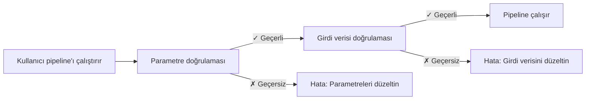

# Bölüm 5: Girdi doğrulaması

<span class="ai-translation-notice">:material-information-outline:{ .ai-translation-notice-icon } Yapay Zeka Destekli Çeviri - [daha fazla bilgi ve iyileştirme önerileri](https://github.com/nextflow-io/training/blob/master/TRANSLATING.md)</span>

Bu Hello nf-core eğitim kursunun beşinci bölümünde, pipeline girdi ve parametrelerini doğrulamak için nf-schema eklentisinin nasıl kullanılacağını gösteriyoruz.

??? info "Bu bölüme nasıl başlanır"

    Bu bölüm, [Bölüm 4: Bir nf-core modülü oluşturma](./04_make_module.md) kısmını tamamladığınızı ve `COWPY` süreç modülünü pipeline'ınızda nf-core standartlarına göre güncellediğinizi varsayar.

    Bölüm 4'ü tamamlamadıysanız veya bu bölüm için yeni başlamak istiyorsanız, başlangıç noktanız olarak `core-hello-part4` çözümünü kullanabilirsiniz.
    Bu komutları `hello-nf-core/` dizininin içinden çalıştırın:

    ```bash
    cp -r solutions/core-hello-part4 core-hello
    cd core-hello
    ```

    Bu size `COWPY` modülü zaten nf-core standartlarına uygun şekilde yükseltilmiş bir pipeline verir.
    Başarılı bir şekilde çalıştığını aşağıdaki komutu çalıştırarak test edebilirsiniz:

    ```bash
    nextflow run . --outdir core-hello-results -profile test,docker --validate_params false
    ```

---

## 0. Isınma: Biraz arka plan bilgisi

### 0.1. Doğrulama neden önemlidir

Pipeline'ınızı iki saat boyunca çalıştırdığınızı, ancak bir kullanıcının yanlış uzantılı bir dosya sağlaması nedeniyle çöktüğünü düşünün. Ya da saatlerce şifreli hataları ayıklamaya çalıştıktan sonra, bir parametrenin yanlış yazıldığını keşfettiğinizi. Girdi doğrulaması olmadan, bu senaryolar yaygındır.

Bu örneği düşünün:

```console title="Doğrulama olmadan"
$ nextflow run my-pipeline --input data.txt --output results

...2 saat sonra...

ERROR ~ No such file: 'data.fq.gz'
  Expected FASTQ format but received TXT
```

Pipeline geçersiz girdileri kabul etti ve başarısız olmadan önce saatlerce çalıştı. Uygun doğrulama ile:

```console title="Doğrulama ile"
$ nextflow run my-pipeline --input data.txt --output results

ERROR ~ Validation of pipeline parameters failed!

 * --input (data.txt): File extension '.txt' does not match required pattern '.fq.gz' or '.fastq.gz'
 * --output: required parameter is missing (expected: --outdir)

Pipeline failed before execution - please fix the errors above
```

Pipeline hemen net, eyleme dönüştürülebilir hata mesajlarıyla başarısız olur. Bu zaman, hesaplama kaynakları ve hayal kırıklığı tasarrufu sağlar.

### 0.2. nf-schema eklentisi

[nf-schema eklentisi](https://nextflow-io.github.io/nf-schema/latest/), Nextflow pipeline'ları için kapsamlı doğrulama yetenekleri sağlayan bir Nextflow eklentisidir.
nf-schema herhangi bir Nextflow workflow'u ile çalışsa da, tüm nf-core pipeline'ları için standart doğrulama çözümüdür.

nf-schema birkaç temel işlev sağlar:

- **Parametre doğrulaması**: `nextflow_schema.json` dosyasına karşı pipeline parametrelerini doğrular
- **Örnek çizelgesi doğrulaması**: `assets/schema_input.json` dosyasına karşı girdi dosyalarını doğrular
- **Kanal dönüşümü**: Doğrulanmış örnek çizelgelerini Nextflow kanallarına dönüştürür
- **Yardım metni oluşturma**: Şema tanımlarından otomatik olarak `--help` çıktısı oluşturur
- **Parametre özeti**: Hangi parametrelerin varsayılanlardan farklı olduğunu gösterir

nf-schema, kullanımdan kaldırılmış nf-validation eklentisinin halefidir ve doğrulama için standart [JSON Schema Draft 2020-12](https://json-schema.org/) kullanır.

??? info "Nextflow eklentileri nedir?"

    Eklentiler, Nextflow dilinin kendisine yeni işlevsellik ekleyen uzantılardır. `nextflow.config` içindeki bir `plugins{}` bloğu aracılığıyla kurulurlar ve şunları sağlayabilirler:

    - İçe aktarılabilen yeni fonksiyonlar ve sınıflar (`samplesheetToList` gibi)
    - Yeni DSL özellikleri ve operatörler
    - Harici hizmetlerle entegrasyon

    nf-schema eklentisi `nextflow.config` içinde belirtilir:

    ```groovy
    plugins {
        id 'nf-schema@2.1.1'
    }
    ```

    Kurulduktan sonra, `include { functionName } from 'plugin/plugin-name'` sözdizimini kullanarak eklentilerden fonksiyonları içe aktarabilirsiniz.

### 0.3. İki tür doğrulama için iki şema dosyası

Bir nf-core pipeline'ı, iki doğrulama türüne karşılık gelen iki ayrı şema dosyası kullanacaktır:

| Şema Dosyası               | Amaç                     | Doğruladığı                                               |
| -------------------------- | ------------------------ | --------------------------------------------------------- |
| `nextflow_schema.json`     | Parametre doğrulaması    | Komut satırı bayrakları: `--input`, `--outdir`, `--batch` |
| `assets/schema_input.json` | Girdi verisi doğrulaması | Örnek çizelgelerin ve girdi dosyalarının içeriği          |

Her iki şema da JSON Schema formatını kullanır; bu, veri yapılarını tanımlamak ve doğrulamak için yaygın olarak benimsenmiş bir standarttır.

**Parametre doğrulaması** komut satırı parametrelerini (`--outdir`, `--batch`, `--input` gibi bayrakları) doğrular:

- Parametre türlerini, aralıklarını ve formatlarını kontrol eder
- Gerekli parametrelerin sağlandığından emin olur
- Dosya yollarının var olduğunu doğrular
- `nextflow_schema.json` içinde tanımlanır

**Girdi verisi doğrulaması** örnek çizelgelerin ve manifest dosyalarının yapısını (verilerinizi tanımlayan CSV/TSV dosyaları) doğrular:

- Sütun yapısını ve veri türlerini kontrol eder
- Örnek çizelgesinde referans verilen dosya yollarının var olduğunu doğrular
- Gerekli alanların bulunduğundan emin olur
- `assets/schema_input.json` içinde tanımlanır

!!! warning "Girdi verisi doğrulamasının YAPMADIKLARI"

    Girdi verisi doğrulaması *manifest dosyalarının* (örnek çizelgeler, CSV dosyaları) yapısını kontrol eder, gerçek veri dosyalarınızın (FASTQ, BAM, VCF, vb.) içeriğini DEĞİL.

    Büyük ölçekli veriler için, dosya içeriklerini doğrulamak (BAM bütünlüğünü kontrol etmek gibi), orkestra makinesindeki doğrulama aşamasında değil, çalışan düğümlerinde çalışan pipeline süreçlerinde gerçekleşmelidir.

### 0.4. Doğrulama ne zaman gerçekleşmelidir?



Doğrulama, herhangi bir pipeline süreci çalışmadan **önce** gerçekleşmeli, böylece hızlı geri bildirim sağlanır ve hesaplama süresi boşa harcanmaz.

Şimdi bu ilkeleri uygulamaya koyalım, parametre doğrulamasıyla başlayarak.

---

## 1. Parametre doğrulaması (nextflow_schema.json)

Pipeline'ımıza parametre doğrulaması ekleyerek başlayalım. Bu, `--input`, `--outdir` ve `--batch` gibi komut satırı bayraklarını doğrular.

### 1.1. Doğrulamayı girdi dosyası doğrulamasını atlayacak şekilde yapılandırın

nf-core pipeline şablonu nf-schema ile birlikte gelir ve zaten kurulmuş ve yapılandırılmıştır:

- nf-schema eklentisi `nextflow.config` içindeki `plugins{}` bloğu aracılığıyla kurulur
- Parametre doğrulaması varsayılan olarak `params.validate_params = true` aracılığıyla etkinleştirilir
- Doğrulama, pipeline başlatma sırasında `UTILS_NFSCHEMA_PLUGIN` alt workflow'u tarafından gerçekleştirilir

Doğrulama davranışı `nextflow.config` içindeki `validation{}` kapsamı aracılığıyla kontrol edilir.

İlk olarak parametre doğrulaması üzerinde çalışacağımız (bu bölüm) ve girdi verisi şemasını bölüm 2'ye kadar yapılandırmayacağımız için, geçici olarak nf-schema'ya `input` parametresinin dosya içeriğini doğrulamayı atlamasını söylememiz gerekiyor.

`nextflow.config` dosyasını açın ve `validation` bloğunu bulun (yaklaşık 246. satır). Girdi dosyası doğrulamasını atlamak için `ignoreParams` ekleyin:

=== "Sonra"

    ```groovy title="nextflow.config" hl_lines="3" linenums="246"
    validation {
        defaultIgnoreParams = ["genomes"]
        ignoreParams = ['input']
        monochromeLogs = params.monochrome_logs
    }
    ```

=== "Önce"

    ```groovy title="nextflow.config" linenums="246"
    validation {
        defaultIgnoreParams = ["genomes"]
        monochromeLogs = params.monochrome_logs
    }
    ```

Bu yapılandırma nf-schema'ya şunları söyler:

- **`defaultIgnoreParams`**: `genomes` gibi karmaşık parametrelerin doğrulamasını atla (şablon geliştiricileri tarafından ayarlanır)
- **`ignoreParams`**: `input` parametresinin dosya içeriğinin doğrulamasını atla (geçici; bunu bölüm 2'de yeniden etkinleştireceğiz)
- **`monochromeLogs`**: `true` olarak ayarlandığında doğrulama mesajlarında renkli çıktıyı devre dışı bırak (`params.monochrome_logs` tarafından kontrol edilir)

!!! note "Input parametresi neden yok sayılıyor?"

    `nextflow_schema.json` içindeki `input` parametresi, `"schema": "assets/schema_input.json"` içerir; bu da nf-schema'ya girdi CSV dosyasının *içeriğini* bu şemaya karşı doğrulamasını söyler.
    Bu şemayı henüz yapılandırmadığımız için, bu doğrulamayı geçici olarak yok sayıyoruz.
    Girdi verisi şemasını yapılandırdıktan sonra bölüm 2'de bu ayarı kaldıracağız.

### 1.2. Parametre şemasını inceleyin

Pipeline şablonumuzla gelen `nextflow_schema.json` dosyasının bir bölümüne bakalım:

```bash
grep -A 25 '"input_output_options"' nextflow_schema.json
```

Parametre şeması gruplara ayrılmıştır. İşte `input_output_options` grubu:

```json title="core-hello/nextflow_schema.json (alıntı)" linenums="8"
        "input_output_options": {
            "title": "Input/output options",
            "type": "object",
            "fa_icon": "fas fa-terminal",
            "description": "Define where the pipeline should find input data and save output data.",
            "required": ["input", "outdir"],
            "properties": {
                "input": {
                    "type": "string",
                    "format": "file-path",
                    "exists": true,
                    "schema": "assets/schema_input.json",
                    "mimetype": "text/csv",
                    "pattern": "^\\S+\\.csv$",
                    "description": "Path to comma-separated file containing information about the samples in the experiment.",
                    "help_text": "You will need to create a design file with information about the samples in your experiment before running the pipeline. Use this parameter to specify its location. It has to be a comma-separated file with 3 columns, and a header row.",
                    "fa_icon": "fas fa-file-csv"
                },
                "outdir": {
                    "type": "string",
                    "format": "directory-path",
                    "description": "The output directory where the results will be saved. You have to use absolute paths to storage on Cloud infrastructure.",
                    "fa_icon": "fas fa-folder-open"
                }
            }
        },
```

Burada açıklanan her girdinin doğrulanabilecek aşağıdaki temel özellikleri vardır:

- **`type`**: Veri türü (string, integer, boolean, number)
- **`format`**: `file-path` veya `directory-path` gibi özel formatlar
- **`exists`**: Dosya yolları için, dosyanın var olup olmadığını kontrol et
- **`pattern`**: Değerin eşleşmesi gereken düzenli ifade
- **`required`**: Sağlanması gereken parametre adlarının dizisi
- **`mimetype`**: Doğrulama için beklenen dosya mimetype'ı

Keskin bir gözünüz varsa, kullandığımız `batch` girdi parametresinin şemada henüz tanımlanmadığını fark edebilirsiniz.
Bunu bir sonraki bölümde ekleyeceğiz.

??? info "Şema parametreleri nereden geliyor?"

    Şema doğrulaması, parametre tanımları için temel olarak `nextflow.config` kullanır.
    Workflow betiklerinizin başka yerlerinde (`main.nf` veya modül dosyalarında olduğu gibi) bildirilen parametreler şema doğrulayıcısı tarafından **otomatik olarak** alınmaz.

    Bu, pipeline parametrelerinizi her zaman `nextflow.config` içinde bildirmeniz ve ardından doğrulama kurallarını `nextflow_schema.json` içinde tanımlamanız gerektiği anlamına gelir.

### 1.3. Batch parametresini ekleyin

Şema manuel olarak düzenlenebilen bir JSON dosyası olsa da, **manuel düzenleme hataya açıktır ve önerilmez**.
Bunun yerine, nf-core sizin için JSON Schema sözdizimini işleyen ve değişikliklerinizi doğrulayan etkileşimli bir GUI aracı sağlar:

```bash
nf-core pipelines schema build
```

Şöyle bir şey görmelisiniz:

```console
                                      ,--./,-.
      ___     __   __   __   ___     /,-._.--\
|\ | |__  __ /  ` /  \ |__) |__         }  {
| \| |       \__, \__/ |  \ |___     \`-._,-`-,
                                      `._,._,'

nf-core/tools version 3.4.1 - https://nf-co.re

INFO     [✓] Default parameters match schema validation
INFO     [✓] Pipeline schema looks valid (found 17 params)
INFO     Writing schema with 17 params: 'nextflow_schema.json'
🚀  Launch web builder for customisation and editing? [y/n]:
```

Etkileşimli web arayüzünü başlatmak için `y` yazın ve Enter tuşuna basın.

Tarayıcınız Parametre şeması oluşturucusunu göstererek açılacaktır:


`batch` parametresini eklemek için:

1. Üstteki **"Add parameter"** düğmesine tıklayın
2. Yeni parametreyi "Input/output options" grubuna, `input` parametresinin altına taşımak için sürükleme tutamacını (⋮⋮) kullanın
3. Parametre ayrıntılarını doldurun:
   - **ID**: `batch`
   - **Description**: `Name for this batch of greetings`
   - **Type**: `string`
   - **Required**: onay kutusunu işaretleyin
   - İsteğe bağlı olarak, simge seçiciden bir simge seçin (örn., `fas fa-layer-group`)


İşiniz bittiğinde, sağ üstteki **"Finished"** düğmesine tıklayın.

Terminalinize döndüğünüzde, şunu göreceksiniz:

```console
INFO     Writing schema with 18 params: 'nextflow_schema.json'
⣾ Use ctrl+c to stop waiting and force exit.
```

Şema oluşturucudan çıkmak için `Ctrl+C` tuşlarına basın.

Araç şimdi `nextflow_schema.json` dosyanızı yeni `batch` parametresiyle güncelledi ve tüm JSON Schema sözdizimini doğru bir şekilde ele aldı.

### 1.4. Değişiklikleri doğrulayın

```bash
grep -A 25 '"input_output_options"' nextflow_schema.json
```

```json title="core-hello/nextflow_schema.json (alıntı)" linenums="8" hl_lines="19-23"
    "input_output_options": {
      "title": "Input/output options",
      "type": "object",
      "fa_icon": "fas fa-terminal",
      "description": "Define where the pipeline should find input data and save output data.",
      "required": ["input", "outdir", "batch"],
      "properties": {
        "input": {
          "type": "string",
          "format": "file-path",
          "exists": true,
          "schema": "assets/schema_input.json",
          "mimetype": "text/csv",
          "pattern": "^\\S+\\.csv$",
          "description": "Path to comma-separated file containing information about the samples in the experiment.",
          "help_text": "You will need to create a design file with information about the samples in your experiment before running the pipeline. Use this parameter to specify its location. It has to be a comma-separated file with 3 columns, and a header row.",
          "fa_icon": "fas fa-file-csv"
        },
        "batch": {
          "type": "string",
          "description": "Name for this batch of greetings",
          "fa_icon": "fas fa-layer-group"
        },
```

`batch` parametresinin şemaya eklendiğini ve "required" alanının artık `["input", "outdir", "batch"]` gösterdiğini görmelisiniz.

### 1.5. Parametre doğrulamasını test edin

Şimdi parametre doğrulamasının doğru çalıştığını test edelim.

İlk olarak, gerekli `input` parametresi olmadan çalıştırmayı deneyin:

```bash
nextflow run . --outdir test-results -profile docker
```

??? warning "Komut çıktısı"

    ```console
    ERROR ~ Validation of pipeline parameters failed!

    -- Check '.nextflow.log' file for details
    The following invalid input values have been detected:

    * Missing required parameter(s): input, batch
    ```

Mükemmel! Doğrulama, pipeline çalışmadan önce eksik gerekli parametreyi yakalar.

Şimdi geçerli bir parametre seti ile deneyin:

```bash
nextflow run . --input assets/greetings.csv --outdir results --batch my-batch -profile test,docker
```

??? success "Komut çıktısı"

    ```console
     N E X T F L O W   ~  version 25.04.3

    Launching `./main.nf` [peaceful_wozniak] DSL2 - revision: b9e9b3b8de

    executor >  local (8)
    [de/a1b2c3] CORE_HELLO:HELLO:sayHello (3)       | 3 of 3 ✔
    [4f/d5e6f7] CORE_HELLO:HELLO:convertToUpper (3) | 3 of 3 ✔
    [8a/b9c0d1] CORE_HELLO:HELLO:CAT_CAT (test)     | 1 of 1 ✔
    [e2/f3a4b5] CORE_HELLO:HELLO:COWPY (test)       | 1 of 1 ✔
    -[core/hello] Pipeline completed successfully-
    ```

Pipeline başarıyla çalışmalı ve `batch` parametresi artık doğrulanıyor.

### Çıkarım

Etkileşimli `nf-core pipelines schema build` aracını kullanarak `nextflow_schema.json` dosyasına parametre eklemeyi öğrendiniz ve parametre doğrulamasını eylemde gördünüz.
Web arayüzü sizin için tüm JSON Schema sözdizimini işleyerek, hataya açık manuel JSON düzenlemesi olmadan karmaşık parametre şemalarını yönetmeyi kolaylaştırır.

### Sırada ne var?

Artık parametre doğrulaması çalıştığına göre, girdi verisi dosya içeriği için doğrulama ekleyelim.

---

## 2. Girdi verisi doğrulaması (schema_input.json)

Girdi CSV dosyamızın içeriği için doğrulama ekleyeceğiz.
Parametre doğrulaması komut satırı bayraklarını kontrol ederken, girdi verisi doğrulaması CSV dosyasının içindeki verilerin doğru yapılandırıldığından emin olur.

### 2.1. greetings.csv formatını anlayın

Girdimizin nasıl göründüğünü kendimize hatırlatalım:

```bash
cat assets/greetings.csv
```

```csv title="assets/greetings.csv"
Hello,en,87
Bonjour,fr,96
Holà,es,98
```

Bu, şunlarla basit bir CSV'dir:

- Üç sütun (başlık yok)
- Her satırda: bir selamlama, bir dil ve bir puan
- İlk iki sütun özel format gereksinimleri olmayan metin dizileridir
- Üçüncü sütun bir tam sayıdır

Pipeline'ımız için yalnızca ilk sütun gereklidir.

### 2.2. Şema yapısını tasarlayın

Kullanım senaryomuz için şunları istiyoruz:

1. En az bir sütunlu CSV girdisini kabul et
2. Her satırın ilk öğesini bir selamlama dizisi olarak ele al
3. Selamlamaların boş olmadığından ve boşlukla başlamadığından emin ol
4. Dil alanının desteklenen dil kodlarından biriyle eşleştiğinden emin ol (en, fr, es, it, de)
5. Puan alanının 0 ile 100 arasında bir değere sahip bir tam sayı olduğundan emin ol

Bunu her nesnenin en azından bir `greeting` alanına sahip olduğu bir nesne dizisi olarak yapılandıracağız.

### 2.3. Şema dosyasını güncelleyin

nf-core pipeline şablonu, çift sonlu dizileme verisi için tasarlanmış varsayılan bir `assets/schema_input.json` içerir.
Bunu selamlamalar kullanım senaryomuz için daha basit bir şema ile değiştirmemiz gerekiyor.

`assets/schema_input.json` dosyasını açın ve `properties` ve `required` bölümlerini değiştirin:

=== "Sonra"

    ```json title="assets/schema_input.json" linenums="1" hl_lines="10-25 27"
    {
        "$schema": "https://json-schema.org/draft/2020-12/schema",
        "$id": "https://raw.githubusercontent.com/core/hello/main/assets/schema_input.json",
        "title": "core/hello pipeline - params.input schema",
        "description": "Schema for the greetings file provided with params.input",
        "type": "array",
        "items": {
            "type": "object",
            "properties": {
                "greeting": {
                    "type": "string",
                    "pattern": "^\\S.*$",
                    "errorMessage": "Greeting must be provided and cannot be empty or start with whitespace"
                },
                "language": {
                    "type": "string",
                    "enum": ["en", "fr", "es", "it", "de"],
                    "errorMessage": "Language must be one of: en, fr, es, it, de"
                },
                "score": {
                    "type": "integer",
                    "minimum": 0,
                    "maximum": 100,
                    "errorMessage": "Score must be an integer with a value between 0 and 100"
                }
            },
            "required": ["greeting"]
        }
    }
    ```

=== "Önce"

    ```json title="assets/schema_input.json" linenums="1" hl_lines="10-29 31"
    {
        "$schema": "https://json-schema.org/draft/2020-12/schema",
        "$id": "https://raw.githubusercontent.com/core/hello/main/assets/schema_input.json",
        "title": "core/hello pipeline - params.input schema",
        "description": "Schema for the file provided with params.input",
        "type": "array",
        "items": {
            "type": "object",
            "properties": {
                "sample": {
                    "type": "string",
                    "pattern": "^\\S+$",
                    "errorMessage": "Sample name must be provided and cannot contain spaces",
                    "meta": ["id"]
                },
                "fastq_1": {
                    "type": "string",
                    "format": "file-path",
                    "exists": true,
                    "pattern": "^([\\S\\s]*\\/)?[^\\s\\/]+\\.f(ast)?q\\.gz$",
                    "errorMessage": "FastQ file for reads 1 must be provided, cannot contain spaces and must have extension '.fq.gz' or '.fastq.gz'"
                },
                "fastq_2": {
                    "type": "string",
                    "format": "file-path",
                    "exists": true,
                    "pattern": "^([\\S\\s]*\\/)?[^\\s\\/]+\\.f(ast)?q\\.gz$",
                    "errorMessage": "FastQ file for reads 2 cannot contain spaces and must have extension '.fq.gz' or '.fastq.gz'"
                }
            },
            "required": ["sample", "fastq_1"]
        }
    }
    ```

Temel değişiklikler:

- **`description`**: "greetings file" ifadesini içerecek şekilde güncellendi
- **`properties`**: `sample`, `fastq_1` ve `fastq_2` yerine `greeting`, `language` ve `score` konuldu
  - **`type:`** String (`greeting`, `language`) veya integer (`score`) zorla
  - **`pattern: "^\\S.*$"`**: Selamlama boşluk olmayan bir karakterle başlamalı (ancak bundan sonra boşluk içerebilir)
  - **`"enum": ["en", "fr", "es", "it", "de"]`**: Dil kodu desteklenen sette olmalı
  - **`"minimum": 0` ve `"maximum": 100`**: Puan değeri 0 ile 100 arasında olmalı
  - **`errorMessage`**: Doğrulama başarısız olursa gösterilen özel hata mesajı
- **`required`**: `["sample", "fastq_1"]` yerine `["greeting"]` olarak değiştirildi

### 2.4. greetings.csv dosyasına bir başlık ekleyin

nf-schema bir CSV dosyası okuduğunda, ilk satırın şemadaki alan adlarıyla eşleşen sütun başlıkları içermesini bekler.

Basit durumumuz için, selamlamalar dosyamıza bir başlık satırı eklememiz gerekiyor:

=== "Sonra"

    ```csv title="assets/greetings.csv" linenums="1" hl_lines="1"
    greeting,language,score
    Hello,en,87
    Bonjour,fr,96
    Holà,es,98
    ```

=== "Önce"

    ```csv title="assets/greetings.csv" linenums="1"
    Hello,en,87
    Bonjour,fr,96
    Holà,es,98
    ```

Artık CSV dosyası, şemamızdaki alan adlarıyla eşleşen bir başlık satırına sahip.

Son adım, `samplesheetToList` kullanarak pipeline kodunda doğrulamayı uygulamaktır.

### 2.5. Pipeline'da doğrulamayı uygulayın

Şimdi basit CSV ayrıştırmamızı nf-schema'nın `samplesheetToList` fonksiyonu ile değiştirmemiz gerekiyor; bu, örnek çizelgesini doğrulayacak ve ayrıştıracak.

`samplesheetToList` fonksiyonu:

1. Girdi örnek çizelgesini okur (CSV, TSV, JSON veya YAML)
2. Sağlanan JSON şemasına karşı doğrular
3. Her girdinin bir satıra karşılık geldiği bir Groovy listesi döndürür
4. Doğrulama başarısız olursa yararlı hata mesajları atar

Girdi işleme kodunu güncelleyelim:

`subworkflows/local/utils_nfcore_hello_pipeline/main.nf` dosyasını açın ve girdi kanalını oluşturduğumuz bölümü bulun (yaklaşık 80. satır).

Yapmamız gerekenler:

1. `samplesheetToList` fonksiyonunu kullan (şablonda zaten içe aktarılmış)
2. Girdiyi doğrula ve ayrıştır
3. Workflow'umuz için sadece selamlama dizilerini çıkar

İlk olarak, `samplesheetToList` fonksiyonunun dosyanın üst kısmında zaten içe aktarıldığını unutmayın (nf-core şablonu bunu varsayılan olarak içerir):

```groovy title="core-hello/subworkflows/local/utils_nfcore_hello_pipeline/main.nf" linenums="1" hl_lines="13"
//
// Subworkflow with functionality specific to the core/hello pipeline
//

/*
~~~~~~~~~~~~~~~~~~~~~~~~~~~~~~~~~~~~~~~~~~~~~~~~~~~~~~~~~~~~~~~~~~~~~~~~~~~~~~~~~~~~~~~~
    IMPORT FUNCTIONS / MODULES / SUBWORKFLOWS
~~~~~~~~~~~~~~~~~~~~~~~~~~~~~~~~~~~~~~~~~~~~~~~~~~~~~~~~~~~~~~~~~~~~~~~~~~~~~~~~~~~~~~~~
*/

include { UTILS_NFSCHEMA_PLUGIN     } from '../../nf-core/utils_nfschema_plugin'
include { paramsSummaryMap          } from 'plugin/nf-schema'
include { samplesheetToList         } from 'plugin/nf-schema'
include { paramsHelp                } from 'plugin/nf-schema'
include { completionSummary         } from '../../nf-core/utils_nfcore_pipeline'
include { UTILS_NFCORE_PIPELINE     } from '../../nf-core/utils_nfcore_pipeline'
include { UTILS_NEXTFLOW_PIPELINE   } from '../../nf-core/utils_nextflow_pipeline'
```

Şimdi kanal oluşturma kodunu güncelleyin:

=== "Sonra"

    ```groovy title="core-hello/subworkflows/local/utils_nfcore_hello_pipeline/main.nf" linenums="80" hl_lines="4"
        //
        // Create channel from input file provided through params.input
        //
        ch_samplesheet = channel.fromList(samplesheetToList(params.input, "${projectDir}/assets/schema_input.json"))
            .map { line -> line[0] }

        emit:
        samplesheet = ch_samplesheet
        versions    = ch_versions
    ```

=== "Önce"

    ```groovy title="core-hello/subworkflows/local/utils_nfcore_hello_pipeline/main.nf" linenums="80" hl_lines="4 5"
        //
        // Create channel from input file provided through params.input
        //
        ch_samplesheet = channel.fromPath(params.input)
            .splitCsv()
            .map { line -> line[0] }

        emit:
        samplesheet = ch_samplesheet
        versions    = ch_versions
    ```

Ne değiştiğini açıklayalım:

1. **`samplesheetToList(params.input, "${projectDir}/assets/schema_input.json")`**: Girdi dosyasını şemamıza karşı doğrular ve bir liste döndürür
2. **`Channel.fromList(...)`**: Listeyi bir Nextflow kanalına dönüştürür

Bu, `samplesheetToList` ve JSON şemaları kullanarak girdi verisi doğrulamasının uygulanmasını tamamlar.

Artık girdi verisi şemasını yapılandırdığımıza göre, daha önce eklediğimiz geçici yok sayma ayarını kaldırabiliriz.

### 2.6. Girdi doğrulamasını yeniden etkinleştirin

`nextflow.config` dosyasını açın ve `validation` bloğundan `ignoreParams` satırını kaldırın:

=== "Sonra"

    ```groovy title="nextflow.config" linenums="246"
    validation {
        defaultIgnoreParams = ["genomes"]
        monochromeLogs = params.monochrome_logs
    }
    ```

=== "Önce"

    ```groovy title="nextflow.config" hl_lines="3" linenums="246"
    validation {
        defaultIgnoreParams = ["genomes"]
        ignoreParams = ['input']
        monochromeLogs = params.monochrome_logs
    }
    ```

Artık nf-schema hem parametre türlerini HEM de girdi dosyası içeriğini doğrulayacak.

### 2.7. Girdi doğrulamasını test edin

Doğrulamanın hem geçerli hem de geçersiz girdilerle çalıştığını test ederek doğrulayalım.

#### 2.7.1. Geçerli girdi ile test edin

İlk olarak, pipeline'ın geçerli girdi ile başarıyla çalıştığını onaylayın.
Doğrulama çalıştığı için artık `--validate_params false` kullanmamıza gerek olmadığını unutmayın!

```bash
nextflow run . --outdir core-hello-results -profile test,docker
```

??? success "Komut çıktısı"

    ```console
    ------------------------------------------------------
    WARN: The following invalid input values have been detected:

    * --character: tux


    executor >  local (8)
    [c1/39f64a] CORE_HELLO:HELLO:sayHello (1)       | 3 of 3 ✔
    [44/c3fb82] CORE_HELLO:HELLO:convertToUpper (3) | 3 of 3 ✔
    [62/80fab2] CORE_HELLO:HELLO:CAT_CAT (test)     | 1 of 1 ✔
    [e1/4db4fd] CORE_HELLO:HELLO:COWPY (test)       | 1 of 1 ✔
    -[core/hello] Pipeline completed successfully-
    ```

Harika! Pipeline başarıyla çalışır ve doğrulama sessizce geçer.
`--character` hakkındaki uyarı sadece bilgilendiricidir çünkü şemada tanımlı değildir.
İsterseniz, öğrendiklerinizi kullanarak o parametre için de doğrulama ekleyebilirsiniz!

#### 2.7.2. Geçersiz girdi ile test edin

Doğrulamayı geçmek her zaman iyi bir histir, ancak doğrulamanın gerçekten hataları yakalayacağından emin olalım.

Geçersiz bir sütun adına sahip bir test dosyası oluşturmak için, `greetings.csv` dosyasının bir kopyasını oluşturarak başlayın:

```bash
cp assets/greetings.csv assets/invalid_greetings.csv
```

Şimdi dosyayı açın ve başlık satırındaki ilk sütunun adını `greeting` yerine `message` olarak değiştirin:

=== "Sonra"

    ```csv title="tmp_invalid_greetings.csv" hl_lines="1" linenums="1"
    message,language,score
    Hello,en,87
    Bonjour,fr,96
    Holà,es,98
    ```

=== "Önce"

    ```csv title="tmp_invalid_greetings.csv" hl_lines="1" linenums="1"
    greeting,language,score
    Hello,en,87
    Bonjour,fr,96
    Holà,es,98
    ```

Bu, şemamızla eşleşmez, bu nedenle doğrulama bir hata atmalıdır.

Pipeline'ı bu geçersiz girdi ile çalıştırmayı deneyin:

```bash
nextflow run . --input assets/invalid_greetings.csv --outdir test-results -profile docker
```

??? failure "Komut çıktısı"

    ```console
    N E X T F L O W   ~  version 24.10.4

    Launching `./main.nf` [trusting_ochoa] DSL2 - revision: b9e9b3b8de

    Input/output options
      input              : assets/invalid_greetings.csv
      outdir             : test-results

    Generic options
      trace_report_suffix: 2025-01-27_03-16-04

    Core Nextflow options
      runName            : trusting_ochoa
      containerEngine    : docker
      launchDir          : /workspace/hello-nf-core
      workDir            : /workspace/hello-nf-core/work
      projectDir         : /workspace/hello-nf-core
      userName           : user
      profile            : docker
      configFiles        : /workspace/hello-nf-core/nextflow.config

    !! Only displaying parameters that differ from the pipeline defaults !!
    ------------------------------------------------------
    ERROR ~ Validation of pipeline parameters failed!

     -- Check '.nextflow.log' file for details
    The following invalid input values have been detected:

    * Missing required parameter(s): batch
    * --input (assets/invalid_greetings.csv): Validation of file failed:
        -> Entry 1: Missing required field(s): greeting
        -> Entry 2: Missing required field(s): greeting
        -> Entry 3: Missing required field(s): greeting

     -- Check script 'subworkflows/nf-core/utils_nfschema_plugin/main.nf' at line: 68 or see '.nextflow.log' file for more details
    ```

Mükemmel! Doğrulama hatayı yakaladı ve şunları gösteren net, yararlı bir hata mesajı sağladı:

- Hangi dosya doğrulamayı geçemedi
- Hangi girdinin (satır 1, ilk veri satırı) sorunu var
- Belirli sorunun ne olduğu (gerekli `greeting` alanı eksik)

Şema doğrulaması, pipeline çalışmadan önce girdi dosyalarının doğru yapıya sahip olduğundan emin olarak zaman kazandırır ve yürütme sırasında daha sonra kafa karıştırıcı hataları önler.

İsterseniz, şemayı başka eğlenceli şekillerde ihlal eden başka selamlamalar girdi dosyaları oluşturarak bunu uygulayabilirsiniz.

### Çıkarım

Hem parametre doğrulaması hem de girdi verisi doğrulamasını uyguladınız ve test ettiniz. Pipeline'ınız artık yürütmeden önce girdileri doğrulayarak hızlı geri bildirim ve net hata mesajları sağlıyor.

!!! tip "Daha fazla bilgi"

    Gelişmiş doğrulama özellikleri ve kalıpları hakkında daha fazla bilgi edinmek için [nf-schema belgelerine](https://nextflow-io.github.io/nf-schema/latest/) göz atın. `nf-core pipelines schema build` komutu, karmaşık şemaları yönetmek için etkileşimli bir GUI sağlar.

### Sırada ne var?

Hello nf-core eğitim kursunun beş bölümünün tamamını tamamladınız!

Oluşturduklarınızı ve öğrendiklerinizi düşünmek için [Özet](summary.md) bölümüne devam edin.
