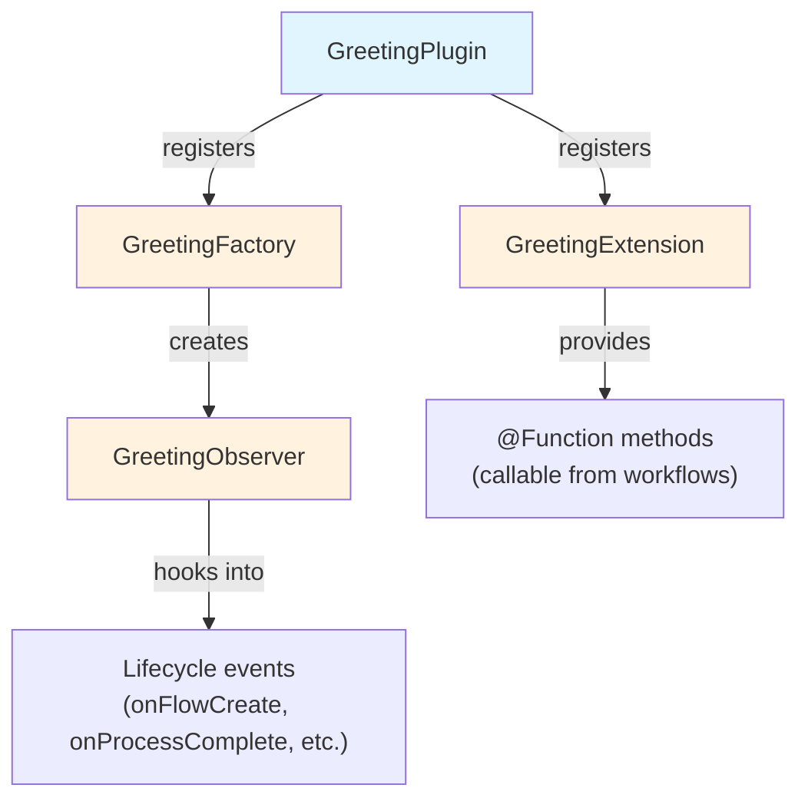

# Bölüm 2: Plugin Projesi Oluşturma

<span class="ai-translation-notice">:material-information-outline:{ .ai-translation-notice-icon } Yapay zeka destekli çeviri - [daha fazla bilgi ve iyileştirme önerileri](https://github.com/nextflow-io/training/blob/master/TRANSLATING.md)</span>

Plugin'lerin Nextflow'u yeniden kullanılabilir işlevsellikle nasıl genişlettiğini gördünüz.
Şimdi kendi plugin'inizi oluşturacaksınız; derleme yapılandırmasını sizin için hazırlayan bir proje şablonuyla başlayacaksınız.

!!! tip "Buradan mı başlıyorsunuz?"

    Bu bölüme doğrudan katılıyorsanız, başlangıç noktası olarak kullanmak üzere Bölüm 1'in çözümünü kopyalayın:

    ```bash
    cp -r solutions/1-plugin-basics/* .
    ```

!!! info "Resmi belgeler"

    Bu bölüm ve sonraki bölümler, plugin geliştirmenin temel konularını kapsamaktadır.
    Kapsamlı ayrıntılar için [resmi Nextflow plugin geliştirme belgelerine](https://www.nextflow.io/docs/latest/plugins/developing-plugins.html) bakın.

---

## 1. Plugin projesini oluşturun

Yerleşik `nextflow plugin create` komutu eksiksiz bir plugin projesi oluşturur:

```bash
nextflow plugin create nf-greeting training
```

```console title="Output"
Plugin created successfully at path: /workspaces/training/side-quests/plugin_development/nf-greeting
```

İlk argüman plugin adıdır; ikincisi ise oluşturulan kodu klasörler halinde düzenlemek için kullanılan organizasyon adınızdır.

!!! tip "Manuel oluşturma"

    Plugin projelerini manuel olarak da oluşturabilir ya da başlangıç noktası olarak GitHub'daki [nf-hello şablonunu](https://github.com/nextflow-io/nf-hello) kullanabilirsiniz.

---

## 2. Proje yapısını inceleyin

Bir Nextflow plugin'i, Nextflow'un içinde çalışan bir Groovy yazılım parçasıdır.
Nextflow'un yeteneklerini iyi tanımlanmış entegrasyon noktaları aracılığıyla genişletir; bu sayede kanallar, süreçler ve yapılandırma gibi Nextflow özellikleriyle birlikte çalışabilir.

Herhangi bir kod yazmadan önce, şablonun neleri oluşturduğuna bakın; böylece her şeyin nereye ait olduğunu bilirsiniz.

Plugin dizinine geçin:

```bash
cd nf-greeting
```

İçeriği listeleyin:

```bash
tree
```

Şunu görmelisiniz:

```console
.
├── build.gradle
├── COPYING
├── gradle
│   └── wrapper
│       ├── gradle-wrapper.jar
│       └── gradle-wrapper.properties
├── gradlew
├── Makefile
├── README.md
├── settings.gradle
└── src
    ├── main
    │   └── groovy
    │       └── training
    │           └── plugin
    │               ├── GreetingExtension.groovy
    │               ├── GreetingFactory.groovy
    │               ├── GreetingObserver.groovy
    │               └── GreetingPlugin.groovy
    └── test
        └── groovy
            └── training
                └── plugin
                    └── GreetingObserverTest.groovy

11 directories, 13 files
```

---

## 3. Derleme yapılandırmasını keşfedin

Bir Nextflow plugin'i, Nextflow tarafından kullanılabilmesi için derlenmesi ve paketlenmesi gereken Java tabanlı bir yazılımdır.
Bu işlem bir derleme aracı gerektirir.

Gradle; kodu derleyen, testleri çalıştıran ve yazılımı paketleyen bir derleme aracıdır.
Plugin şablonu, Gradle'ı ayrıca kurmanıza gerek kalmayacak şekilde bir Gradle sarmalayıcısı (`./gradlew`) içerir.

Derleme yapılandırması, Gradle'a plugin'inizi nasıl derleyeceğini ve Nextflow'a onu nasıl yükleyeceğini söyler.
En önemli iki dosya şunlardır.

### 3.1. settings.gradle

Bu dosya projeyi tanımlar:

```bash
cat settings.gradle
```

```groovy title="settings.gradle"
rootProject.name = 'nf-greeting'
```

Buradaki ad, plugin'i kullanırken `nextflow.config` dosyasına yazacağınız adla eşleşmelidir.

### 3.2. build.gradle

Derleme dosyası, yapılandırmanın büyük bölümünün gerçekleştiği yerdir:

```bash
cat build.gradle
```

Dosya birkaç bölüm içermektedir.
En önemlisi `nextflowPlugin` bloğudur:

```groovy title="build.gradle"
plugins {
    id 'io.nextflow.nextflow-plugin' version '1.0.0-beta.10'
}

version = '0.1.0'

nextflowPlugin {
    nextflowVersion = '24.10.0'       // (1)!

    provider = 'training'             // (2)!
    className = 'training.plugin.GreetingPlugin'  // (3)!
    extensionPoints = [               // (4)!
        'training.plugin.GreetingExtension',
        'training.plugin.GreetingFactory'
    ]

}
```

1. **`nextflowVersion`**: Gereken minimum Nextflow sürümü
2. **`provider`**: Adınız veya organizasyonunuz
3. **`className`**: Ana plugin sınıfı; Nextflow'un ilk yüklediği giriş noktası
4. **`extensionPoints`**: Nextflow'a özellik ekleyen sınıflar (fonksiyonlarınız, izleme bileşenleri vb.)

`nextflowPlugin` bloğu şunları yapılandırır:

- `nextflowVersion`: Gereken minimum Nextflow sürümü
- `provider`: Adınız veya organizasyonunuz
- `className`: Ana plugin sınıfı (`build.gradle` dosyasında belirtilen, Nextflow'un ilk yüklediği giriş noktası)
- `extensionPoints`: Nextflow'a özellik ekleyen sınıflar (fonksiyonlarınız, izleme bileşenleri vb.)

### 3.3. nextflowVersion değerini güncelleyin

Şablon, güncel olmayabilecek bir `nextflowVersion` değeri oluşturur.
Tam uyumluluk için kurulu Nextflow sürümünüzle eşleşecek şekilde güncelleyin:

=== "Sonra"

    ```groovy title="build.gradle" hl_lines="2"
    nextflowPlugin {
        nextflowVersion = '25.10.0'

        provider = 'training'
    ```

=== "Önce"

    ```groovy title="build.gradle" hl_lines="2"
    nextflowPlugin {
        nextflowVersion = '24.10.0'

        provider = 'training'
    ```

---

## 4. Kaynak dosyaları tanıyın

Plugin kaynak kodu `src/main/groovy/training/plugin/` dizininde bulunur.
Her biri farklı bir role sahip dört kaynak dosya vardır:

| Dosya                      | Rol                                                           | Değiştirildiği bölüm        |
| -------------------------- | ------------------------------------------------------------- | --------------------------- |
| `GreetingPlugin.groovy`    | Nextflow'un ilk yüklediği giriş noktası                       | Hiçbir zaman (oluşturulmuş) |
| `GreetingExtension.groovy` | İş akışlarından çağrılabilecek fonksiyonları tanımlar         | Bölüm 3                     |
| `GreetingFactory.groovy`   | Bir iş akışı başladığında gözlemci örnekleri oluşturur        | Bölüm 5                     |
| `GreetingObserver.groovy`  | İş akışı yaşam döngüsü olaylarına yanıt olarak kod çalıştırır | Bölüm 5                     |

Her dosya, ilk kez değiştirdiğinizde yukarıda belirtilen bölümde ayrıntılı olarak tanıtılmaktadır.
Dikkat edilmesi gereken temel dosyalar şunlardır:

- `GreetingPlugin`, Nextflow'un yüklediği giriş noktasıdır
- `GreetingExtension`, bu plugin'in iş akışlarına sunduğu fonksiyonları sağlar
- `GreetingObserver`, pipeline ile birlikte çalışır ve pipeline kodunda değişiklik gerektirmeksizin olaylara yanıt verir



---

## 5. Derleyin, kurun ve çalıştırın

Şablon, kullanıma hazır çalışan kod içerir; bu nedenle projenin doğru kurulduğunu doğrulamak için hemen derleyip çalıştırabilirsiniz.

Plugin'i derleyin ve yerel olarak kurun:

```bash
make install
```

`make install`, plugin kodunu derler ve yerel Nextflow plugin dizininize (`$NXF_HOME/plugins/`) kopyalayarak kullanıma hazır hale getirir.

??? example "Derleme çıktısı"

    Bu komutu ilk kez çalıştırdığınızda Gradle kendisini indirecektir (bu bir dakika sürebilir):

    ```console
    Downloading https://services.gradle.org/distributions/gradle-8.14-bin.zip
    ...10%...20%...30%...40%...50%...60%...70%...80%...90%...100%

    Welcome to Gradle 8.14!
    ...

    Deprecated Gradle features were used in this build...

    BUILD SUCCESSFUL in 23s
    5 actionable tasks: 5 executed
    ```

    **Uyarılar beklenen bir durumdur.**

    - **"Downloading gradle..."**: Bu yalnızca ilk seferinde gerçekleşir. Sonraki derlemeler çok daha hızlıdır.
    - **"Deprecated Gradle features..."**: Bu uyarı, kodunuzdan değil plugin şablonundan kaynaklanmaktadır. Güvenle görmezden gelebilirsiniz.
    - **"BUILD SUCCESSFUL"**: Önemli olan budur. Plugin'iniz hatasız derlendi.

Pipeline dizinine geri dönün:

```bash
cd ..
```

`nextflow.config` dosyasına nf-greeting plugin'ini ekleyin:

=== "Sonra"

    ```groovy title="nextflow.config" hl_lines="4"
    // Plugin geliştirme alıştırmaları için yapılandırma
    plugins {
        id 'nf-schema@2.6.1'
        id 'nf-greeting@0.1.0'
    }
    ```

=== "Önce"

    ```groovy title="nextflow.config"
    // Plugin geliştirme alıştırmaları için yapılandırma
    plugins {
        id 'nf-schema@2.6.1'
    }
    ```

!!! note "Yerel plugin'ler için sürüm zorunludur"

    Yerel olarak kurulu plugin'leri kullanırken sürümü belirtmeniz gerekir (örneğin, `nf-greeting@0.1.0`).
    Kayıt defterinde yayımlanmış plugin'ler yalnızca adla kullanılabilir.

Pipeline'ı çalıştırın:

```bash
nextflow run greet.nf -ansi-log false
```

`-ansi-log false` bayrağı, animasyonlu ilerleme gösterimini devre dışı bırakır; böylece gözlemci mesajları dahil tüm çıktılar sırayla yazdırılır.

```console title="Output"
Pipeline is starting! 🚀
[bc/f10449] Submitted process > SAY_HELLO (1)
[9a/f7bcb2] Submitted process > SAY_HELLO (2)
[6c/aff748] Submitted process > SAY_HELLO (3)
[de/8937ef] Submitted process > SAY_HELLO (4)
[98/c9a7d6] Submitted process > SAY_HELLO (5)
Output: Bonjour
Output: Hello
Output: Holà
Output: Ciao
Output: Hallo
Pipeline complete! 👋
```

(Çıktı sıralamanız ve work directory hash değerleriniz farklı olacaktır.)

"Pipeline is starting!" ve "Pipeline complete!" mesajları Bölüm 1'deki nf-hello plugin'inden tanıdık gelecektir; ancak bu sefer kendi plugin'inizdeki `GreetingObserver`'dan gelmektedir.
Pipeline'ın kendisi değişmemiştir; gözlemci, factory'de kayıtlı olduğu için otomatik olarak çalışır.

---

## Özetle

Şunları öğrendiniz:

- `nextflow plugin create` komutu eksiksiz bir başlangıç projesi oluşturur
- `build.gradle`, plugin meta verilerini, bağımlılıklarını ve hangi sınıfların özellik sağladığını yapılandırır
- Plugin'in dört ana bileşeni vardır: Plugin (giriş noktası), Extension (fonksiyonlar), Factory (izleyiciler oluşturur) ve Observer (iş akışı olaylarına yanıt verir)
- Geliştirme döngüsü şu şekildedir: kodu düzenleyin, `make install` çalıştırın, pipeline'ı çalıştırın

---

## Sırada ne var?

Şimdi Extension sınıfında özel fonksiyonlar uygulayacak ve bunları iş akışında kullanacaksınız.

[Bölüm 3'e geçin :material-arrow-right:](03_custom_functions.md){ .md-button .md-button--primary }
