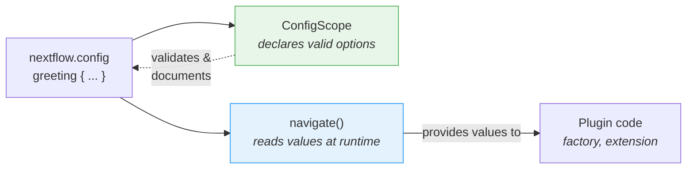

# Bölüm 6: Yapılandırma

<span class="ai-translation-notice">:material-information-outline:{ .ai-translation-notice-icon } Yapay zeka destekli çeviri - [daha fazla bilgi ve iyileştirme önerileri](https://github.com/nextflow-io/training/blob/master/TRANSLATING.md)</span>

Eklentinizin özel fonksiyonları ve bir gözlemcisi var, ancak her şey sabit kodlanmış durumda.
Kullanıcılar, kaynak kodu düzenleyip yeniden derlemeden görev sayacını kapatamaz veya dekoratörü değiştiremez.

Bölüm 1'de, nf-schema ve nf-co2footprint'in nasıl davranacağını kontrol etmek için `nextflow.config` dosyasında `#!groovy validation {}` ve `#!groovy co2footprint {}` bloklarını kullandınız.
Bu yapılandırma blokları, eklenti yazarlarının bu özelliği yerleştirmiş olması sayesinde mevcuttur.
Bu bölümde, kendi eklentiniz için aynısını yapacaksınız.

**Hedefler:**

1. Kullanıcıların selamlama dekoratörünün ön ek ve son ekini özelleştirmesine izin vermek
2. Kullanıcıların eklentiyi `nextflow.config` aracılığıyla etkinleştirmesine veya devre dışı bırakmasına izin vermek
3. Nextflow'un `#!groovy greeting {}` bloğunu tanıması için resmi bir yapılandırma kapsamı kaydetmek

**Değiştirecekleriniz:**

| Dosya                      | Değişiklik                                                              |
| -------------------------- | ----------------------------------------------------------------------- |
| `GreetingExtension.groovy` | `init()` içinde ön ek/son ek yapılandırmasını okumak                    |
| `GreetingFactory.groovy`   | Gözlemci oluşturmayı kontrol etmek için yapılandırma değerlerini okumak |
| `GreetingConfig.groovy`    | Yeni dosya: resmi `@ConfigScope` sınıfı                                 |
| `build.gradle`             | Yapılandırma sınıfını bir uzantı noktası olarak kaydetmek               |
| `nextflow.config`          | Test etmek için bir `#!groovy greeting {}` bloğu eklemek                |

!!! tip "Buradan mı başlıyorsunuz?"

    Bu bölüme doğrudan katılıyorsanız, başlangıç noktası olarak kullanmak üzere Bölüm 5'in çözümünü kopyalayın:

    ```bash
    cp -r solutions/5-observers/* .
    ```

!!! info "Resmi belgeler"

    Kapsamlı yapılandırma ayrıntıları için [Nextflow yapılandırma kapsamları belgelerine](https://nextflow.io/docs/latest/developer/config-scopes.html) bakın.

---

## 1. Dekoratörü yapılandırılabilir hale getirme

`decorateGreeting` fonksiyonu her selamlamayı `*** ... ***` ile sarar.
Kullanıcılar farklı işaretler isteyebilir, ancak şu anda bunları değiştirmenin tek yolu kaynak kodu düzenleyip yeniden derlemektir.

Nextflow oturumu, `nextflow.config` dosyasından iç içe değerleri okuyan `session.config.navigate()` adlı bir yöntem sağlar:

```groovy
// nextflow.config dosyasından 'greeting.prefix' değerini okur, varsayılan '***'
final prefix = session.config.navigate('greeting.prefix', '***') as String
```

Bu, kullanıcının `nextflow.config` dosyasındaki bir yapılandırma bloğuna karşılık gelir:

```groovy title="nextflow.config"
greeting {
    prefix = '>>>'
}
```

### 1.1. Yapılandırma okumayı ekleme (bu başarısız olacak!)

`GreetingExtension.groovy` dosyasını, `init()` içinde yapılandırmayı okuyacak ve `decorateGreeting()` içinde kullanacak şekilde düzenleyin:

```groovy title="GreetingExtension.groovy" linenums="35" hl_lines="7-8 18"
@CompileStatic
class GreetingExtension extends PluginExtensionPoint {

    @Override
    protected void init(Session session) {
        // Varsayılan değerlerle yapılandırmayı oku
        prefix = session.config.navigate('greeting.prefix', '***') as String
        suffix = session.config.navigate('greeting.suffix', '***') as String
    }

    // ... diğer yöntemler değişmedi ...

    /**
    * Bir selamlamayı kutlama işaretleriyle süsle
    */
    @Function
    String decorateGreeting(String greeting) {
        return "${prefix} ${greeting} ${suffix}"
    }
```

Derlemeyi deneyin:

```bash
cd nf-greeting && make assemble
```

### 1.2. Hatayı gözlemleme

Derleme başarısız olur:

```console
> Task :compileGroovy FAILED
GreetingExtension.groovy: 30: [Static type checking] - The variable [prefix] is undeclared.
 @ line 30, column 9.
           prefix = session.config.navigate('greeting.prefix', '***') as String
           ^

GreetingExtension.groovy: 31: [Static type checking] - The variable [suffix] is undeclared.
```

Groovy'de (ve Java'da), bir değişkeni kullanmadan önce _bildirmeniz_ gerekir.
Kod, `prefix` ve `suffix` değişkenlerine değer atamaya çalışıyor, ancak sınıfın bu adlarda alanları yok.

### 1.3. Örnek değişkenler bildirerek düzeltme

Sınıfın başına, açılış parantezinin hemen ardına değişken bildirimlerini ekleyin:

```groovy title="GreetingExtension.groovy" linenums="35" hl_lines="4-5"
@CompileStatic
class GreetingExtension extends PluginExtensionPoint {

    private String prefix = '***'
    private String suffix = '***'

    @Override
    protected void init(Session session) {
        // Varsayılan değerlerle yapılandırmayı oku
        prefix = session.config.navigate('greeting.prefix', '***') as String
        suffix = session.config.navigate('greeting.suffix', '***') as String
    }

    // ... sınıfın geri kalanı değişmedi ...
```

Bu iki satır, her `GreetingExtension` nesnesine ait **örnek değişkenler** (alan olarak da adlandırılır) bildirir.
`private` anahtar sözcüğü, yalnızca bu sınıfın içindeki kodun bunlara erişebileceği anlamına gelir.
Her değişken, `'***'` varsayılan değeriyle başlatılır.

Eklenti yüklendiğinde Nextflow, `init()` yöntemini çağırır; bu yöntem söz konusu varsayılanların üzerine kullanıcının `nextflow.config` dosyasında ayarladığı değerleri yazar.
Kullanıcı herhangi bir şey ayarlamamışsa `navigate()` aynı varsayılanı döndürür, dolayısıyla davranış değişmez.
`decorateGreeting()` yöntemi her çalıştığında bu alanları okur.

!!! tip "Hatalardan öğrenmek"

    Bu "kullanmadan önce bildir" kalıbı Java/Groovy için temeldir; ancak değişkenlerin ilk atama yapıldığında var olmaya başladığı Python veya R'dan geliyorsanız alışılmadık gelebilir.
    Bu hatayı bir kez yaşamak, ileride hızlıca tanıyıp düzeltmenizi sağlar.

### 1.4. Derleme ve test

Derleyin ve yükleyin:

```bash
make install && cd ..
```

Süslemeyi özelleştirmek için `nextflow.config` dosyasını güncelleyin:

=== "Sonra"

    ```groovy title="nextflow.config" hl_lines="7-10"
    // Eklenti geliştirme alıştırmaları için yapılandırma
    plugins {
        id 'nf-schema@2.6.1'
        id 'nf-greeting@0.1.0'
    }

    greeting {
        prefix = '>>>'
        suffix = '<<<'
    }
    ```

=== "Önce"

    ```groovy title="nextflow.config"
    // Eklenti geliştirme alıştırmaları için yapılandırma
    plugins {
        id 'nf-schema@2.6.1'
        id 'nf-greeting@0.1.0'
    }
    ```

Pipeline'ı çalıştırın:

```bash
nextflow run greet.nf -ansi-log false
```

```console title="Output (partial)"
Decorated: >>> Hello <<<
Decorated: >>> Bonjour <<<
...
```

Dekoratör artık yapılandırma dosyasındaki özel ön ek ve son eki kullanıyor.

Nextflow'un henüz `greeting`'i geçerli bir kapsam olarak bildiren bir şey olmadığı için "Unrecognized config option" uyarısı yazdırdığına dikkat edin.
Değer, `navigate()` aracılığıyla doğru şekilde okunmaya devam eder, ancak Nextflow bunu tanınmayan olarak işaretler.
Bunu Bölüm 3'te düzelteceksiniz.

---

## 2. Görev sayacını yapılandırılabilir hale getirme

Gözlemci fabrikası şu anda koşulsuz olarak gözlemciler oluşturuyor.
Kullanıcılar, yapılandırma aracılığıyla eklentiyi tamamen devre dışı bırakabilmelidir.

Fabrika, Nextflow oturumuna ve yapılandırmasına erişebildiğinden, `enabled` ayarını okuyup gözlemci oluşturulup oluşturulmayacağına karar vermek için doğru yerdir.

=== "Sonra"

    ```groovy title="GreetingFactory.groovy" linenums="31" hl_lines="3-4"
    @Override
    Collection<TraceObserver> create(Session session) {
        final enabled = session.config.navigate('greeting.enabled', true)
        if (!enabled) return []

        return [
            new GreetingObserver(),
            new TaskCounterObserver()
        ]
    }
    ```

=== "Önce"

    ```groovy title="GreetingFactory.groovy" linenums="31"
    @Override
    Collection<TraceObserver> create(Session session) {
        return [
            new GreetingObserver(),
            new TaskCounterObserver()
        ]
    }
    ```

Fabrika artık yapılandırmadan `greeting.enabled` değerini okuyor ve kullanıcı bunu `false` olarak ayarlamışsa boş bir liste döndürüyor.
Liste boş olduğunda hiçbir gözlemci oluşturulmaz; dolayısıyla eklentinin yaşam döngüsü kancaları sessizce atlanır.

### 2.1. Derleme ve test

Eklentiyi yeniden derleyin ve yükleyin:

```bash
cd nf-greeting && make install && cd ..
```

Her şeyin hâlâ çalıştığını doğrulamak için pipeline'ı çalıştırın:

```bash
nextflow run greet.nf -ansi-log false
```

??? exercise "Eklentiyi tamamen devre dışı bırakma"

    `nextflow.config` dosyasında `greeting.enabled = false` ayarını yapıp pipeline'ı tekrar çalıştırmayı deneyin.
    Çıktıda ne değişiyor?

    ??? solution "Çözüm"

        ```groovy title="nextflow.config" hl_lines="8"
        // Eklenti geliştirme alıştırmaları için yapılandırma
        plugins {
            id 'nf-schema@2.6.1'
            id 'nf-greeting@0.1.0'
        }

        greeting {
            enabled = false
        }
        ```

        "Pipeline is starting!", "Pipeline complete!" ve görev sayısı mesajlarının tamamı kaybolur; çünkü `enabled` false olduğunda fabrika boş bir liste döndürür.
        Pipeline'ın kendisi çalışmaya devam eder, ancak hiçbir gözlemci etkin değildir.

        Devam etmeden önce `enabled` değerini `true` olarak ayarlamayı (veya satırı kaldırmayı) unutmayın.

---

## 3. ConfigScope ile resmi yapılandırma

Eklenti yapılandırmanız çalışıyor, ancak Nextflow hâlâ "Unrecognized config option" uyarıları yazdırıyor.
Bunun nedeni, `session.config.navigate()` yönteminin yalnızca değerleri okuması; `greeting`'in geçerli bir yapılandırma kapsamı olduğunu Nextflow'a bildiren hiçbir şeyin olmamasıdır.

`ConfigScope` sınıfı bu boşluğu doldurur.
Eklentinizin kabul ettiği seçenekleri, türlerini ve varsayılanlarını bildirir.
`navigate()` çağrılarınızın **yerini almaz**. Bunun yerine onlarla birlikte çalışır:



`ConfigScope` sınıfı olmadan `navigate()` hâlâ çalışır, ancak:

- Nextflow tanınmayan seçenekler hakkında uyarı verir (gördüğünüz gibi)
- `nextflow.config` yazan kullanıcılar için IDE otomatik tamamlama desteği olmaz
- Yapılandırma seçenekleri kendi kendini belgelemez
- Tür dönüşümü manueldir (`as String`, `as boolean`)

Resmi bir yapılandırma kapsamı sınıfı kaydetmek uyarıyı düzeltir ve bu üç sorunu da giderir.
Bu, Bölüm 1'de kullandığınız `#!groovy validation {}` ve `#!groovy co2footprint {}` bloklarının arkasındaki mekanizmanın aynısıdır.

### 3.1. Yapılandırma sınıfını oluşturma

Yeni bir dosya oluşturun:

```bash
touch nf-greeting/src/main/groovy/training/plugin/GreetingConfig.groovy
```

Üç seçeneğin tamamını içeren yapılandırma sınıfını ekleyin:

```groovy title="GreetingConfig.groovy" linenums="1"
package training.plugin

import nextflow.config.spec.ConfigOption
import nextflow.config.spec.ConfigScope
import nextflow.config.spec.ScopeName
import nextflow.script.dsl.Description

/**
 * nf-greeting eklentisi için yapılandırma seçenekleri.
 *
 * Kullanıcılar bunları nextflow.config dosyasında yapılandırır:
 *
 *     greeting {
 *         enabled = true
 *         prefix = '>>>'
 *         suffix = '<<<'
 *     }
 */
@ScopeName('greeting')                       // (1)!
class GreetingConfig implements ConfigScope { // (2)!

    GreetingConfig() {}

    GreetingConfig(Map opts) {               // (3)!
        this.enabled = opts.enabled as Boolean ?: true
        this.prefix = opts.prefix as String ?: '***'
        this.suffix = opts.suffix as String ?: '***'
    }

    @ConfigOption                            // (4)!
    @Description('Enable or disable the plugin entirely')
    boolean enabled = true

    @ConfigOption
    @Description('Prefix for decorated greetings')
    String prefix = '***'

    @ConfigOption
    @Description('Suffix for decorated greetings')
    String suffix = '***'
}
```

1. `nextflow.config` dosyasındaki `#!groovy greeting { }` bloğuyla eşleşir
2. Yapılandırma sınıfları için gerekli arayüz
3. Nextflow'un yapılandırmayı örnekleyebilmesi için hem bağımsız değişkensiz hem de Map yapıcısı gereklidir
4. `@ConfigOption` bir alanı yapılandırma seçeneği olarak işaretler; `@Description` ise araçlar için belgeler (`nextflow.script.dsl` paketinden içe aktarılır)

Temel noktalar:

- **`@ScopeName('greeting')`**: Yapılandırmadaki `greeting { }` bloğuyla eşleşir
- **`implements ConfigScope`**: Yapılandırma sınıfları için gerekli arayüz
- **`@ConfigOption`**: Her alan bir yapılandırma seçeneği olur
- **`@Description`**: Dil sunucusu desteği için her seçeneği belgeler (`nextflow.script.dsl` paketinden içe aktarılır)
- **Yapıcılar**: Hem bağımsız değişkensiz hem de Map yapıcısı gereklidir

### 3.2. Yapılandırma sınıfını kaydetme

Sınıfı oluşturmak tek başına yeterli değildir.
Nextflow'un bunun varlığından haberdar olması gerekir; bu nedenle diğer uzantı noktalarının yanına `build.gradle` dosyasına kaydedersiniz.

=== "Sonra"

    ```groovy title="build.gradle" hl_lines="4"
    extensionPoints = [
        'training.plugin.GreetingExtension',
        'training.plugin.GreetingFactory',
        'training.plugin.GreetingConfig'
    ]
    ```

=== "Önce"

    ```groovy title="build.gradle"
    extensionPoints = [
        'training.plugin.GreetingExtension',
        'training.plugin.GreetingFactory'
    ]
    ```

Fabrika ve uzantı noktaları kaydı arasındaki farka dikkat edin:

- **`build.gradle` içindeki `extensionPoints`**: Derleme zamanı kaydı. Nextflow eklenti sistemine hangi sınıfların uzantı noktalarını uyguladığını bildirir.
- **Fabrika `create()` yöntemi**: Çalışma zamanı kaydı. Fabrika, bir iş akışı gerçekten başladığında gözlemci örnekleri oluşturur.

### 3.3. Derleme ve test

```bash
cd nf-greeting && make install && cd ..
nextflow run greet.nf -ansi-log false
```

Pipeline davranışı aynıdır, ancak "Unrecognized config option" uyarısı artık görünmez.

!!! note "Ne değişti, ne değişmedi"

    `GreetingFactory` ve `GreetingExtension` sınıflarınız çalışma zamanında değerleri okumak için hâlâ `session.config.navigate()` kullanıyor.
    Bu kodların hiçbiri değişmedi.
    `ConfigScope` sınıfı, Nextflow'a hangi seçeneklerin var olduğunu bildiren paralel bir bildirimdir.
    Her iki parça da gereklidir: `ConfigScope` bildirir, `navigate()` okur.

Eklentiniz artık Bölüm 1'de kullandığınız eklentilerle aynı yapıya sahip.
nf-schema bir `#!groovy validation {}` bloğu veya nf-co2footprint bir `#!groovy co2footprint {}` bloğu sunduğunda, tam olarak bu kalıbı kullanırlar: açıklamalı alanlara sahip bir `ConfigScope` sınıfı, uzantı noktası olarak kaydedilmiş.
`#!groovy greeting {}` bloğunuz da aynı şekilde çalışır.

---

## Özetle

Şunları öğrendiniz:

- `session.config.navigate()` çalışma zamanında yapılandırma değerlerini **okur**
- `@ConfigScope` sınıfları hangi yapılandırma seçeneklerinin var olduğunu **bildirir**; `navigate()` ile birlikte çalışırlar, onun yerine geçmezler
- Yapılandırma hem gözlemcilere hem de uzantı fonksiyonlarına uygulanabilir
- Groovy/Java'da örnek değişkenler kullanılmadan önce bildirilmelidir; `init()` eklenti yüklendiğinde bunları yapılandırmadan doldurur

| Kullanım durumu                            | Önerilen yaklaşım                                                   |
| ------------------------------------------ | ------------------------------------------------------------------- |
| Hızlı prototip veya basit eklenti          | Yalnızca `session.config.navigate()`                                |
| Çok sayıda seçeneğe sahip üretim eklentisi | `navigate()` çağrılarınızın yanına bir `ConfigScope` sınıfı ekleyin |
| Herkese açık paylaşacağınız eklenti        | `navigate()` çağrılarınızın yanına bir `ConfigScope` sınıfı ekleyin |

---

## Sırada ne var?

Eklentiniz artık bir üretim eklentisinin tüm parçalarına sahip: özel fonksiyonlar, izleme gözlemcileri ve kullanıcıya yönelik yapılandırma.
Son adım, dağıtım için paketlemektir.

[Özete geç :material-arrow-right:](summary.md){ .md-button .md-button--primary }
